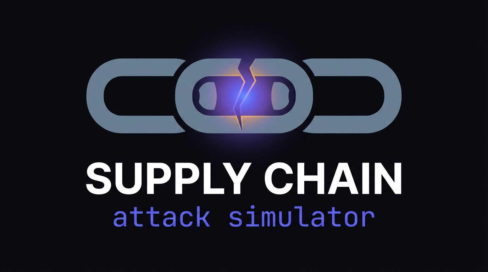

# Supply Chain Attack Test Bench 🔐

A comprehensive cybersecurity learning platform for understanding, practicing, and defending against supply chain attacks.

[](https://github.com/RAJANAGORI/supply-chain-attack-simulator/actions/workflows/smoke.yml)



## Start here

Pick **one** path; everything else links out so you are not stuck in a long README.

| You are… | Do this |
|----------|---------|
| **New to the project** | Run `./START_HERE.sh` (after `chmod +x START_HERE.sh`) or read [Zero to Hero](documentation/getting-started/ZERO_TO_HERO.md) |
| **Planning teaching or a curriculum** | Use the [Scenario learning path](documentation/learning-path/SCENARIO_LEARNING_PATH.md) (beginner → intermediate → advanced) |
| **Comfortable with npm, shells, and isolated VMs** | [Quick Start](#quick-start-experienced-users) below, then open the README inside each scenario folder |

**Safety:** This repo is for **education in isolated environments only**. Read [Safety & ethics](#safety--ethics) before running anything.

## Overview

This test bench provides hands-on scenarios for supply chain attacks—among the most critical risks in modern software development. Learners set up intentionally vulnerable environments, walk through attacks, practice detection, and implement defenses. The runtime is **CLI-only** (no web dashboard required).

**At a glance**

- **22** self-contained labs under `scenarios/` (numbered folders `01-` … `22-`)
- Each lab includes attack mechanics, detection ideas, mitigations, and references where relevant
- Canonical guides and learning paths live in [`documentation/`](documentation/README.md)
- Malicious samples are gated (for example `TESTBENCH_MODE=enabled`) and designed for localhost-style exercises—see [Security notice](#security-notice)

## What you'll learn (themes)

Instead of listing every technique here, the labs group into a few themes:

- **Package and registry abuse** — typosquatting, dependency and version confusion, mirrors, metadata, lockfiles, caches, workspaces
- **Compromise of trust** — hijacked or malicious updates, signing bypass, submodules, SBOM gaps
- **Build, CI/CD, and delivery** — pipeline tampering, container images, multi-stage chains
- **Developer toolchain** — plugins, “Shai-Hulud” / self-spreading patterns, IDE–CLI style risks ([scenario folder `06-sha-hulud/`](scenarios/06-sha-hulud/) uses the short name **sha-hulud** on disk)
- **Realistic simulations** — Axios-style npm and LiteLLM-style PyPI patterns (fictional packages, localhost-only; see issues [#3](https://github.com/RAJANAGORI/supply-chain-attack-simulator/issues/3) and [#4](https://github.com/RAJANAGORI/supply-chain-attack-simulator/issues/4))
- **Defense** — detection tooling, hardening patterns, and defensive workflows across scenarios

For a **full numbered list** with paths and skills, see [Scenario walkthroughs](documentation/reference/SCENARIOS.md).

## Prerequisites

- **Operating system**: Linux, macOS, or Windows with WSL2
- **Software**: Python 3.8+, Node.js 16+, Git
- **Knowledge**: Basic familiarity with package managers (npm, pip, and similar)
- **Runtime model**: CLI-only (no dashboard or web UI required)

## Project structure

```
supply-chain-attack-simulator/
├── scenarios/                  # Attack scenario labs (01- … 22-)
├── vulnerable-apps/             # Sample vulnerable applications (Node, Python, CI)
├── malicious-packages/          # Example malicious packages (for learning)
├── detection-tools/             # Security scanning and detection tools
├── observability/               # Optional Elasticsearch + Kibana stack (issue #22)
├── .github/ISSUE_TEMPLATE/      # GitHub issue forms
├── documentation/               # Canonical Markdown: guides, learning path, modules
├── docs/                        # GitHub Pages (HTML + assets/); symlinks → documentation/
└── scripts/                     # Setup and utility scripts
```

## Quick Start (experienced users)

### 1. Clone and enter the repo

```bash
git clone https://github.com/RAJANAGORI/supply-chain-attack-simulator.git
cd supply-chain-attack-simulator
```

Use your own fork or mirror URL if you did not clone from GitHub.

### 2. Run the setup script

```bash
chmod +x scripts/setup.sh
./scripts/setup.sh
```

### 3. Run Scenario 1 (example CLI flow)

```bash
cd scenarios/01-typosquatting
./setup.sh
node infrastructure/mock-server.js &
cd victim-app
npm install ../malicious-packages/request-lib
export TESTBENCH_MODE=enabled
npm start
curl http://localhost:3000/captured-data
```

You should see captured exercise data from the mock exfiltration endpoint (exact shape is described in `scenarios/01-typosquatting/README.md`).

### 4. Clean up the scenario port

```bash
./scripts/kill-port.sh 3000
```

Or clean up all testbench processes and local scenario artifacts:

```bash
./scripts/teardown.sh
```

## Scenario index

Open each folder’s **README** for objectives, duration, and step-by-step steps. Levels follow [documentation/reference/SCENARIOS.md](documentation/reference/SCENARIOS.md).

| # | Lab | Level |
|---|-----|--------|
| 01 | [Typosquatting](scenarios/01-typosquatting/) | Beginner |
| 02 | [Dependency confusion](scenarios/02-dependency-confusion/) | Intermediate |
| 03 | [Compromised package](scenarios/03-compromised-package/) | Intermediate |
| 04 | [Malicious update](scenarios/04-malicious-update/) | Advanced |
| 05 | [Build system compromise](scenarios/05-build-compromise/) | Advanced |
| 06 | [Shai-Hulud (self-replicating)](scenarios/06-sha-hulud/) | Expert |
| 07 | [Transitive dependency](scenarios/07-transitive-dependency/) | Intermediate |
| 08 | [Package lock file manipulation](scenarios/08-package-lock-file-manipulation/) | Intermediate |
| 09 | [Package signing bypass](scenarios/09-package-signing-bypass/) | Advanced |
| 10 | [Git submodule attack](scenarios/10-git-submodule-attack/) | Intermediate |
| 11 | [Registry mirror poisoning](scenarios/11-registry-mirror-poisoning/) | Advanced |
| 12 | [Workspace / monorepo attack](scenarios/12-workspace-monorepo-attack/) | Intermediate |
| 13 | [Package metadata manipulation](scenarios/13-package-metadata-manipulation/) | Intermediate |
| 14 | [Container image supply chain](scenarios/14-container-image-supply-chain-attack/) | Advanced |
| 15 | [Developer tool compromise](scenarios/15-developer-tool-compromise/) | Advanced |
| 16 | [Package cache poisoning](scenarios/16-package-cache-poisoning/) | Intermediate |
| 17 | [Multi-stage attack chain](scenarios/17-multi-stage-attack-chain/) | Advanced |
| 18 | [Package manager plugin attack](scenarios/18-package-manager-plugin-attack/) | Advanced |
| 19 | [SBOM manipulation](scenarios/19-sbom-manipulation-attack/) | Advanced |
| 20 | [Package version confusion](scenarios/20-package-version-confusion/) | Advanced |
| 21 | [Axios-style npm release (simulation)](scenarios/21-axios-compromised-release-attack/) | Advanced |
| 22 | [LiteLLM-style PyPI compromise (simulation)](scenarios/22-litellm-pypi-compromise/) | Advanced |

## Defense & detection

Each scenario includes:

- Detection techniques and tools
- Mitigation strategies
- Prevention-oriented practices
- Real-world case studies where relevant
- A blue-team runbook at `scenarios/<scenario>/DETECT.md` with IOCs, sample logs, Sigma-style rules, and YARA-like text matches

### Optional Elasticsearch + Kibana track

For workshops, you can index all detection runbooks and runtime events into a local Docker stack (roadmap issue [#22](https://github.com/RAJANAGORI/supply-chain-attack-simulator/issues/22)):

```bash
./scripts/elasticsearch-up.sh
export SCAS_ES_URL=http://localhost:9200   # opt-in live capture forwarding
```

See [observability/README.md](observability/README.md) for Kibana data views, shippers, and smoke checks.

## Safety & ethics

**IMPORTANT**: This test bench is for **educational purposes only**.

- Use **only** in isolated environments
- Never deploy malicious code to public repositories
- Do not test on systems you do not own
- Follow responsible disclosure practices

All malicious packages in this test bench are:

- Clearly labeled as educational
- Designed to work only in the test environment
- Intended not to cause real harm when used as documented

## Security notice

This repository contains intentionally vulnerable code and malicious package examples for educational purposes. Safeguards reduce accidental misuse:

- Environment variable checks (for example `TESTBENCH_MODE=enabled`)
- Localhost-oriented operations
- Clear warning messages
- No real credential harvesting

## Documentation

Authoritative Markdown lives under **`documentation/`** — start at the **[documentation index](documentation/README.md)** (master source of truth).

**Browse on the web:** [Documentation hub](docs/guide.html) — sequential Zero to Hero guides (01→22), setup, detection, and FAQ rendered from the same Markdown files.

| Doc | Purpose |
|-----|---------|
| [Documentation index](documentation/README.md) | Master index — all links |
| [Scenario catalog](documentation/scenario-guides/CATALOG.md) | All 22 labs — README, DETECT, guides, modules |
| [Docs map (legacy)](documentation/README.md) | Same as index |
| [FAQ](documentation/platform/FAQ.md) | Troubleshooting |
| [Architecture](documentation/platform/ARCHITECTURE.md) | Platform design |
| [Operations](documentation/platform/OPERATIONS.md) | Scripts and ports |
| [Detection & observability](documentation/platform/DETECTION_AND_OBSERVABILITY.md) | Blue team + Elasticsearch |
| [Zero to Hero](documentation/getting-started/ZERO_TO_HERO.md) | Guided start if you are new |
| [Scenario learning path](documentation/learning-path/SCENARIO_LEARNING_PATH.md) | Beginner / intermediate / advanced tracks |
| [Quick reference](documentation/platform/QUICK_REFERENCE.md) | One-page commands |
| [Complete setup](documentation/getting-started/SETUP.md) |
| [Best practices](documentation/platform/BEST_PRACTICES.md) |
| [Scenario walkthroughs](documentation/reference/SCENARIOS.md) |
| [Additional resources](documentation/reference/RESOURCES.md) |
| [Observability stack](observability/README.md) | Optional Elasticsearch + Kibana |

The **`docs/`** folder is the GitHub Pages site (`index.html`, `guide.html`, `assets/`); shared guides are **symlinks** into `documentation/` — see **`docs/README.md`**.

## Issue templates

GitHub issue forms live under `.github/ISSUE_TEMPLATE`:

- `bug_report.yaml`
- `feature_request.yaml`
- `scenario_issue.yaml`

## Learning path (how to order the labs)

There is **no single mandatory order** for all 22 scenarios. Use this as a rule of thumb, then follow **[Scenario learning path](documentation/learning-path/SCENARIO_LEARNING_PATH.md)** for tracks and outcomes.

1. **Foundation**: Complete **01 → 02 → 03** (typosquatting, dependency confusion, compromised package) before deep dives.
2. **Before scenario 06**: Finish **01–05** first. **06 (Shai-Hulud)** is the heaviest “single scenario” lab and assumes you understand earlier mechanics and response concepts.
3. **Everything else**: Choose by role—intermediate registry and repo labs (for example **07, 08, 10, 12, 13, 16**), advanced CI and signing labs (**05, 09, 11, 14, 15, 17–22**) as needed. Enterprise-focused notes apply especially to **11** (mirrors); container tooling to **14**.

Capstone-style work is described in the **[Capstone rubric](documentation/learning-path/CAPSTONE_RUBRIC.md)**.

## Contributing

This is an educational project. Contributions are welcome:

- New attack scenarios
- Improved detection tools
- Better documentation
- Bug fixes and enhancements

See [CONTRIBUTING.md](CONTRIBUTING.md) for contribution workflow and testing expectations.

## Community standards

- [Code of Conduct](CODE_OF_CONDUCT.md)
- [Security Policy](SECURITY.md)

## License and copyright

**Creator:** [Raja Nagori](https://github.com/rajanagori) · Copyright © 2024–2026

This project uses **dual licensing**:

| Material | License |
|----------|---------|
| **Software** — scenarios, scripts, detection tools, observability | [MIT License](LICENSE) |
| **Documentation** — guides, modules, learning paths, curriculum | [CC BY-NC-ND 4.0](DOCUMENTATION-CC-BY-NC-ND.md) |

- **[LEGAL.md](LEGAL.md)** — ownership and what others may not do  
- **[ATTRIBUTION.md](ATTRIBUTION.md)** — how to credit SCAS when sharing or teaching  
- **[AUTHORS.md](AUTHORS.md)** — creator and contributors  
- **[NOTICE](NOTICE)** — summary for distributions  
- **[CONTRIBUTING.md](CONTRIBUTING.md)** — DCO and contribution terms  

You may fork and use the **software** under MIT (keep copyright notice). **Documentation** may be shared with attribution but not commercially republished as modified derivatives without permission. Do not remove copyright or claim you authored SCAS.

## Acknowledgments

Inspired by real-world supply chain incidents, including:

- SolarWinds (2020)
- CodeCov (2021)
- Event-stream (2018)
- UA-Parser-js (2021)
- Colors.js & Faker.js (2022)

## Support

For questions or issues:

- Read the [FAQ](documentation/platform/FAQ.md) and [documentation index](documentation/README.md)
- Check [OPERATIONS.md](documentation/platform/OPERATIONS.md) for ports and teardown
- Open an issue on GitHub

---

**Remember**: With great power comes great responsibility. Use these skills to defend, not to harm.

Happy learning.
