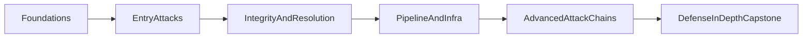

# Supply Chain Attacks: Zero to Hero

If you are teaching this topic to engineers, this page is the clean starting line.  
The goal is simple: make people understand not just *what* happened, but *why* it happened and how to prevent it next time.

## What Is a Supply Chain Attack?

A supply chain attack compromises software by abusing trust in dependencies, build systems, registries, tooling, or delivery pipelines.  
Instead of attacking your app directly, the attacker tampers with something your app already trusts.

### Core Mental Model: Trust Edges

Treat every handoff as a trust edge:

`Developer -> Package Manager -> Registry -> CI/CD -> Artifact -> Runtime`

Attackers usually do not need to break everything. One weak edge is enough.

## Why This Matters

- Modern applications pull in huge dependency trees.
- CI/CD systems often run with privileged access.
- Attacks can look like normal updates unless you inspect closely.
- Good defense needs both static checks and runtime signals.

## Zero-to-Hero Learning Path

Use the same teaching rhythm in every module:

1. How the attack works  
2. Reproduce it in the simulator  
3. Detect it with evidence  
4. Prevent recurrence with policy and controls

### Stage 0: Foundations

- Threat modeling for software supply chains
- Dependency lifecycle and resolver behavior
- Baseline controls: pinning, lockfiles, provenance, CI gates

### Stage 1: Entry Attacks

- Typosquatting
- Dependency confusion
- Compromised package and malicious updates

### Stage 2: Resolution and Integrity Attacks

- Transitive dependency abuse
- Lockfile manipulation
- Metadata tampering
- Signing bypass patterns

### Stage 3: Pipeline and Infrastructure Attacks

- Build compromise
- Registry mirror poisoning
- Cache poisoning
- Developer tool and plugin compromise
- Container image supply chain attacks

### Stage 4: Advanced Attack Chains

- Multi-stage attack chains
- Version confusion and policy drift

### Stage 5: Capstone Defense-in-Depth

- SBOM validation and cross-checking
- Enforced version policies and signed provenance
- Incident response and recovery drills

## Start Here

- New learners: [ZERO_TO_HERO.md](../ZERO_TO_HERO.md)
- Scenario map: [SCENARIO_LEARNING_PATH.md](./SCENARIO_LEARNING_PATH.md)
- Reusable module format: [MODULE_TEMPLATE.md](../modules/MODULE_TEMPLATE.md)
- Per-scenario teaching files: [MODULE_INSTANCES_INDEX.md](../modules/MODULE_INSTANCES_INDEX.md)
- Delivery pack (talk/docs/course/simulator): [TEACHING_DELIVERY_PACK.md](./TEACHING_DELIVERY_PACK.md)
- Final evaluation rubric: [CAPSTONE_RUBRIC.md](./CAPSTONE_RUBRIC.md)

## Teaching Principles (Audience Clarity)

- Keep one concept per section. Avoid tool overload early.
- Every lab should answer: what happened, how it was detected, how to prevent it.
- Use short command blocks, then immediately show expected evidence.
- End each module with concrete policy guidance teams can adopt.

## Visual Learning Flow

## Reference

This structure is inspired by the concise, progressive documentation style used by the Model Context Protocol docs: [modelcontextprotocol.io](https://modelcontextprotocol.io/docs/getting-started/intro).
