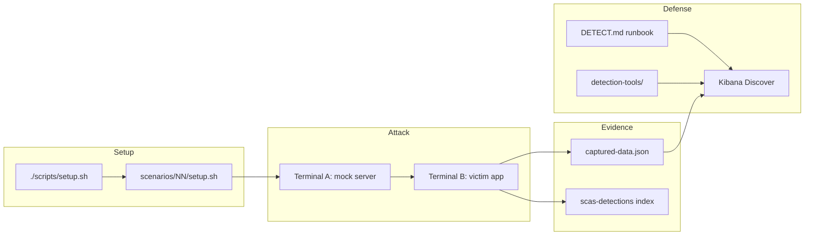

# Architecture

How the Supply Chain Attack Simulator (SCAS) is organized and how data flows through a typical lab.

## Design principles

- **CLI-only** — no web dashboard required to run labs (Kibana is optional for workshops).
- **Education-only** — malicious behavior is gated by `TESTBENCH_MODE=enabled` and targets **127.0.0.1** only.
- **Self-contained scenarios** — each folder under `scenarios/` is a complete lab with setup, attack, detection, and cleanup.
- **Single documentation source** — edit under `documentation/`; `docs/` mirrors via symlinks for GitHub Pages.

## Repository layout

```text
supply-chain-attack-simulator/
├── scenarios/              # 22 attack labs (01- … 22-)
├── detection-tools/        # Shared scanners + Elasticsearch shippers
├── observability/          # Optional Docker ES + Kibana stack
├── documentation/          # Canonical docs (YOU ARE HERE)
├── docs/                   # GitHub Pages (index.html + symlinks → documentation/)
├── scripts/                # setup, teardown, smoke, elasticsearch-up, ports.env
├── vulnerable-apps/        # Sample vulnerable applications
└── .github/                # CI (smoke.yml), issue templates
```

## Typical scenario anatomy

```text
scenarios/NN-slug/
├── README.md               # Lab instructions (runtime source of truth for steps)
├── DETECT.md               # Blue-team runbook → indexed to Elasticsearch scas-rules
├── setup.sh                # Creates dirs, checks TESTBENCH_MODE, installs deps
├── infrastructure/         # Mock attacker / harvester servers
│   ├── mock-server.js      # Most Node scenarios
│   └── captured-data.json  # Runtime evidence (often gitignored)
├── victim-app/             # or corporate-app/, etc.
├── malicious-packages/     # or compromised-package/, registry/, packages/
├── templates/              # Attack templates for learners
└── detection-tools/        # Scenario-local detectors (optional)
```

**Exceptions:**

| Scenario | Mock collector | Capture file |
|----------|----------------|--------------|
| 06 | `credential-harvester.js` (:3001) | `captured-credentials.json` |
| 14 | `mock-server.js` (:3002) | `captured-data.json` (array format) |
| 22 | `mock_server.py` (:3022) | `captured-data.json` (`events[]`) |

## Mock server contract (Node majority)

| Method | Path | Purpose |
|--------|------|---------|
| `POST` | `/collect` or `/capture` or `/beacon` | Receive exfil JSON |
| `GET` | `/captured-data` | View captures |
| `DELETE` | `/captured-data` | Clear captures (where implemented) |

After each capture, mock servers optionally call:

```javascript
require('../../../detection-tools/es/forward-capture')
  .forwardCaptureIfEnabled(__dirname, captureEntry)
  .catch(() => {});
```

Forwarding runs only when `SCAS_ES_URL` is set (see [DETECTION_AND_OBSERVABILITY.md](./DETECTION_AND_OBSERVABILITY.md)).

## Safety gates

| Gate | Where | Purpose |
|------|-------|---------|
| `TESTBENCH_MODE=enabled` | Shell + malicious payloads | Prevents accidental execution outside lab |
| Localhost exfil | Mock servers, package code | No real C2 or external IPs |
| Isolated VM | Operator responsibility | Do not run on production or shared hosts |

## End-to-end lab flow



## CI and quality

- **Smoke tests:** `.github/workflows/smoke.yml` runs `scripts/smoke-all-scenarios.sh`
- **Observability smoke:** `scripts/smoke-observability.sh` (optional ES stack)

## Related docs

- [OPERATIONS.md](./OPERATIONS.md) — scripts, ports, teardown
- [DETECTION_AND_OBSERVABILITY.md](./DETECTION_AND_OBSERVABILITY.md) — scanners, Elasticsearch, Kibana
- [scenario-guides/CATALOG.md](../scenario-guides/CATALOG.md) — all 22 labs with links
