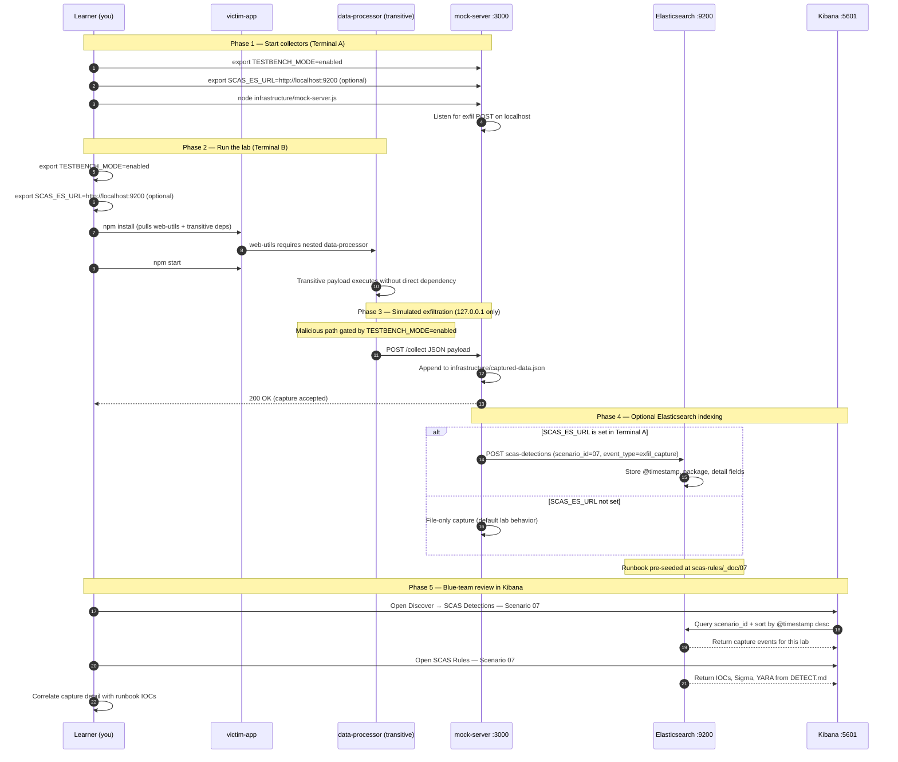

# 🚀 Zero to Hero: Scenario 7 - Transitive Dependency Attack

Welcome! This guide will take you from zero knowledge to successfully completing the Transitive Dependency attack scenario. We'll go step by step, explaining everything along the way.

## 📚 What You'll Learn

By the end of this guide, you will:
- Understand what transitive dependencies are
- Learn how transitive dependency attacks work
- Execute a transitive dependency attack simulation (safely)
- Conduct dependency tree analysis
- Perform detection and forensic investigation
- Implement defense strategies

- Apply the **Mitigation Playbook** from this guide and the scenario README
---


## Table of Contents

<div class="doc-toc">

- [Part 1: Understanding Transitive Dependencies (15 minutes)](#part-1-understanding-transitive-dependencies-15-minutes)
- [Part 2: Prerequisites Check (5 minutes)](#part-2-prerequisites-check-5-minutes)
- [Part 3: Setting Up Scenario 7 (15 minutes)](#part-3-setting-up-scenario-7-15-minutes)
- [Part 4: Understanding the Dependency Structure (20 minutes)](#part-4-understanding-the-dependency-structure-20-minutes)
- [Part 5: The Attack - Compromised Transitive Dependency (30 minutes)](#part-5-the-attack---compromised-transitive-dependency-30-minutes)
- [Part 6: Detection Methods (40 minutes)](#part-6-detection-methods-40-minutes)
- [Part 7: Forensic Investigation (30 minutes)](#part-7-forensic-investigation-30-minutes)
- [Part 8: Incident Response (25 minutes)](#part-8-incident-response-25-minutes)
- [Part 9: Defense Strategies (20 minutes)](#part-9-defense-strategies-20-minutes)
- [Mitigation Playbook](#mitigation-playbook)
- [Elasticsearch + Kibana observability (optional)](#elasticsearch--kibana-observability-optional)
- [Part 10: Key Takeaways (10 minutes)](#part-10-key-takeaways-10-minutes)
- [🎓 Congratulations!](#🎓-congratulations)
- [📚 Additional Resources](#📚-additional-resources)

</div>

---
## Part 1: Understanding Transitive Dependencies (15 minutes)

### What is a Transitive Dependency?

A **transitive dependency** is a dependency of a dependency. You don't directly install it, but it gets installed automatically when you install a package that depends on it.

**Example**:
```
Your App
└── express (you install this)
    └── cookie-parser (express needs this - transitive dependency)
        └── cookie (cookie-parser needs this - also transitive)
```

You only install `express`, but `cookie-parser` and `cookie` get installed automatically!

### Visual Example

```bash
# Your package.json only has:
{
  "dependencies": {
    "express": "^4.18.0"
  }
}

# But npm installs:
- express (direct dependency)
  - cookie-parser (transitive - express needs it)
  - body-parser (transitive - express needs it)
  - accepts (transitive - express needs it)
  - ... and many more!
```

### Why Transitive Dependencies Are Risky

1. **Hidden from View**: You don't see them in package.json
2. **Automatic Installation**: Installed without your explicit action
3. **Trust Chain**: You trust the parent package, not the transitive one
4. **Wide Impact**: One compromised transitive dependency affects many projects
5. **Hard to Detect**: You never directly installed the malicious package

### Real-World Example: event-stream → flatmap-stream (2018)

- **event-stream**: Popular package with 2M weekly downloads
- **flatmap-stream**: Transitive dependency used by event-stream
- **Attack**: Attacker compromised flatmap-stream, added cryptocurrency stealer
- **Impact**: Affected Copay Bitcoin wallet and thousands of projects
- **Detection Time**: Weeks before discovery

**The Dependency Chain**:
```
Your App
└── event-stream (you installed this)
    └── flatmap-stream (transitive dependency - COMPROMISED!)
```

Users of `event-stream` never directly installed `flatmap-stream`, but got it automatically!

---

## Part 2: Prerequisites Check (5 minutes)

Before we start, make sure you've completed:

- ✅ Scenario 1 (Typosquatting) - Understanding basic attacks
- ✅ Scenario 2 (Dependency Confusion) - Understanding package resolution
- ✅ Scenario 3 (Compromised Package) - Understanding package compromise
- ✅ Node.js 16+ and npm installed
- ✅ TESTBENCH_MODE enabled

Verify your setup:

```bash
node --version
npm --version
echo $TESTBENCH_MODE  # Should output: enabled
```

---

## Part 3: Setting Up Scenario 7 (15 minutes)

### Step 1: Navigate to Scenario Directory

```bash
cd scenarios/07-transitive-dependency
```

### Step 2: Run the Setup Script

```bash
export TESTBENCH_MODE=enabled
./setup.sh
```

**What this does:**
- Creates directory structure
- Sets up legitimate packages (web-utils and data-processor)
- Creates compromised data-processor package
- Sets up victim application
- Creates detection tools
- Sets up mock attacker server

**Expected output:**
- Setup progress messages
- Directories and files created
- "Next Steps" displayed

### Step 3: Understand the Environment

**The Dependency Chain**:
```
victim-app
└── web-utils (direct dependency - you install this)
    └── data-processor (transitive dependency - COMPROMISED!)
```

**Packages**:
- **web-utils**: Legitimate parent package (direct dependency)
- **data-processor**: Transitive dependency (compromised by attacker)
- **victim-app**: Your application that uses web-utils

**The Attack**: 
- Attacker compromises `data-processor`
- Victims install `web-utils` (legitimate package)
- npm automatically installs compromised `data-processor`
- Malicious code executes

---

## Part 4: Understanding the Dependency Structure (20 minutes)

### Step 1: Examine the Victim App

```bash
cd victim-app
cat package.json
```

**What you'll see:**
```json
{
  "name": "victim-app",
  "dependencies": {
    "web-utils": "file:../legitimate-packages/web-utils"
  }
}
```

**Notice**: Only `web-utils` is listed! No `data-processor`.

### Step 2: Examine the Parent Package

```bash
cd ../legitimate-packages/web-utils
cat package.json
```

**What you'll see:**
```json
{
  "name": "web-utils",
  "dependencies": {
    "data-processor": "^1.2.0"
  }
}
```

**Notice**: `web-utils` depends on `data-processor`!

### Step 3: Understand the Relationship

```bash
# View the dependency chain visually
cd ../../victim-app
npm install  # Install dependencies first
npm ls       # View dependency tree
```

**You'll see:**
```
victim-app@1.0.0
└── web-utils@2.1.0
    └── data-processor@1.2.0
```

**Key Point**: `data-processor` is installed even though it's not in victim-app's package.json!

### Step 4: View the Legitimate Transitive Dependency

```bash
cd ../legitimate-packages/data-processor
cat package.json
cat index.js
```

**What you'll see:**
- Clean, legitimate code
- Simple data processing functions
- Version 1.2.0
- No malicious behavior

This is what `data-processor` should look like.

---

## Part 5: The Attack - Compromised Transitive Dependency (30 minutes)

### Step 1: Understand the Compromise

**Scenario**: Attacker has compromised `data-processor` and published version 1.2.1 with malicious code.

**Attack Timeline**:
1. Attacker gains access to data-processor maintainer account
2. Publishes malicious version 1.2.1
3. Version 1.2.1 has postinstall script
4. When victims install web-utils, they get compromised data-processor
5. Postinstall script executes automatically

### Step 2: Examine the Compromised Package

```bash
cd ../../compromised-packages/data-processor
cat package.json
```

**What you'll see:**
```json
{
  "name": "data-processor",
  "version": "1.2.1",
  "scripts": {
    "postinstall": "node postinstall.js"
  }
}
```

**Key Change**: Version 1.2.1 has a `postinstall` script!

```bash
cat postinstall.js
```

**What it does:**
- Executes automatically when package is installed
- Collects system information
- Reads sensitive files (.npmrc, .env)
- Exfiltrates data to attacker server

### Step 3: Start the Mock Attacker Server

```bash
cd ../../infrastructure
node mock-server.js &
```

**What this does:**
- Starts a server on localhost:3000
- Receives exfiltrated data
- Logs captured information
- Safe - only works on localhost!

**Verify it's running:**
```bash
curl http://localhost:3000/captured-data
# Should return: {"captures":[]}
```

### Step 4: Simulate the Attack

```bash
cd ../victim-app

# Clean install to simulate fresh environment
rm -rf node_modules package-lock.json

# Install dependencies
npm install

# Replace legitimate data-processor with compromised version
cp -r ../compromised-packages/data-processor node_modules/data-processor

# Reinstall to trigger postinstall script
npm install
```

**What happens:**
1. npm installs `web-utils` (direct dependency)
2. npm automatically installs `data-processor` (transitive dependency)
3. Postinstall script in compromised `data-processor` executes
4. Data is collected and exfiltrated
5. Check the mock server console for captured data!

### Step 5: Observe the Attack

```bash
# Check the mock server output
# You should see:
# 🎯 CAPTURED DATA FROM TRANSITIVE DEPENDENCY
# Package: data-processor@1.2.1
# ... system information ...
```

```bash
# Or check via API
curl http://localhost:3000/captured-data | jq
```

**What was exfiltrated:**
- Hostname
- Username
- Platform information
- Environment variables
- Contents of sensitive files (.npmrc, .env)

### Step 6: Run the Victim Application

```bash
cd victim-app
export TESTBENCH_MODE=enabled
npm start
```

**Notice**: The application runs normally! You might not notice anything wrong.

**Key Point**: The attack executed during `npm install`, not during application runtime.

---

## Part 6: Detection Methods (40 minutes)

### Detection Method 1: Dependency Tree Analysis

```bash
cd detection-tools
node dependency-tree-scanner.js ../victim-app
```

**What this does:**
- Scans the entire dependency tree
- Identifies all transitive dependencies
- Checks for postinstall scripts
- Detects suspicious packages

**What to look for:**
- Packages with postinstall scripts
- Unexpected packages in dependency tree
- Suspicious version numbers

### Detection Method 2: Manual Dependency Tree Inspection

```bash
cd ../victim-app

# View complete dependency tree
npm ls

# View with all transitive dependencies
npm ls --all

# Export to JSON for analysis
npm ls --json > dependency-tree.json
cat dependency-tree.json | jq '.dependencies'
```

**Key Questions:**
- Which packages are direct dependencies?
- Which packages are transitive?
- Are there any unexpected packages?

### Detection Method 3: Package Comparison

```bash
# Compare package.json with installed packages
node -e "
const pkg = require('./package.json');
const lock = require('./package-lock.json');
const pkgDeps = Object.keys({...pkg.dependencies, ...pkg.devDependencies});
const lockDeps = Object.keys(lock.dependencies || {});
const transitive = lockDeps.filter(d => !pkgDeps.includes(d));
console.log('Direct dependencies:', pkgDeps);
console.log('Transitive dependencies:', transitive);
"
```

**Expected Output:**
```
Direct dependencies: [ 'web-utils' ]
Transitive dependencies: [ 'data-processor', 'express', ... ]
```

### Detection Method 4: Postinstall Script Detection

```bash
# Find all packages with postinstall scripts
find node_modules -name "package.json" -exec grep -l "postinstall" {} \;

# Check specific transitive dependency
cat node_modules/data-processor/package.json | grep -A 5 "scripts"
```

**Red Flags:**
- Postinstall scripts in transitive dependencies
- Scripts that make network requests
- Scripts that access sensitive files

### Detection Method 5: Network Monitoring

```bash
# Check captured data (indicates network activity)
curl http://localhost:3000/captured-data | jq '.captures[0].data'
```

**What to look for:**
- Unexpected network requests during install
- Data exfiltration to unknown servers
- Postinstall scripts making HTTP requests

---

## Part 7: Forensic Investigation (30 minutes)

### Investigation Step 1: Dependency Tree Reconstruction

```bash
cd victim-app

# Build complete dependency tree
npm ls --depth=10

# Identify all transitive dependencies
npm ls --json | jq '[.dependencies | to_entries[] | select(.value.dependencies)] | map(.key)'
```

**Questions to Answer:**
- What is the complete dependency tree?
- Which packages are direct vs transitive?
- How deep is the dependency chain?

### Investigation Step 2: Package Analysis

```bash
# Analyze the compromised package
cd node_modules/data-processor

# Check package.json
cat package.json

# Check for postinstall script
cat package.json | jq '.scripts'

# Review the postinstall script
cat postinstall.js
```

**Key Findings:**
- Package version: 1.2.1 (compromised)
- Postinstall script present
- Script collects and exfiltrates data

### Investigation Step 3: Version Comparison

```bash
# Compare legitimate vs compromised versions
diff -ur ../../legitimate-packages/data-processor ../../compromised-packages/data-processor
```

**What Changed:**
- Version: 1.2.0 → 1.2.1
- Added: postinstall script
- Functionality: Still works (maintains compatibility)

### Investigation Step 4: Impact Assessment

```bash
# Check what data was exfiltrated
cat ../../infrastructure/captured-data.json | jq '.captures[0].data'

# Identify affected systems
cat ../../infrastructure/captured-data.json | jq '.captures[].data.hostname'
```

**Impact:**
- System information collected
- Sensitive files accessed
- Data exfiltrated to attacker server

---

## Part 8: Incident Response (25 minutes)

### Response Step 1: Immediate Containment

```bash
cd victim-app

# Remove compromised package
npm uninstall web-utils

# Clear npm cache
npm cache clean --force

# Remove node_modules
rm -rf node_modules package-lock.json
```

### Response Step 2: Package Replacement

```bash
# Option 1: Pin to safe version (if available)
# Update package.json:
# "web-utils": "2.0.9"  // Last version before compromised transitive dep

# Option 2: Find alternative package
# Research alternatives that don't use compromised transitive dependency

# Option 3: Fork and maintain own version
# Fork web-utils, update to use safe version of data-processor
```

### Response Step 3: Dependency Locking

```bash
# Regenerate lock file
npm install

# Pin dependencies in package-lock.json
# Review package-lock.json to ensure no compromised versions

# Commit lock file to version control
git add package-lock.json
git commit -m "Update package-lock.json with safe dependencies"
```

### Response Step 4: Long-term Defenses

**Implement Multiple Layers:**

1. **Dependency Pinning**:
   ```json
   {
     "dependencies": {
       "web-utils": "2.1.0"  // Exact version, not "^2.1.0"
     }
   }
   ```

2. **Automated Scanning**:
   ```bash
   # Add to CI/CD pipeline
   npm audit
   node detection-tools/dependency-tree-scanner.js .
   ```

3. **SBOM Generation**:
   ```bash
   # Generate Software Bill of Materials
   npm ls --json > sbom.json
   ```

4. **Transitive Dependency Review**:
   - Regular audits of entire dependency tree
   - Monitor for new transitive dependencies
   - Review postinstall scripts

---

## Part 9: Defense Strategies (20 minutes)

### Prevention Strategies

1. **Dependency Pinning**: Use exact versions
2. **Package Lock Files**: Always commit package-lock.json
3. **Automated Scanning**: Regular npm audit
4. **SBOM Maintenance**: Keep Software Bill of Materials
5. **Dependency Review**: Regular review of dependency tree

### Detection Strategies

1. **Dependency Tree Scanning**: Regular scans of entire tree
2. **Postinstall Monitoring**: Monitor for postinstall execution
3. **Network Monitoring**: Detect unexpected network requests
4. **Behavioral Analysis**: Monitor package behavior
5. **Version Verification**: Verify package versions

### Response Strategies

1. **Immediate Containment**: Remove compromised packages
2. **Impact Assessment**: Determine scope of compromise
3. **Package Replacement**: Find safe alternatives
4. **Credential Rotation**: Rotate compromised credentials
5. **Incident Documentation**: Document attack and response

---


---

---

## Mitigation Playbook

Canonical prevention and mitigation controls (aligned with the [scenario README](../../../scenarios/07-transitive-dependency/README.md)). Lab walkthroughs above expand each control with hands-on steps.

- Pin exact dependency versions — avoid loose semver ranges on critical packages.
- Commit `package-lock.json` and use `npm ci` in CI/CD.
- Run automated scanning (`npm audit`, SBOM tools) across the full dependency tree.
- Generate and maintain SBOMs for transitive dependency visibility.
- Monitor postinstall script execution and unexpected network requests.
- Review the full dependency tree regularly, not only direct dependencies.

---

## Elasticsearch + Kibana observability (optional)

Scenario **07 — Transitive Dependency** is indexed in Elasticsearch when the observability stack is running.

Transitive dependency: victim-app trusts web-utils; hidden data-processor dependency exfiltrates.

- **Detection runbook (static)** → index `scas-rules`, document id `07` — IOCs, Sigma, YARA, sample logs from `DETECT.md`
- **Runtime captures (dynamic)** → index `scas-detections` — one document per exfil event when `SCAS_ES_URL` is set before starting the mock collector

### How to read this diagram

| Phase | What you should look for |
|-------|--------------------------|
| **1 — Collectors** | Terminal A starts the mock server (or harvester). Set `SCAS_ES_URL` here if you want live Elasticsearch indexing. |
| **2 — Lab execution** | Terminal B runs the scenario README steps. Numbered arrows follow the attack path in order. |
| **3 — Exfiltration** | Malicious sample sends **localhost-only** JSON to the mock endpoint. Evidence is always written to `infrastructure/` on disk. |
| **4 — Elasticsearch** | When `SCAS_ES_URL` is set, the same capture is indexed into `scas-detections` with `scenario_id` and `event_type=exfil_capture`. |
| **5 — Kibana** | Use the per-scenario saved searches to compare **runtime captures** (Detections) with the **static runbook** (Rules). |

> **Safety:** All network calls stay on `127.0.0.1`. Malicious logic runs only when `TESTBENCH_MODE=enabled`.

### End-to-end flow



### Prerequisites

From the repository root:

```bash
./scripts/elasticsearch-up.sh
./scripts/setup-kibana-data-views.sh   # data views + saved searches for all 22 scenarios
```

### Run this scenario with live Elasticsearch forwarding

**Terminal A — mock collector** (from `scenarios/07-transitive-dependency`):

```bash
cd scenarios/07-transitive-dependency
export TESTBENCH_MODE=enabled
export SCAS_ES_URL=http://localhost:9200
node infrastructure/mock-server.js
```

**Terminal B — execute the lab:**

```bash
cd scenarios/07-transitive-dependency
export TESTBENCH_MODE=enabled
export SCAS_ES_URL=http://localhost:9200
cd victim-app && npm install && npm start
```

### Verify locally (file-based evidence)

```bash
curl -s http://localhost:3000/captured-data
```

### Verify in Elasticsearch (API)

```bash
# Static runbook for this scenario
curl -s "http://localhost:9200/scas-rules/_doc/07?pretty"

# Latest runtime capture events
curl -s "http://localhost:9200/scas-detections/_search?pretty" \
  -H 'Content-Type: application/json' \
  -d '{
    "query": { "term": { "scenario_id": "07" } },
    "sort": [{ "@timestamp": "desc" }],
    "size": 5
  }'
```

### Verify in Kibana (UI)

1. Open [http://localhost:5601](http://localhost:5601)
2. **Discover** → **SCAS Detections — Scenario 07** — live capture timeline (`@timestamp`, `package.name`, `detail`)
3. **Discover** → **SCAS Rules — Scenario 07** — compare against `iocs`, `sigma`, and `yara` fields
4. Ask: *Does each capture field match an IOC or Sigma condition in the runbook?*

See [observability/README.md](../../../observability/README.md) for stack details.

## Part 10: Key Takeaways (10 minutes)

### Why Transitive Dependencies Are Risky

1. **Hidden from View**: Not visible in package.json
2. **Automatic Installation**: Installed without explicit action
3. **Trust Chain**: Trust in parent package extends to transitive deps
4. **Wide Impact**: One compromise affects many projects
5. **Hard to Detect**: Requires deep dependency tree analysis

### Best Practices

1. ✅ **Always use package-lock.json** - Locks all dependency versions
2. ✅ **Regular dependency audits** - Use `npm audit` regularly
3. ✅ **Pin dependency versions** - Use exact versions in production
4. ✅ **Monitor dependency tree** - Regular scans for changes
5. ✅ **Review transitive deps** - Understand your full dependency tree
6. ✅ **Use SBOMs** - Maintain Software Bill of Materials
7. ✅ **Automated scanning** - Include in CI/CD pipeline

### Real-World Impact

- **Average npm project**: 80+ transitive dependencies
- **Typical dependency depth**: 3-5 levels deep
- **Most projects**: Don't audit transitive dependencies
- **Attack success rate**: High due to lack of visibility

---

## 🎓 Congratulations!

You've successfully completed Scenario 7: Transitive Dependency Attack!

**What you've learned:**
- ✅ How transitive dependencies work
- ✅ How attackers exploit transitive dependencies
- ✅ Detection and investigation techniques
- ✅ Incident response procedures
- ✅ Defense strategies

**Next Steps:**
- Try Scenario 8: Package Lock File Manipulation
- Review the detection tools and improve them
- Implement defenses in your own projects
- Share your knowledge with your team!

---

## 📚 Additional Resources

- [npm documentation on dependencies](https://docs.npmjs.com/cli/v8/configuring-npm/package-json#dependencies)
- [OWASP Dependency Check](https://owasp.org/www-project-dependency-check/)
- [Snyk - Dependency Scanning](https://snyk.io/)
- [npm audit documentation](https://docs.npmjs.com/cli/v8/commands/npm-audit)

🔐 Happy Learning!


