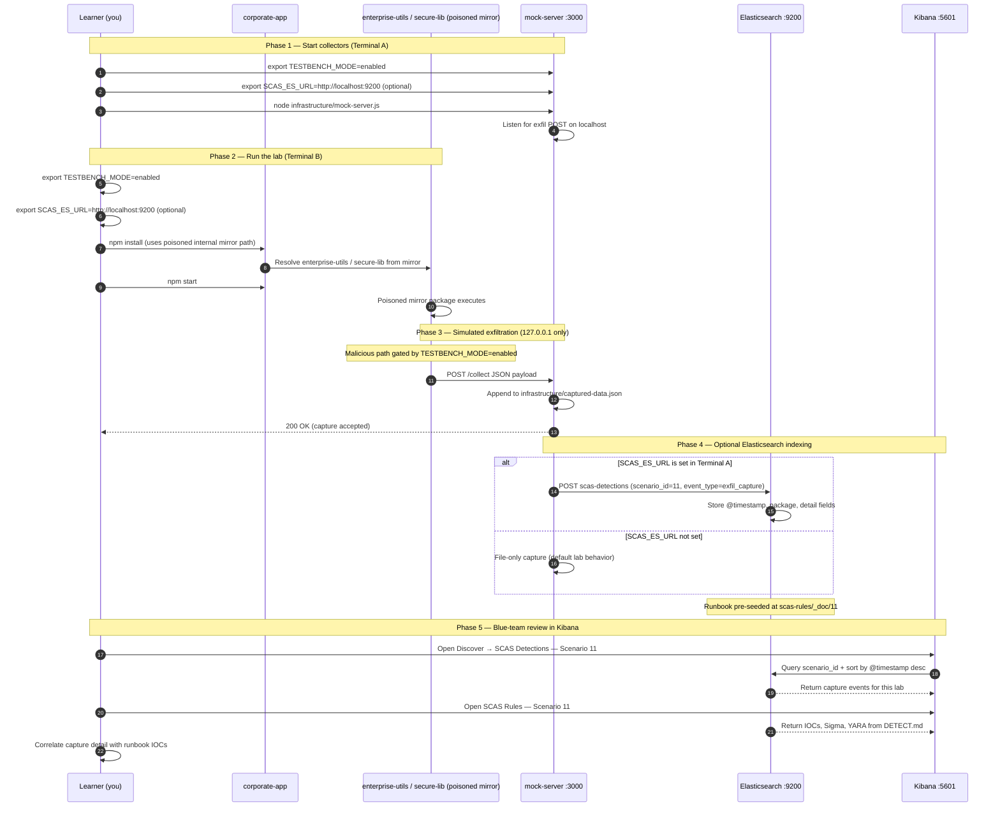

# Zero-to-Hero — Scenario 11: Registry Mirror Poisoning

1. **Overview:** An internal npm mirror is a single point of trust. If compromised, every developer who installs through it may receive malicious packages instead of legitimate ones.
2. **Setup:** `cd scenarios/11-registry-mirror-poisoning && export TESTBENCH_MODE=enabled && ./setup.sh` (generates `corporate-app/`, `compromised-mirror/`, `legitimate-packages/`, and infrastructure).
3. **Mock server:** `node infrastructure/mock-server.js` (port **3000**)
4. **Compare mirrors:** `diff -r legitimate-packages/ compromised-mirror/`
5. **Run victim flow:** `cd corporate-app && export TESTBENCH_MODE=enabled && npm install && npm start`
6. **Validate mirror:** `node detection-tools/mirror-validator.js` (from scenario root)
7. **Evidence:** `curl -s http://localhost:3000/captured-data` and `infrastructure/captured-data.json`

Poisoned packages in this lab include **`enterprise-utils`** and **`secure-lib`** served from `compromised-mirror/`.

See the full scenario README: [`scenarios/11-registry-mirror-poisoning/README.md`](../../../scenarios/11-registry-mirror-poisoning/README.md).


---

## Elasticsearch + Kibana observability (optional)

Scenario **11 — Registry Mirror Poisoning** is indexed in Elasticsearch when the observability stack is running.

Registry mirror poisoning: corporate-app installs from compromised-mirror instead of legitimate-packages.

- **Detection runbook (static)** → index `scas-rules`, document id `11` — IOCs, Sigma, YARA, sample logs from `DETECT.md`
- **Runtime captures (dynamic)** → index `scas-detections` — one document per exfil event when `SCAS_ES_URL` is set before starting the mock collector

### How to read this diagram

| Phase | What you should look for |
|-------|--------------------------|
| **1 — Collectors** | Terminal A starts the mock server (or harvester). Set `SCAS_ES_URL` here if you want live Elasticsearch indexing. |
| **2 — Lab execution** | Terminal B runs the scenario README steps. Numbered arrows follow the attack path in order. |
| **3 — Exfiltration** | Malicious sample sends **localhost-only** JSON to the mock endpoint. Evidence is always written to `infrastructure/` on disk. |
| **4 — Elasticsearch** | When `SCAS_ES_URL` is set, the same capture is indexed into `scas-detections` with `scenario_id` and `event_type=exfil_capture`. |
| **5 — Kibana** | Use the per-scenario saved searches to compare **runtime captures** (Detections) with the **static runbook** (Rules). |

> **Safety:** All network calls stay on `127.0.0.1`. Malicious logic runs only when `TESTBENCH_MODE=enabled`.

### End-to-end flow



### Prerequisites

From the repository root:

```bash
./scripts/elasticsearch-up.sh
./scripts/setup-kibana-data-views.sh   # data views + saved searches for all 22 scenarios
```

### Run this scenario with live Elasticsearch forwarding

**Terminal A — mock collector** (from `scenarios/11-registry-mirror-poisoning`):

```bash
cd scenarios/11-registry-mirror-poisoning
export TESTBENCH_MODE=enabled
export SCAS_ES_URL=http://localhost:9200
node infrastructure/mock-server.js
```

**Terminal B — execute the lab:**

```bash
cd scenarios/11-registry-mirror-poisoning
export TESTBENCH_MODE=enabled
export SCAS_ES_URL=http://localhost:9200
cd corporate-app && npm install && npm start
```

> **Note:** Run ./setup.sh first to generate corporate-app/ and compromised-mirror/.

### Verify locally (file-based evidence)

```bash
curl -s http://localhost:3000/captured-data
```

### Verify in Elasticsearch (API)

```bash
# Static runbook for this scenario
curl -s "http://localhost:9200/scas-rules/_doc/11?pretty"

# Latest runtime capture events
curl -s "http://localhost:9200/scas-detections/_search?pretty" \
  -H 'Content-Type: application/json' \
  -d '{
    "query": { "term": { "scenario_id": "11" } },
    "sort": [{ "@timestamp": "desc" }],
    "size": 5
  }'
```

### Verify in Kibana (UI)

1. Open [http://localhost:5601](http://localhost:5601)
2. **Discover** → **SCAS Detections — Scenario 11** — live capture timeline (`@timestamp`, `package.name`, `detail`)
3. **Discover** → **SCAS Rules — Scenario 11** — compare against `iocs`, `sigma`, and `yara` fields
4. Ask: *Does each capture field match an IOC or Sigma condition in the runbook?*

See [observability/README.md](../../../observability/README.md) for stack details.
