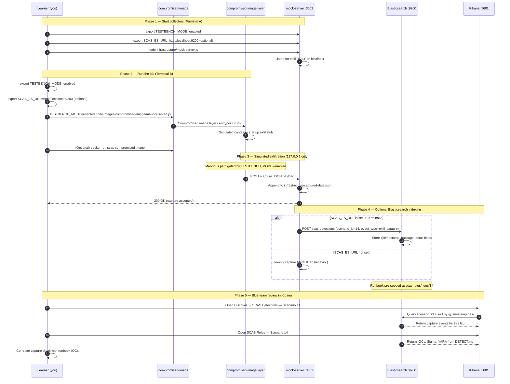

# 🚀 Zero to Hero: Scenario 14 - Container Image Supply Chain Attack

Welcome! This guide will take you from zero knowledge to successfully completing the Container Image Supply Chain Attack scenario. We'll go step by step, explaining everything along the way.

## 📚 What You'll Learn

By the end of this guide, you will:
- Understand how container image trust differs from CVE scanning
- Learn how attackers hide malicious startup behavior in images
- Execute a container supply chain attack simulation (safely)
- Run static Dockerfile scanning and runtime beacon detection
- Perform detection and forensic investigation
- Implement defense strategies for image provenance and runtime controls

- Apply the **Mitigation Playbook** from this guide and the scenario README
---


## Table of Contents

<div class="doc-toc">

- [Part 1: Understanding Container Image Supply Chain Attacks (15 minutes)](#part-1-understanding-container-image-supply-chain-attacks-15-minutes)
- [Part 2: Prerequisites Check (5 minutes)](#part-2-prerequisites-check-5-minutes)
- [Part 3: Setting Up Scenario 14 (15 minutes)](#part-3-setting-up-scenario-14-15-minutes)
- [Part 4: Understanding the Image Structure (20 minutes)](#part-4-understanding-the-image-structure-20-minutes)
- [Part 5: The Attack - Compromised Container Startup (30 minutes)](#part-5-the-attack---compromised-container-startup-30-minutes)
- [Part 6: Detection Methods (40 minutes)](#part-6-detection-methods-40-minutes)
- [Part 7: Forensic Investigation (30 minutes)](#part-7-forensic-investigation-30-minutes)
- [Part 8: Incident Response & Mitigation (30 minutes)](#part-8-incident-response--mitigation-30-minutes)
- [Mitigation Playbook](#mitigation-playbook)
- [Elasticsearch + Kibana observability (optional)](#elasticsearch--kibana-observability-optional)
- [Part 9: Key Takeaways](#part-9-key-takeaways)
- [Part 10: Advanced Exercises](#part-10-advanced-exercises)
- [📚 Additional Resources](#📚-additional-resources)
- [⚠️ Safety & Ethics](#⚠️-safety--ethics)
- [🎉 Congratulations!](#🎉-congratulations)

</div>

---
## Part 1: Understanding Container Image Supply Chain Attacks (15 minutes)

### What Is a Container Image Supply Chain Attack?

A **container image supply chain attack** compromises the trust consumers place in image contents — not just known vulnerabilities, but **what actually runs when the container starts**. Attackers alter entrypoints, inject startup scripts, or embed hidden network beacons that execute before your application logic.

**Typical image structure**:
```
my-app-image/
├── Dockerfile          # Build instructions
├── app.js              # Expected application entrypoint
└── malicious-start.js  # Hidden attacker script (compromised image)
```

### Why Container Security Is More Than CVE Scanning

1. **CVE scans miss behavior**: An image can have zero CVEs and still beacon data at startup
2. **Tag mutability**: Same tag (`latest`) can point to different digests over time
3. **Entrypoint drift**: `CMD` or `ENTRYPOINT` changes are easy to miss in review
4. **Build-time vs runtime**: Malicious code may not appear in application source repos
5. **Network at boot**: Containers often have egress; startup scripts exploit this immediately

### Visual Example: Legitimate vs Compromised Dockerfile

**Legitimate image** (`images/legitimate-image/Dockerfile`):
```dockerfile
FROM node:18-alpine
WORKDIR /app
COPY app.js .
CMD ["node", "app.js"]
```

**Compromised image** (`images/compromised-image/Dockerfile`):
```dockerfile
FROM node:18-alpine
WORKDIR /app
COPY app.js .
CMD ["node", "malicious-start.js"]
```

**The only visible change**: Entrypoint switched from `app.js` to `malicious-start.js`.

### How Container Image Attacks Work

**The Attack Chain**:
```
Attacker modifies image build pipeline or registry tag
        ↓
Image passes superficial review (same base, same tag name)
        ↓
Container starts with malicious entrypoint
        ↓
Startup script beacons host metadata to attacker endpoint
        ↓
Application may appear to run normally (or script runs standalone)
```

### Why Container Image Attacks Are Risky

1. **Implicit trust in tags**: Teams pull `:latest` without digest pinning
2. **CI/CD blind spots**: Pipelines verify app code but not final image CMD
3. **Runtime visibility gaps**: Startup beacons happen before app logging initializes
4. **Host bridge abuse**: Scripts target `host.docker.internal` to reach host-side collectors
5. **Wide deployment**: One bad image affects every environment that pulls it

### Real-World Examples

- **SolarWinds-style build compromise**: Trusted build produces untrusted artifacts
- **Registry substitution**: Attacker pushes to wrong registry namespace
- **Base image drift**: Malicious layer added during CI build
- **Entrypoint injection**: Hidden script added in final Dockerfile layer

**Key insight**: "No critical CVEs" ≠ "Safe to run."

---

## Part 2: Prerequisites Check (5 minutes)

Before we start, make sure you've completed:

- ✅ Scenario 1 (Typosquatting) — basic supply chain trust concepts
- ✅ Node.js 16+ installed
- ✅ TESTBENCH_MODE enabled
- ✅ Docker installed (optional — lab works without Docker via runtime script)

Verify your setup:

```bash
node --version
echo $TESTBENCH_MODE  # Should output: enabled
docker --version      # Optional
```

If `TESTBENCH_MODE` is not set:

```bash
export TESTBENCH_MODE=enabled
```

---

## Part 3: Setting Up Scenario 14 (15 minutes)

### Step 1: Navigate to Scenario Directory

```bash
cd scenarios/14-container-image-supply-chain-attack
```

### Step 2: Run the Setup Script

```bash
export TESTBENCH_MODE=enabled
./setup.sh
```

**What this does:**
- Creates `images/legitimate-image/` and `images/compromised-image/`
- Prepares `victim-app/` reference layout
- Initializes `infrastructure/captured-data.json`
- Creates `detection-tools/image-scanner.js`
- Sets up mock collector on port **3002**

**Expected output:**
- Setup progress messages
- Numbered lab flow printed to terminal

### Step 3: Understand the Environment

**The Scenario Structure**:
```
14-container-image-supply-chain-attack/
├── images/
│   ├── legitimate-image/     # Benign Dockerfile + app.js
│   └── compromised-image/    # Malicious CMD + malicious-start.js
├── victim-app/               # Reference consumer layout
├── infrastructure/
│   ├── mock-server.js        # Attacker collector (port 3002)
│   └── captured-data.json    # Runtime evidence
└── detection-tools/
    └── image-scanner.js      # Static Dockerfile scanner
```

**The Attack**:
- Compromised image runs `malicious-start.js` instead of `app.js`
- Startup script beacons to `host.docker.internal:3002` (Docker) or fails gracefully locally
- Mock server receives `POST /capture` payloads
- Static scanner flags known malicious entrypoint patterns

---

## Part 4: Understanding the Image Structure (20 minutes)

### Step 1: Examine the Legitimate Image

```bash
cat images/legitimate-image/Dockerfile
```

**What you'll see:**
```dockerfile
FROM node:18-alpine
WORKDIR /app
COPY app.js .
CMD ["node", "app.js"]
```

**Notice**: Standard Node.js Alpine base, single application entrypoint.

```bash
cat images/legitimate-image/app.js
```

**What you'll see:**
- Benign application logic
- No outbound network calls
- No environment harvesting

### Step 2: Examine the Compromised Image

```bash
cat images/compromised-image/Dockerfile
```

**What you'll see:**
```dockerfile
FROM node:18-alpine
WORKDIR /app
COPY app.js .
CMD ["node", "malicious-start.js"]
```

**Key Change**: CMD points to `malicious-start.js` instead of `app.js`.

### Step 3: Inspect the Malicious Startup Script

```bash
cat images/compromised-image/malicious-start.js
```

**What it does:**
- Checks `TESTBENCH_MODE=enabled` before malicious behavior
- Collects hostname via `os.hostname()`
- Sends JSON payload to `host.docker.internal:3002` at path `/capture`
- Keeps process alive with idle interval (simulates long-running container)

**Why `host.docker.internal`?**
- Docker containers use this hostname to reach services on the host
- In this lab, the mock server runs on the host at port 3002
- Static scanner flags this as a suspicious pattern

### Step 4: Side-by-Side Dockerfile Diff

```bash
diff images/legitimate-image/Dockerfile images/compromised-image/Dockerfile
```

**Expected diff:**
```
4c4
< CMD ["node", "app.js"]
---
> CMD ["node", "malicious-start.js"]
```

**Key Point**: A one-line CMD change is enough to compromise every container pulled from this image definition.

---

## Part 5: The Attack - Compromised Container Startup (30 minutes)

### Step 1: Understand the Attack Timeline

**Scenario**: An attacker modified the image build pipeline, replacing the application entrypoint with a malicious startup script.

**Attack Timeline**:
1. Attacker modifies Dockerfile or build template
2. Image built and tagged with familiar name
3. CI/CD or operator pulls and runs image
4. Container executes `malicious-start.js` at boot
5. Beacon sent to attacker collector on port 3002

### Step 2: Start the Mock Attacker Server

Open **Terminal A**:

```bash
cd scenarios/14-container-image-supply-chain-attack
node infrastructure/mock-server.js
```

**What this does:**
- Listens on `127.0.0.1:3002`
- Accepts `POST /capture`
- Appends entries to `infrastructure/captured-data.json`

**Verify it's running:**
```bash
curl -s http://127.0.0.1:3002/captured-data
# Should return: []
```

### Step 3: Static Detection First (Blue Team Preview)

Open **Terminal B** — run scanner before executing attack:

```bash
cd scenarios/14-container-image-supply-chain-attack
node detection-tools/image-scanner.js images/compromised-image
```

**Expected output:**
```
Potential issues found:
- known malicious entrypoint
```

**What this proves**: Static analysis can catch compromise **before** runtime.

### Step 4: Runtime Simulation (Without Docker)

```bash
export TESTBENCH_MODE=enabled
node images/compromised-image/malicious-start.js
```

**What happens:**
- Script attempts beacon to `host.docker.internal:3002`
- On macOS, `host.docker.internal` may resolve; on Linux you may need Docker or hosts entry
- Mock server may receive capture if routing succeeds

**Check captures:**
```bash
curl -s http://127.0.0.1:3002/captured-data | jq
```

### Step 5: Optional Docker Validation

If Docker is available:

```bash
docker build -t scas-legit images/legitimate-image
docker build -t scas-compromised images/compromised-image
docker run --rm -e TESTBENCH_MODE=enabled --add-host=host.docker.internal:host-gateway scas-compromised
```

**What this does:**
- Builds both image variants locally
- Runs compromised image with testbench flag enabled
- Maps `host.docker.internal` to host gateway for beacon delivery

**Verify capture after Docker run:**
```bash
curl -s http://127.0.0.1:3002/captured-data | jq
```

**What was exfiltrated:**
- Container/host hostname
- Timestamp (`ts` field)

### Step 6: Compare Legitimate vs Compromised Behavior

```bash
export TESTBENCH_MODE=enabled
node images/legitimate-image/app.js
# Benign application output only — no network beacon
```

**Key Point**: Legitimate image produces expected app behavior; compromised image prioritizes beacon at startup.

---

## Part 6: Detection Methods (40 minutes)

### Detection Method 1: Image Scanner (Static)

```bash
node detection-tools/image-scanner.js images/compromised-image
```

**What this checks:**
- Network fetch patterns in Dockerfile (`curl`, `wget`)
- References to `host.docker.internal`
- Known malicious entrypoint filename (`malicious-start.js`)

**Exit code 2** indicates findings — integrate into CI image build gates.

### Detection Method 2: Dockerfile Diff Against Baseline

```bash
diff -u images/legitimate-image/Dockerfile images/compromised-image/Dockerfile
```

**Red flags:**
- CMD/ENTRYPOINT changes without approved change ticket
- New COPY lines for unknown scripts
- RUN instructions pulling remote content

### Detection Method 3: Entrypoint/CMD Policy Check

```bash
grep -E 'CMD|ENTRYPOINT' images/*/Dockerfile
```

**What to look for:**
- Unexpected script names in CMD array
- Shell-form CMD hiding commands (`CMD node malicious-start.js` vs exec form)

### Detection Method 4: Runtime Network Monitoring

```bash
curl -s http://127.0.0.1:3002/captured-data | jq
```

**What to look for:**
- HTTP POST at container start (before app ready)
- Destinations to unknown hostnames or ports
- Payloads containing hostname/metadata fields

### Detection Method 5: Process Tree Inspection (Production Parallel)

In production Kubernetes/Docker environments, look for:
- Unexpected `node malicious-start.js` in container PID 1
- Child processes spawning before application server
- Immediate outbound connections on container start

**Sample log line for this scenario:**
```json
{"scenario_id":"14","event_type":"container_startup_beacon","source":"malicious-start.js","destination":"127.0.0.1:3002","timestamp_utc":"2026-04-20T13:05:00Z"}
```

### Detection Method 6: Sigma Rule (from DETECT.md)

```yaml
title: Container Startup Script Unexpected Network Beacon
detection:
  selection:
    process.command_line|contains: "node malicious-start.js"
    network.destination.port: 3002
  condition: selection
level: high
```

---

## Part 7: Forensic Investigation (30 minutes)

### Investigation Step 1: Image Definition Analysis

```bash
# Preserve Dockerfile evidence
cp images/compromised-image/Dockerfile /tmp/compromised-dockerfile.forensics

# List all files in compromised image context
ls -la images/compromised-image/
```

**Questions:**
- Who approved the CMD change?
- When was the image last rebuilt?
- Does registry digest match expected signed attestation?

### Investigation Step 2: Startup Script Forensics

```bash
cat images/compromised-image/malicious-start.js
```

**Document:**
- Network destination (`host.docker.internal:3002`, path `/capture`)
- Safety gate (`TESTBENCH_MODE`) — lab only
- Data fields collected (`host`, `ts`)

### Investigation Step 3: Capture Timeline

```bash
cat infrastructure/captured-data.json | jq '.[] | {received_at, payload}'
```

**Build Timeline:**
- T0: Container start / script execution
- T1: Outbound POST to port 3002
- T2: Capture written to `captured-data.json`
- T3: Application (if any) continues or script holds process open

### Investigation Step 4: Deployment Impact Assessment

**Questions for a real incident:**
- Which clusters/namespaces pulled this image tag?
- Was digest pinned or tag-only pull used?
- How many running pods use compromised entrypoint?
- Are secrets mounted into affected containers?

### Investigation Step 5: Static vs Runtime Evidence Correlation

```bash
# Static finding
node detection-tools/image-scanner.js images/compromised-image

# Runtime finding
curl -s http://127.0.0.1:3002/captured-data | jq
```

**Strongest case**: Scanner flagged entrypoint **before** deploy; runtime beacon confirms exploitation path.

---

## Part 8: Incident Response & Mitigation (30 minutes)

### Response Step 1: Immediate Containment

```bash
# Stop mock server
../../scripts/kill-port.sh 3002

# Stop running compromised containers (Docker)
docker ps --filter ancestor=scas-compromised -q | xargs -r docker stop
```

**Production parallels:**
- Halt deployments using affected image tag/digest
- Quarantine nodes running compromised containers
- Block egress from affected namespaces pending review

### Response Step 2: Roll Back to Known-Good Image

```bash
docker build -t scas-legit images/legitimate-image
docker run --rm scas-legit
# Verify benign startup only
```

**Production parallels:**
- Redeploy last known-good immutable digest
- Invalidate CI cache for compromised build pipeline
- Rotate secrets accessible to affected containers

### Response Step 3: Long-term Defenses

**Implement Multiple Layers**:

1. **Image Provenance & Signing**:
   - Require cosign/sigstore verification before pull
   - Reject unsigned images in admission controllers

2. **Immutable Digests**:
   ```bash
   # Pull by digest, not tag
   docker pull myregistry/app@sha256:abc123...
   ```

3. **Policy Gates for CMD/ENTRYPOINT**:
   ```bash
   node detection-tools/image-scanner.js images/compromised-image
   # Fail CI on non-zero exit
   ```

4. **Runtime Network Controls**:
   - Default-deny egress for build jobs and sensitive workloads
   - Alert on startup-time outbound connections

5. **Reproducible Builds**:
   - Pin base image digests
   - Generate and store build attestations (SLSA)

6. **Separate Vulnerability vs Trust Scanning**:
   - CVE scan answers "known bugs?"
   - Trust verification answers "expected contents and entrypoint?"

---

---

---

## Mitigation Playbook

Canonical prevention and mitigation controls (aligned with the [scenario README](../../../scenarios/14-container-image-supply-chain-attack/README.md)). Lab walkthroughs above expand each control with hands-on steps.

- Enforce image provenance and signature verification in CI/CD.
- Pin immutable image digests (not mutable tags only).
- Add policy checks for entrypoint/CMD changes on critical images.
- Restrict outbound network from build and runtime where possible.
- Require reproducible image builds and signed attestations.

---

## Elasticsearch + Kibana observability (optional)

Scenario **14 — Container Image Supply Chain** is indexed in Elasticsearch when the observability stack is running.

Container supply chain: compromised-image entrypoint sends build-time payload to mock-server :3002.

- **Detection runbook (static)** → index `scas-rules`, document id `14` — IOCs, Sigma, YARA, sample logs from `DETECT.md`
- **Runtime captures (dynamic)** → index `scas-detections` — one document per exfil event when `SCAS_ES_URL` is set before starting the mock collector

### How to read this diagram

| Phase | What you should look for |
|-------|--------------------------|
| **1 — Collectors** | Terminal A starts the mock server (or harvester). Set `SCAS_ES_URL` here if you want live Elasticsearch indexing. |
| **2 — Lab execution** | Terminal B runs the scenario README steps. Numbered arrows follow the attack path in order. |
| **3 — Exfiltration** | Malicious sample sends **localhost-only** JSON to the mock endpoint. Evidence is always written to `infrastructure/` on disk. |
| **4 — Elasticsearch** | When `SCAS_ES_URL` is set, the same capture is indexed into `scas-detections` with `scenario_id` and `event_type=exfil_capture`. |
| **5 — Kibana** | Use the per-scenario saved searches to compare **runtime captures** (Detections) with the **static runbook** (Rules). |

> **Safety:** All network calls stay on `127.0.0.1`. Malicious logic runs only when `TESTBENCH_MODE=enabled`.

### End-to-end flow



### Prerequisites

From the repository root:

```bash
./scripts/elasticsearch-up.sh
./scripts/setup-kibana-data-views.sh   # data views + saved searches for all 22 scenarios
```

### Run this scenario with live Elasticsearch forwarding

**Terminal A — mock collector** (from `scenarios/14-container-image-supply-chain-attack`):

```bash
cd scenarios/14-container-image-supply-chain-attack
export TESTBENCH_MODE=enabled
export SCAS_ES_URL=http://localhost:9200
node infrastructure/mock-server.js
```

**Terminal B — execute the lab:**

```bash
cd scenarios/14-container-image-supply-chain-attack
export TESTBENCH_MODE=enabled
export SCAS_ES_URL=http://localhost:9200
TESTBENCH_MODE=enabled node images/compromised-image/malicious-start.js
```

### Verify locally (file-based evidence)

```bash
curl -s http://localhost:3002/captured-data
```

### Verify in Elasticsearch (API)

```bash
# Static runbook for this scenario
curl -s "http://localhost:9200/scas-rules/_doc/14?pretty"

# Latest runtime capture events
curl -s "http://localhost:9200/scas-detections/_search?pretty" \
  -H 'Content-Type: application/json' \
  -d '{
    "query": { "term": { "scenario_id": "14" } },
    "sort": [{ "@timestamp": "desc" }],
    "size": 5
  }'
```

### Verify in Kibana (UI)

1. Open [http://localhost:5601](http://localhost:5601)
2. **Discover** → **SCAS Detections — Scenario 14** — live capture timeline (`@timestamp`, `package.name`, `detail`)
3. **Discover** → **SCAS Rules — Scenario 14** — compare against `iocs`, `sigma`, and `yara` fields
4. Ask: *Does each capture field match an IOC or Sigma condition in the runbook?*

See [observability/README.md](../../../observability/README.md) for stack details.

## Part 9: Key Takeaways

### Why Container Image Attacks Are Dangerous

1. **Trust in tags**: Mutable tags hide digest changes
2. **Startup blind spot**: Beacons fire before application logs exist
3. **CMD drift**: One-line Dockerfile changes compromise all pulls
4. **Host bridge paths**: `host.docker.internal` reaches host-side services
5. **CVE-only mindset**: Clean scan results create false confidence

### Best Practices

1. ✅ **Pin image digests** — never rely on tags alone
2. ✅ **Verify signatures and provenance** in CI/CD and admission control
3. ✅ **Policy-check CMD/ENTRYPOINT** changes on critical images
4. ✅ **Restrict outbound network** at build and runtime
5. ✅ **Monitor startup network activity** in orchestrators
6. ✅ **Maintain signed baseline images** for diff comparison
7. ✅ **Separate vulnerability scanning from trust verification**

### Real-World Impact

- **Wide deployment**: One image affects every environment that pulls it
- **Stealthy indicators**: Startup beacons resemble health checks
- **Detection time**: Often discovered only after anomaly detection on egress
- **Recovery cost**: Rolling digest-pinned redeploys across all clusters

---

## Part 10: Advanced Exercises

### Exercise 1: Admission Controller Policy
- Write a Kyverno/OPA rule rejecting images whose CMD contains unknown scripts
- Test against legitimate and compromised Dockerfiles in this lab

### Exercise 2: Digest-Pinned Pipeline
- Modify a sample CI job to build, sign, and deploy by digest only
- Document rollback procedure using previous digest

### Exercise 3: Runtime Detection Tuning
- Map DETECT.md Sigma rule to your container runtime logs
- Define alert severity when startup POST occurs within 30s of container start

### Exercise 4: Docker vs Non-Docker Paths
- Compare capture success running `malicious-start.js` directly vs in Docker
- Document when `host.docker.internal` resolution succeeds on your OS
- Propose lab-friendly hosts-file workaround for Linux learners

---

## 📚 Additional Resources

- [Dockerfile reference — CMD and ENTRYPOINT](https://docs.docker.com/engine/reference/builder/)
- [Sigstore cosign documentation](https://docs.sigstore.dev/cosign/overview/)
- [SLSA container track](https://slsa.dev/spec/v1.0/building-levels)
- [NIST SP 800-190 Application Container Security Guide](https://csrc.nist.gov/publications/detail/sp/800-190/final)
- Scenario README: `scenarios/14-container-image-supply-chain-attack/README.md`
- Detection runbook: `scenarios/14-container-image-supply-chain-attack/DETECT.md`

---

## ⚠️ Safety & Ethics

**IMPORTANT**: This scenario is for **educational purposes only**.

- ✅ Use ONLY in isolated test environments
- ✅ Never push compromised images to public registries
- ✅ All malicious behavior requires `TESTBENCH_MODE=enabled`
- ✅ Exfiltration targets localhost / `host.docker.internal:3002` only
- ✅ Do not run compromised images on production systems

---

## 🎉 Congratulations!

You've completed the Container Image Supply Chain Attack scenario! You now understand:
- How entrypoint drift compromises container trust
- How to detect malicious startup scripts statically and at runtime
- How to defend with provenance, digest pinning, and network controls

**Remember**: CVE-free images can still be malicious. Verify what runs at container start, not just what's in the vulnerability database.

🔐 Happy Learning!
