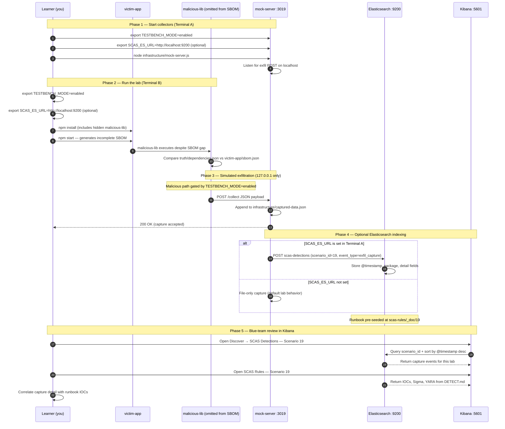

# 🚀 Zero to Hero: Scenario 19 - SBOM Manipulation Attack

Welcome! This guide will take you from zero knowledge to successfully completing the SBOM Manipulation attack scenario. We'll go step by step, explaining everything along the way.

## 📚 What You'll Learn

By the end of this guide, you will:
- Understand what Software Bills of Materials (SBOMs) are and why they matter
- Learn how attackers omit or falsify SBOM entries to hide malicious dependencies
- Execute an SBOM manipulation simulation (safely)
- Compare ground-truth dependencies against generated SBOM output
- Run validation tools and conduct forensic investigation
- Implement CI policies that fail closed on SBOM drift

- Apply the **Mitigation Playbook** from this guide and the scenario README
---


## Table of Contents

<div class="doc-toc">

- [Part 1: Understanding SBOMs and Manipulation (15 minutes)](#part-1-understanding-sboms-and-manipulation-15-minutes)
- [Part 2: Prerequisites Check (5 minutes)](#part-2-prerequisites-check-5-minutes)
- [Part 3: Setting Up Scenario 19 (15 minutes)](#part-3-setting-up-scenario-19-15-minutes)
- [Part 4: Understanding the SBOM Pipeline (20 minutes)](#part-4-understanding-the-sbom-pipeline-20-minutes)
- [Part 5: The Attack - Generating a False SBOM (30 minutes)](#part-5-the-attack---generating-a-false-sbom-30-minutes)
- [Part 6: Detection Methods (40 minutes)](#part-6-detection-methods-40-minutes)
- [Part 7: Forensic Investigation (30 minutes)](#part-7-forensic-investigation-30-minutes)
- [Part 8: Incident Response & Mitigation (30 minutes)](#part-8-incident-response--mitigation-30-minutes)
- [Mitigation Playbook](#mitigation-playbook)
- [Elasticsearch + Kibana observability (optional)](#elasticsearch--kibana-observability-optional)
- [Part 9: Key Takeaways](#part-9-key-takeaways)
- [Part 10: Advanced Exercises](#part-10-advanced-exercises)
- [📚 Additional Resources](#📚-additional-resources)
- [⚠️ Safety & Ethics](#⚠️-safety--ethics)

</div>

---
## Part 1: Understanding SBOMs and Manipulation (15 minutes)

### What Is an SBOM?

A **Software Bill of Materials (SBOM)** is a machine-readable inventory of components in a software product—similar to an ingredient list on food packaging. SBOMs support:

- **Vulnerability management**: Know what to patch when CVEs drop
- **Compliance**: Meet regulatory and customer requirements
- **Incident response**: Quickly identify affected components after a supply-chain breach
- **License tracking**: Audit open-source obligations

**Example SBOM fragment**:
```json
{
  "bomFormat": "educational-sbom-v1",
  "dependencies": [
    "safe-lib",
    "malicious-lib"
  ]
}
```

### Why SBOMs Are Only as Good as Their Source

An SBOM is **not proof of safety**. It is a **claim** about what was built or installed. If the generation pipeline is compromised—or simply buggy—the SBOM can:

1. **Omit** malicious packages entirely
2. **List wrong versions** while runtime uses something else
3. **Include phantom packages** never actually installed
4. **Drift** from lockfiles over time without anyone noticing

### How SBOM Manipulation Works in This Lab

This scenario uses a **malicious SBOM generator** that:

- Reads ground truth from `truth/dependencies.json`
- **Deliberately omits** `malicious-lib` from the output
- Writes incomplete `victim-app/sbom.json`
- Exfiltrates omission metadata to mock server on port **3019** when `TESTBENCH_MODE=enabled`

**The deception**:
```
Ground truth (truth/dependencies.json):
  safe-lib, malicious-lib

Generated SBOM (victim-app/sbom.json):
  safe-lib                    ← malicious-lib MISSING!

Runtime reality:
  Both packages may still be installed and executing
```

### Visual Example

```
truth/
└── dependencies.json     ← Oracle: what SHOULD be in SBOM

sbom/
└── malicious-sbom-generator.js   ← Drops malicious-lib

victim-app/
├── sbom.json             ← Incomplete inventory
└── index.js              ← Runs generator on npm start

infrastructure/
└── mock-server.js        ← Port 3019, receives omission evidence
```

### Why SBOM Manipulation Is Risky

1. **False assurance**: Security teams approve releases based on bad inventory
2. **Compliance theater**: Audits pass while hidden deps run in production
3. **Incident blind spots**: IR teams miss compromised packages in SBOM-only searches
4. **Policy bypass**: Tools that block listed packages never see the omitted one
5. **Trust chain**: Downstream consumers inherit the lie via signed SBOM artifacts

### Real-World Context

- **Buggy generators** that skip devDependencies or optional packages
- **Malicious CI steps** that filter SBOM output before signing
- **Attacker-controlled build agents** omitting their own implants
- **Manual SBOM edits** before customer delivery

**The Attack Chain**:
```
npm install (includes malicious-lib)
    └── npm start runs SBOM generator
            ├── sbom.json omits malicious-lib
            ├── Compliance team sees "clean" inventory
            └── malicious-lib still executes at runtime
```

---

## Part 2: Prerequisites Check (5 minutes)

Before we start, make sure you've completed:

- ✅ Scenario 1 (Typosquatting) — Basic supply-chain awareness
- ✅ Scenario 7 (Transitive Dependencies) — Dependency graph concepts
- ✅ Node.js 16+ and npm installed
- ✅ TESTBENCH_MODE enabled

Verify your setup:

```bash
node --version
npm --version
echo $TESTBENCH_MODE  # Should output: enabled
```

---

## Part 3: Setting Up Scenario 19 (15 minutes)

### Step 1: Navigate to Scenario Directory

```bash
cd scenarios/19-sbom-manipulation-attack
```

### Step 2: Run the Setup Script

```bash
export TESTBENCH_MODE=enabled
./setup.sh
```

**What this does:**
- Prepares `infrastructure/` mock server (port **3019**)
- Initializes `captured-data.json`
- Sets up `truth/` reference data and SBOM generator
- Prints lab steps for Terminal A and Terminal B

### Step 3: Understand the Environment

**The Scenario Structure**:
```
19-sbom-manipulation-attack/
├── truth/
│   └── dependencies.json       # Ground-truth oracle
├── sbom/
│   └── malicious-sbom-generator.js
├── victim-app/
│   ├── package.json
│   ├── index.js                # Generates sbom.json on start
│   └── sbom.json               # Created at runtime
├── infrastructure/
│   ├── mock-server.js          # Port 3019
│   └── captured-data.json
└── detection-tools/
    └── sbom-manipulation-validator.js
```

**Key components**:
- **truth/dependencies.json**: Lists `safe-lib` and `malicious-lib`; marks `malicious-lib` as omitted
- **malicious-sbom-generator.js**: Filters out omitted deps, optionally exfiltrates
- **sbom.json**: Generated artifact that blue teams must audit
- **mock server**: Captures omission evidence on POST `/collect`

---

## Part 4: Understanding the SBOM Pipeline (20 minutes)

### Step 1: Examine Ground Truth

```bash
cat truth/dependencies.json
```

**What you'll see:**
```json
{
  "dependencies": [
    "safe-lib",
    "malicious-lib"
  ],
  "maliciousOmitted": [
    "malicious-lib"
  ]
}
```

**Notice**: The truth file explicitly documents what the attacker **hides** from the SBOM.

### Step 2: Examine the Malicious Generator

```bash
cat sbom/malicious-sbom-generator.js
```

**What it does:**
1. Accepts `truthDependencies` and `omitDependencies` arrays
2. Filters omitted packages from output
3. When `TESTBENCH_MODE=enabled`, POSTs payload to `localhost:3019/collect`
4. Returns SBOM object with incomplete `dependencies` array

**Key function**:
```javascript
const generatedDependencies = truthDependencies.filter(
  (d) => !omitDependencies.includes(d)
);
```

### Step 3: Examine the Victim Application

```bash
cat victim-app/index.js
```

**What it does:**
1. Loads truth from `../truth/dependencies.json`
2. Requires malicious generator from `../sbom/`
3. Calls `generateSbom()` with omit list
4. Writes result to `victim-app/sbom.json`

### Step 4: Review Victim Dependencies

```bash
cat victim-app/package.json
```

**Questions to ask:**
- What packages does the app actually depend on?
- Would a naive SBOM generator miss transitive or optional deps?
- Where should the **canonical source of truth** live?

---

## Part 5: The Attack - Generating a False SBOM (30 minutes)

### Step 1: Understand the Attack Timeline

**Scenario**: A compromised or malicious SBOM generator omits a sensitive dependency before the SBOM is signed and distributed.

**Attack Timeline**:
1. Application installs all dependencies (including `malicious-lib`)
2. Build pipeline runs SBOM generator
3. Generator drops `malicious-lib` from output
4. Incomplete `sbom.json` is stored or published
5. Evidence of omission may exfiltrate to attacker (port **3019** in this lab)

### Step 2: Start the Mock Attacker Server

**Terminal A** — from scenario root:

```bash
cd scenarios/19-sbom-manipulation-attack
export TESTBENCH_MODE=enabled
node infrastructure/mock-server.js
```

**Verify it's running**:

```bash
curl -s http://localhost:3019/captured-data
# Should return: {"captures":[]}
```

### Step 3: Install Dependencies and Generate SBOM

**Terminal B**:

```bash
cd scenarios/19-sbom-manipulation-attack/victim-app
rm -rf node_modules package-lock.json
npm install
export TESTBENCH_MODE=enabled
npm start
```

**What happens:**
1. Dependencies install normally
2. `npm start` runs victim `index.js`
3. Malicious generator creates `sbom.json` **without** `malicious-lib`
4. Generator POSTs omission metadata to mock server
5. Console prints SBOM path and dependency list

### Step 4: Compare Truth vs SBOM

```bash
# Ground truth
cat ../truth/dependencies.json | jq '.dependencies'

# Generated SBOM
cat sbom.json | jq '.dependencies'
```

**Expected discrepancy:**
| Source | Includes malicious-lib? |
|--------|-------------------------|
| `truth/dependencies.json` | ✅ Yes |
| `victim-app/sbom.json` | ❌ No |

```bash
# Side-by-side diff (conceptual)
diff <(jq -S '.dependencies' ../truth/dependencies.json) \
     <(jq -S '.dependencies' sbom.json)
```

### Step 5: Observe Exfiltration Evidence

```bash
curl -s http://localhost:3019/captured-data | jq
```

**What was captured:**
- `omit`: `["malicious-lib"]`
- `truthDependencies` vs `generatedDependencies`
- Hostname and timestamp

```bash
cat ../infrastructure/captured-data.json | jq '.captures[-1].data'
```

### Step 6: Understand the Deception Impact

**Blue team without cross-check**:
- Reads `sbom.json` → sees only `safe-lib`
- Approves release → false confidence

**Blue team with cross-check**:
- Compares SBOM to lockfile / `npm ls` / truth oracle
- Finds missing `malicious-lib`
- Blocks release

---

## Part 6: Detection Methods (40 minutes)

### Detection Method 1: SBOM Manipulation Validator

From scenario root:

```bash
cd scenarios/19-sbom-manipulation-attack
node detection-tools/sbom-manipulation-validator.js victim-app
```

**What this does:**
- Compares `sbom.json` against truth data and install graph
- Flags omitted or inconsistent dependencies
- Reports validation failures for CI integration

**Expected output when manipulated:**
- Warnings about `malicious-lib` present in truth but absent from SBOM
- Mismatch indicators you can map to `DETECT.md` IOCs

### Detection Method 2: Manual Truth vs SBOM Audit

```bash
cd victim-app

# List SBOM claims
jq '.dependencies' sbom.json

# Compare to truth oracle
jq '.dependencies' ../truth/dependencies.json

# List what npm actually installed (if applicable)
npm ls --depth=0 2>/dev/null || true
```

**Red flags:**
- Dependencies in lockfile/runtime absent from SBOM
- SBOM version strings that don't match installed versions
- SBOM generated by application code rather than isolated CI step

### Detection Method 3: Lockfile Cross-Check

```bash
# Extract dependency names from lockfile
node -e "
  const lock = require('./package-lock.json');
  console.log(Object.keys(lock.packages || {}).filter(k => k).map(k => k.replace('node_modules/','')));
" 2>/dev/null || echo "Run npm install first"
```

**Policy**: SBOM must be a superset of (or exactly match) lockfile direct + transitive deps for the scoped build.

### Detection Method 4: Generator Code Review

```bash
grep -n "omit\|filter" ../sbom/malicious-sbom-generator.js
```

**Hunt for:**
- Filter logic removing packages from SBOM output
- Hardcoded omit lists
- Conditional branches that skip "internal" or "test" packages incorrectly

### Detection Method 5: Network and Log Hunting

**Sample log line** (from `DETECT.md`):
```json
{"scenario_id":"19","event_type":"sbom_omission_detected","source":"sbom-generator","destination":"127.0.0.1:3019"}
```

**Sigma-style rule**:
- File path ends with `sbom.json`
- Event action `dependency_missing`
- Compare inventory sources in SIEM correlation rules

---

## Part 7: Forensic Investigation (30 minutes)

### Investigation Step 1: Inventory Reconstruction

```bash
cd scenarios/19-sbom-manipulation-attack

# Truth oracle
cat truth/dependencies.json

# Generated artifact
cat victim-app/sbom.json

# Capture evidence
cat infrastructure/captured-data.json | jq
```

**Questions:**
- Which dependencies are in truth but not in SBOM?
- When was `sbom.json` written?
- Does capture data prove intentional omission?

### Investigation Step 2: Pipeline Analysis

```bash
# Trace generation path
cat victim-app/index.js

# Review generator logic
cat sbom/malicious-sbom-generator.js
```

**Build timeline:**
- Who runs the SBOM generator (app code vs CI)?
- Is the SBOM signed after generation?
- Can an attacker modify output between generation and signing?

### Investigation Step 3: Impact Assessment

**Questions:**
- Who consumed the false SBOM (customers, internal GRC, regulators)?
- Were vulnerability scans run against SBOM-only data?
- Could omitted packages have been blocked by policy if listed?

### Investigation Step 4: Provenance Review

In production investigations, also examine:
- Build logs for SBOM generation step
- Git history on generator scripts
- Signing key access for SBOM artifacts
- Diff between SBOM versions across releases

---

## Part 8: Incident Response & Mitigation (30 minutes)

### Response Step 1: Immediate Containment

```bash
# Stop distributing the false SBOM
# Quarantine victim-app/sbom.json — do not use for compliance decisions

# Kill mock server
../../scripts/kill-port.sh 3019

# Mark SBOM as untrusted
mv victim-app/sbom.json victim-app/sbom.json.UNTRUSTED
```

### Response Step 2: Regenerate from Trusted Source

```bash
cd scenarios/19-sbom-manipulation-attack/victim-app

# Reinstall from lockfile in clean environment
rm -rf node_modules
npm ci 2>/dev/null || npm install

# Regenerate SBOM using ONLY trusted tooling in isolated CI
# (In production: use Syft, CycloneDX plugins, etc.—not app code)
```

### Response Step 3: Long-term Defenses

**Implement multiple layers**:

1. **Generate SBOM in trusted CI only**:
   - Isolated step with no app-controlled filter logic
   - Output compared to lockfile before signing

2. **Sign and attest SBOMs**:
   - Sigstore / in-toto provenance linking SBOM to build inputs
   - Fail closed if signature invalid

3. **Fail-closed CI policy**:
   ```bash
   node detection-tools/sbom-manipulation-validator.js victim-app
   # Exit non-zero blocks merge/release
   ```

4. **Separate truth sources**:
   - Lockfile + reproducible build inputs = source of truth
   - SBOM = derived artifact, never authoritative alone

5. **Periodic drift detection**:
   - Diff production runtime inventory scans vs published SBOM
   - Alert on any new package not in signed SBOM

---

---

---

## Mitigation Playbook

Canonical prevention and mitigation controls (aligned with the [scenario README](../../../scenarios/19-sbom-manipulation-attack/README.md)). Lab walkthroughs above expand each control with hands-on steps.

- Regenerate SBOM from lockfile/build artifacts in trusted CI only.
- Require SBOM signing and provenance attestation.
- Enforce fail-closed CI policy for SBOM-lockfile mismatches.
- Keep truth-source and SBOM generation isolated from app code tampering.
- Periodically diff production SBOM against runtime inventory scans.

---

## Elasticsearch + Kibana observability (optional)

Scenario **19 — SBOM Manipulation** is indexed in Elasticsearch when the observability stack is running.

SBOM manipulation: malicious-lib runs at runtime but is omitted from generated sbom.json.

- **Detection runbook (static)** → index `scas-rules`, document id `19` — IOCs, Sigma, YARA, sample logs from `DETECT.md`
- **Runtime captures (dynamic)** → index `scas-detections` — one document per exfil event when `SCAS_ES_URL` is set before starting the mock collector

### How to read this diagram

| Phase | What you should look for |
|-------|--------------------------|
| **1 — Collectors** | Terminal A starts the mock server (or harvester). Set `SCAS_ES_URL` here if you want live Elasticsearch indexing. |
| **2 — Lab execution** | Terminal B runs the scenario README steps. Numbered arrows follow the attack path in order. |
| **3 — Exfiltration** | Malicious sample sends **localhost-only** JSON to the mock endpoint. Evidence is always written to `infrastructure/` on disk. |
| **4 — Elasticsearch** | When `SCAS_ES_URL` is set, the same capture is indexed into `scas-detections` with `scenario_id` and `event_type=exfil_capture`. |
| **5 — Kibana** | Use the per-scenario saved searches to compare **runtime captures** (Detections) with the **static runbook** (Rules). |

> **Safety:** All network calls stay on `127.0.0.1`. Malicious logic runs only when `TESTBENCH_MODE=enabled`.

### End-to-end flow



### Prerequisites

From the repository root:

```bash
./scripts/elasticsearch-up.sh
./scripts/setup-kibana-data-views.sh   # data views + saved searches for all 22 scenarios
```

### Run this scenario with live Elasticsearch forwarding

**Terminal A — mock collector** (from `scenarios/19-sbom-manipulation-attack`):

```bash
cd scenarios/19-sbom-manipulation-attack
export TESTBENCH_MODE=enabled
export SCAS_ES_URL=http://localhost:9200
node infrastructure/mock-server.js
```

**Terminal B — execute the lab:**

```bash
cd scenarios/19-sbom-manipulation-attack
export TESTBENCH_MODE=enabled
export SCAS_ES_URL=http://localhost:9200
cd victim-app && npm install && npm start
```

### Verify locally (file-based evidence)

```bash
curl -s http://localhost:3019/captured-data
```

### Verify in Elasticsearch (API)

```bash
# Static runbook for this scenario
curl -s "http://localhost:9200/scas-rules/_doc/19?pretty"

# Latest runtime capture events
curl -s "http://localhost:9200/scas-detections/_search?pretty" \
  -H 'Content-Type: application/json' \
  -d '{
    "query": { "term": { "scenario_id": "19" } },
    "sort": [{ "@timestamp": "desc" }],
    "size": 5
  }'
```

### Verify in Kibana (UI)

1. Open [http://localhost:5601](http://localhost:5601)
2. **Discover** → **SCAS Detections — Scenario 19** — live capture timeline (`@timestamp`, `package.name`, `detail`)
3. **Discover** → **SCAS Rules — Scenario 19** — compare against `iocs`, `sigma`, and `yara` fields
4. Ask: *Does each capture field match an IOC or Sigma condition in the runbook?*

See [observability/README.md](../../../observability/README.md) for stack details.

## Part 9: Key Takeaways

### Why SBOM Manipulation Is Dangerous

1. **False confidence**: Teams believe inventory is complete when it is not
2. **Compliance gap**: Audits pass; runtime still runs hidden deps
3. **IR blind spots**: Playbooks that search SBOM-only miss omitted malware
4. **Downstream propagation**: Signed false SBOMs spread through supply chain
5. **Single point of failure**: Trusting generator without cross-validation

### Best Practices

1. ✅ **Regenerate SBOM from lockfile/build artifacts** in trusted CI
2. ✅ **Sign SBOMs** and verify signatures before consumption
3. ✅ **Fail CI on mismatch** between SBOM, lockfile, and runtime scan
4. ✅ **Isolate generation** from application code that could filter output
5. ✅ **Treat SBOM as derived data** — lockfile + hashes are ground truth
6. ✅ **Periodic reconciliation** — diff SBOM vs production inventory
7. ✅ **Incident plan** for discovered SBOM drift in production

### Real-World Impact

- **Missed CVE coverage**: Omitted packages never patched
- **Regulatory exposure**: False attestation if SBOM submitted to auditors
- **Detection delay**: Weeks until runtime EDR finds what SBOM hid
- **Remediation scope**: Full rebuild and re-attestation of all releases

---

## Part 10: Advanced Exercises

### Exercise 1: SBOM Acceptance Policy
- Write a one-paragraph SBOM acceptance policy for your org (inputs, tooling, failure modes)
- Define who may sign SBOMs and what cross-checks must pass first

### Exercise 2: Automated Diff Pipeline
- Outline steps to automate `npm ls --json` vs `sbom.json` diff without implementing
- Specify exit codes and alert routing for CI

### Exercise 3: Generator Threat Model
- List five ways a malicious generator could falsify SBOMs beyond omission
- Map each to a detective control

### Exercise 4: Incident Response Tabletop
- You discover production SBOM omits a package present in runtime — write first 24-hour response steps
- Which stakeholders get notified (GRC, customers, IR)?

---

## 📚 Additional Resources

- [NTIA SBOM Minimum Elements](https://www.ntia.gov/report/2021/minimum-elements-software-bill-materials-sbom)
- [CycloneDX specification](https://cyclonedx.org/)
- [SPDX specification](https://spdx.dev/)
- Scenario README: `scenarios/19-sbom-manipulation-attack/README.md`
- Detection runbook: `scenarios/19-sbom-manipulation-attack/DETECT.md`
- Quick reference: `documentation/scenario-guides/quick-reference/QUICK_REFERENCE_SCENARIO_19.md`

---

## ⚠️ Safety & Ethics

**IMPORTANT**: This scenario is for **educational purposes only**.

- ✅ Use ONLY in isolated test environments
- ✅ Never deploy malicious SBOM generators to production pipelines
- ✅ All malicious behavior requires `TESTBENCH_MODE=enabled`
- ✅ Exfiltration targets **127.0.0.1:3019** only — no real external C2
- ✅ SBOM manipulation is simulated for educational purposes

---

**Remember**: An SBOM is a claim, not a guarantee. Always cross-check against lockfiles, build provenance, and runtime inventory!

🔐 Happy Learning!
