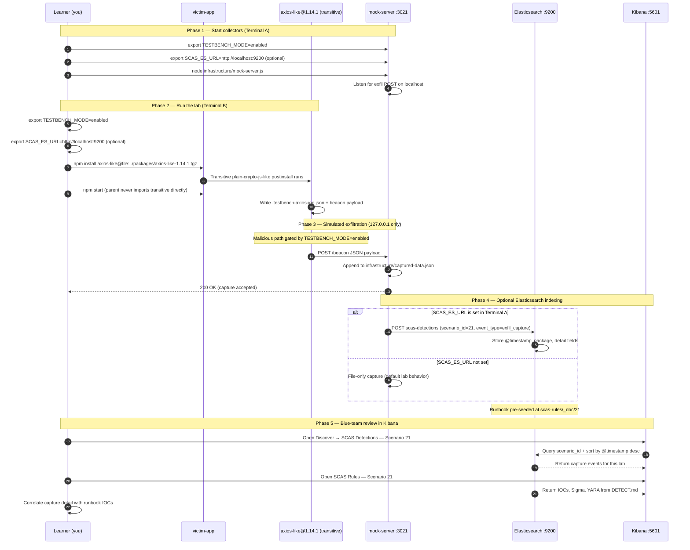

# 🚀 Zero to Hero: Scenario 21 - Axios-style Compromised npm Release

Welcome! This guide will take you from zero knowledge to successfully completing the Axios-style compromised npm release scenario. We'll go step by step, explaining everything along the way.

**Note**: This lab uses **fictional** package names (`axios-like`, `plain-crypto-js-like`) and **localhost-only** telemetry. It is inspired by real maintainer-compromise patterns but contains no real malware or external C2.

## 📚 What You'll Learn

By the end of this guide, you will:
- Understand how a trusted parent package can introduce a malicious transitive dependency
- Learn why `postinstall` scripts run even when your app never imports the transitive
- Execute a compromised patch-version install simulation (safely)
- Hunt IOC markers, lockfile anomalies, and beacon evidence
- Perform forensic investigation including anti-forensics manifest swap
- Implement pinning, lockfile-only CI, and lifecycle script defenses

- Apply the **Mitigation Playbook** from this guide and the scenario README
---


## Table of Contents

<div class="doc-toc">

- [Part 1: Understanding Compromised npm Releases (15 minutes)](#part-1-understanding-compromised-npm-releases-15-minutes)
- [Part 2: Prerequisites Check (5 minutes)](#part-2-prerequisites-check-5-minutes)
- [Part 3: Setting Up Scenario 21 (15 minutes)](#part-3-setting-up-scenario-21-15-minutes)
- [Part 4: Understanding the Package Structure (20 minutes)](#part-4-understanding-the-package-structure-20-minutes)
- [Part 5: The Attack - Compromised Patch Install (30 minutes)](#part-5-the-attack---compromised-patch-install-30-minutes)
- [Part 6: Detection Methods (40 minutes)](#part-6-detection-methods-40-minutes)
- [Part 7: Forensic Investigation (30 minutes)](#part-7-forensic-investigation-30-minutes)
- [Part 8: Incident Response & Mitigation (30 minutes)](#part-8-incident-response--mitigation-30-minutes)
- [Mitigation Playbook](#mitigation-playbook)
- [Elasticsearch + Kibana observability (optional)](#elasticsearch--kibana-observability-optional)
- [Part 9: Key Takeaways](#part-9-key-takeaways)
- [Part 10: Advanced Exercises](#part-10-advanced-exercises)
- [📚 Additional Resources](#📚-additional-resources)
- [⚠️ Safety & Ethics](#⚠️-safety--ethics)

</div>

---
## Part 1: Understanding Compromised npm Releases (15 minutes)

### What Happened in Real Incidents (Pattern Overview)

Maintainer-account compromises on popular npm packages have shown a recurring pattern:

1. Attacker publishes a **patch semver** (e.g. `1.14.0` → `1.14.1`) that looks routine
2. The patch adds an **unexpected transitive dependency** the parent never used before
3. The transitive runs a **`postinstall`** script during `npm install`
4. The script beacons home, steals credentials, or drops persistence — then may **hide evidence**

This lab models that pattern with fictional names and **127.0.0.1:3021** beacons only.

### The Transitive Postinstall Problem

Your application imports only the parent:

```javascript
const axiosLike = require('axios-like');  // Clean HTTP client stand-in
// plain-crypto-js-like is NEVER imported here
```

But npm still:
1. Resolves `axios-like@1.14.1`'s dependencies
2. Materializes `plain-crypto-js-like` in `node_modules`
3. Runs **`postinstall`** on the transitive during install

**Key insight**: Lifecycle scripts execute for **installed** packages, not **imported** packages.

### Why `bundledDependencies` Matters in This Lab

Real attackers need the transitive to **always install** with the parent tarball. This lab uses:

```json
"bundledDependencies": ["plain-crypto-js-like"]
```

Combined with `npm pack` → `axios-like-1.14.1.tgz`, so `npm install` of the packed release materializes the nested package and runs `postinstall` reliably (avoids `file:` link quirks that skip nested installs).

### Attack Flow in This Scenario

```
victim-app depends on axios-like@1.14.0 (clean, no extra deps)
    └── Attacker publishes axios-like@1.14.1 (compromised tarball)
            └── bundles plain-crypto-js-like
                    └── postinstall (TESTBENCH_MODE=enabled):
                            ├── Writes .testbench-axios-ioc.json
                            ├── POST http://localhost:3021/beacon
                            └── Swaps package.json to decoy (no postinstall)
```

### Visual Example

```
packages/
├── axios-like-1.14.0/          # Clean baseline
├── axios-like-1.14.1/          # Compromised (bundled transitive)
├── axios-like-1.14.1.tgz       # Packed release for install
└── plain-crypto-js-like/
    ├── postinstall.js          # Malicious lifecycle
    ├── package.json
    └── package.clean.json      # Decoy manifest (anti-forensics)

victim-app/
├── index.js                    # Imports axios-like ONLY
└── .testbench-axios-ioc.json   # Marker written by postinstall
```

### Why This Attack Class Is Dangerous

1. **Trust in maintainer**: Patch bumps look normal in changelogs
2. **Transitive blindness**: App code never references the malicious package
3. **Install-time execution**: Attack completes before app runs
4. **Anti-forensics**: Decoy `package.json` hides `postinstall` after install
5. **Wide reach**: High-download packages affect thousands of CI pipelines

---

## Part 2: Prerequisites Check (5 minutes)

Before we start, make sure you've completed:

- ✅ Scenario 4 (Postinstall Scripts) — Install-time execution
- ✅ Scenario 7 (Transitive Dependencies) — Nested dependency trees
- ✅ Node.js 16+ and npm installed
- ✅ TESTBENCH_MODE enabled

Verify your setup:

```bash
node --version
npm --version
echo $TESTBENCH_MODE  # Should output: enabled
```

---

## Part 3: Setting Up Scenario 21 (15 minutes)

### Step 1: Navigate to Scenario Directory

```bash
cd scenarios/21-axios-compromised-release-attack
```

### Step 2: Run the Setup Script

```bash
export TESTBENCH_MODE=enabled
chmod +x setup.sh
./setup.sh
```

**What this does:**
- Builds `axios-like-1.14.1.tgz` with bundled transitive
- Prepares mock server on port **3021** (endpoint **`/beacon`**, not `/collect`)
- Initializes `infrastructure/captured-data.json`
- Sets up victim-app with clean `axios-like@1.14.0` baseline

### Step 3: Understand the Environment

**The Scenario Structure**:
```
21-axios-compromised-release-attack/
├── packages/
│   ├── axios-like-1.14.0/      # Clean version
│   ├── axios-like-1.14.1/      # Compromised source
│   ├── axios-like-1.14.1.tgz   # Install this in the lab
│   └── plain-crypto-js-like/   # Malicious transitive
├── victim-app/
│   ├── index.js
│   └── package.json
├── infrastructure/
│   ├── mock-server.js          # Port 3021, POST /beacon
│   └── captured-data.json
└── detection-tools/
    └── axios-compromise-detector.js
```

**Mock server contract** (differs from most scenarios):
- Port: **3021**
- Path: **`POST /beacon`** (not `/collect`)

---

## Part 4: Understanding the Package Structure (20 minutes)

### Step 1: Compare Clean vs Compromised Parent

```bash
cat packages/axios-like-1.14.0/package.json
cat packages/axios-like-1.14.1/package.json
```

**Look for in 1.14.1**:
- New `dependencies` or `bundledDependencies` referencing `plain-crypto-js-like`
- Version bump from `1.14.0` to `1.14.1`

### Step 2: Examine the Malicious Transitive

```bash
cat packages/plain-crypto-js-like/package.json
cat packages/plain-crypto-js-like/postinstall.js
```

**postinstall behavior** (when `TESTBENCH_MODE=enabled`):
1. Writes `.testbench-axios-ioc.json` to `INIT_CWD` (victim app root)
2. POSTs JSON to `http://localhost:3021/beacon`
3. Overwrites installed `package.json` with `package.clean.json` (decoy)

**Forensic note**: `INIT_CWD` is set by npm to the directory where `npm install` was invoked — critical for timeline reconstruction.

```bash
cat packages/plain-crypto-js-like/package.clean.json
# Notice: no "scripts" / postinstall in decoy
```

### Step 3: Examine the Victim Application

```bash
cat victim-app/index.js
```

**What you'll see:**
- Imports `axios-like` only
- Never `require('plain-crypto-js-like')`
- Logs loaded version for learner verification

### Step 4: Verify the Packed Tarball Exists

```bash
ls -la packages/axios-like-1.14.1.tgz
```

**Why tarball**: Ensures bundled dependency installs exactly as a registry release would.

### Step 5: Inspect Tarball Contents (Optional Deep Dive)

```bash
cd packages
tar -tzf axios-like-1.14.1.tgz | head -30
```

**Look for**:
- `package/package.json` with `bundledDependencies`
- Nested `node_modules/plain-crypto-js-like/` inside tarball
- `postinstall.js` in the bundled transitive path

```bash
# Extract to temp dir for inspection (optional)
mkdir -p /tmp/tgz-inspect && tar -xzf axios-like-1.14.1.tgz -C /tmp/tgz-inspect
cat /tmp/tgz-inspect/package/package.json | jq '.bundledDependencies'
```

### Step 6: Understand INIT_CWD Forensics

The postinstall script uses:

```javascript
const projectRoot = process.env.INIT_CWD || process.cwd();
```

**Why this matters in real IR**:
- `cwd` inside postinstall may be the **nested package directory**
- `INIT_CWD` points to where the developer ran `npm install` (victim-app)
- Marker files and beacons should attribute to **INIT_CWD**, not nested path

```bash
grep INIT_CWD packages/plain-crypto-js-like/postinstall.js
```

---

## Part 5: The Attack - Compromised Patch Install (30 minutes)

### Step 1: Understand the Attack Timeline

**Scenario**: Developer or CI runs `npm install` and pulls compromised patch `axios-like@1.14.1`.

**Attack Timeline**:
1. Victim starts on clean `axios-like@1.14.0`
2. Attacker publishes `1.14.1` with bundled transitive
3. `npm install axios-like@file:../packages/axios-like-1.14.1.tgz`
4. `plain-crypto-js-like` postinstall runs during install
5. Beacon hits **localhost:3021/beacon**; marker file written
6. Decoy manifest replaces transitive `package.json`
7. `npm start` runs app — which never imported the transitive

### Step 2: Start the Mock Collector

**Terminal A**:

```bash
cd scenarios/21-axios-compromised-release-attack
export TESTBENCH_MODE=enabled
node infrastructure/mock-server.js
```

**Verify**:

```bash
curl -s http://localhost:3021/captured-data
```

### Step 3: Install the Compromised Patch

**Terminal B**:

```bash
export TESTBENCH_MODE=enabled
cd scenarios/21-axios-compromised-release-attack/victim-app
npm install axios-like@file:../packages/axios-like-1.14.1.tgz
```

**Watch for**:
- npm lifecycle output mentioning `plain-crypto-js-like`
- Creation of `.testbench-axios-ioc.json`

```bash
cat .testbench-axios-ioc.json
```

### Step 4: Run the Victim Application

```bash
npm start
```

**Notice**: App runs normally. The attack already happened at **install time**.

```bash
# Confirm parent loaded
# Console: [victim-app] loaded axios-like 1.14.1 ...
```

### Step 5: Inspect Beacon Evidence

```bash
curl -s http://localhost:3021/captured-data | jq
```

**Captured payload fields**:
- `type`: `postinstall-beacon`
- `package`: `plain-crypto-js-like`
- `cwd`: victim-app path

```bash
cat ../infrastructure/captured-data.json | jq '.captures[-1]'
```

### Step 6: Observe Anti-Forensics

```bash
# Installed transitive package.json may show decoy (no postinstall)
cat node_modules/plain-crypto-js-like/package.json
```

**Compare to source**:

```bash
diff packages/plain-crypto-js-like/package.json \
     node_modules/plain-crypto-js-like/package.json || true
```

**Key Point**: Disk forensics must include lockfile, npm logs, and marker files — not just current `package.json`.

### Step 7: Offline Install Mode (Optional)

For air-gapped CI that still installs deps but skips beacon:

```bash
TESTBENCH_OFFLINE=1 npm install axios-like@file:../packages/axios-like-1.14.1.tgz
```

Postinstall exits early — useful for testing install graph without network markers.

---

## Part 6: Detection Methods (40 minutes)

### Detection Method 1: Axios Compromise Detector

From scenario root:

```bash
node detection-tools/axios-compromise-detector.js victim-app
```

**What this flags:**
- Unexpected transitive with `postinstall` in dependency tree
- Marker file `.testbench-axios-ioc.json`
- Version skew between expected clean release and installed patch

### Detection Method 2: Lockfile and Tree Inspection

```bash
cd victim-app

npm ls plain-crypto-js-like
npm ls axios-like

# Find postinstall scripts in tree
npm ls --all 2>/dev/null | head -50
find node_modules -name package.json -exec grep -l postinstall {} \; 2>/dev/null
```

**Red flags:**
- New transitive appearing in patch upgrade diff
- Lifecycle scripts on packages your app never directly depends on

### Detection Method 3: Marker File Hunt

```bash
find . -name ".testbench-axios-ioc.json" 2>/dev/null
cat .testbench-axios-ioc.json | jq
```

**IOC fields for real incidents** (adapt names):
- Unexpected marker files in project root after install
- `INIT_CWD` in install logs vs nested package paths

### Detection Method 4: Network Monitoring

**Endpoint**: `127.0.0.1:3021` path `/beacon`

**Sample log** (from `DETECT.md`):
```json
{"scenario_id":"21","event_type":"transitive_postinstall_beacon","source":"plain-crypto-js-like","destination":"127.0.0.1:3021"}
```

**Sigma-style**:
- Process command line contains `npm install` + compromised tarball/version
- File path contains `.testbench-axios-ioc.json`

### Detection Method 5: Manifest Integrity Check

```bash
# Compare installed manifest to known-good hash from advisory
shasum node_modules/plain-crypto-js-like/package.json
shasum ../packages/plain-crypto-js-like/package.json
```

**Policy**: Store trusted hashes for critical packages; alert on post-install drift.

### Detection Method 6: Lockfile Diff Review

After installing compromised patch:

```bash
cd victim-app

# Show what npm recorded for the new transitive
grep -A2 "plain-crypto-js-like" package-lock.json | head -20

# Compare lockfile before/after (if you saved baseline)
# diff package-lock.json.clean package-lock.json
```

**CI gate idea**: Fail PR if lockfile adds a new transitive with `postinstall` under high-trust parent packages.

### Detection Method 7: Lifecycle Script Inventory

```bash
# All packages with install scripts in node_modules
find node_modules -name package.json -print0 2>/dev/null | \
  xargs -0 grep -l '"postinstall"' 2>/dev/null | head -20
```

**Question**: Would your org notice a **new** package name appearing in this list after a patch bump?

---

## Part 7: Forensic Investigation (30 minutes)

### Investigation Step 1: Dependency Tree Reconstruction

```bash
cd victim-app
npm ls --all 2>/dev/null | grep -E "axios-like|plain-crypto"
```

**Questions:**
- Who introduced `plain-crypto-js-like` — direct or transitive?
- Which parent version pulled it in?
- Was it bundled or resolved from registry?

### Investigation Step 2: Install Timeline

```bash
cat .testbench-axios-ioc.json | jq '.time, .cwd, .phase'

# npm debug log (if enabled)
# NPM_CONFIG_LOGLEVEL=verbose npm install ...
```

**Build timeline**:
- When was compromised tarball installed?
- Did postinstall run before or after app deploy?
- Which CI runners executed the install?

### Investigation Step 3: Anti-Forensics Analysis

```bash
# Source still shows postinstall
grep postinstall ../packages/plain-crypto-js-like/package.json

# Installed may show decoy
grep postinstall node_modules/plain-crypto-js-like/package.json || echo "postinstall removed from disk"
```

**Questions:**
- Would disk-only IR miss the attack?
- What logs preserve original manifest?

### Investigation Step 4: Impact Assessment

**Questions:**
- How many repos use `^1.14.0` and auto-pulled `1.14.1`?
- Which secrets existed in CI env during install?
- Were npm tokens or cloud credentials exposed?

```bash
# Hunt org-wide (conceptual)
# grep -r "plain-crypto-js-like" across lockfiles in monorepo
```

---

## Part 8: Incident Response & Mitigation (30 minutes)

### Response Step 1: Immediate Containment

```bash
# Stop CI runners that ran npm install against bad version
../../scripts/kill-port.sh 3021

cd victim-app
rm -rf node_modules
rm -f .testbench-axios-ioc.json
rm -f package-lock.json
```

### Response Step 2: Eradicate and Recover

```bash
# Pin known-good version
# package.json: "axios-like": "1.14.0" (exact, no caret)

npm install axios-like@file:../packages/axios-like-1.14.0
# Or verified tarball hash from before incident

npm start
```

**Real incidents also require**:
- Revoke and rotate npm tokens, CI secrets, cloud API keys
- Invalidate compromised release on registry (deprecate/unpublish per policy)

### Response Step 3: Long-term Defenses

1. **Pin exact versions** — avoid caret auto-upgrade on critical HTTP/crypto libs
2. **Lockfile-only CI** — `npm ci` with `--ignore-scripts` where safe, then targeted script audit
3. **Trusted publishing / provenance** — verify attestations when available
4. **Patch review** — treat patch bumps on high-download packages as security reviews
5. **Lifecycle monitoring** — alert on postinstall network from nested deps
6. **Org-wide lockfile hunt** — search for IOC package names from advisories

```bash
node detection-tools/axios-compromise-detector.js victim-app
```

---

---

---

## Mitigation Playbook

Canonical prevention and mitigation controls (aligned with the [scenario README](../../../scenarios/21-axios-compromised-release-attack/README.md)). Lab walkthroughs above expand each control with hands-on steps.

- Contain: stop CI runners and isolate hosts that installed the bad version.
- Eradicate: remove `node_modules`, regenerate lockfiles, rotate npm tokens and CI secrets.
- Recover: pin to a known-good exact version; enforce lockfile-only installs in CI.
- Hunt: search org lockfiles for unexpected transitive packages from advisories.
- Enable trusted publishing / provenance checks and lifecycle script monitoring.

---

## Elasticsearch + Kibana observability (optional)

Scenario **21 — Axios-style Compromised Release** is indexed in Elasticsearch when the observability stack is running.

Axios-style release: axios-like@1.14.1 bundles a transitive with postinstall; beacon goes to /beacon.

- **Detection runbook (static)** → index `scas-rules`, document id `21` — IOCs, Sigma, YARA, sample logs from `DETECT.md`
- **Runtime captures (dynamic)** → index `scas-detections` — one document per exfil event when `SCAS_ES_URL` is set before starting the mock collector

### How to read this diagram

| Phase | What you should look for |
|-------|--------------------------|
| **1 — Collectors** | Terminal A starts the mock server (or harvester). Set `SCAS_ES_URL` here if you want live Elasticsearch indexing. |
| **2 — Lab execution** | Terminal B runs the scenario README steps. Numbered arrows follow the attack path in order. |
| **3 — Exfiltration** | Malicious sample sends **localhost-only** JSON to the mock endpoint. Evidence is always written to `infrastructure/` on disk. |
| **4 — Elasticsearch** | When `SCAS_ES_URL` is set, the same capture is indexed into `scas-detections` with `scenario_id` and `event_type=exfil_capture`. |
| **5 — Kibana** | Use the per-scenario saved searches to compare **runtime captures** (Detections) with the **static runbook** (Rules). |

> **Safety:** All network calls stay on `127.0.0.1`. Malicious logic runs only when `TESTBENCH_MODE=enabled`.

### End-to-end flow



### Prerequisites

From the repository root:

```bash
./scripts/elasticsearch-up.sh
./scripts/setup-kibana-data-views.sh   # data views + saved searches for all 22 scenarios
```

### Run this scenario with live Elasticsearch forwarding

**Terminal A — mock collector** (from `scenarios/21-axios-compromised-release-attack`):

```bash
cd scenarios/21-axios-compromised-release-attack
export TESTBENCH_MODE=enabled
export SCAS_ES_URL=http://localhost:9200
node infrastructure/mock-server.js
```

**Terminal B — execute the lab:**

```bash
cd scenarios/21-axios-compromised-release-attack
export TESTBENCH_MODE=enabled
export SCAS_ES_URL=http://localhost:9200
cd victim-app && npm install axios-like@file:../packages/axios-like-1.14.1.tgz && npm start
```

### Verify locally (file-based evidence)

```bash
curl -s http://localhost:3021/captured-data
```

### Verify in Elasticsearch (API)

```bash
# Static runbook for this scenario
curl -s "http://localhost:9200/scas-rules/_doc/21?pretty"

# Latest runtime capture events
curl -s "http://localhost:9200/scas-detections/_search?pretty" \
  -H 'Content-Type: application/json' \
  -d '{
    "query": { "term": { "scenario_id": "21" } },
    "sort": [{ "@timestamp": "desc" }],
    "size": 5
  }'
```

### Verify in Kibana (UI)

1. Open [http://localhost:5601](http://localhost:5601)
2. **Discover** → **SCAS Detections — Scenario 21** — live capture timeline (`@timestamp`, `package.name`, `detail`)
3. **Discover** → **SCAS Rules — Scenario 21** — compare against `iocs`, `sigma`, and `yara` fields
4. Ask: *Does each capture field match an IOC or Sigma condition in the runbook?*

See [observability/README.md](../../../observability/README.md) for stack details.

## Part 9: Key Takeaways

### Why Compromised Patch Releases Are Dangerous

1. **Maintainer trust**: Small semver bumps bypass scrutiny
2. **Transitive execution**: App code never references malicious package
3. **Install-time payload**: Attack finishes before runtime monitoring starts
4. **Anti-forensics**: Decoy manifests frustrate naive disk triage
5. **CI amplification**: Every unpinned pipeline is a victim

### Best Practices

1. ✅ **Pin exact versions** on high-impact dependencies
2. ✅ **Lockfile-only installs** in CI with hash verification
3. ✅ **Review patch diffs** for new transitives and lifecycle scripts
4. ✅ **Monitor postinstall** network and filesystem activity
5. ✅ **Preserve npm logs** and `INIT_CWD` for forensic timelines
6. ✅ **Rotate secrets** after confirmed supply-chain incidents
7. ✅ **Use provenance tools** where ecosystem supports them

### Real-World Impact

- **axios/axios incident discussion** — community pattern for unexpected transitives
- **Detection time**: Often hours to days via registry advisories + lockfile hunts
- **Blast radius**: Any project with semver range accepting poisoned patch

---

## Part 10: Advanced Exercises

### Exercise 1: Bundled Dependencies
- Explain why **`bundledDependencies` + `npm pack`** is used in this lab to ensure the nested package installs
- What would break if the transitive were only a `file:` dependency?

### Exercise 2: IOC Hunting
- List three **IOC fields** you would hunt in a real org after an npm supply-chain alert
- Write a Sigma rule mapping this lab's markers to production field names

### Exercise 3: Control Prioritization
- Rank: trusted publishing, lockfile policy, script blocking — which is strongest for this attack class?
- Defend your ranking in one paragraph

### Exercise 4: Anti-Forensics Resistance
- What anti-forensics behavior was present, and how can detection resist it?
- Design a control that captures manifest state **before** postinstall completes

---

## 📚 Additional Resources

- [axios/axios incident discussion (GitHub)](https://github.com/axios/axios/issues/10604)
- [GitHub issue #3 — scenario inspiration](https://github.com/RAJANAGORI/supply-chain-attack-simulator/issues/3)
- [npm bundledDependencies](https://docs.npmjs.com/cli/v10/configuring-npm/package-json#bundleddependencies)
- Scenario README: `scenarios/21-axios-compromised-release-attack/README.md`
- Detection runbook: `scenarios/21-axios-compromised-release-attack/DETECT.md`
- Quick reference: `documentation/scenario-guides/quick-reference/QUICK_REFERENCE_SCENARIO_21.md`

---

## ⚠️ Safety & Ethics

**IMPORTANT**: This scenario is for **educational purposes only**.

- ✅ Use ONLY in isolated test environments
- ✅ Fictional package names — do not confuse with real `axios` or `crypto-js`
- ✅ All malicious behavior requires `TESTBENCH_MODE=enabled`
- ✅ Beacons target **127.0.0.1:3021/beacon** only — no real external C2
- ✅ Do not point payloads at non-localhost endpoints

---

**Remember**: A patch version bump is not automatically safe. Inspect new transitives, lifecycle scripts, and lockfile diffs like security releases!

🔐 Happy Learning!
