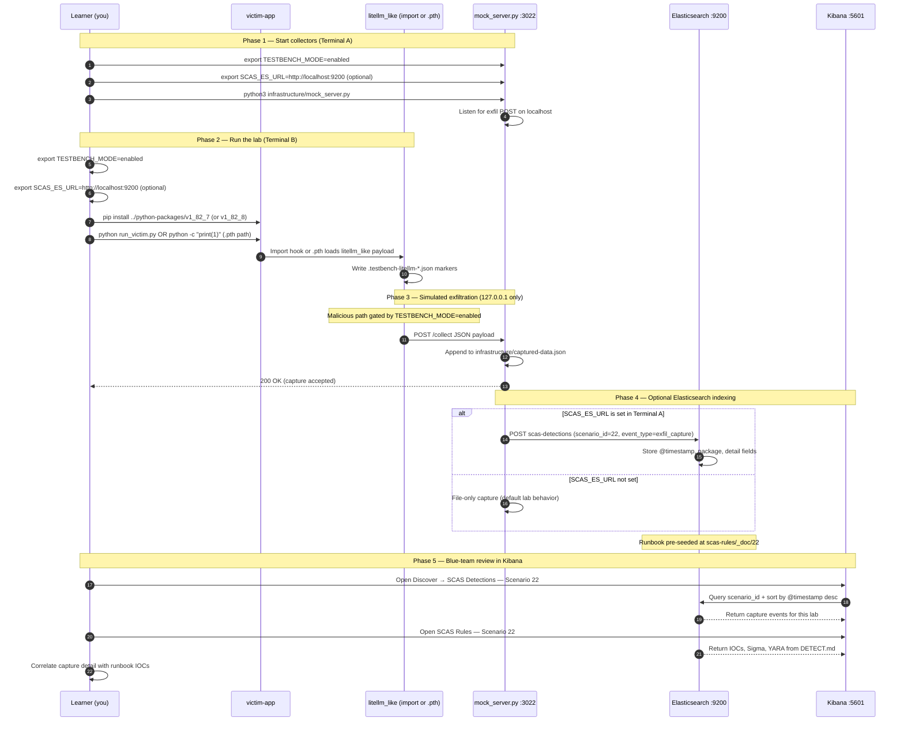

# Zero-to-Hero — Scenario 22: LiteLLM-style PyPI compromise

1. **Overview**: Compare **import-time** malware (`1.82.7`) with **`.pth` startup** hooks (`1.82.8`) in a fictional **`litellm_like`** package—**127.0.0.1** mock server only.
2. **Setup**: `cd scenarios/22-litellm-pypi-compromise && export TESTBENCH_MODE=enabled && ./setup.sh`
3. **Mock server**: `python3 infrastructure/mock_server.py` (port **3022**)
4. **Import path**: `cd victim-app && source .venv/bin/activate && pip install -U ../python-packages/v1_82_7 && export TESTBENCH_MODE=enabled && python run_victim.py`
5. **`.pth` path**: `pip uninstall -y litellm_like && export TESTBENCH_MODE=enabled && pip install ../python-packages/v1_82_8 && python -c "print(1)"` — no `import litellm_like` needed.
6. **Evidence**: `curl http://127.0.0.1:3022/captured-data` · marker files under `victim-app/`
7. **Detect**: `python detection-tools/litellm_pth_scanner.py` (with venv activated)
8. **Response**: delete `.venv`, reinstall from pinned requirements; scan **`site-packages/*.pth`**; rotate secrets after real PyPI compromises.

**Exercises**

- Describe when **`.pth`** is more dangerous than **import-time** payloads for security monitoring.
- Write a one-line **`pip install`** policy your team would use for critical AI dependencies.


---

## Elasticsearch + Kibana observability (optional)

Scenario **22 — LiteLLM-style PyPI Compromise** is indexed in Elasticsearch when the observability stack is running.

LiteLLM-style PyPI: litellm_like exfil on import (1.82.7) or via .pth at interpreter startup (1.82.8).

- **Detection runbook (static)** → index `scas-rules`, document id `22` — IOCs, Sigma, YARA, sample logs from `DETECT.md`
- **Runtime captures (dynamic)** → index `scas-detections` — one document per exfil event when `SCAS_ES_URL` is set before starting the mock collector

### How to read this diagram

| Phase | What you should look for |
|-------|--------------------------|
| **1 — Collectors** | Terminal A starts the mock server (or harvester). Set `SCAS_ES_URL` here if you want live Elasticsearch indexing. |
| **2 — Lab execution** | Terminal B runs the scenario README steps. Numbered arrows follow the attack path in order. |
| **3 — Exfiltration** | Malicious sample sends **localhost-only** JSON to the mock endpoint. Evidence is always written to `infrastructure/` on disk. |
| **4 — Elasticsearch** | When `SCAS_ES_URL` is set, the same capture is indexed into `scas-detections` with `scenario_id` and `event_type=exfil_capture`. |
| **5 — Kibana** | Use the per-scenario saved searches to compare **runtime captures** (Detections) with the **static runbook** (Rules). |

> **Safety:** All network calls stay on `127.0.0.1`. Malicious logic runs only when `TESTBENCH_MODE=enabled`.

### End-to-end flow



### Prerequisites

From the repository root:

```bash
./scripts/elasticsearch-up.sh
./scripts/setup-kibana-data-views.sh   # data views + saved searches for all 22 scenarios
```

### Run this scenario with live Elasticsearch forwarding

**Terminal A — mock collector** (from `scenarios/22-litellm-pypi-compromise`):

```bash
cd scenarios/22-litellm-pypi-compromise
export TESTBENCH_MODE=enabled
export SCAS_ES_URL=http://localhost:9200
python3 infrastructure/mock_server.py
```

**Terminal B — execute the lab:**

```bash
cd scenarios/22-litellm-pypi-compromise
export TESTBENCH_MODE=enabled
export SCAS_ES_URL=http://localhost:9200
cd victim-app && source .venv/bin/activate && pip install -U ../python-packages/v1_82_7 && python run_victim.py
```

### Verify locally (file-based evidence)

```bash
curl -s http://127.0.0.1:3022/captured-data
```

### Verify in Elasticsearch (API)

```bash
# Static runbook for this scenario
curl -s "http://localhost:9200/scas-rules/_doc/22?pretty"

# Latest runtime capture events
curl -s "http://localhost:9200/scas-detections/_search?pretty" \
  -H 'Content-Type: application/json' \
  -d '{
    "query": { "term": { "scenario_id": "22" } },
    "sort": [{ "@timestamp": "desc" }],
    "size": 5
  }'
```

### Verify in Kibana (UI)

1. Open [http://localhost:5601](http://localhost:5601)
2. **Discover** → **SCAS Detections — Scenario 22** — live capture timeline (`@timestamp`, `package.name`, `detail`)
3. **Discover** → **SCAS Rules — Scenario 22** — compare against `iocs`, `sigma`, and `yara` fields
4. Ask: *Does each capture field match an IOC or Sigma condition in the runbook?*

See [observability/README.md](../../../observability/README.md) for stack details.
