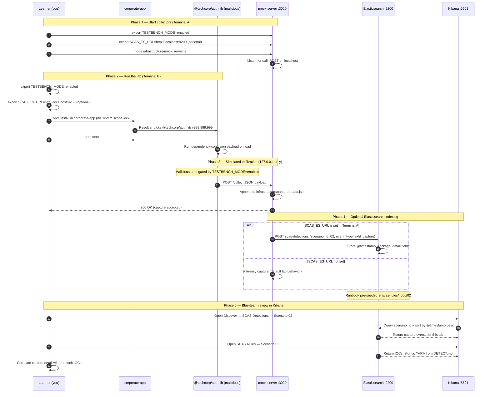

# 🚀 Zero to Hero: Scenario 2 - Dependency Confusion Attack

Welcome! This guide will take you from zero knowledge to successfully completing the Dependency Confusion attack scenario. We'll go step by step, explaining everything along the way.

## 📚 What You'll Learn

By the end of this guide, you will:
- Understand what dependency confusion attacks are
- Learn how package resolution works
- Execute a dependency confusion attack (safely in a test environment)
- Detect and prevent dependency confusion vulnerabilities
- Configure proper registry scoping

- Apply the **Mitigation Playbook** from this guide and the scenario README
---


## Table of Contents

<div class="doc-toc">

- [Part 1: Understanding Dependency Confusion (10 minutes)](#part-1-understanding-dependency-confusion-10-minutes)
- [Part 2: Prerequisites Check (5 minutes)](#part-2-prerequisites-check-5-minutes)
- [Part 3: Setting Up Scenario 2 (15 minutes)](#part-3-setting-up-scenario-2-15-minutes)
- [Part 4: Understanding the Attack Flow (15 minutes)](#part-4-understanding-the-attack-flow-15-minutes)
- [Part 5: Executing the Attack (30 minutes)](#part-5-executing-the-attack-30-minutes)
- [Part 6: Understanding What Happened (10 minutes)](#part-6-understanding-what-happened-10-minutes)
- [Part 7: Detecting the Attack (25 minutes)](#part-7-detecting-the-attack-25-minutes)
- [Part 8: Prevention and Mitigation (30 minutes)](#part-8-prevention-and-mitigation-30-minutes)
- [Part 9: Advanced Topics (20 minutes)](#part-9-advanced-topics-20-minutes)
- [Mitigation Playbook](#mitigation-playbook)
- [Elasticsearch + Kibana observability (optional)](#elasticsearch--kibana-observability-optional)
- [Part 10: Clean Up and Next Steps (5 minutes)](#part-10-clean-up-and-next-steps-5-minutes)
- [🆘 Troubleshooting](#🆘-troubleshooting)
- [📚 Additional Resources](#📚-additional-resources)
- [⚠️ Important Reminders](#⚠️-important-reminders)
- [🎉 Congratulations!](#🎉-congratulations)

</div>

---
## Part 1: Understanding Dependency Confusion (10 minutes)

### What is Dependency Confusion?

**Dependency Confusion** (also called **Substitution Attack**) occurs when an attacker publishes a malicious package to a public registry with the same name as a private/internal package, exploiting how package managers resolve dependencies.

### The Vulnerability

Most package managers (npm, pip, etc.) check multiple registries when resolving dependencies:
1. First checks public registries (npmjs.com, pypi.org)
2. Then checks private/internal registries

**The Problem**: When a higher version exists on the public registry, it may take precedence over the private one!

### Real-World Example: Alex Birsan (2021)

- Found leaked `package.json` files on GitHub
- Identified private package names (e.g., `@microsoft/...`, `@apple/...`)
- Published higher version numbers to public npm
- Companies' build systems automatically downloaded malicious packages
- **Result**: $130,000+ in bug bounties from 35+ companies including Microsoft, Apple, Tesla, Netflix, Uber

### How It Works

```
1. Company has private package: @techcorp/auth-lib version 1.0.0
2. Attacker publishes: @techcorp/auth-lib version 999.999.999 to public npm
3. Developer runs: npm install
4. npm sees version 999.999.999 is higher than 1.0.0
5. npm installs the malicious version from public registry!
```

---

## Part 2: Prerequisites Check (5 minutes)

Before we start, make sure you've completed:

- ✅ Scenario 1 (Typosquatting) - Understanding basic supply chain attacks
- ✅ Node.js 16+ and npm installed
- ✅ TESTBENCH_MODE enabled

Verify your setup:

```bash
node --version   # Should be v16+
npm --version    # Should be v7+
echo $TESTBENCH_MODE  # Should output: enabled
```

---

## Part 3: Setting Up Scenario 2 (15 minutes)

### Step 1: Navigate to Scenario Directory

```bash
cd scenarios/02-dependency-confusion
```

### Step 2: Run the Setup Script

```bash
./setup.sh
```

**What this does:**
- Creates internal packages and attacker package (`@techcorp/auth-lib@999.999.999`)
- Packs attacker tarball and builds fake public registry metadata (`work/`)
- Creates `corporate-app/.npmrc` with vulnerable `@techcorp:registry=http://localhost:4874/`
- Sets up `infrastructure/registry-server.js` (port **4874**) and mock C2 (port **3000**)
- Prepares `detection-tools/dependency-confusion-scanner.js`

**Expected output:**
- You'll see setup progress messages
- Directories and files will be created
- At the end, it will show "Next Steps"

### Step 3: Understand the Environment

**TechCorp's Internal Setup:**
- **Private Packages** (in `internal-packages/`):
  - `@techcorp/auth-lib` - Authentication library
  - `@techcorp/data-utils` - Data processing utilities
  - `@techcorp/api-client` - Internal API client

**Corporate Application** (in `corporate-app/`):
- Uses all three internal packages
- Depends on them for core functionality

**Leaked Data** (in `leaked-data/`):
- Simulates a `package.json` accidentally committed to a public GitHub repo
- Contains internal package names (this is what attackers find!)

---

## Part 4: Understanding the Attack Flow (15 minutes)

### Step 1: Reconnaissance (How Attackers Find Targets)

Attackers discover internal package names from:

1. **Public Git Repositories**: Accidentally committed `package.json`
2. **Job Postings**: Technical requirements listing internal tools
3. **Public CI/CD Logs**: Build outputs showing package names
4. **JavaScript Bundles**: Inspecting compiled code
5. **Employee LinkedIn**: Posts about internal tools

**Let's see what was "leaked":**

```bash
cat leaked-data/package.json
```

**What you'll see:**
- Internal package names: `@techcorp/auth-lib`, `@techcorp/data-utils`, `@techcorp/api-client`
- Version requirements: `^1.0.0`

**This is gold for attackers!** They now know:
- Which packages exist internally
- What versions are being used
- The organization's naming convention

### Step 2: Understanding Package Resolution

Let's see how npm resolves packages:

```bash
# Check current registry configuration
npm config get registry

# Check if .npmrc exists
cat .npmrc 2>/dev/null || echo "No .npmrc file"
```

**The Problem:**
- Without proper `.npmrc` configuration, npm checks BOTH public and private registries
- It picks the HIGHEST version number available
- If public registry has version 999.999.999 and private has 1.0.0, public wins!

### Step 3: The Attack Strategy

**Attacker's Plan:**
1. Publish malicious package with same name as internal package
2. Use version number HIGHER than internal version (999.999.999)
3. Wait for developers to run `npm install`
4. Malicious package gets installed instead of internal one

---

## Part 5: Executing the Attack (30 minutes)

### Step 1: Examine Internal Packages

First, let's see what the legitimate internal packages look like:

```bash
# View internal auth-lib
cat internal-packages/@techcorp/auth-lib/index.js
cat internal-packages/@techcorp/auth-lib/package.json
```

**Notice:**
- Version: `1.0.0`
- It's a legitimate authentication library
- Clean, straightforward code

### Step 2: Review the Attacker Package (Pre-built by setup)

`setup.sh` already copies the malicious template and packs the attacker tarball:

```bash
cat attacker-packages/@techcorp/auth-lib/package.json
cat attacker-packages/@techcorp/auth-lib/postinstall.js | head -30
```

**Key Points:**
- **Same name**: `@techcorp/auth-lib`
- **Higher version**: `999.999.999` (beats internal `1.x`)
- **postinstall**: Exfiltrates at `npm install` time (no `npm start` required)

### Step 3: Inspect the Vulnerable `.npmrc`

```bash
cat corporate-app/.npmrc
```

**The misconfiguration:** `@techcorp:registry` points to the attacker's fake public registry (`localhost:4874`) instead of TechCorp's internal registry.

### Step 4: Start the Mock C2 and Fake Public Registry

**Terminal A** — mock C2:
```bash
node infrastructure/mock-server.js
```

**Terminal B** — attacker-controlled registry:
```bash
node infrastructure/registry-server.js
```

**Verify registry is serving the malicious package:**
```bash
curl -s http://localhost:4874/@techcorp%2Fauth-lib | jq '.["dist-tags"]'
# Expected: {"latest":"999.999.999"}
```

### Step 5: Run `npm install` (The Real Attack)

**Terminal C:**
```bash
cd corporate-app
rm -rf node_modules package-lock.json
npm cache clean --force
export TESTBENCH_MODE=enabled
npm install
```

**What just happened:**
1. npm read `.npmrc` → `@techcorp:registry=http://localhost:4874/`
2. Queried the fake registry for `@techcorp/auth-lib`
3. Downloaded `v999.999.999` tarball (higher than any internal version)
4. `postinstall.js` fired during install → data sent to mock C2 on `:3000`

### Step 6: Run the Corporate Application (Still Works)

```bash
export TESTBENCH_MODE=enabled
npm start
```

The app runs normally — the attack was silent during install.

### Step 7: Verify the Compromise

```bash
npm list @techcorp/auth-lib
curl -s http://localhost:3000/captured-data | jq
```

**Look for:**
- Installed version: `999.999.999`
- Capture with `"phase": "postinstall"` and `"registrySource": "...4874..."`

**What you should see:**
- Version installed: `999.999.999` (malicious version)
- Captured data in the mock server
- The attack was successful!

---

## Part 6: Understanding What Happened (10 minutes)

### The Attack Flow

1. **Reconnaissance**: Attacker found leaked `package.json` with internal package names
2. **Package Creation**: Attacker created malicious package with same name
3. **Version Manipulation**: Used version `999.999.999` (higher than internal `1.0.0`)
4. **Installation**: Developer ran `npm install`, malicious package was installed
5. **Execution**: Malicious code ran and exfiltrated data

### Why It Worked

**The Root Cause:**
- npm's default behavior checks multiple registries
- Without proper `.npmrc` configuration, it doesn't restrict scoped packages to private registries
- Version resolution picks the highest version available
- Public registry version (999.999.999) > Private registry version (1.0.0)

**In a Real Attack:**
- Attacker publishes to public npm (npmjs.com)
- Thousands of companies could be affected
- Build systems automatically install the malicious version
- Data exfiltration happens silently

---

## Part 7: Detecting the Attack (25 minutes)

Now let's switch roles and become defenders. How can we detect this attack?

### Method 1: Version Anomaly Detection

```bash
# Run the dependency confusion scanner
cd ..
node detection-tools/dependency-confusion-scanner.js corporate-app
```

**What it checks:**
- Unusually high version numbers (like 999.999.999)
- Packages from unexpected registries
- Suspicious version patterns

### Method 2: Registry Source Verification

```bash
cd corporate-app

# Check where packages came from
npm list @techcorp/auth-lib

# Check package-lock.json for registry sources
cat package-lock.json | grep -A 5 "@techcorp/auth-lib"
```

**Red flags:**
- Internal packages coming from public registry
- Unexpected registry URLs
- Suspicious version numbers

### Method 3: Package Inspection

```bash
# Check the installed package
cat node_modules/@techcorp/auth-lib/index.js | head -50
```

**What to look for:**
- Network requests
- Data collection
- Suspicious code patterns
- Obfuscation

### Method 4: Automated Scanning

```bash
# Use the detection tool
cd ../detection-tools
node dependency-confusion-scanner.js ../corporate-app
```

**Detection capabilities:**
- Scans for scoped packages
- Checks version numbers
- Identifies suspicious patterns
- Reports potential attacks

---

## Part 8: Prevention and Mitigation (30 minutes)

Now that we've seen how the attack works, how can we prevent it?

### Prevention Strategy 1: Configure Scope Restrictions (.npmrc)

**This is the MOST IMPORTANT defense!**

```bash
# Create .npmrc in corporate-app directory
cd corporate-app

cat > .npmrc << 'EOF'
# Private packages from INTERNAL registry ONLY (correct configuration)
@techcorp:registry=https://internal-registry.techcorp.local/

# Public packages from public registry
registry=https://registry.npmjs.org/
EOF
```

**What this does:**
- Forces `@techcorp/*` packages to ONLY come from private registry
- Public registry is ignored for internal scopes
- Prevents dependency confusion attacks

**Test it:**
```bash
# Clear and reinstall
rm -rf node_modules package-lock.json
npm install

# Now it should use internal packages
npm list @techcorp/auth-lib
```

### Prevention Strategy 2: Use Package Lock Files

```bash
# Ensure package-lock.json is committed
git add package-lock.json
git commit -m "Add package-lock.json for security"

# In CI/CD, always use npm ci (not npm install)
npm ci
```

**Benefits:**
- Locks exact versions
- Prevents automatic updates to malicious versions
- Provides integrity checking

### Prevention Strategy 3: Registry Isolation

**Network-level protection:**
- Block public registry access for internal scopes at firewall/proxy level
- Use private registries exclusively for internal packages
- Implement network segmentation

### Prevention Strategy 4: Namespace Reservation

**Reserve your organization's scope on public registries:**

```bash
# Reserve the scope (prevents others from using it)
npm owner add your-team @techcorp

# Optionally publish placeholder packages
# This makes it harder for attackers to use your scope
```

### Prevention Strategy 5: Dependency Pinning

**Use exact versions (not ranges):**

```json
{
  "dependencies": {
    "@techcorp/auth-lib": "1.0.0"  // Exact version, not ^1.0.0
  }
}
```

### Prevention Strategy 6: Pre-Install Validation

The setup script created a validation script:

```bash
# View the validation script
cat corporate-app/scripts/validate-dependencies.js

# It runs automatically before install (preinstall hook)
```

**Enhance it to:**
- Check registry sources
- Verify version numbers
- Validate integrity hashes
- Ensure packages come from correct registries

### Prevention Strategy 7: Automated Scanning in CI/CD

```yaml
# .github/workflows/security.yml
- name: Check for Dependency Confusion
  run: |
    node scripts/scan-dependencies.js
    if [ $? -ne 0 ]; then
      echo "⚠️ Dependency confusion detected!"
      exit 1
    fi
```

---

## Part 9: Advanced Topics (20 minutes)

### Understanding Registry Priority

npm checks registries in this order:
1. Scope-specific registry (from `.npmrc`)
2. Default registry (from `.npmrc` or npm config)
3. Public registry (npmjs.com)

**Key insight:** If you don't configure scope-specific registries, npm will check the public registry first!

### Version Resolution Logic

npm uses semantic versioning (semver) to resolve versions:
- `^1.0.0` means "compatible with 1.0.0" (allows 1.0.1, 1.1.0, but not 2.0.0)
- `999.999.999` satisfies `^1.0.0` because it's higher
- This is why attackers use extremely high version numbers

### Multi-Registry Scenarios

**Complex setups:**
- Multiple private registries
- Different scopes for different registries
- Fallback mechanisms

**Best practice:** Always explicitly configure scope-to-registry mappings.

---


---

## Mitigation Playbook

Canonical prevention and mitigation controls (aligned with the [scenario README](../../../scenarios/02-dependency-confusion/README.md)). Lab walkthroughs above expand each control with hands-on steps.

- Configure scope-specific registry routing in `.npmrc` (e.g. `@org:registry=...`).
- Enforce package lock files and use `npm ci --audit` in CI/CD.
- Isolate private registry traffic from public npm at the network layer.
- Reserve internal namespaces on public registries where applicable.
- Pin dependencies to exact versions for critical packages.
- Verify package integrity hashes on install.
- Add build-time validation to reject unexpected registry sources.

---

---

## Elasticsearch + Kibana observability (optional)

Scenario **02 — Dependency Confusion** is indexed in Elasticsearch when the observability stack is running.

Dependency confusion: a scoped internal name resolves to a higher public version and exfiltrates from corporate-app.

- **Detection runbook (static)** → index `scas-rules`, document id `02` — IOCs, Sigma, YARA, sample logs from `DETECT.md`
- **Runtime captures (dynamic)** → index `scas-detections` — one document per exfil event when `SCAS_ES_URL` is set before starting the mock collector

### How to read this diagram

| Phase | What you should look for |
|-------|--------------------------|
| **1 — Collectors** | Terminal A starts the mock server (or harvester). Set `SCAS_ES_URL` here if you want live Elasticsearch indexing. |
| **2 — Lab execution** | Terminal B runs the scenario README steps. Numbered arrows follow the attack path in order. |
| **3 — Exfiltration** | Malicious sample sends **localhost-only** JSON to the mock endpoint. Evidence is always written to `infrastructure/` on disk. |
| **4 — Elasticsearch** | When `SCAS_ES_URL` is set, the same capture is indexed into `scas-detections` with `scenario_id` and `event_type=exfil_capture`. |
| **5 — Kibana** | Use the per-scenario saved searches to compare **runtime captures** (Detections) with the **static runbook** (Rules). |

> **Safety:** All network calls stay on `127.0.0.1`. Malicious logic runs only when `TESTBENCH_MODE=enabled`.

### End-to-end flow



### Prerequisites

From the repository root:

```bash
./scripts/elasticsearch-up.sh
./scripts/setup-kibana-data-views.sh   # data views + saved searches for all 23 scenarios
```

### Run this scenario with live Elasticsearch forwarding

**Terminal A — mock collector** (from `scenarios/02-dependency-confusion`):

```bash
cd scenarios/02-dependency-confusion
export TESTBENCH_MODE=enabled
export SCAS_ES_URL=http://localhost:9200
node infrastructure/mock-server.js
```

**Terminal B — execute the lab:**

```bash
cd scenarios/02-dependency-confusion
export TESTBENCH_MODE=enabled
export SCAS_ES_URL=http://localhost:9200
cd corporate-app && npm install && npm start
```

### Verify locally (file-based evidence)

```bash
curl -s http://localhost:3000/captured-data
```

### Verify in Elasticsearch (API)

```bash
# Static runbook for this scenario
curl -s "http://localhost:9200/scas-rules/_doc/02?pretty"

# Latest runtime capture events
curl -s "http://localhost:9200/scas-detections/_search?pretty" \
  -H 'Content-Type: application/json' \
  -d '{
    "query": { "term": { "scenario_id": "02" } },
    "sort": [{ "@timestamp": "desc" }],
    "size": 5
  }'
```

### Verify in Kibana (UI)

1. Open [http://localhost:5601](http://localhost:5601)
2. **Discover** → **SCAS Detections — Scenario 02** — live capture timeline (`@timestamp`, `package.name`, `detail`)
3. **Discover** → **SCAS Rules — Scenario 02** — compare against `iocs`, `sigma`, and `yara` fields
4. Ask: *Does each capture field match an IOC or Sigma condition in the runbook?*

See [observability/README.md](../../../observability/README.md) for stack details.

## Part 10: Clean Up and Next Steps (5 minutes)

### Clean Up

```bash
# Stop mock server (if running manually)
# Find process: ps aux | grep mock-server
# Kill it: kill <PID>
```

### What You've Accomplished

✅ Understood dependency confusion attacks  
✅ Executed a dependency confusion attack (safely)  
✅ Detected the attack using multiple methods  
✅ Implemented preventive measures  
✅ Configured proper registry scoping  

### Next Steps

1. **Try Scenario 3**: Compromised Package Attack
2. **Experiment**: Try different version numbers and registry configurations
3. **Read more**: Study Alex Birsan's original research
4. **Practice**: Implement these defenses in a real project

---

## 🆘 Troubleshooting

### Problem: "Package not found" or no capture

**Solution:**
```bash
# Ensure both servers are running
node infrastructure/mock-server.js &          # :3000
node infrastructure/registry-server.js &      # :4874

# Rebuild registry if work/ is missing
node infrastructure/build-registry.js

cd corporate-app
rm -rf node_modules package-lock.json
npm cache clean --force
export TESTBENCH_MODE=enabled
npm install
```

### Problem: "Wrong version installed" or still using file: path

**Solution:**
```bash
# Confirm vulnerable .npmrc points @techcorp to attacker registry (lab)
cat corporate-app/.npmrc

# Clear cache and reinstall
npm cache clean --force
rm -rf node_modules package-lock.json
npm install
```

### Problem: ".npmrc not working"

**Solution:**
```bash
# Verify .npmrc is in the right location (project root)
cat .npmrc

# Check npm config
npm config list

# Test registry resolution
npm view @techcorp/auth-lib
```

---

## 📚 Additional Resources

- **Main README**: `README.md`
- **Scenario README**: `scenarios/02-dependency-confusion/README.md`
- **Alex Birsan's Research**: https://medium.com/@alex.birsan
- **npm Scope Documentation**: https://docs.npmjs.com/cli/v7/using-npm/scope

---

## ⚠️ Important Reminders

- ✅ This is for **EDUCATIONAL purposes only**
- ✅ Use **ONLY in isolated environments**
- ✅ **Never** deploy malicious code to production
- ✅ **Always** set `TESTBENCH_MODE=enabled`
- ✅ **Never** test on systems you don't own

---

## 🎉 Congratulations!

You've completed the Dependency Confusion attack scenario! You now understand:
- How dependency confusion attacks work
- How to detect them
- How to prevent them with proper configuration

**Remember**: Proper registry configuration is critical for enterprise security!

Happy learning! 🔐

