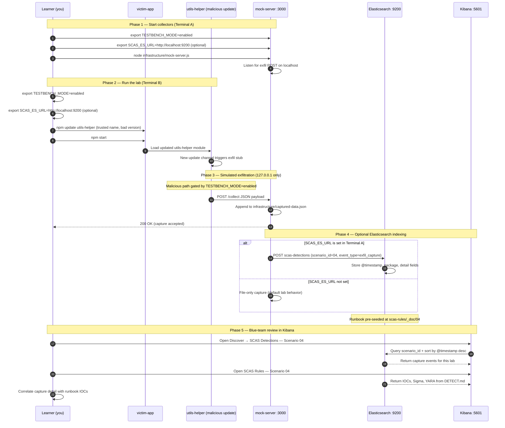

# 🚀 Zero to Hero: Scenario 4 - Malicious Update Attack

## 📚 What You'll Learn

By the end of this guide, you will:
- Understand malicious update attacks
- Learn how trojan updates work
- Execute a malicious update simulation (safely)
- Detect and prevent malicious updates
- Implement update verification strategies

- Apply the **Mitigation Playbook** from this guide and the scenario README
---


## Table of Contents

<div class="doc-toc">

- [Part 1: Understanding Malicious Updates (10 minutes)](#part-1-understanding-malicious-updates-10-minutes)
- [Part 2: Prerequisites Check (5 minutes)](#part-2-prerequisites-check-5-minutes)
- [Part 3: Setting Up Scenario 4 (15 minutes)](#part-3-setting-up-scenario-4-15-minutes)
- [Part 4: Understanding Automatic Updates (15 minutes)](#part-4-understanding-automatic-updates-15-minutes)
- [Part 5: Executing the Attack (30 minutes)](#part-5-executing-the-attack-30-minutes)
- [Part 6: Understanding What Happened (10 minutes)](#part-6-understanding-what-happened-10-minutes)
- [Part 7: Detecting the Attack (25 minutes)](#part-7-detecting-the-attack-25-minutes)
- [Part 8: Prevention and Mitigation (30 minutes)](#part-8-prevention-and-mitigation-30-minutes)
- [Mitigation Playbook](#mitigation-playbook)
- [Elasticsearch + Kibana observability (optional)](#elasticsearch--kibana-observability-optional)
- [Part 9: Clean Up and Next Steps (5 minutes)](#part-9-clean-up-and-next-steps-5-minutes)
- [📚 Additional Resources](#📚-additional-resources)
- [⚠️ Important Reminders](#⚠️-important-reminders)

</div>

---
## Part 1: Understanding Malicious Updates (10 minutes)

### What is a Malicious Update?

**Malicious Update** attacks occur when attackers inject malicious code into what appears to be a legitimate package update. These updates often:
- Appear as normal bug fixes or feature additions
- Maintain backward compatibility
- Include legitimate functionality
- Hide malicious code in seemingly innocent changes

### Why It's Dangerous

- **Trusted Source**: Update comes from the same trusted maintainer
- **Automatic Updates**: Many projects use `^` or `~` version ranges
- **Wide Distribution**: Affects all users who update
- **Stealth**: Malicious code hidden in legitimate changes

### Real-World Examples

**coa & rc (2021)**:
- Maintainer account compromised
- Password stealer injected in updates
- Affected React, Vue, Angular projects

**ua-parser-js (2021)**:
- Versions 0.7.29, 0.8.0, 1.0.0 contained crypto miners
- Used in Facebook, Apple, Amazon, Microsoft products

---

## Part 2: Prerequisites Check (5 minutes)

Before we start, make sure you've completed:

- ✅ Scenario 1 (Typosquatting)
- ✅ Scenario 2 (Dependency Confusion)
- ✅ Scenario 3 (Compromised Package)
- ✅ Node.js 16+ and npm installed
- ✅ TESTBENCH_MODE enabled

---

## Part 3: Setting Up Scenario 4 (15 minutes)

### Step 1: Navigate to Scenario Directory

```bash
cd scenarios/04-malicious-update
```

### Step 2: Run the Setup Script

```bash
./setup.sh
```

**What this does:**
- Creates directory structure
- Sets up legitimate package (version 2.1.0)
- Sets up malicious update (version 2.1.1)
- Creates victim application
- Sets up detection tools

**Expected output:**
- Setup progress messages
- Directories and files created
- "Next Steps" displayed

### Step 3: Understand the Environment

**The Package**: `utils-helper`
- **Legitimate Version**: 2.1.0 (in `legitimate-package/`)
- **Malicious Update**: 2.1.1 (in `malicious-update/`)
- **Purpose**: Utility functions for common operations
- **Weekly Downloads**: 8,000,000+
- **Maintainer**: Sarah Johnson (compromised account)

**The Attack**: 
- Attacker obtained maintainer credentials
- Published malicious update version 2.1.1
- Update includes legitimate bug fixes + hidden malicious code
- Users with `^2.1.0` automatically get the malicious update

---

## Part 4: Understanding Automatic Updates (15 minutes)

### Step 1: Version Ranges Explained

npm uses semantic versioning (semver) with version ranges:

- `^2.1.0` - Allows updates to any version < 3.0.0 (2.1.1, 2.2.0, 2.9.9, but not 3.0.0)
- `~2.1.0` - Allows updates to any version < 2.2.0 (2.1.1, 2.1.9, but not 2.2.0)
- `*` or `latest` - Allows any version
- `2.1.0` - Exact version only (no automatic updates)

### Step 2: The Vulnerability

When developers use version ranges:
```json
{
  "dependencies": {
    "utils-helper": "^2.1.0"
  }
}
```

Running `npm install` or `npm update` will automatically install version 2.1.1 if it's available, even if it's malicious!

### Step 3: Examine the Victim Application

```bash
cd victim-app
cat package.json
```

**Notice**: Uses `^2.1.0`, which allows automatic updates to 2.1.1.

---

## Part 5: Executing the Attack (30 minutes)

### Step 1: Install Legitimate Version

```bash
cd victim-app

# Install the legitimate version
npm install ../legitimate-package/utils-helper

# Verify version
npm list utils-helper
# Should show: utils-helper@2.1.0
```

### Step 2: Start Mock Attacker Server

```bash
# Scenario root (parent of victim-app)
cd ..

# Start mock server (if not already running)
node infrastructure/mock-server.js &
```

**Verify it's running:**
```bash
curl http://localhost:3000/captured-data
```

### Step 3: Simulate Automatic Update

```bash
cd victim-app

# Clear and reinstall (simulates npm update)
rm -rf node_modules package-lock.json
npm install

# npm will check for updates and find 2.1.1
# Since ^2.1.0 allows 2.1.1, it installs automatically
```

**Or explicitly update:**
```bash
npm update utils-helper
```

### Step 4: Verify the Update

```bash
# Check installed version
npm list utils-helper
# Should show: utils-helper@2.1.1 (malicious version)

# Run the application
export TESTBENCH_MODE=enabled
npm start
```

**What happens:**
- Application runs normally
- Malicious code executes in background
- Data is exfiltrated silently

### Step 5: Check Exfiltrated Data

```bash
# Check captured data
curl http://localhost:3000/captured-data
```

**What you should see:**
- Version: 2.1.1 (malicious update)
- Captured data in mock server
- Attack successful!

---

## Part 6: Understanding What Happened (10 minutes)

### The Attack Flow

1. **Initial State**: Application uses `utils-helper@2.1.0`
2. **Attacker Action**: Publishes malicious update `2.1.1`
3. **Automatic Update**: Developer runs `npm update`
4. **Version Resolution**: npm sees 2.1.1 is within `^2.1.0` range
5. **Automatic Installation**: Malicious version installed
6. **Execution**: Malicious code runs when package is imported
7. **Data Exfiltration**: Sensitive data sent to attacker

### Why It Worked

- **Version Range**: `^2.1.0` allows automatic updates
- **Trust**: Update comes from same trusted maintainer
- **Stealth**: Update includes legitimate bug fixes
- **No Review**: Developers often don't review patch updates

---

## Part 7: Detecting the Attack (25 minutes)

Now let's switch roles and become defenders. How can we detect this malicious update?

### Method 1: Version Comparison

```bash
# Compare package versions
diff -ur legitimate-package/utils-helper malicious-update/utils-helper

# Check what changed
cat malicious-update/utils-helper/index.js | head -50
```

### Method 2: Code Review

```bash
# Review the update
cat malicious-update/utils-helper/index.js

# Look for suspicious patterns
grep -n "http\|https\|process.env\|eval" malicious-update/utils-helper/index.js
```

### Method 3: Automated Scanning

```bash
cd detection-tools
node update-scanner.js ../victim-app
```

**What it checks:**
- Version ranges that allow automatic updates
- Suspicious code patterns
- Unexpected changes

### Method 4: Behavioral Analysis

```bash
# Monitor during update
npm update utils-helper --verbose

# Check network traffic
../detection-tools/network-monitor.sh
```

---

## Part 8: Prevention and Mitigation (30 minutes)

Now that we've seen how the attack works, how can we prevent it?

### Prevention Strategy 1: Pin Exact Versions

```json
{
  "dependencies": {
    "utils-helper": "2.1.0"  // Exact version, not ^2.1.0
  }
}
```

**Benefits:**
- No automatic updates
- Full control over versions
- Predictable builds

### Prevention Strategy 2: Use Package Lock Files

```bash
# Always commit package-lock.json
git add package-lock.json
git commit -m "Lock dependencies"

# In CI/CD, use npm ci (not npm install)
npm ci
```

**Benefits:**
- Locks exact versions
- Prevents automatic updates
- Provides integrity checking

### Prevention Strategy 3: Update Verification

Create a pre-update verification script:

```bash
# Before updating, verify the update
npm view utils-helper@2.1.1
# Review changelog, check for suspicious changes
```

### Prevention Strategy 4: Staged Rollouts

```bash
# Test updates in staging first
npm install utils-helper@2.1.1 --save-exact
npm test
# If tests pass, then deploy
```

### Prevention Strategy 5: Changelog Review

Always review changelogs before updating:
- Check what changed
- Verify changes match the version bump
- Look for suspicious additions

### Prevention Strategy 6: Automated Update Scanning

```yaml
# .github/workflows/security.yml
- name: Scan Updates
  run: |
    npm update --dry-run
    node scripts/scan-updates.js
```

---


---

## Mitigation Playbook

Canonical prevention and mitigation controls (aligned with the [scenario README](../../../scenarios/04-malicious-update/README.md)). Lab walkthroughs above expand each control with hands-on steps.

- Pin exact versions in `package.json` — avoid carets on sensitive dependencies.
- Commit lockfiles and use `npm ci` in CI/CD pipelines.
- Verify updates before install (changelog review, integrity checks, code diff).
- Scan dependency updates automatically in CI before merge.
- Use staged rollouts — test updates in staging before production.
- Require human review of changelogs for patch and minor bumps on critical packages.

---

---

## Elasticsearch + Kibana observability (optional)

Scenario **04 — Malicious Update** is indexed in Elasticsearch when the observability stack is running.

Malicious update: npm update pulls a trojanized utils-helper version with new exfil behavior.

- **Detection runbook (static)** → index `scas-rules`, document id `04` — IOCs, Sigma, YARA, sample logs from `DETECT.md`
- **Runtime captures (dynamic)** → index `scas-detections` — one document per exfil event when `SCAS_ES_URL` is set before starting the mock collector

### How to read this diagram

| Phase | What you should look for |
|-------|--------------------------|
| **1 — Collectors** | Terminal A starts the mock server (or harvester). Set `SCAS_ES_URL` here if you want live Elasticsearch indexing. |
| **2 — Lab execution** | Terminal B runs the scenario README steps. Numbered arrows follow the attack path in order. |
| **3 — Exfiltration** | Malicious sample sends **localhost-only** JSON to the mock endpoint. Evidence is always written to `infrastructure/` on disk. |
| **4 — Elasticsearch** | When `SCAS_ES_URL` is set, the same capture is indexed into `scas-detections` with `scenario_id` and `event_type=exfil_capture`. |
| **5 — Kibana** | Use the per-scenario saved searches to compare **runtime captures** (Detections) with the **static runbook** (Rules). |

> **Safety:** All network calls stay on `127.0.0.1`. Malicious logic runs only when `TESTBENCH_MODE=enabled`.

### End-to-end flow



### Prerequisites

From the repository root:

```bash
./scripts/elasticsearch-up.sh
./scripts/setup-kibana-data-views.sh   # data views + saved searches for all 23 scenarios
```

### Run this scenario with live Elasticsearch forwarding

**Terminal A — mock collector** (from `scenarios/04-malicious-update`):

```bash
cd scenarios/04-malicious-update
export TESTBENCH_MODE=enabled
export SCAS_ES_URL=http://localhost:9200
node infrastructure/mock-server.js
```

**Terminal B — execute the lab:**

```bash
cd scenarios/04-malicious-update
export TESTBENCH_MODE=enabled
export SCAS_ES_URL=http://localhost:9200
cd victim-app && npm update && npm start
```

### Verify locally (file-based evidence)

```bash
curl -s http://localhost:3000/captured-data
```

### Verify in Elasticsearch (API)

```bash
# Static runbook for this scenario
curl -s "http://localhost:9200/scas-rules/_doc/04?pretty"

# Latest runtime capture events
curl -s "http://localhost:9200/scas-detections/_search?pretty" \
  -H 'Content-Type: application/json' \
  -d '{
    "query": { "term": { "scenario_id": "04" } },
    "sort": [{ "@timestamp": "desc" }],
    "size": 5
  }'
```

### Verify in Kibana (UI)

1. Open [http://localhost:5601](http://localhost:5601)
2. **Discover** → **SCAS Detections — Scenario 04** — live capture timeline (`@timestamp`, `package.name`, `detail`)
3. **Discover** → **SCAS Rules — Scenario 04** — compare against `iocs`, `sigma`, and `yara` fields
4. Ask: *Does each capture field match an IOC or Sigma condition in the runbook?*

See [observability/README.md](../../../observability/README.md) for stack details.

## Part 9: Clean Up and Next Steps (5 minutes)

### Clean Up

```bash
# Stop mock server (if running manually)
# ps aux | grep mock-server
# kill <PID>
```

### What You've Accomplished

✅ Understood malicious update attacks  
✅ Executed a malicious update simulation (safely)  
✅ Detected malicious updates using multiple methods  
✅ Implemented preventive measures  

### Next Steps

1. **Try Scenario 5**: Build System Compromise
2. **Experiment**: Try different version ranges
3. **Read more**: Study real-world update attacks
4. **Practice**: Implement update verification in a real project

---

## 📚 Additional Resources

- **Main README**: `README.md`
- **Other Scenarios**: See `documentation/scenario-guides/zero-to-hero/` for the full series.
- **Best Practices**: `documentation/platform/BEST_PRACTICES.md`

---

## ⚠️ Important Reminders

- ✅ This is for **EDUCATIONAL purposes only**
- ✅ Use **ONLY in isolated environments**
- ✅ **Never** deploy malicious code to production
- ✅ **Always** set `TESTBENCH_MODE=enabled`

---

Happy learning! 🔐

