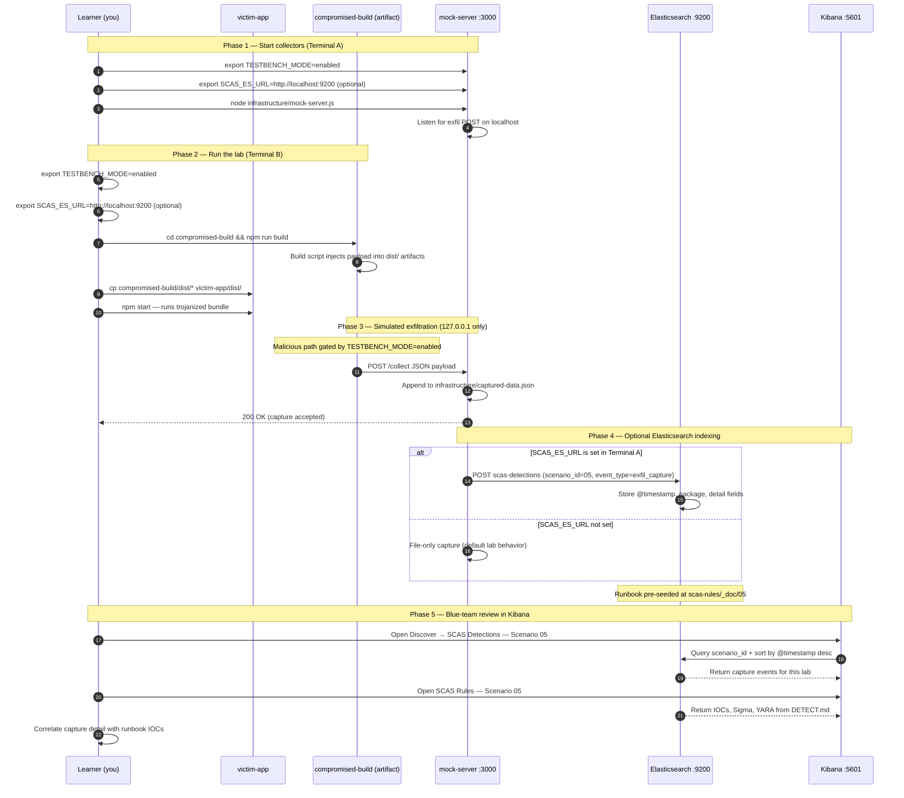

# 🚀 Zero to Hero: Scenario 5 - Build System Compromise

> **Note**: This scenario is currently under development. This guide will be updated once the scenario is fully implemented.

## 📚 What You'll Learn

By the end of this guide, you will:
- Understand CI/CD pipeline attacks
- Learn how build systems get compromised
- Execute a build compromise simulation (safely)
- Detect and prevent build system attacks
- Implement secure CI/CD practices

---

## Part 1: Understanding Build System Compromise (10 minutes)

### What is a Build System Compromise?

**Build System Compromise** occurs when attackers gain access to CI/CD pipelines, build servers, or deployment systems. This allows them to:
- Inject malicious code during the build process
- Modify build artifacts
- Compromise deployment pipelines
- Access sensitive build-time secrets

### Why It's Dangerous

- **High Privileges**: Build systems often have access to production secrets
- **Wide Impact**: Compromised builds affect all deployments
- **Stealth**: Malicious code injected during build appears legitimate
- **Persistence**: Can persist across multiple deployments

### Real-World Examples

**CodeCov (2021)**:
- CI/CD system compromised
- Bash uploader script modified
- Stole environment variables from thousands of projects
- Affected GitHub, Atlassian, and many others

**SolarWinds (2020)**:
- Build system compromised
- Malicious code injected into software updates
- Affected thousands of organizations worldwide

---

## Part 2: Prerequisites Check (5 minutes)

Before we start, make sure you've completed:

- ✅ Scenario 1 (Typosquatting)
- ✅ Scenario 2 (Dependency Confusion)
- ✅ Scenario 3 (Compromised Package)
- ✅ Scenario 6 (Shai-Hulud)
- ✅ Node.js 16+ and npm installed
- ✅ TESTBENCH_MODE enabled

---

## Part 3: Setting Up Scenario 5 (Coming Soon)

This scenario will cover:
- Understanding CI/CD pipelines
- Simulating build system compromise
- Detecting build-time attacks
- Implementing secure build practices

---

## Part 3: Setting Up Scenario 5 (15 minutes)

### Step 1: Navigate to Scenario Directory

```bash
cd scenarios/05-build-compromise
```

### Step 2: Run the Setup Script

```bash
./setup.sh
```

**What this does:**
- Creates directory structure
- Sets up legitimate build configuration
- Sets up compromised build configuration
- Creates victim application
- Sets up detection tools

**Expected output:**
- Setup progress messages
- Directories and files created
- "Next Steps" displayed

### Step 3: Understand the Environment

**The Build System**:
- **Legitimate Build**: Clean, secure build script (in `legitimate-build/`)
- **Compromised Build**: Modified build script with malicious code (in `compromised-build/`)
- **Build Artifacts**: Compiled JavaScript files
- **Secrets**: Environment variables (AWS keys, database passwords)

**The Attack**: 
- Attacker gained access to CI/CD system
- Modified build script to inject malicious code
- Build process creates compromised artifacts
- Compromised artifacts are deployed

---

## Part 4: Understanding Build Systems (15 minutes)

### Step 1: What is a Build System?

**Build systems** compile source code into deployable artifacts:
- Source code → Build process → Compiled artifacts
- Examples: npm build, webpack
- Often automated in CI/CD pipelines

### Step 2: The Vulnerability

Build systems have access to:
- Source code
- Build-time secrets (API keys, passwords)
- Compilation process
- Final artifacts

If compromised, attackers can:
- Inject malicious code
- Steal secrets
- Modify artifacts
- Compromise deployments

### Step 3: Examine the Legitimate Build

```bash
cd legitimate-build
cat build.sh
cat package.json
```

**What to notice:**
- Clean build script
- No suspicious commands
- Standard build process
- Secure artifact creation

---

## Part 5: Executing the Attack (30 minutes)

### Step 1: Examine the Compromised Build

```bash
cd ../compromised-build
cat build.sh
```

**Key Changes:**
1. **Secret Harvesting**: Collects environment variables
2. **Data Exfiltration**: Sends data to attacker server
3. **Code Injection**: Injects malicious code into artifacts

### Step 2: Start Mock Attacker Server

```bash
# Scenario root (parent of compromised-build)
cd ..

# Start mock server (if not already running)
node infrastructure/mock-server.js &
```

**Verify it's running:**
```bash
curl http://localhost:3000/captured-data
```

### Step 3: Run the Compromised Build

```bash
cd compromised-build

# Set test environment variables (simulating secrets)
export TESTBENCH_MODE=enabled
export AWS_ACCESS_KEY_ID=test-key-12345
export AWS_SECRET_ACCESS_KEY=test-secret-67890
export DATABASE_PASSWORD=super-secret-password

# Run the build
npm run build
```

**What happens:**
- Build process executes
- Malicious code collects secrets
- Data is exfiltrated
- Final artifact contains malicious code

### Step 4: Verify the Compromise

```bash
# Check build artifacts
ls -la dist/

# Check captured data
curl http://localhost:3000/captured-data
```

**What you should see:**
- Build artifacts created
- Secrets captured in mock server
- Malicious code in artifacts

### Step 5: Use Compromised Artifacts

```bash
# Copy artifacts to victim app
cp dist/* ../victim-app/dist/

# Run the application
cd ../victim-app
export TESTBENCH_MODE=enabled
npm start
```

**What happens:**
- Application runs from compromised artifacts
- Malicious code executes
- Additional data exfiltration occurs

---

## Part 6: Understanding What Happened (10 minutes)

### The Attack Flow

1. **Initial Compromise**: Attacker gains CI/CD access
2. **Build Script Modification**: Malicious code added to build script
3. **Build Execution**: Build process runs with malicious code
4. **Secret Theft**: Environment variables collected
5. **Data Exfiltration**: Secrets sent to attacker
6. **Artifact Poisoning**: Malicious code injected into artifacts
7. **Deployment**: Compromised artifacts deployed
8. **Execution**: Malicious code runs in production

### Why It's Dangerous

- **High Privileges**: Build systems have access to secrets
- **Wide Impact**: All deployments are compromised
- **Stealth**: Malicious code appears legitimate
- **Persistence**: Compromised artifacts persist across deployments

---

## Part 7: Detecting the Attack (25 minutes)

Now let's switch roles and become defenders. How can we detect this build compromise?

### Method 1: Build Script Review

```bash
# Compare build scripts
diff legitimate-build/build.sh compromised-build/build.sh

# Check for suspicious commands
grep -n "curl\|wget\|http\|eval" compromised-build/build.sh
```

### Method 2: Artifact Analysis

```bash
# Compare build artifacts
diff legitimate-build/dist/ compromised-build/dist/

# Check for suspicious code
grep -r "http\|process.env\|eval" compromised-build/dist/
```

### Method 3: Secret Monitoring

```bash
cd detection-tools
node secret-monitor.js ../compromised-build
```

**What it checks:**
- Suspicious patterns in build scripts
- Secret access
- Network requests
- Code execution

### Method 4: Build Log Analysis

```bash
# Review build logs
cat build.log | grep -i "error\|warning\|suspicious"

# Check for unexpected network requests
cat build.log | grep -i "http\|curl\|wget"
```

---

## Part 8: Prevention and Mitigation (30 minutes)

Now that we've seen how the attack works, how can we prevent it?

### Prevention Strategy 1: Build Script Integrity

```bash
# Use checksums for build scripts
sha256sum build.sh > build.sh.sha256

# Verify before build
sha256sum -c build.sh.sha256
```

### Prevention Strategy 2: Least Privilege

```yaml
# CI/CD configuration
env:
  # Only provide necessary secrets
  AWS_ACCESS_KEY_ID: ${{ secrets.AWS_KEY }}
  # Don't expose all environment variables
```

### Prevention Strategy 3: Build Isolation

Run builds in an isolated environment (dedicated build user + clean working directory) and only pass the minimum required secrets.

### Prevention Strategy 4: Artifact Verification

```bash
# Verify build artifacts
npm run build
npm run verify-artifacts

# Compare checksums
sha256sum dist/* > artifacts.sha256
```

### Prevention Strategy 5: Secret Management

```bash
# Use secret management tools
# HashiCorp Vault, AWS Secrets Manager, etc.

# Never hardcode secrets in build scripts
# Use environment variables or secret stores
```

### Prevention Strategy 6: Build Auditing

```yaml
# CI/CD audit logging
- name: Audit Build
  run: |
    npm run build
    npm run audit-build
    # Log all build activities
```

### Prevention Strategy 7: Code Signing

```bash
# Sign build artifacts
gpg --sign dist/app.js

# Verify signatures before deployment
gpg --verify dist/app.js.asc
```

---


---

---

## Elasticsearch + Kibana observability (optional)

Scenario **05 — Build System Compromise** is indexed in Elasticsearch when the observability stack is running.

Build compromise: tampered build output is copied into victim-app/dist before the app runs.

- **Detection runbook (static)** → index `scas-rules`, document id `05` — IOCs, Sigma, YARA, sample logs from `DETECT.md`
- **Runtime captures (dynamic)** → index `scas-detections` — one document per exfil event when `SCAS_ES_URL` is set before starting the mock collector

### How to read this diagram

| Phase | What you should look for |
|-------|--------------------------|
| **1 — Collectors** | Terminal A starts the mock server (or harvester). Set `SCAS_ES_URL` here if you want live Elasticsearch indexing. |
| **2 — Lab execution** | Terminal B runs the scenario README steps. Numbered arrows follow the attack path in order. |
| **3 — Exfiltration** | Malicious sample sends **localhost-only** JSON to the mock endpoint. Evidence is always written to `infrastructure/` on disk. |
| **4 — Elasticsearch** | When `SCAS_ES_URL` is set, the same capture is indexed into `scas-detections` with `scenario_id` and `event_type=exfil_capture`. |
| **5 — Kibana** | Use the per-scenario saved searches to compare **runtime captures** (Detections) with the **static runbook** (Rules). |

> **Safety:** All network calls stay on `127.0.0.1`. Malicious logic runs only when `TESTBENCH_MODE=enabled`.

### End-to-end flow



### Prerequisites

From the repository root:

```bash
./scripts/elasticsearch-up.sh
./scripts/setup-kibana-data-views.sh   # data views + saved searches for all 22 scenarios
```

### Run this scenario with live Elasticsearch forwarding

**Terminal A — mock collector** (from `scenarios/05-build-compromise`):

```bash
cd scenarios/05-build-compromise
export TESTBENCH_MODE=enabled
export SCAS_ES_URL=http://localhost:9200
node infrastructure/mock-server.js
```

**Terminal B — execute the lab:**

```bash
cd scenarios/05-build-compromise
export TESTBENCH_MODE=enabled
export SCAS_ES_URL=http://localhost:9200
cd compromised-build && npm run build && cp dist/* ../victim-app/dist/ && cd ../victim-app && npm start
```

### Verify locally (file-based evidence)

```bash
curl -s http://localhost:3000/captured-data
```

### Verify in Elasticsearch (API)

```bash
# Static runbook for this scenario
curl -s "http://localhost:9200/scas-rules/_doc/05?pretty"

# Latest runtime capture events
curl -s "http://localhost:9200/scas-detections/_search?pretty" \
  -H 'Content-Type: application/json' \
  -d '{
    "query": { "term": { "scenario_id": "05" } },
    "sort": [{ "@timestamp": "desc" }],
    "size": 5
  }'
```

### Verify in Kibana (UI)

1. Open [http://localhost:5601](http://localhost:5601)
2. **Discover** → **SCAS Detections — Scenario 05** — live capture timeline (`@timestamp`, `package.name`, `detail`)
3. **Discover** → **SCAS Rules — Scenario 05** — compare against `iocs`, `sigma`, and `yara` fields
4. Ask: *Does each capture field match an IOC or Sigma condition in the runbook?*

See [observability/README.md](../../../observability/README.md) for stack details.

## Part 9: Clean Up and Next Steps (5 minutes)

### Clean Up

```bash
# Stop mock server (if running manually)
# ps aux | grep mock-server
# kill <PID>
```

### What You've Accomplished

✅ Understood build system compromise attacks  
✅ Executed a build compromise simulation (safely)  
✅ Detected build-time attacks using multiple methods  
✅ Implemented preventive measures  

### Next Steps

1. **Review All Scenarios**: Understand the complete attack landscape
2. **Experiment**: Try different build compromise techniques
3. **Read more**: Study real-world build compromise cases
4. **Practice**: Implement secure CI/CD practices in a real project

---

## 📚 Additional Resources

- **Main README**: `README.md`
- **Other Scenarios**: See `documentation/scenario-guides/zero-to-hero/` for the full series.
- **Best Practices**: `documentation/platform/BEST_PRACTICES.md`
- **CI/CD Security**: Research CodeCov and SolarWinds incidents

---

## ⚠️ Important Reminders

- ✅ This is for **EDUCATIONAL purposes only**
- ✅ Use **ONLY in isolated environments**
- ✅ **Never** deploy malicious code to production
- ✅ **Always** set `TESTBENCH_MODE=enabled`

---

Happy learning! 🔐

