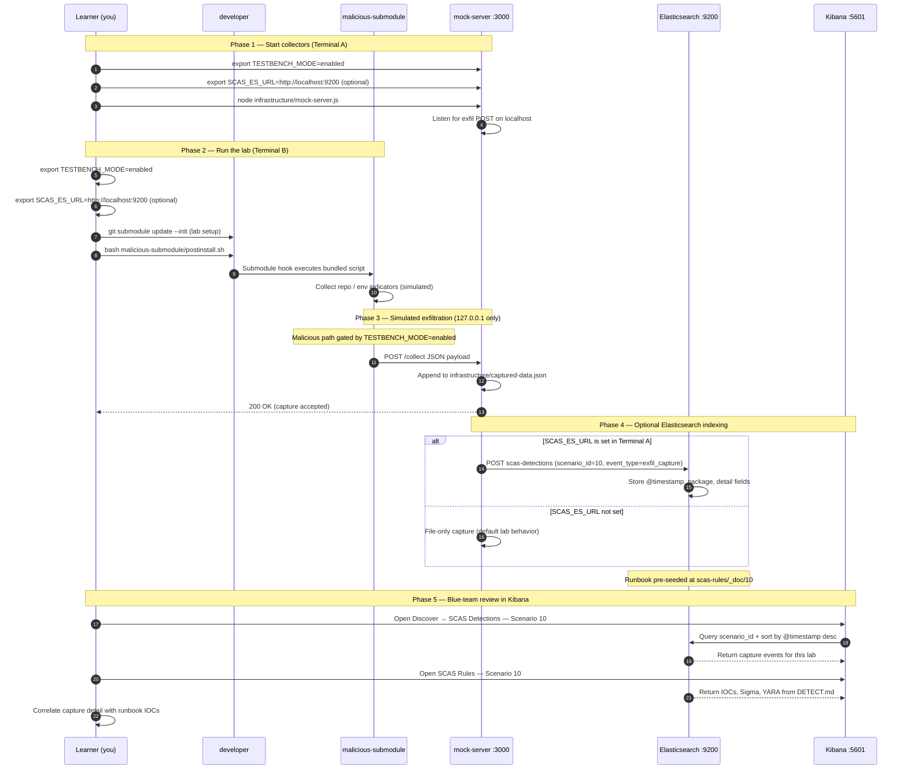

# 🚀 Zero to Hero: Scenario 10 - Git Submodule Attack

Welcome! This guide will take you from zero knowledge to successfully completing the Git Submodule Attack scenario.

## 📚 What You'll Learn

By the end of this guide, you will:
- Understand how git submodules work
- Learn how attackers use malicious submodules
- Execute a submodule attack simulation (safely)
- Conduct submodule validation and forensic investigation
- Perform incident response
- Implement defense strategies

---

## Part 1: Understanding Git Submodules (15 minutes)

### What are Git Submodules?

**Git submodules** allow you to include other git repositories as subdirectories within your repository. They're useful for including external code, but can also be used maliciously.

**How submodules work:**
1. Main repository references another repository
2. Submodule information stored in `.gitmodules` file
3. Submodule content stored in separate directory
4. Submodules can execute code during clone/update

### Why Submodules Can Be Dangerous

- **Automatic Execution**: Code in submodules can execute during clone/update
- **Hidden from View**: Submodules can be overlooked in code reviews
- **Wide Impact**: Affects all repository users
- **Trust Chain**: Users trust the parent repository
- **Build Integration**: Submodules often execute in CI/CD pipelines

---

## Part 2: Prerequisites Check (5 minutes)

Before we start, make sure you have:

- ✅ Git installed
- ✅ Node.js 16+ installed
- ✅ Basic understanding of git
- ✅ TESTBENCH_MODE enabled

Verify your setup:

```bash
git --version
node --version
echo $TESTBENCH_MODE  # Should output: enabled
```

---

## Part 3: Setting Up Scenario 10 (15 minutes)

### Step 1: Navigate to Scenario Directory

```bash
cd scenarios/10-git-submodule-attack
```

### Step 2: Run the Setup Script

```bash
export TESTBENCH_MODE=enabled
./setup.sh
```

**What this does:**
- Creates directory structure
- Sets up legitimate repository
- Creates compromised repository with malicious submodule
- Sets up detection tools
- Creates mock attacker server

---

## Part 4: Understanding the Legitimate Repository (20 minutes)

### Step 1: Examine the Legitimate Repository

```bash
cd legitimate-repo
cat .gitmodules
```

**What you'll see:**
```
[submodule "legitimate-lib"]
	path = libs/legitimate-lib
	url = https://github.com/legitproject/legitimate-lib.git
```

**Key Components:**
- `[submodule "name"]`: Submodule section
- `path`: Where submodule is stored
- `url`: Repository URL for submodule

### Step 2: Understand Submodule Structure

`.gitmodules` file defines:
- Submodule names
- Local paths
- Repository URLs

---

## Part 5: The Attack - Malicious Submodule (30 minutes)

### Step 1: Understand the Attack

**Scenario**: Attacker has added a malicious submodule to the repository.

**Attack Steps:**
1. Attacker adds malicious submodule to repository
2. Submodule contains malicious scripts
3. `.gitmodules` file updated to include submodule
4. When developers clone/update, submodule executes
5. Malicious code runs automatically

### Step 2: Examine the Compromised Repository

```bash
cd ../compromised-repo
cat .gitmodules
```

**What you'll see:**
```
[submodule "legitimate-lib"]
	path = libs/legitimate-lib
	url = https://github.com/legitproject/legitimate-lib.git

[submodule "malicious-submodule"]
	path = libs/malicious-submodule
	url = ./malicious-submodule
```

**Key Difference**: New submodule added!

### Step 3: Examine the Malicious Submodule

```bash
cd ../malicious-submodule
cat postinstall.sh
```

**What it does:**
- Executes automatically when submodule is initialized
- Collects system information
- Exfiltrates data to attacker server

### Step 4: Start the Mock Attacker Server

```bash
cd ../infrastructure
node mock-server.js &
```

### Step 5: Simulate the Attack

```bash
cd ../malicious-submodule
export TESTBENCH_MODE=enabled
bash postinstall.sh
```

**What happens:**
1. Submodule postinstall script executes
2. System information collected
3. Data exfiltrated to attacker server
4. Check mock server console for captured data!

---

## Part 6: Detection Methods (40 minutes)

### Detection Method 1: Submodule Validation

```bash
cd detection-tools
node submodule-validator.js ../compromised-repo
```

**What to look for:**
- Unexpected submodules in `.gitmodules`
- Suspicious submodule URLs
- Local/relative URLs (suspicious)
- Submodules with postinstall scripts

### Detection Method 2: Manual .gitmodules Review

```bash
cd ../compromised-repo
cat .gitmodules
```

**Red Flags:**
- Unexpected submodules
- Local/relative URLs (`./`, `../`)
- Suspicious submodule names
- Submodules you didn't add

### Detection Method 3: Git History Analysis

```bash
# Check when .gitmodules was modified
git log -p .gitmodules
```

**What to look for:**
- Unexpected `.gitmodules` changes
- Unknown commit authors
- Suspicious commit messages
- Submodules added without review

---

## Part 7: Forensic Investigation (30 minutes)

### Investigation Step 1: Submodule Analysis

```bash
cd compromised-repo
cat .gitmodules | grep -A 2 "malicious"
```

**Findings:**
- Malicious submodule in `.gitmodules`
- Local/relative URL (suspicious)
- Path points to local directory

### Investigation Step 2: Content Analysis

```bash
cat ../malicious-submodule/postinstall.sh
```

**Findings:**
- Script contains data exfiltration
- Collects system information
- Sends data to attacker server

---

## Part 8: Incident Response (30 minutes)

### Response Step 1: Immediate Containment

```bash
cd compromised-repo

# Remove malicious submodule from .gitmodules
# Edit .gitmodules and remove the [submodule "malicious-submodule"] section

# Remove submodule directory
rm -rf libs/malicious-submodule

# Clean git cache
git rm --cached libs/malicious-submodule
```

### Response Step 2: Repository Cleanup

```bash
# Update .gitmodules (remove malicious submodule section)
# Commit changes
git add .gitmodules
git commit -m "Remove malicious submodule"
```

### Response Step 3: Notify Users

**Actions:**
1. Notify repository users
2. Provide cleanup instructions
3. Review access controls
4. Implement submodule validation

---

## Part 9: Defense Strategies (20 minutes)

### Prevention

1. **Submodule Review**: Review all submodule additions
2. **URL Validation**: Verify submodule repository URLs
3. **Access Controls**: Limit who can add submodules
4. **Submodule Pinning**: Pin submodules to specific commits
5. **Automated Scanning**: Scan for suspicious submodules

### Detection

1. **`.gitmodules` Review**: Regular review of submodule configuration
2. **URL Verification**: Verify submodule URLs are legitimate
3. **Content Analysis**: Analyze submodule content
4. **Execution Monitoring**: Monitor submodule execution
5. **Git History Review**: Review `.gitmodules` changes in commits

### Response

1. **Immediate Removal**: Remove malicious submodule
2. **Repository Cleanup**: Clean submodule cache and references
3. **User Notification**: Notify users of compromise
4. **Access Review**: Review who added the submodule
5. **Incident Documentation**: Document attack and response

---


---

---

## Mitigation Playbook

Canonical prevention and mitigation controls (aligned with the [scenario README](../../../scenarios/10-git-submodule-attack/README.md)). Lab walkthroughs above expand each control with hands-on steps.

- Review every submodule addition in pull requests.
- Validate submodule repository URLs against an allowlist.
- Limit who can add or modify submodules in protected branches.
- Pin submodules to specific commits, not floating branch heads.
- Scan submodule content and monitor submodule initialization behavior.

---

## Elasticsearch + Kibana observability (optional)

Scenario **10 — Git Submodule Attack** is indexed in Elasticsearch when the observability stack is running.

Git submodule attack: malicious-submodule postinstall runs when the developer initializes submodules.

- **Detection runbook (static)** → index `scas-rules`, document id `10` — IOCs, Sigma, YARA, sample logs from `DETECT.md`
- **Runtime captures (dynamic)** → index `scas-detections` — one document per exfil event when `SCAS_ES_URL` is set before starting the mock collector

### How to read this diagram

| Phase | What you should look for |
|-------|--------------------------|
| **1 — Collectors** | Terminal A starts the mock server (or harvester). Set `SCAS_ES_URL` here if you want live Elasticsearch indexing. |
| **2 — Lab execution** | Terminal B runs the scenario README steps. Numbered arrows follow the attack path in order. |
| **3 — Exfiltration** | Malicious sample sends **localhost-only** JSON to the mock endpoint. Evidence is always written to `infrastructure/` on disk. |
| **4 — Elasticsearch** | When `SCAS_ES_URL` is set, the same capture is indexed into `scas-detections` with `scenario_id` and `event_type=exfil_capture`. |
| **5 — Kibana** | Use the per-scenario saved searches to compare **runtime captures** (Detections) with the **static runbook** (Rules). |

> **Safety:** All network calls stay on `127.0.0.1`. Malicious logic runs only when `TESTBENCH_MODE=enabled`.

### End-to-end flow



### Prerequisites

From the repository root:

```bash
./scripts/elasticsearch-up.sh
./scripts/setup-kibana-data-views.sh   # data views + saved searches for all 22 scenarios
```

### Run this scenario with live Elasticsearch forwarding

**Terminal A — mock collector** (from `scenarios/10-git-submodule-attack`):

```bash
cd scenarios/10-git-submodule-attack
export TESTBENCH_MODE=enabled
export SCAS_ES_URL=http://localhost:9200
node infrastructure/mock-server.js
```

**Terminal B — execute the lab:**

```bash
cd scenarios/10-git-submodule-attack
export TESTBENCH_MODE=enabled
export SCAS_ES_URL=http://localhost:9200
bash malicious-submodule/postinstall.sh
```

### Verify locally (file-based evidence)

```bash
curl -s http://localhost:3000/captured-data
```

### Verify in Elasticsearch (API)

```bash
# Static runbook for this scenario
curl -s "http://localhost:9200/scas-rules/_doc/10?pretty"

# Latest runtime capture events
curl -s "http://localhost:9200/scas-detections/_search?pretty" \
  -H 'Content-Type: application/json' \
  -d '{
    "query": { "term": { "scenario_id": "10" } },
    "sort": [{ "@timestamp": "desc" }],
    "size": 5
  }'
```

### Verify in Kibana (UI)

1. Open [http://localhost:5601](http://localhost:5601)
2. **Discover** → **SCAS Detections — Scenario 10** — live capture timeline (`@timestamp`, `package.name`, `detail`)
3. **Discover** → **SCAS Rules — Scenario 10** — compare against `iocs`, `sigma`, and `yara` fields
4. Ask: *Does each capture field match an IOC or Sigma condition in the runbook?*

See [observability/README.md](../../../observability/README.md) for stack details.

## Part 10: Key Takeaways (10 minutes)

### Why Submodule Attacks Are Dangerous

1. **Automatic Execution**: Execute during clone/update
2. **Hidden**: Can be overlooked in reviews
3. **Wide Impact**: Affect all repository users
4. **Trust Chain**: Users trust parent repository
5. **Build Integration**: Execute in CI/CD pipelines

### Best Practices

1. ✅ **Review submodule additions** - Carefully review all `.gitmodules` changes
2. ✅ **Verify submodule URLs** - Ensure URLs point to legitimate repositories
3. ✅ **Pin submodules** - Pin to specific commits, not branches
4. ✅ **Monitor execution** - Watch for unexpected execution
5. ✅ **Use validation** - Implement automated submodule validation
6. ✅ **Limit access** - Control who can add submodules
7. ✅ **Regular audits** - Regularly audit submodule configurations

---

## 🎓 Congratulations!

You've successfully completed Scenario 10: Git Submodule Attack!

**What you've learned:**
- ✅ How git submodules work
- ✅ How attackers use malicious submodules
- ✅ Detection and investigation techniques
- ✅ Incident response procedures
- ✅ Defense strategies

---

## 📚 Additional Resources

- [Git Submodules Documentation](https://git-scm.com/book/en/v2/Git-Tools-Submodules)
- [Git Submodules Security](https://github.com/git/git/blob/master/Documentation/technical/index-format.txt)
- [OWASP Git Security](https://owasp.org/www-project-secure-coding-practices-quick-reference-guide/)

🔐 Happy Learning!

