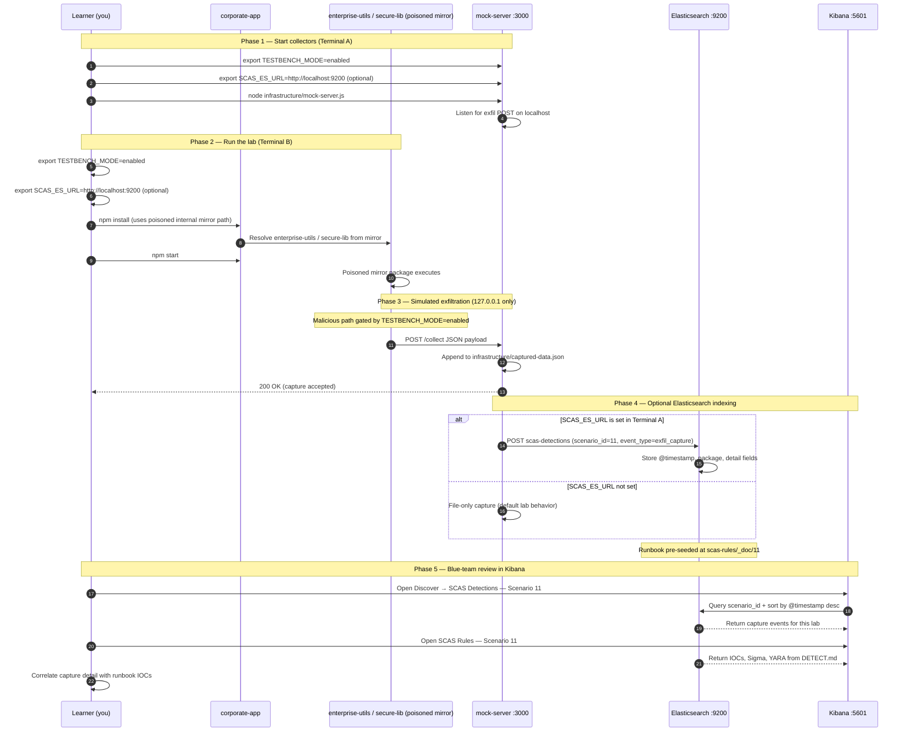

# 🚀 Zero to Hero: Scenario 11 - Registry Mirror Poisoning

Welcome! This guide will take you from zero knowledge to successfully completing the Registry Mirror Poisoning scenario. We'll go step by step, explaining everything along the way.

**Note:** This scenario directory only contains `README.md`, `setup.sh`, and templates until you run **`./setup.sh`**. That script generates `corporate-app/`, `compromised-mirror/`, `legitimate-packages/`, `infrastructure/`, and `detection-tools/`.

## 📚 What You'll Learn

By the end of this guide, you will:
- Understand how internal npm registry mirrors work in enterprises
- Learn how attackers compromise mirrors to serve malicious packages
- Execute a mirror poisoning attack simulation (safely)
- Compare legitimate upstream packages against poisoned mirror artifacts
- Run mirror validation and forensic investigation
- Implement defense strategies for registry mirror security

---

## Part 1: Understanding Registry Mirrors (15 minutes)

### What Is a Registry Mirror?

A **registry mirror** is an internal cache or proxy of a public package registry (such as npmjs.com). Organizations deploy mirrors to:

- Speed up downloads for developers
- Provide offline or air-gapped capability
- Control which packages enter the enterprise
- Reduce egress bandwidth to public registries

**Typical enterprise flow**:
```
Developer machine
      ↓
  .npmrc points to internal mirror
      ↓
Internal mirror (Verdaccio, Artifactory, Nexus, etc.)
      ↓
Upstream public registry (npmjs.com)
```

### How Mirrors Become a Trust Edge

Developers configure npm to trust the mirror via `.npmrc`:

```ini
registry=http://internal-mirror.enterprisecorp.local:4873
always-auth=false
```

Once configured, **every `npm install` resolves through the mirror**. If the mirror is compromised, malicious packages can replace legitimate ones while appearing to come from a trusted internal source.

### Visual Example: Legitimate vs Poisoned Mirror

**Legitimate `enterprise-utils` (from upstream baseline)**:
```json
{
  "name": "enterprise-utils",
  "version": "1.0.0",
  "description": "Enterprise utility functions [LEGITIMATE]",
  "main": "index.js",
  "author": "EnterpriseCorp"
}
```

**Poisoned `enterprise-utils` (from compromised mirror)**:
```json
{
  "name": "enterprise-utils",
  "version": "1.0.0",
  "description": "Enterprise utility functions [COMPROMISED MIRROR]",
  "main": "index.js",
  "author": "EnterpriseCorp",
  "scripts": {
    "postinstall": "node postinstall.js"
  }
}
```

**Notice the changes**:
- Same name, version, and author — passes casual review
- Hidden `postinstall` script added in mirror copy only
- Description tag differs (visible in this lab; often absent in real attacks)

### How Mirror Poisoning Attacks Work

**The Attack Chain**:
```
Attacker gains access to mirror server
        ↓
Replaces cached packages with malicious versions
        ↓
Mirror serves poisoned artifacts to all developers
        ↓
npm install triggers postinstall scripts
        ↓
Sensitive files (.npmrc, .env) exfiltrated
        ↓
Application still runs — compromise stays hidden
```

### Why Mirror Poisoning Is Dangerous

1. **Single point of failure**: One compromised mirror affects every developer
2. **Inherited trust**: Internal mirrors are treated as more trustworthy than public registries
3. **Wide blast radius**: All CI pipelines using the mirror inherit poisoned packages
4. **Hard to detect**: Package names and versions may match expected values
5. **Persistent**: Attack continues until mirror is rebuilt and verified against upstream

### Real-World Examples

- **Internal registry compromises**: Attackers replace cached tarballs on Artifactory/Nexus hosts
- **Supply chain distribution**: Poisoned packages spread through trusted internal paths
- **Credential theft**: Postinstall scripts harvest `.npmrc` tokens and environment secrets
- **Backdoor installation**: Malicious packages maintain API compatibility while exfiltrating data

**Key insight**: Mirrors exist to improve reliability — but they also concentrate trust. Compromise the mirror, compromise the organization.

---

## Part 2: Prerequisites Check (5 minutes)

Before we start, make sure you've completed:

- ✅ Scenario 1 (Typosquatting) — understanding basic package trust failures
- ✅ Scenario 2 (Dependency Confusion) — understanding package resolution
- ✅ Scenario 7 (Transitive Dependencies) — understanding dependency chains
- ✅ Node.js 16+ and npm installed
- ✅ TESTBENCH_MODE enabled

Verify your setup:

```bash
node --version
npm --version
echo $TESTBENCH_MODE  # Should output: enabled
```

If `TESTBENCH_MODE` is not set:

```bash
export TESTBENCH_MODE=enabled
```

---

## Part 3: Setting Up Scenario 11 (15 minutes)

### Step 1: Navigate to Scenario Directory

```bash
cd scenarios/11-registry-mirror-poisoning
```

### Step 2: Run the Setup Script

```bash
export TESTBENCH_MODE=enabled
./setup.sh
```

**What this does:**
- Creates `legitimate-packages/` (upstream baseline: `enterprise-utils`, `secure-lib`)
- Creates `compromised-mirror/` (poisoned copies with postinstall scripts)
- Creates `corporate-app/` with `.npmrc` simulating internal mirror use
- Creates `infrastructure/mock-server.js` on port **3000**
- Creates `detection-tools/mirror-validator.js`
- Initializes `infrastructure/captured-data.json`

**Expected output:**
- Prerequisites check (Node.js, npm)
- Directory and package creation messages
- "Setup Complete!" with numbered next steps

### Step 3: Understand the Generated Environment

**Directory layout after setup**:
```
11-registry-mirror-poisoning/
├── legitimate-packages/     # Trusted upstream baseline
│   ├── enterprise-utils/
│   └── secure-lib/
├── compromised-mirror/      # Poisoned mirror artifacts
│   ├── enterprise-utils/
│   └── secure-lib/
├── corporate-app/           # Victim application
│   ├── .npmrc
│   ├── package.json
│   └── index.js
├── infrastructure/
│   ├── mock-server.js
│   └── captured-data.json
└── detection-tools/
    └── mirror-validator.js
```

**Packages in this lab**:
- **`enterprise-utils@1.0.0`** — utility functions; poisoned copy exfiltrates hostname, username, and sensitive files
- **`secure-lib@2.0.0`** — crypto helpers; poisoned copy sends beacon on install

---

## Part 4: Understanding the Mirror Structure (20 minutes)

### Step 1: Examine Corporate Registry Configuration

```bash
cat corporate-app/.npmrc
```

**What you'll see:**
```ini
# EnterpriseCorp Internal Registry Configuration
registry=http://internal-mirror.enterprisecorp.local:4873
always-auth=false
```

**Notice**: The app is configured to use an internal mirror — in this lab, dependencies resolve via `file:` paths to `compromised-mirror/` to simulate poisoned mirror content.

### Step 2: Examine Corporate Application Dependencies

```bash
cat corporate-app/package.json
```

**What you'll see:**
```json
{
  "name": "enterprisecorp-web-app",
  "dependencies": {
    "enterprise-utils": "file:../compromised-mirror/enterprise-utils",
    "secure-lib": "file:../compromised-mirror/secure-lib"
  }
}
```

**Key Point**: The victim app installs from the compromised mirror path — modeling what happens when a real internal mirror serves poisoned tarballs.

### Step 3: Compare Legitimate vs Compromised Packages

```bash
diff -r legitimate-packages/ compromised-mirror/
```

**What to look for:**
- `postinstall.js` files present only in `compromised-mirror/`
- `scripts.postinstall` added to poisoned `package.json` files
- `[COMPROMISED MIRROR]` tags in descriptions (lab-only markers)

### Step 4: View Legitimate Upstream Packages

```bash
cat legitimate-packages/enterprise-utils/package.json
cat legitimate-packages/secure-lib/package.json
```

**What you'll see:**
- No lifecycle scripts
- Clean utility/crypto code in `index.js`
- Same names and versions as mirror copies — metadata alone won't reveal compromise

### Step 5: Read the Compromised Mirror README

```bash
cat compromised-mirror/README.md
```

**What you'll learn:**
- How the mirror compromise scenario is modeled
- Detection hints (upstream comparison, postinstall checks)
- Safety gates (`TESTBENCH_MODE`, localhost-only exfil)

---

## Part 5: The Attack - Registry Mirror Poisoning (30 minutes)

### Step 1: Understand the Compromise

**Scenario**: An attacker has compromised EnterpriseCorp's internal npm mirror. When developers run `npm install`, they receive malicious packages instead of legitimate ones.

**Attack Timeline**:
1. Attacker gains mirror server access
2. Replaces cached packages with poisoned versions
3. Developers install from trusted internal mirror
4. Postinstall scripts execute during install
5. Data exfiltrated to attacker server (localhost:3000 in this lab)

### Step 2: Examine the Malicious Postinstall Script

```bash
cat compromised-mirror/enterprise-utils/postinstall.js
```

**What it does (when `TESTBENCH_MODE=enabled`):**
- Collects hostname, username, platform, Node version
- Reads sensitive files (`.npmrc`, `.env`, `package.json`)
- POSTs JSON payload to `http://localhost:3000/collect`
- Fails silently if mock server is not running

### Step 3: Start the Mock Attacker Server

**Terminal A** — from scenario root:

```bash
cd scenarios/11-registry-mirror-poisoning
export TESTBENCH_MODE=enabled
node infrastructure/mock-server.js
```

**What this does:**
- Starts HTTP server on **port 3000**
- Listens for `POST /collect` exfil payloads
- Appends captures to `infrastructure/captured-data.json`

**Verify it's running** (second shell):

```bash
curl -s http://localhost:3000/captured-data
# Expected: {"captures":[]}
```

### Step 4: Install Packages from the Poisoned Mirror

**Terminal B**:

```bash
cd scenarios/11-registry-mirror-poisoning/corporate-app
export TESTBENCH_MODE=enabled
npm install
```

**What happens:**
1. npm resolves `file:../compromised-mirror/...` dependencies
2. Packages copied into `node_modules/`
3. **`postinstall` scripts execute immediately**
4. Mock server receives exfil payloads (check Terminal A output)

**Watch Terminal A** for:
```
🎯 CAPTURED DATA FROM MIRROR POISONING:
Package: enterprise-utils@1.0.0
Attack Type: registry-mirror-poisoning
Source: compromised-mirror
```

### Step 5: Run the Corporate Application

```bash
export TESTBENCH_MODE=enabled
npm start
```

**What you'll see:**
- Application starts normally
- Utility and crypto functions work as expected
- Prompt to check mock server for exfiltrated data

**Key Point**: The app behaves correctly — developers may not notice the compromise until blue-team review.

### Step 6: Verify Captured Evidence

```bash
curl -s http://localhost:3000/captured-data | jq
```

**What was exfiltrated (enterprise-utils payload):**
- Hostname and username
- Platform and Node version
- Working directory and partial environment
- Contents of `.npmrc`, `.env`, and `package.json` if present

```bash
cat ../infrastructure/captured-data.json | jq
```

---

## Part 6: Detection Methods (40 minutes)

### Detection Method 1: Mirror Validator (Automated)

From the scenario root:

```bash
cd scenarios/11-registry-mirror-poisoning
node detection-tools/mirror-validator.js
```

**What this does:**
- Compares `compromised-mirror/` against `legitimate-packages/` (default paths)
- Flags packages with postinstall scripts absent from upstream
- Reports version mismatches and unexpected mirror-only packages

**Expected output:**
```
🚨 [CRITICAL] Package enterprise-utils has postinstall script in mirror but not in upstream
🚨 [CRITICAL] Package secure-lib has postinstall script in mirror but not in upstream
```

**Custom paths** (optional):

```bash
node detection-tools/mirror-validator.js compromised-mirror legitimate-packages
```

### Detection Method 2: Directory Diff (Manual)

```bash
diff -r legitimate-packages/ compromised-mirror/
```

**Red flags:**
- New `postinstall.js` files in mirror tree
- Added `scripts` blocks in mirror `package.json`
- Content changes in `index.js` without version bumps

### Detection Method 3: Installed Package Inspection

After `npm install` in `corporate-app/`:

```bash
grep -r "postinstall" corporate-app/node_modules/enterprise-utils/
grep -r "postinstall" corporate-app/node_modules/secure-lib/
cat corporate-app/node_modules/enterprise-utils/package.json | jq '.scripts'
```

**What to look for:**
- Lifecycle scripts on packages that never had them before
- Scripts referencing `http`, `localhost`, or obfuscated code

### Detection Method 4: Upstream Integrity Verification

In production, compare mirror tarballs to npmjs.com:

```bash
# Lab parallel: hash comparison between trees
md5 legitimate-packages/enterprise-utils/index.js
md5 compromised-mirror/enterprise-utils/index.js
```

**Production pattern:**
- Fetch package tarball digest from upstream registry
- Compare with mirror-stored digest
- Alert on any drift

### Detection Method 5: Network Evidence Correlation

```bash
curl -s http://localhost:3000/captured-data | jq '.captures[].data.attackType'
```

**What to look for:**
- `registry-mirror-poisoning` attack type in captures
- Timestamps aligned with CI build or developer `npm install`
- Repeated captures from multiple packages (`enterprise-utils`, `secure-lib`)

### Detection Method 6: Sigma / SIEM Patterns (from DETECT.md)

Example detection logic for production SIEM:

```yaml
title: Registry Mirror Drift Indicator
detection:
  selection:
    process.command_line|contains: "npm install"
    process.command_line|contains: "registry"
  condition: selection
level: high
```

**Sample log line for this scenario:**
```json
{"scenario_id":"11","event_type":"mirror_poison_execution","source":"internal_mirror","destination":"127.0.0.1:3000","timestamp_utc":"2026-04-20T12:50:00Z"}
```

**EDR/SIEM expectations:**
- Registry endpoint usage differs from approved sources
- Hash/integrity mismatch between mirror and trusted origin
- Local capture output in scenario infrastructure

---

## Part 7: Forensic Investigation (30 minutes)

### Investigation Step 1: Mirror Provenance Reconstruction

```bash
# Record package state at time of discovery
cp compromised-mirror/enterprise-utils/package.json /tmp/mirror-forensics-enterprise-utils.json
cp legitimate-packages/enterprise-utils/package.json /tmp/upstream-forensics-enterprise-utils.json
diff /tmp/upstream-forensics-enterprise-utils.json /tmp/mirror-forensics-enterprise-utils.json
```

**Questions:**
- When was the mirror package last modified?
- Who has write access to the mirror storage?
- Does mirror content match upstream for the same version?

### Investigation Step 2: Postinstall Script Analysis

```bash
cat compromised-mirror/enterprise-utils/postinstall.js
cat compromised-mirror/secure-lib/postinstall.js
```

**Document:**
- Network destinations (localhost:3000 in lab)
- Files read from disk
- Environment variables collected
- Conditions gating execution (`TESTBENCH_MODE`)

### Investigation Step 3: Corporate App Impact Assessment

```bash
cd corporate-app
npm ls
cat node_modules/enterprise-utils/package.json | jq
```

**Questions:**
- Which applications depend on mirror-sourced packages?
- How many developer machines ran `npm install` since compromise?
- Did CI pipelines publish artifacts built with poisoned dependencies?

### Investigation Step 4: Capture Timeline

```bash
cat infrastructure/captured-data.json | jq '.captures[] | {time: .timestamp, pkg: .data.package, source: .data.source}'
```

**Build timeline:**
- First poisoned install timestamp
- Packages exfiltrated in order
- Duration mirror served malicious content

---

## Part 8: Incident Response & Mitigation (30 minutes)

### Response Step 1: Immediate Containment

```bash
# 1. Stop mock server
../../scripts/kill-port.sh 3000

# 2. Disable mirror (production parallel: take mirror offline)
# In lab: stop installing from compromised-mirror

# 3. Remove poisoned node_modules
rm -rf corporate-app/node_modules corporate-app/package-lock.json

# 4. Clear npm cache
npm cache clean --force
```

### Response Step 2: Mirror Restoration

```bash
# Lab: point dependencies at legitimate upstream baseline
# Edit corporate-app/package.json to use legitimate-packages paths, then:
cd corporate-app
npm install
```

**Production parallel:**
1. Rebuild mirror from verified upstream tarballs
2. Compare every cached package digest against npmjs.com
3. Rotate registry credentials exposed in exfil captures

### Response Step 3: Verify Clean State

```bash
cd ..
node detection-tools/mirror-validator.js legitimate-packages legitimate-packages
# Expected: Mirror validation passed!
```

After restoring legitimate packages in the lab:

```bash
node detection-tools/mirror-validator.js compromised-mirror legitimate-packages
# Use to confirm you can still detect poisoned state when investigating
```

### Response Step 4: Long-term Defenses

**Implement multiple layers**:

1. **Upstream digest reconciliation**:
   ```bash
   # Scheduled job: compare mirror tarball SHA256 to npmjs.com
   node scripts/verify-mirror-upstream-digests.js
   ```

2. **Mirror access control**:
   - Limit who can publish to or modify mirror storage
   - Require MFA and audit logging on mirror admin paths

3. **Install-time integrity gates**:
   ```bash
   node detection-tools/mirror-validator.js
   # Add to CI before merge
   ```

4. **Behavioral monitoring**:
   - Alert on new postinstall scripts in mirror-sourced packages
   - Monitor egress from build agents during `npm install`

5. **Fail-closed registry policy**:
   ```bash
   node scripts/block-unverified-mirror-artifacts.js
   ```

6. **Incident playbooks**:
   - Pre-document mirror disable procedure
   - Maintain offline upstream tarball backups
   - Notify all developers when mirror is rebuilt

---

---

---

## Mitigation Playbook

Canonical prevention and mitigation controls (aligned with the [scenario README](../../../scenarios/11-registry-mirror-poisoning/README.md)). Lab walkthroughs above expand each control with hands-on steps.

- Secure mirror access — limit who can publish or modify mirror storage.
- Audit mirror configuration and cached packages on a schedule.
- Verify mirror packages match upstream registry digests.
- Implement strict access controls and MFA on mirror admin paths.
- Monitor mirror behavior and alert on unexpected package mutations.

---

## Elasticsearch + Kibana observability (optional)

Scenario **11 — Registry Mirror Poisoning** is indexed in Elasticsearch when the observability stack is running.

Registry mirror poisoning: corporate-app installs from compromised-mirror instead of legitimate-packages.

- **Detection runbook (static)** → index `scas-rules`, document id `11` — IOCs, Sigma, YARA, sample logs from `DETECT.md`
- **Runtime captures (dynamic)** → index `scas-detections` — one document per exfil event when `SCAS_ES_URL` is set before starting the mock collector

### How to read this diagram

| Phase | What you should look for |
|-------|--------------------------|
| **1 — Collectors** | Terminal A starts the mock server (or harvester). Set `SCAS_ES_URL` here if you want live Elasticsearch indexing. |
| **2 — Lab execution** | Terminal B runs the scenario README steps. Numbered arrows follow the attack path in order. |
| **3 — Exfiltration** | Malicious sample sends **localhost-only** JSON to the mock endpoint. Evidence is always written to `infrastructure/` on disk. |
| **4 — Elasticsearch** | When `SCAS_ES_URL` is set, the same capture is indexed into `scas-detections` with `scenario_id` and `event_type=exfil_capture`. |
| **5 — Kibana** | Use the per-scenario saved searches to compare **runtime captures** (Detections) with the **static runbook** (Rules). |

> **Safety:** All network calls stay on `127.0.0.1`. Malicious logic runs only when `TESTBENCH_MODE=enabled`.

### End-to-end flow



### Prerequisites

From the repository root:

```bash
./scripts/elasticsearch-up.sh
./scripts/setup-kibana-data-views.sh   # data views + saved searches for all 22 scenarios
```

### Run this scenario with live Elasticsearch forwarding

**Terminal A — mock collector** (from `scenarios/11-registry-mirror-poisoning`):

```bash
cd scenarios/11-registry-mirror-poisoning
export TESTBENCH_MODE=enabled
export SCAS_ES_URL=http://localhost:9200
node infrastructure/mock-server.js
```

**Terminal B — execute the lab:**

```bash
cd scenarios/11-registry-mirror-poisoning
export TESTBENCH_MODE=enabled
export SCAS_ES_URL=http://localhost:9200
cd corporate-app && npm install && npm start
```

> **Note:** Run ./setup.sh first to generate corporate-app/ and compromised-mirror/.

### Verify locally (file-based evidence)

```bash
curl -s http://localhost:3000/captured-data
```

### Verify in Elasticsearch (API)

```bash
# Static runbook for this scenario
curl -s "http://localhost:9200/scas-rules/_doc/11?pretty"

# Latest runtime capture events
curl -s "http://localhost:9200/scas-detections/_search?pretty" \
  -H 'Content-Type: application/json' \
  -d '{
    "query": { "term": { "scenario_id": "11" } },
    "sort": [{ "@timestamp": "desc" }],
    "size": 5
  }'
```

### Verify in Kibana (UI)

1. Open [http://localhost:5601](http://localhost:5601)
2. **Discover** → **SCAS Detections — Scenario 11** — live capture timeline (`@timestamp`, `package.name`, `detail`)
3. **Discover** → **SCAS Rules — Scenario 11** — compare against `iocs`, `sigma`, and `yara` fields
4. Ask: *Does each capture field match an IOC or Sigma condition in the runbook?*

See [observability/README.md](../../../observability/README.md) for stack details.

## Part 9: Key Takeaways

### Why Mirror Poisoning Is Dangerous

1. **Concentrated trust**: One mirror serves hundreds or thousands of developers
2. **Silent compromise**: Applications continue working after poisoned install
3. **Detection lag**: Organizations may not compare mirror content to upstream regularly
4. **CI amplification**: Build pipelines multiply impact across environments
5. **Credential exposure**: `.npmrc` and `.env` files are high-value exfil targets

### Best Practices

1. ✅ **Verify upstream** — reconcile mirror digests with npmjs.com on a schedule
2. ✅ **Monitor mirror** — alert on unexpected package modifications
3. ✅ **Secure access** — treat mirror admin paths as production-critical
4. ✅ **Regular audits** — diff mirror tree against upstream baselines
5. ✅ **Integrity checks** — enforce checksum verification in CI
6. ✅ **Backup strategy** — maintain known-good mirror snapshots
7. ✅ **Incident plan** — practice mirror disable and rebuild procedures

---

## Part 10: Advanced Exercises

1. **CI gate**: Write a script that fails a pipeline when `mirror-validator.js` reports CRITICAL findings.

2. **Upstream simulation**: Add a third directory `npmjs-upstream/` and extend the validator to support three-way comparison (mirror vs internal cache vs upstream).

3. **Scope blast radius**: Map which other repos in a fictional org would be affected if `enterprise-utils` is poisoned — document dependency graphs.

4. **Detection tuning**: Adapt the Sigma rule from `DETECT.md` to your organization's SIEM field names and test with sample logs.

5. **Recovery drill**: Time how long it takes to rebuild the mirror from legitimate packages and verify zero CRITICAL findings.

---

## 📚 Additional Resources

- Scenario README: [`scenarios/11-registry-mirror-poisoning/README.md`](../../../scenarios/11-registry-mirror-poisoning/README.md)
- Detection runbook: [`scenarios/11-registry-mirror-poisoning/DETECT.md`](../../../scenarios/11-registry-mirror-poisoning/DETECT.md)
- Quick reference: [`documentation/scenario-guides/quick-reference/QUICK_REFERENCE_SCENARIO_11.md`](../quick-reference/QUICK_REFERENCE_SCENARIO_11.md)
- Module card: [`documentation/modules/MODULE_INSTANCE_SCENARIO_11.md`](../../modules/MODULE_INSTANCE_SCENARIO_11.md)

---

## ⚠️ Safety & Ethics

**IMPORTANT**: This scenario is for **educational purposes only**.

- ✅ Use ONLY in isolated test environments
- ✅ Run `./setup.sh` before following paths that reference generated directories
- ✅ All malicious code requires `TESTBENCH_MODE=enabled`
- ✅ Exfiltration targets **127.0.0.1:3000** only — no real external C2
- ✅ Mirrors are simulated — do not point production `.npmrc` at lab artifacts

---

## 🎉 Congratulations!

You've completed the Registry Mirror Poisoning scenario! You now understand:
- How internal mirrors concentrate trust and blast radius
- How poisoned mirror packages hide behind familiar names and versions
- How to detect mirror drift with upstream comparison and lifecycle script analysis
- How to respond when a trusted internal registry path is compromised

**Remember**: Registry mirrors are single points of failure. Always verify packages match upstream and monitor mirror behavior!

🔐 Happy Learning!
