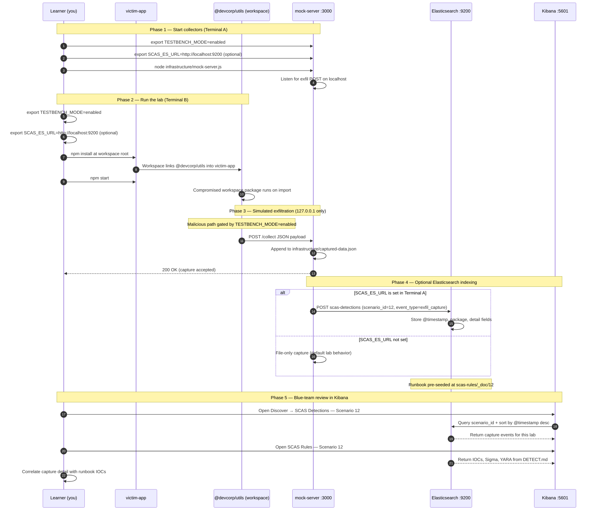

# 🚀 Zero to Hero: Scenario 12 - Workspace/Monorepo Attack

Welcome! This guide will take you from zero knowledge to successfully completing the Workspace/Monorepo attack scenario. We'll go step by step, explaining everything along the way.

## 📚 What You'll Learn

By the end of this guide, you will:
- Understand what npm workspaces and monorepos are
- Learn how workspace/monorepo attacks work
- Execute a workspace attack simulation (safely)
- Conduct workspace package analysis
- Perform detection and forensic investigation
- Implement defense strategies for workspaces

---

## Part 1: Understanding Workspaces and Monorepos (15 minutes)

### What is a Workspace?

A **workspace** (also called a **monorepo**) is a way to manage multiple packages in a single repository. Instead of having separate repositories for each package, you can have them all in one place.

**Example Structure**:
```
my-workspace/
├── package.json          # Root workspace config
├── packages/
│   ├── utils/           # Package 1
│   ├── api/            # Package 2
│   └── auth/          # Package 3
└── apps/
    └── web-app/        # Application using workspace packages
```

### Why Use Workspaces?

1. **Code Sharing**: Packages can easily use each other
2. **Single Repository**: All code in one place
3. **Atomic Changes**: Change multiple packages together
4. **Simplified Dependencies**: Use `workspace:*` protocol
5. **Modern Development**: Used by Lerna, Nx, Turborepo, etc.

### How Workspace Dependencies Work

**Workspace Protocol**: `workspace:*`
```json
{
  "dependencies": {
    "@devcorp/utils": "workspace:*"
  }
}
```

This means: "Use the version of @devcorp/utils from this workspace"

### Visual Example

```bash
# Root package.json
{
  "workspaces": ["packages/*"]
}

# packages/utils/package.json
{
  "name": "@devcorp/utils",
  "version": "1.0.0"
}

# packages/api/package.json
{
  "name": "@devcorp/api",
  "dependencies": {
    "@devcorp/utils": "workspace:*"  # Uses workspace package
  }
}
```

### Why Workspace Attacks Are Risky

1. **Shared Access**: Workspace packages can access each other's code
2. **Wide Impact**: One compromised package affects entire workspace
3. **Trust Chain**: Developers trust all workspace packages
4. **Automatic Execution**: Postinstall scripts run during workspace install
5. **Hard to Detect**: Workspace packages treated as internal and trusted
6. **Modern Development**: Monorepos are increasingly common

### Real-World Example: Monorepo Compromises

- **Internal Package Attacks**: Attackers compromise internal workspace packages
- **Build System Attacks**: Workspace packages used to compromise CI/CD
- **Credential Theft**: Compromised workspace packages steal credentials
- **Wide Impact**: One compromise affects all packages in workspace

**The Attack Chain**:
```
Your Workspace
├── @devcorp/utils (COMPROMISED!)
├── @devcorp/api (depends on utils)
└── @devcorp/auth (depends on utils)
```

When `@devcorp/utils` is compromised, all packages that depend on it are affected!

---

## Part 2: Prerequisites Check (5 minutes)

Before we start, make sure you've completed:

- ✅ Scenario 1 (Typosquatting) - Understanding basic attacks
- ✅ Scenario 2 (Dependency Confusion) - Understanding package resolution
- ✅ Scenario 7 (Transitive Dependencies) - Understanding dependency chains
- ✅ Node.js 16+ and npm installed
- ✅ TESTBENCH_MODE enabled

Verify your setup:

```bash
node --version
npm --version
echo $TESTBENCH_MODE  # Should output: enabled
```

---

## Part 3: Setting Up Scenario 12 (15 minutes)

### Step 1: Navigate to Scenario Directory

```bash
cd scenarios/12-workspace-monorepo-attack
```

### Step 2: Run the Setup Script

```bash
export TESTBENCH_MODE=enabled
./setup.sh
```

**What this does:**
- Creates workspace root package.json
- Sets up legitimate workspace packages (utils, api, auth)
- Creates compromised utils package
- Sets up victim application
- Creates detection tools
- Sets up mock attacker server

**Expected output:**
- Setup progress messages
- Directories and files created
- "Next Steps" displayed

### Step 3: Understand the Environment

**The Workspace Structure**:
```
devcorp-workspace/
├── package.json (workspace root)
├── packages/
│   ├── utils/ (COMPROMISED!)
│   ├── api/ (depends on utils)
│   └── auth/ (depends on utils)
└── victim-app/ (uses api and auth)
```

**Packages**:
- **@devcorp/utils**: Workspace package (compromised by attacker)
- **@devcorp/api**: Workspace package that depends on utils
- **@devcorp/auth**: Workspace package that depends on utils
- **victim-app**: Application using workspace packages

**The Attack**: 
- Attacker compromises `@devcorp/utils`
- Adds malicious postinstall script
- When workspace is installed, postinstall executes
- Affects all packages in workspace

---

## Part 4: Understanding the Workspace Structure (20 minutes)

### Step 1: Examine the Workspace Root

```bash
cat package.json
```

**What you'll see:**
```json
{
  "name": "devcorp-workspace",
  "workspaces": [
    "packages/*"
  ]
}
```

**Notice**: The `workspaces` field tells npm which directories contain workspace packages.

### Step 2: Examine Legitimate Workspace Packages

```bash
cd legitimate-packages/utils
cat package.json
```

**What you'll see:**
```json
{
  "name": "@devcorp/utils",
  "version": "1.0.0"
}
```

```bash
cd ../api
cat package.json
```

**What you'll see:**
```json
{
  "name": "@devcorp/api",
  "dependencies": {
    "@devcorp/utils": "workspace:*"
  }
}
```

**Notice**: `@devcorp/api` depends on `@devcorp/utils` using `workspace:*` protocol!

### Step 3: Understand Workspace Dependencies

```bash
cd ../auth
cat package.json
```

**What you'll see:**
```json
{
  "name": "@devcorp/auth",
  "dependencies": {
    "@devcorp/utils": "workspace:*"
  }
}
```

**Key Point**: Both `@devcorp/api` and `@devcorp/auth` depend on `@devcorp/utils`!

### Step 4: View the Legitimate Utils Package

```bash
cd ../utils
cat index.js
```

**What you'll see:**
- Clean, legitimate code
- Simple utility functions
- No malicious behavior

This is what `@devcorp/utils` should look like.

---

## Part 5: The Attack - Compromised Workspace Package (30 minutes)

### Step 1: Understand the Compromise

**Scenario**: Attacker has compromised `@devcorp/utils` and added malicious postinstall script.

**Attack Timeline**:
1. Attacker gains access to workspace repository
2. Compromises `@devcorp/utils` package
3. Adds malicious postinstall script
4. When workspace is installed, postinstall executes
5. Data is exfiltrated from workspace root

### Step 2: Examine the Compromised Package

```bash
cd ../../compromised-package/utils
cat package.json
```

**What you'll see:**
```json
{
  "name": "@devcorp/utils",
  "version": "1.0.1",
  "scripts": {
    "postinstall": "node postinstall.js"
  }
}
```

**Key Change**: Version 1.0.1 has a `postinstall` script!

```bash
cat postinstall.js
```

**What it does:**
- Executes automatically when workspace package is installed
- Collects system information
- Reads sensitive files from workspace root (.env, package.json)
- Exfiltrates data to attacker server

### Step 3: Start the Mock Attacker Server

```bash
cd ../../infrastructure
node mock-server.js &
```

**What this does:**
- Starts a server on localhost:3000
- Receives exfiltrated data
- Logs captured information
- Safe - only works on localhost!

**Verify it's running:**
```bash
curl http://localhost:3000/captured-data
# Should return: {"captures":[]}
```

### Step 4: Set Up Workspace with Legitimate Packages

```bash
cd ..
cp -r legitimate-packages/* packages/
npm install
```

**What happens:**
1. Workspace packages are copied to `packages/` directory
2. npm recognizes them as workspace packages
3. Workspace dependencies are resolved
4. All packages are installed together

### Step 5: Replace with Compromised Package

```bash
cp -r compromised-package/utils packages/utils
npm install
```

**What happens:**
1. Compromised `@devcorp/utils` replaces legitimate version
2. npm installs workspace packages
3. Postinstall script in compromised `@devcorp/utils` executes
4. Data is collected and exfiltrated
5. Check the mock server console for captured data!

### Step 6: Observe the Attack

```bash
# Check the mock server output
# You should see:
# 🎯 CAPTURED DATA FROM WORKSPACE PACKAGE
# Package: @devcorp/utils@1.0.1
# ... system information ...
```

```bash
# Or check via API
curl http://localhost:3000/captured-data | jq
```

**What was exfiltrated:**
- Hostname
- Username
- Platform information
- Workspace root path
- Environment variables
- Contents of sensitive files (.npmrc, .env, package.json)

### Step 7: Run the Victim Application

```bash
cd victim-app
export TESTBENCH_MODE=enabled
npm install
npm start
```

**Notice**: The application runs normally! You might not notice anything wrong.

**Key Point**: The attack executed during `npm install`, not during application runtime.

---

## Part 6: Detection Methods (40 minutes)

### Detection Method 1: Workspace Scanner

```bash
cd detection-tools
node workspace-scanner.js ..
```

**What this does:**
- Scans all workspace packages
- Identifies packages with postinstall scripts
- Checks for suspicious code patterns
- Detects malicious workspace packages

**What to look for:**
- Packages with postinstall scripts
- Suspicious network requests
- Unexpected file access

### Detection Method 2: Manual Workspace Inspection

```bash
cd ..

# View workspace configuration
cat package.json | grep -A 5 "workspaces"

# List all workspace packages
ls -la packages/

# Check workspace dependencies
npm ls --workspaces
```

**Key Questions:**
- Which packages are in the workspace?
- Which packages depend on each other?
- Are there any unexpected packages?

### Detection Method 3: Postinstall Script Detection

```bash
# Find all packages with postinstall scripts
find packages -name "package.json" -exec grep -l "postinstall" {} \;

# Check specific workspace package
cat packages/utils/package.json | grep -A 5 "scripts"
```

**Red Flags:**
- Postinstall scripts in workspace packages
- Scripts that make network requests
- Scripts that access sensitive files

### Detection Method 4: Workspace Dependency Tree

```bash
# View complete workspace tree
npm ls --workspaces --all

# Check specific workspace package
npm ls @devcorp/utils --workspaces
```

**What to look for:**
- Unexpected dependencies
- Suspicious version numbers
- Packages with unusual structure

### Detection Method 5: Network Monitoring

```bash
# Check captured data (indicates network activity)
curl http://localhost:3000/captured-data | jq '.captures[0].data'
```

**What to look for:**
- Unexpected network requests during install
- Data exfiltration to unknown servers
- Postinstall scripts making HTTP requests

---

## Part 7: Forensic Investigation (30 minutes)

### Investigation Step 1: Workspace Tree Reconstruction

```bash
# Build complete workspace tree
npm ls --workspaces --all

# Identify all workspace packages
ls -la packages/

# Check workspace dependencies
cat packages/api/package.json | grep -A 10 "dependencies"
cat packages/auth/package.json | grep -A 10 "dependencies"
```

**Questions:**
- What is the complete workspace structure?
- Which packages are workspace packages?
- Which packages depend on each other?
- How deep is the dependency chain?

### Investigation Step 2: Package Analysis

```bash
# Analyze the compromised package
cd packages/utils

# Check package.json
cat package.json

# Check for postinstall script
cat package.json | grep -A 5 "scripts"

# Review the postinstall script
cat postinstall.js

# Check package version
npm list @devcorp/utils --workspaces
```

### Investigation Step 3: Impact Assessment

```bash
# Find all packages using compromised package
npm ls @devcorp/utils --workspaces

# Check which packages are affected
cd ..
npm ls --workspaces
```

**Questions:**
- Which packages depend on `@devcorp/utils`?
- How many packages are affected?
- What is the scope of the compromise?

### Investigation Step 4: Timeline Reconstruction

```bash
# Check package version history
cat packages/utils/package.json | grep "version"

# Review captured data timestamps
cat infrastructure/captured-data.json | jq '.captures[0].timestamp'

# Check when package was installed
ls -la packages/utils
```

**Build Timeline:**
- When was the package compromised?
- When was it installed in the workspace?
- What data was exfiltrated?
- How long was the compromise active?

---

## Part 8: Incident Response & Mitigation (30 minutes)

### Response Step 1: Immediate Containment

```bash
# 1. Remove compromised package
rm -rf packages/utils

# 2. Clear npm cache
npm cache clean --force

# 3. Remove node_modules
rm -rf node_modules package-lock.json

# 4. Restore legitimate package
cp -r legitimate-packages/utils packages/utils
```

### Response Step 2: Workspace Restoration

```bash
# 1. Reinstall workspace
npm install

# 2. Verify clean state
npm ls --workspaces

# 3. Run workspace scanner
node detection-tools/workspace-scanner.js .
```

### Response Step 3: Long-term Defenses

**Implement Multiple Layers**:

1. **Workspace Access Control**:
   - Limit who can modify workspace packages
   - Use code review for workspace changes
   - Implement branch protection

2. **Postinstall Monitoring**:
   ```bash
   # Monitor for postinstall scripts
   find packages -name "package.json" -exec grep -l "postinstall" {} \;
   ```

3. **Automated Scanning**:
   ```bash
   # Add to CI/CD pipeline
   node detection-tools/workspace-scanner.js .
   ```

4. **Workspace Auditing**:
   ```bash
   # Regular workspace audits
   npm audit --workspaces
   npm ls --workspaces --all
   ```

5. **Version Control**:
   - Use version control for all workspace changes
   - Review workspace package changes carefully
   - Maintain workspace package history

---


---

---

## Mitigation Playbook

Canonical prevention and mitigation controls (aligned with the [scenario README](../../../scenarios/12-workspace-monorepo-attack/README.md)). Lab walkthroughs above expand each control with hands-on steps.

- Limit who can modify workspace and monorepo internal packages.
- Audit all workspace packages regularly for lifecycle scripts and drift.
- Monitor postinstall execution across workspace packages.
- Review workspace dependency changes with the same rigor as external deps.
- Track workspace package changes in version control with mandatory review.

---

## Elasticsearch + Kibana observability (optional)

Scenario **12 — Workspace / Monorepo Attack** is indexed in Elasticsearch when the observability stack is running.

Workspace monorepo: compromised @devcorp/utils inside the workspace is linked into victim-app.

- **Detection runbook (static)** → index `scas-rules`, document id `12` — IOCs, Sigma, YARA, sample logs from `DETECT.md`
- **Runtime captures (dynamic)** → index `scas-detections` — one document per exfil event when `SCAS_ES_URL` is set before starting the mock collector

### How to read this diagram

| Phase | What you should look for |
|-------|--------------------------|
| **1 — Collectors** | Terminal A starts the mock server (or harvester). Set `SCAS_ES_URL` here if you want live Elasticsearch indexing. |
| **2 — Lab execution** | Terminal B runs the scenario README steps. Numbered arrows follow the attack path in order. |
| **3 — Exfiltration** | Malicious sample sends **localhost-only** JSON to the mock endpoint. Evidence is always written to `infrastructure/` on disk. |
| **4 — Elasticsearch** | When `SCAS_ES_URL` is set, the same capture is indexed into `scas-detections` with `scenario_id` and `event_type=exfil_capture`. |
| **5 — Kibana** | Use the per-scenario saved searches to compare **runtime captures** (Detections) with the **static runbook** (Rules). |

> **Safety:** All network calls stay on `127.0.0.1`. Malicious logic runs only when `TESTBENCH_MODE=enabled`.

### End-to-end flow



### Prerequisites

From the repository root:

```bash
./scripts/elasticsearch-up.sh
./scripts/setup-kibana-data-views.sh   # data views + saved searches for all 22 scenarios
```

### Run this scenario with live Elasticsearch forwarding

**Terminal A — mock collector** (from `scenarios/12-workspace-monorepo-attack`):

```bash
cd scenarios/12-workspace-monorepo-attack
export TESTBENCH_MODE=enabled
export SCAS_ES_URL=http://localhost:9200
node infrastructure/mock-server.js
```

**Terminal B — execute the lab:**

```bash
cd scenarios/12-workspace-monorepo-attack
export TESTBENCH_MODE=enabled
export SCAS_ES_URL=http://localhost:9200
cd victim-app && npm install && npm start
```

### Verify locally (file-based evidence)

```bash
curl -s http://localhost:3000/captured-data
```

### Verify in Elasticsearch (API)

```bash
# Static runbook for this scenario
curl -s "http://localhost:9200/scas-rules/_doc/12?pretty"

# Latest runtime capture events
curl -s "http://localhost:9200/scas-detections/_search?pretty" \
  -H 'Content-Type: application/json' \
  -d '{
    "query": { "term": { "scenario_id": "12" } },
    "sort": [{ "@timestamp": "desc" }],
    "size": 5
  }'
```

### Verify in Kibana (UI)

1. Open [http://localhost:5601](http://localhost:5601)
2. **Discover** → **SCAS Detections — Scenario 12** — live capture timeline (`@timestamp`, `package.name`, `detail`)
3. **Discover** → **SCAS Rules — Scenario 12** — compare against `iocs`, `sigma`, and `yara` fields
4. Ask: *Does each capture field match an IOC or Sigma condition in the runbook?*

See [observability/README.md](../../../observability/README.md) for stack details.

## Part 9: Key Takeaways

### Why Workspace Attacks Are Dangerous

1. **Shared Access**: Workspace packages can access each other
2. **Wide Impact**: One compromise affects entire workspace
3. **Trust**: Developers trust all workspace packages
4. **Hard to Detect**: Workspace packages treated as internal
5. **Modern Development**: Monorepos are increasingly common

### Best Practices

1. ✅ **Audit workspace packages** - Regularly audit all workspace packages
2. ✅ **Monitor postinstall scripts** - Monitor postinstall execution in workspaces
3. ✅ **Limit access** - Limit who can modify workspace packages
4. ✅ **Version control** - Use version control for all workspace changes
5. ✅ **Dependency review** - Review workspace dependencies carefully
6. ✅ **Integrity checks** - Verify workspace package integrity
7. ✅ **Incident plan** - Have incident response plan for workspace attacks

### Real-World Impact

- **Monorepo Compromises**: Multiple organizations affected
- **Internal Package Attacks**: Workspace packages used for attacks
- **Detection Time**: Often weeks before discovery
- **Wide Impact**: All packages in workspace affected

---

## Part 10: Advanced Exercises

### Exercise 1: Deep Workspace Analysis
- Map the complete workspace structure
- Identify all workspace dependencies
- Calculate dependency depth
- Find packages with postinstall scripts

### Exercise 2: Automated Detection
- Create a CI/CD pipeline check
- Automate workspace scanning
- Set up alerts for suspicious packages
- Implement workspace integrity checks

### Exercise 3: Defense Implementation
- Implement workspace access control
- Set up automated scanning
- Create monitoring outputs
- Document incident response procedures

---

## 📚 Additional Resources

- [npm workspaces documentation](https://docs.npmjs.com/cli/v8/using-npm/workspaces)
- [Lerna documentation](https://lerna.js.org/)
- [Nx documentation](https://nx.dev/)
- [Turborepo documentation](https://turborepo.org/)

---

## ⚠️ Safety & Ethics

**IMPORTANT**: This scenario is for **educational purposes only**.

- ✅ Use ONLY in isolated test environments
- ✅ Never deploy malicious code to production
- ✅ All malicious code requires `TESTBENCH_MODE=enabled`
- ✅ Workspaces are simulated for educational purposes

---

**Remember**: Workspace packages are a critical attack vector. Always audit workspace packages and monitor postinstall scripts!

🔐 Happy Learning!
