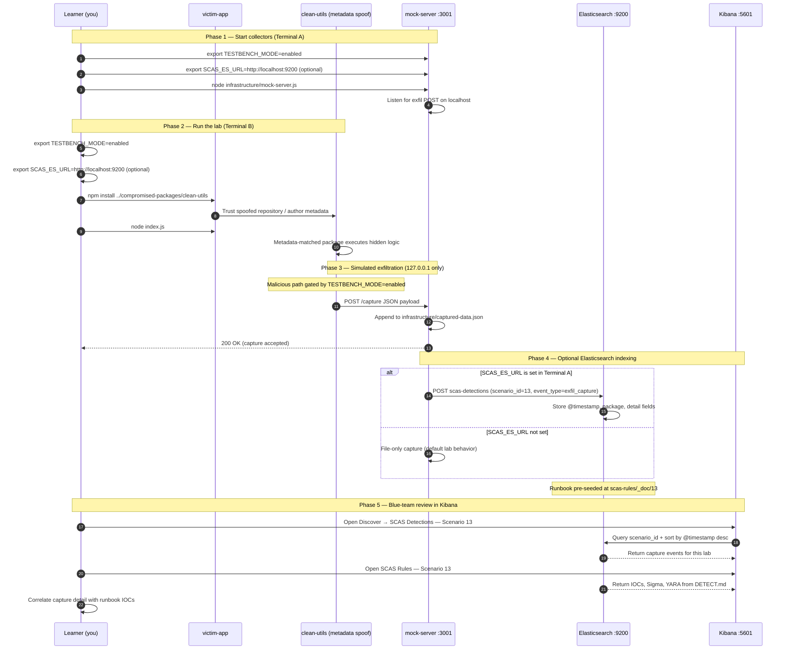

# 🚀 Zero to Hero: Scenario 13 - Package Metadata Manipulation

Welcome! This guide will take you from zero knowledge to successfully completing the Package Metadata Manipulation scenario. We'll go step by step, explaining everything along the way.

## 📚 What You'll Learn

By the end of this guide, you will:
- Understand what package metadata is and why consumers trust it
- Learn how attackers manipulate repository, author, and integrity fields
- Execute a metadata manipulation attack simulation (safely)
- Run metadata validation and SBOM-style checks
- Perform detection and forensic investigation
- Implement defense strategies for registry metadata trust

- Apply the **Mitigation Playbook** from this guide and the scenario README
---


## Table of Contents

<div class="doc-toc">

- [Part 1: Understanding Package Metadata (15 minutes)](#part-1-understanding-package-metadata-15-minutes)
- [Part 2: Prerequisites Check (5 minutes)](#part-2-prerequisites-check-5-minutes)
- [Part 3: Setting Up Scenario 13 (15 minutes)](#part-3-setting-up-scenario-13-15-minutes)
- [Part 4: Understanding the Package Structure (20 minutes)](#part-4-understanding-the-package-structure-20-minutes)
- [Part 5: The Attack - Metadata Manipulation (30 minutes)](#part-5-the-attack---metadata-manipulation-30-minutes)
- [Part 6: Detection Methods (40 minutes)](#part-6-detection-methods-40-minutes)
- [Part 7: Forensic Investigation (30 minutes)](#part-7-forensic-investigation-30-minutes)
- [Part 8: Incident Response & Mitigation (30 minutes)](#part-8-incident-response--mitigation-30-minutes)
- [Mitigation Playbook](#mitigation-playbook)
- [Elasticsearch + Kibana observability (optional)](#elasticsearch--kibana-observability-optional)
- [Part 9: Key Takeaways](#part-9-key-takeaways)
- [Part 10: Advanced Exercises](#part-10-advanced-exercises)
- [📚 Additional Resources](#📚-additional-resources)
- [⚠️ Safety & Ethics](#⚠️-safety--ethics)
- [🎉 Congratulations!](#🎉-congratulations)

</div>

---
## Part 1: Understanding Package Metadata (15 minutes)

### What Is Package Metadata?

**Package metadata** is the descriptive information published alongside a software package. In npm, this lives primarily in `package.json` and registry responses. Consumers, CI pipelines, and security tools often treat metadata as authoritative without verifying it against the actual tarball contents.

**Common metadata fields**:
```
name          — package identifier
version       — release version
repository    — claimed source code location
author        — claimed maintainer identity
homepage      — project website
dist          — tarball URL, shasum, integrity hash
scripts       — lifecycle hooks (postinstall, preinstall, etc.)
```

### Why Metadata Matters

1. **Trust decisions**: Developers pick packages based on repository links and maintainer names
2. **Automation**: CI tools scan metadata before downloading code
3. **SBOM generation**: Software bills of materials inherit metadata claims
4. **Audit trails**: Security teams compare metadata to known-good baselines
5. **Dependency pinning**: Lockfiles store integrity hashes derived from metadata

### Visual Example: Legitimate vs Manipulated

**Legitimate `clean-utils` (v1.0.0)**:
```json
{
  "name": "clean-utils",
  "version": "1.0.0",
  "repository": {
    "type": "git",
    "url": "https://github.com/example/clean-utils.git"
  },
  "author": "Clean Maintainers <maintainers@example.com>"
}
```

**Compromised `clean-utils` (v1.0.1)**:
```json
{
  "name": "clean-utils",
  "version": "1.0.1",
  "repository": {
    "type": "git",
    "url": "https://malicious-mirror.example/clean-utils.git"
  },
  "author": "Clean Maintainers <maintainers@example.com>",
  "scripts": {
    "postinstall": "node postinstall.js"
  }
}
```

**Notice the changes**:
- Repository URL points to a malicious mirror
- Version bumped to look like a patch release
- Hidden `postinstall` script added for runtime exfiltration

### How Metadata Manipulation Attacks Work

**The Attack Chain**:
```
Attacker compromises publish pipeline
        ↓
Metadata looks legitimate (same name, plausible author)
        ↓
Repository URL redirects auditors to wrong source
        ↓
Integrity fields may not match actual tarball
        ↓
Hidden lifecycle script runs on npm install
        ↓
Data exfiltrated to attacker server (localhost:3001 in this lab)
```

### Why Metadata Attacks Are Risky

1. **Surface legitimacy**: Spoofed repository URLs pass casual review
2. **Automation blind spots**: Tools that only read metadata miss tarball mismatches
3. **Silent execution**: Postinstall scripts run before anyone reads source code
4. **Wide blast radius**: Any consumer trusting metadata inherits the compromise
5. **Hard to detect**: Name and author may match expected values exactly

### Real-World Examples

- **Repository URL spoofing**: Package claims GitHub origin but ships from attacker mirror
- **Maintainer impersonation**: Author field copied from legitimate package
- **Integrity drift**: `dist.integrity` does not match downloaded tarball
- **Typos in metadata**: Subtle URL changes (`github.com` vs `github.co`) hide malicious publishes

**Key insight**: Metadata is not code — but misplaced trust in metadata is a direct path to executing malicious code.

---

## Part 2: Prerequisites Check (5 minutes)

Before we start, make sure you've completed:

- ✅ Scenario 1 (Typosquatting) — understanding basic package trust failures
- ✅ Scenario 2 (Dependency Confusion) — understanding package resolution
- ✅ Node.js 16+ and npm installed
- ✅ TESTBENCH_MODE enabled

Verify your setup:

```bash
node --version
npm --version
echo $TESTBENCH_MODE  # Should output: enabled
```

If `TESTBENCH_MODE` is not set:

```bash
export TESTBENCH_MODE=enabled
```

---

## Part 3: Setting Up Scenario 13 (15 minutes)

### Step 1: Navigate to Scenario Directory

```bash
cd scenarios/13-package-metadata-manipulation
```

### Step 2: Run the Setup Script

```bash
export TESTBENCH_MODE=enabled
./setup.sh
```

**What this does:**
- Creates `legitimate-packages/clean-utils` (known-good baseline)
- Creates `compromised-packages/clean-utils` (manipulated metadata + payload)
- Prepares `victim-app/` for dependency installation
- Initializes `infrastructure/captured-data.json`
- Creates `detection-tools/metadata-validator.js`

**Expected output:**
- Setup progress messages
- "Environment prepared" confirmation
- Numbered "Next steps" flow printed to terminal

### Step 3: Understand the Environment

**The Scenario Structure**:
```
13-package-metadata-manipulation/
├── legitimate-packages/clean-utils/   # Expected correct metadata
├── compromised-packages/clean-utils/  # Manipulated metadata + postinstall
├── victim-app/                        # App depending on clean-utils
├── infrastructure/
│   ├── mock-server.js                 # Attacker collector (port 3001)
│   └── captured-data.json             # Runtime evidence
└── detection-tools/
    └── metadata-validator.js          # Metadata mismatch detector
```

**The Attack**:
- Attacker publishes `clean-utils@1.0.1` with spoofed repository URL
- Victim installs the compromised package believing metadata is trustworthy
- Postinstall script exfiltrates host metadata to `127.0.0.1:3001` via `POST /capture`
- Blue team compares installed metadata against known-good baseline

---

## Part 4: Understanding the Package Structure (20 minutes)

### Step 1: Examine the Legitimate Package

```bash
cat legitimate-packages/clean-utils/package.json
```

**What you'll see:**
```json
{
  "name": "clean-utils",
  "version": "1.0.0",
  "repository": {
    "type": "git",
    "url": "https://github.com/example/clean-utils.git"
  },
  "author": "Clean Maintainers <maintainers@example.com>"
}
```

**Notice**: No lifecycle scripts — this is the trusted baseline.

### Step 2: Review Legitimate Code

```bash
cat legitimate-packages/clean-utils/index.js
```

**What you'll see:**
- Simple string utility functions (`trim`, `normalizeWhitespace`)
- No network calls
- No environment inspection

This is what consumers expect when they trust the package name.

### Step 3: Examine the Compromised Package Metadata

```bash
cat compromised-packages/clean-utils/package.json
```

**What you'll see:**
- Version `1.0.1` (looks like a routine patch)
- Repository URL changed to `https://malicious-mirror.example/clean-utils.git`
- Author string unchanged (social engineering — looks familiar)
- New `postinstall` script referencing `postinstall.js`

**Key Point**: The author field matches the legitimate package — only careful metadata validation reveals the repository drift.

### Step 4: Inspect the Malicious Postinstall

```bash
cat compromised-packages/clean-utils/postinstall.js
```

**What it does:**
- Checks `TESTBENCH_MODE=enabled` before any malicious behavior
- Collects hostname and timestamp
- Sends JSON payload to `localhost:3001` at path `/capture`
- Exits silently on error (stealthy in real attacks)

### Step 5: Understand the Victim Application

```bash
cat victim-app/index.js
```

**What you'll see:**
```javascript
const clean = require('clean-utils');
console.log('Normalized:', clean.normalizeWhitespace('  hello   world  '));
```

The victim app appears benign — it simply uses utility functions. The compromise executes during install, not during normal app logic.

---

## Part 5: The Attack - Metadata Manipulation (30 minutes)

### Step 1: Understand the Attack Timeline

**Scenario**: An attacker has compromised the publish pipeline for `clean-utils` and released version `1.0.1` with manipulated metadata.

**Attack Timeline**:
1. Attacker gains access to publish credentials or registry mirror
2. Publishes `clean-utils@1.0.1` with spoofed repository URL
3. Adds hidden postinstall script to metadata
4. Developer runs `npm install` in victim-app
5. Postinstall executes and exfiltrates data to mock server

### Step 2: Start the Mock Attacker Server

Open **Terminal A** (keep this running):

```bash
cd scenarios/13-package-metadata-manipulation
node infrastructure/mock-server.js
```

**What this does:**
- Starts HTTP server on `127.0.0.1:3001`
- Accepts `POST /capture` with exfiltrated JSON
- Stores captures in `infrastructure/captured-data.json`
- Safe — only listens on localhost

**Verify it's running:**
```bash
curl -s http://127.0.0.1:3001/captured-data
# Should return: []
```

### Step 3: Install the Compromised Package

Open **Terminal B**:

```bash
cd scenarios/13-package-metadata-manipulation/victim-app
export TESTBENCH_MODE=enabled
npm install ../compromised-packages/clean-utils
```

**What happens:**
1. npm reads compromised `package.json` metadata
2. Package copied into `node_modules/clean-utils`
3. npm runs `postinstall` script automatically
4. Postinstall sends beacon to mock server on port 3001

**What you'll see:**
- npm install output with lifecycle script execution
- No obvious errors (attack is designed to be quiet)

### Step 4: Run the Victim Application

```bash
export TESTBENCH_MODE=enabled
node index.js
```

**Expected output:**
```
Normalized: hello world
```

**Key Point**: The app runs normally! The attack already executed during `npm install`.

### Step 5: Observe the Attack

```bash
curl -s http://127.0.0.1:3001/captured-data | jq
```

**What was exfiltrated:**
- Hostname of the lab machine
- Timestamp of execution
- Note field identifying the simulation (`metadata-manipulation-sim`)

**Alternative — read capture file directly:**
```bash
cat ../infrastructure/captured-data.json | jq
```

### Step 6: Compare Installed Metadata to Baseline

```bash
cd ..
diff legitimate-packages/clean-utils/package.json victim-app/node_modules/clean-utils/package.json
```

**What to look for:**
- Repository URL mismatch
- Version bump from 1.0.0 to 1.0.1
- New `scripts.postinstall` field in compromised copy

---

## Part 6: Detection Methods (40 minutes)

### Detection Method 1: Metadata Validator (Automated)

From the scenario root:

```bash
node detection-tools/metadata-validator.js victim-app/node_modules/clean-utils
```

**What this does:**
- Compares installed `package.json` against known-good expected values
- Checks repository URL, author, and simulated integrity field
- Exits with code 2 when mismatches are found

**Expected output:**
```
Metadata issues detected:
- repository mismatch: expected https://github.com/example/clean-utils.git got https://malicious-mirror.example/clean-utils.git
```

### Detection Method 2: Manual Metadata Inspection

```bash
cat victim-app/node_modules/clean-utils/package.json | jq '.repository, .author, .scripts'
```

**Red flags:**
- Repository URL not matching internal allowlist
- Unexpected lifecycle scripts on utility packages
- Version changes without corresponding changelog review

### Detection Method 3: Side-by-Side Comparison

```bash
echo "=== LEGITIMATE ==="
cat legitimate-packages/clean-utils/package.json

echo "=== INSTALLED ==="
cat victim-app/node_modules/clean-utils/package.json
```

**Key Questions:**
- Does the repository URL match your trusted source?
- Is the author field verifiable through independent channels?
- Are there scripts that did not exist in the prior version?

### Detection Method 4: Lifecycle Script Detection

```bash
grep -r "postinstall" victim-app/node_modules/clean-utils/
cat victim-app/node_modules/clean-utils/postinstall.js
```

**What to look for:**
- HTTP requests to unknown hosts or ports
- Environment variable reads
- Obfuscated or minified install scripts

### Detection Method 5: Network Evidence Correlation

```bash
curl -s http://127.0.0.1:3001/captured-data | jq '.[].payload' -r | jq
```

**What to look for:**
- Capture timestamps aligned with `npm install` time
- Payload fields matching postinstall script output
- Repeated captures indicating reinstall attempts

### Detection Method 6: Sigma / SIEM Patterns (from DETECT.md)

Example detection logic to implement in production:

```yaml
title: Package Metadata Integrity Mismatch
detection:
  selection:
    file.path|endswith: "package.json"
    file.content|contains|all: ["repository", "author", "dist"]
  condition: selection
level: medium
```

**Sample log line for this scenario:**
```json
{"scenario_id":"13","event_type":"metadata_mismatch_execution","source":"clean-utils","destination":"127.0.0.1:3001","timestamp_utc":"2026-04-20T13:00:00Z"}
```

---

## Part 7: Forensic Investigation (30 minutes)

### Investigation Step 1: Package Provenance Reconstruction

```bash
# Identify installed package path
ls -la victim-app/node_modules/clean-utils/

# Record metadata at time of discovery
cp victim-app/node_modules/clean-utils/package.json /tmp/clean-utils-forensics.json
cat /tmp/clean-utils-forensics.json | jq
```

**Questions:**
- Where did this package come from (local path vs registry)?
- What version was requested vs installed?
- When was it installed (check file timestamps)?

### Investigation Step 2: Script Analysis

```bash
cat victim-app/node_modules/clean-utils/postinstall.js
```

**Document:**
- Network destinations (localhost:3001, path `/capture`)
- Data collected (hostname, timestamp)
- Safety gate (`TESTBENCH_MODE`) — present in lab, absent in real attacks

### Investigation Step 3: Capture Timeline

```bash
cat infrastructure/captured-data.json | jq '.[] | {received_at, payload}'
```

**Build Timeline:**
- T0: Developer runs `npm install`
- T1: Postinstall executes
- T2: `POST /capture` received by mock server
- T3: Victim app runs (benign output)

### Investigation Step 4: Impact Assessment

```bash
# Check if other projects might use same package name
grep -r "clean-utils" victim-app/

# Review npm install logs (if available)
# npm installs with --verbose flag in CI retain this evidence
```

**Questions:**
- How many applications depend on `clean-utils`?
- Was metadata validated in CI before merge?
- Are lockfile integrity hashes current?

### Investigation Step 5: Integrity Field Analysis

The metadata validator also checks simulated tarball integrity:

```bash
node detection-tools/metadata-validator.js victim-app/node_modules/clean-utils
```

If `dist.integrity` is present and mismatched, the validator reports **tarball integrity mismatch** — a strong indicator the published artifact differs from expected content.

---

## Part 8: Incident Response & Mitigation (30 minutes)

### Response Step 1: Immediate Containment

```bash
# 1. Stop mock server (if still running)
../../scripts/kill-port.sh 3001

# 2. Remove compromised package from victim app
rm -rf victim-app/node_modules/clean-utils

# 3. Clear npm cache (real-world parallel)
npm cache clean --force

# 4. Remove lockfile for clean reinstall
rm -f victim-app/package-lock.json
```

### Response Step 2: Restore Trusted Package

```bash
cd victim-app
npm install ../legitimate-packages/clean-utils
node detection-tools/metadata-validator.js node_modules/clean-utils
# Run from scenario root for validator path above — adjust as needed
```

Or from scenario root after reinstall:

```bash
node detection-tools/metadata-validator.js victim-app/node_modules/clean-utils
# Expected: No metadata issues found.
```

### Response Step 3: Long-term Defenses

**Implement Multiple Layers**:

1. **Metadata Allowlists**:
   - Maintain trusted repository URLs for critical packages
   - Block installs when metadata deviates from baseline

2. **Lockfile + Integrity Verification**:
   ```bash
   npm ci  # Fails if lockfile integrity does not match tarball
   ```

3. **CI Metadata Gates**:
   ```bash
   node detection-tools/metadata-validator.js node_modules/clean-utils
   ```

4. **SBOM Comparison**:
   - Generate SBOM before and after dependency updates
   - Compare repository and author fields programmatically

5. **Registry Policy**:
   - Pin exact versions for sensitive dependencies
   - Mirror and sign internal-approved artifacts
   - Require two-person review for metadata changes on critical packages

6. **Postinstall Monitoring**:
   - Alert on new lifecycle scripts in dependency diffs
   - Run installs in sandboxed CI with egress controls

---

---

## Mitigation Playbook

Canonical prevention and mitigation controls (aligned with the [scenario README](../../../scenarios/13-package-metadata-manipulation/README.md)). Lab walkthroughs above expand each control with hands-on steps.

- Validate metadata against trusted allowlists for critical packages.
- Require lockfile and integrity verification in CI.
- Pin exact versions for sensitive dependencies.
- Mirror and sign internal-approved artifacts.

---

---

## Elasticsearch + Kibana observability (optional)

Scenario **13 — Package Metadata Manipulation** is indexed in Elasticsearch when the observability stack is running.

Metadata manipulation: clean-utils package.json spoof misleads install; mock listens on :3001 /capture.

- **Detection runbook (static)** → index `scas-rules`, document id `13` — IOCs, Sigma, YARA, sample logs from `DETECT.md`
- **Runtime captures (dynamic)** → index `scas-detections` — one document per exfil event when `SCAS_ES_URL` is set before starting the mock collector

### How to read this diagram

| Phase | What you should look for |
|-------|--------------------------|
| **1 — Collectors** | Terminal A starts the mock server (or harvester). Set `SCAS_ES_URL` here if you want live Elasticsearch indexing. |
| **2 — Lab execution** | Terminal B runs the scenario README steps. Numbered arrows follow the attack path in order. |
| **3 — Exfiltration** | Malicious sample sends **localhost-only** JSON to the mock endpoint. Evidence is always written to `infrastructure/` on disk. |
| **4 — Elasticsearch** | When `SCAS_ES_URL` is set, the same capture is indexed into `scas-detections` with `scenario_id` and `event_type=exfil_capture`. |
| **5 — Kibana** | Use the per-scenario saved searches to compare **runtime captures** (Detections) with the **static runbook** (Rules). |

> **Safety:** All network calls stay on `127.0.0.1`. Malicious logic runs only when `TESTBENCH_MODE=enabled`.

### End-to-end flow



### Prerequisites

From the repository root:

```bash
./scripts/elasticsearch-up.sh
./scripts/setup-kibana-data-views.sh   # data views + saved searches for all 23 scenarios
```

### Run this scenario with live Elasticsearch forwarding

**Terminal A — mock collector** (from `scenarios/13-package-metadata-manipulation`):

```bash
cd scenarios/13-package-metadata-manipulation
export TESTBENCH_MODE=enabled
export SCAS_ES_URL=http://localhost:9200
node infrastructure/mock-server.js
```

**Terminal B — execute the lab:**

```bash
cd scenarios/13-package-metadata-manipulation
export TESTBENCH_MODE=enabled
export SCAS_ES_URL=http://localhost:9200
cd victim-app && npm install ../compromised-packages/clean-utils && node index.js
```

### Verify locally (file-based evidence)

```bash
curl -s http://localhost:3001/captured-data
```

### Verify in Elasticsearch (API)

```bash
# Static runbook for this scenario
curl -s "http://localhost:9200/scas-rules/_doc/13?pretty"

# Latest runtime capture events
curl -s "http://localhost:9200/scas-detections/_search?pretty" \
  -H 'Content-Type: application/json' \
  -d '{
    "query": { "term": { "scenario_id": "13" } },
    "sort": [{ "@timestamp": "desc" }],
    "size": 5
  }'
```

### Verify in Kibana (UI)

1. Open [http://localhost:5601](http://localhost:5601)
2. **Discover** → **SCAS Detections — Scenario 13** — live capture timeline (`@timestamp`, `package.name`, `detail`)
3. **Discover** → **SCAS Rules — Scenario 13** — compare against `iocs`, `sigma`, and `yara` fields
4. Ask: *Does each capture field match an IOC or Sigma condition in the runbook?*

See [observability/README.md](../../../observability/README.md) for stack details.

## Part 9: Key Takeaways

### Why Metadata Manipulation Is Dangerous

1. **Trust without verification**: Metadata looks plausible while code is malicious
2. **Automation gaps**: Scanners that skip tarball comparison miss the attack
3. **Silent execution**: Postinstall runs before human code review
4. **Wide blast radius**: Every consumer of the package is affected
5. **Audit evasion**: Spoofed repository URLs mislead investigators

### Best Practices

1. ✅ **Validate metadata against allowlists** for critical packages
2. ✅ **Require lockfile integrity** verification in CI (`npm ci`)
3. ✅ **Pin exact versions** for sensitive dependencies
4. ✅ **Compare SBOMs** across releases
5. ✅ **Monitor lifecycle scripts** in dependency update PRs
6. ✅ **Mirror and sign** internal-approved artifacts
7. ✅ **Rotate credentials** after suspected publish compromise

### Real-World Impact

- **Registry incidents**: Compromised publish tokens enable metadata + payload changes
- **Mirror poisoning**: Internal mirrors serving stale or tampered metadata
- **Detection time**: Often days to weeks when only names are checked
- **Blast radius**: All downstream builds trusting unverified metadata

---

## Part 10: Advanced Exercises

### Exercise 1: CI Metadata Gate
- Add a GitHub Actions / GitLab CI job running `metadata-validator.js`
- Fail the pipeline when repository URL deviates from allowlist
- Document false-positive handling for forked dependencies

### Exercise 2: SBOM Diff Workflow
- Generate SBOM for legitimate vs compromised package
- Write a script diffing repository, author, and script fields
- Present findings in a mock incident report

### Exercise 3: Integrity Simulation
- Add a `dist.integrity` field to compromised `package.json`
- Trigger validator integrity mismatch path
- Propose registry-side enforcement for hash verification

### Exercise 4: Detection Rule Authoring
- Convert DETECT.md Sigma example into a production SIEM rule
- Map sample log JSON fields to your organization's schema
- Define escalation criteria when metadata + network IOCs co-occur

---

## 📚 Additional Resources

- [npm package.json documentation](https://docs.npmjs.com/cli/v9/configuring-npm/package-json)
- [SLSA provenance framework](https://slsa.dev/)
- [OWASP Software Supply Chain Security](https://owasp.org/www-project-top-10-ci-cd-security-risks/)
- Scenario README: `scenarios/13-package-metadata-manipulation/README.md`
- Detection runbook: `scenarios/13-package-metadata-manipulation/DETECT.md`

---

## ⚠️ Safety & Ethics

**IMPORTANT**: This scenario is for **educational purposes only**.

- ✅ Use ONLY in isolated test environments
- ✅ Never deploy malicious code to production
- ✅ All malicious code requires `TESTBENCH_MODE=enabled`
- ✅ Exfiltration targets `127.0.0.1:3001` only — no real external C2
- ✅ Do not publish manipulated packages to public registries

---

## 🎉 Congratulations!

You've completed the Package Metadata Manipulation scenario! You now understand:
- How attackers abuse metadata trust without changing package names
- How to detect repository, author, and integrity mismatches
- How to respond when metadata and tarball content diverge

**Remember**: Trust metadata only after independent verification. Always compare installed packages to known-good baselines.

🔐 Happy Learning!
