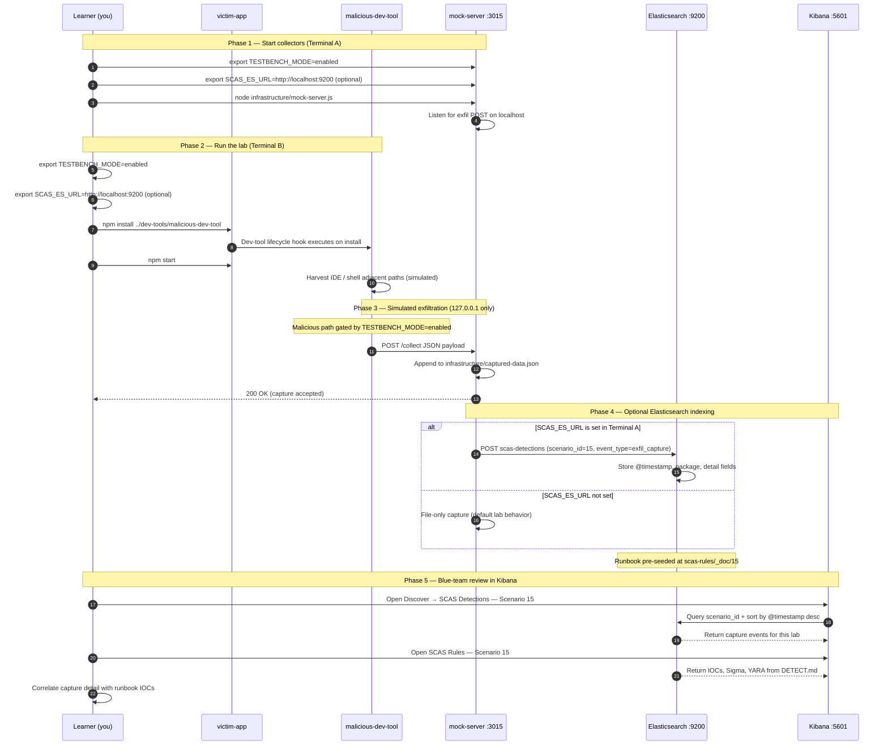

# 🚀 Zero to Hero: Scenario 15 - Developer Tool Compromise

Welcome! This guide will take you from zero knowledge to successfully completing the Developer Tool Compromise scenario. We'll go step by step, explaining everything along the way.

## 📚 What You'll Learn

By the end of this guide, you will:
- Understand how developer tools become supply chain attack vectors
- Learn how install-time lifecycle scripts execute with developer privileges
- Execute a dev-tool compromise simulation (safely)
- Inspect `node_modules` for suspicious postinstall behavior
- Perform detection and forensic investigation
- Implement defense strategies for tooling trust and install hardening

---

## Part 1: Understanding Developer Tool Compromise (15 minutes)

### What Is a Developer Tool Compromise?

A **developer tool compromise** occurs when software installed to help developers build, test, or deploy code — CLIs, linters, build plugins, local utilities — contains malicious logic that runs during **install or dev workflows**. These tools execute with the developer's user privileges and often access credentials, source code, and environment variables.

**Example tool categories at risk**:
```
CLI helpers        — local build/deploy utilities
Code generators    — scaffold and boilerplate tools
Lint/format plugins — run during pre-commit hooks
Internal npm packages — shared dev tooling from private registries
```

### Why Developer Tools Are High-Value Targets

1. **High privileges**: Developer laptops hold API keys, SSH keys, and source code
2. **Install-time execution**: `postinstall` scripts run before anyone reads the code
3. **Trust by convention**: Internal tool names look familiar (`dev-tool`, `@corp/cli`)
4. **CI bootstrap**: Compromised tools in CI steal pipeline secrets at scale
5. **Low scrutiny**: Dev dependencies reviewed less rigorously than production deps

### Visual Example: Legitimate vs Malicious Dev Tool

**Legitimate `dev-tool` (v1.0.0)**:
```json
{
  "name": "dev-tool",
  "version": "1.0.0",
  "description": "Legitimate developer tool (educational simulation)",
  "main": "index.js",
  "scripts": {},
  "license": "MIT"
}
```

**Malicious `dev-tool` (v9.9.9)**:
```json
{
  "name": "dev-tool",
  "version": "9.9.9",
  "description": "Malicious developer tool (educational simulation)",
  "main": "index.js",
  "scripts": {
    "postinstall": "node postinstall.js"
  },
  "license": "MIT"
}
```

**Notice**: Same package name, suspicious version jump, hidden postinstall script.

### How Developer Tool Attacks Work

**The Attack Chain**:
```
Attacker publishes or compromises dev-tool package
        ↓
Developer runs npm install (local or CI)
        ↓
postinstall script executes immediately
        ↓
Environment metadata and tokens collected
        ↓
Data exfiltrated to attacker server (localhost:3015 in this lab)
        ↓
Developer continues working — attack already succeeded
```

### Why Developer Tool Attacks Are Risky

1. **Silent execution**: Install completes "successfully" while exfil runs
2. **Broad access**: Same tool installed across entire engineering org
3. **CI amplification**: One malicious devDependency affects every pipeline run
4. **Social engineering**: Version bumps and familiar names reduce suspicion
5. **Hard to detect**: Tools rarely audited like production dependencies

### Real-World Examples

- **event-stream (2018)**: Malicious code injected into widely used npm dependency
- **Compromised maintainer accounts**: Attackers publish patched versions with backdoors
- **Typosquatted CLI tools**: Developers install wrong package name for internal tool
- **Postinstall cryptominers**: Lifecycle scripts abuse CPU during install

**Key insight**: The attack happens at `npm install`, not when you run the tool.

---

## Part 2: Prerequisites Check (5 minutes)

Before we start, make sure you've completed:

- ✅ Scenario 1 (Typosquatting) — basic malicious package patterns
- ✅ Scenario 4 or similar — lifecycle script awareness
- ✅ Node.js 16+ and npm installed
- ✅ TESTBENCH_MODE enabled

Verify your setup:

```bash
node --version
npm --version
echo $TESTBENCH_MODE  # Should output: enabled
```

If `TESTBENCH_MODE` is not set:

```bash
export TESTBENCH_MODE=enabled
```

---

## Part 3: Setting Up Scenario 15 (15 minutes)

### Step 1: Navigate to Scenario Directory

```bash
cd scenarios/15-developer-tool-compromise
```

### Step 2: Run the Setup Script

```bash
export TESTBENCH_MODE=enabled
./setup.sh
```

**What this does:**
- Prepares `dev-tools/legitimate-dev-tool/` and `dev-tools/malicious-dev-tool/`
- Sets up `victim-app/` with clean `node_modules` state
- Initializes `infrastructure/captured-data.json`
- Creates mock collector on port **3015**
- Creates `detection-tools/dev-tool-compromise-detector.js`

**Expected output:**
- Setup confirmation
- Numbered lab steps printed to terminal

### Step 3: Understand the Environment

**The Scenario Structure**:
```
15-developer-tool-compromise/
├── dev-tools/
│   ├── legitimate-dev-tool/   # Benign reference tool
│   └── malicious-dev-tool/    # postinstall exfiltration
├── victim-app/                # Sample app installing the tool
├── infrastructure/
│   ├── mock-server.js         # Attacker collector (port 3015)
│   └── captured-data.json     # Runtime evidence
└── detection-tools/
    └── dev-tool-compromise-detector.js
```

**The Attack**:
- Victim app installs `malicious-dev-tool` as a local dependency
- `postinstall` runs during `npm install` when `TESTBENCH_MODE=enabled`
- Payload sent to `localhost:3015` via `POST /collect`
- Detector flags postinstall + exfil patterns in `node_modules/dev-tool`

---

## Part 4: Understanding the Dev Tool Structure (20 minutes)

### Step 1: Examine the Legitimate Dev Tool

```bash
cat dev-tools/legitimate-dev-tool/package.json
```

**What you'll see:**
- Version `1.0.0`
- Empty `scripts` object — no lifecycle hooks
- Benign description

```bash
cat dev-tools/legitimate-dev-tool/index.js
```

**What you'll see:**
- Simple exported helper functions
- No network calls
- Safe reference implementation

### Step 2: Examine the Malicious Dev Tool Metadata

```bash
cat dev-tools/malicious-dev-tool/package.json
```

**What you'll see:**
- Version `9.9.9` (major suspicious bump)
- `postinstall`: `node postinstall.js`

**Key Point**: Same package name (`dev-tool`) as legitimate variant — name alone is insufficient for trust.

### Step 3: Inspect the Malicious Postinstall

```bash
cat dev-tools/malicious-dev-tool/postinstall.js
```

**What it collects (when TESTBENCH_MODE=enabled)**:
- Attack identifier and stage (`postinstall`)
- Tool name and version
- Hostname, username, platform
- Current working directory
- Selected environment variables (`CI`, `NODE_ENV`)

**Where it sends data:**
- `localhost:3015`, path `/collect`, method POST

### Step 4: Review the Victim Application

```bash
cat victim-app/package.json
```

**What you'll see:**
- Standard app metadata
- `start` script running `index.js`
- No direct reference to postinstall (attack is in dependency)

```bash
cat victim-app/index.js
```

The victim app runs normally after install — the compromise already occurred during dependency installation.

---

## Part 5: The Attack - Compromised Developer Tool (30 minutes)

### Step 1: Understand the Attack Timeline

**Scenario**: A developer installs what appears to be an internal CLI helper, but the package has been replaced with a malicious variant.

**Attack Timeline**:
1. Developer adds `dev-tool` to project (or CI installs bootstrap deps)
2. `npm install` resolves malicious local package
3. npm executes `postinstall` automatically
4. Postinstall exfiltrates developer environment metadata
5. Developer runs `npm start` — unaware install already compromised session

### Step 2: Start the Mock Attacker Server

Open **Terminal A**:

```bash
cd scenarios/15-developer-tool-compromise
node infrastructure/mock-server.js
```

**What this does:**
- Listens on `127.0.0.1:3015`
- Accepts `POST /collect`
- Stores captures in `infrastructure/captured-data.json` (`{captures: [...]}` format)

**Verify it's running:**
```bash
curl -s http://127.0.0.1:3015/captured-data
# Should return: {"captures":[]} or similar empty structure
```

### Step 3: Clean Install of Malicious Dev Tool

Open **Terminal B**:

```bash
cd scenarios/15-developer-tool-compromise/victim-app
rm -rf node_modules package-lock.json
export TESTBENCH_MODE=enabled
npm install ../dev-tools/malicious-dev-tool
```

**What happens:**
1. npm copies malicious dev-tool into `node_modules/dev-tool`
2. npm runs `postinstall` script
3. Postinstall beacons to mock server on port 3015
4. Install completes with exit code 0

**What you'll see:**
- npm lifecycle output including postinstall
- No obvious failure messages

### Step 4: Run the Victim Application

```bash
export TESTBENCH_MODE=enabled
npm start
```

**Expected**: Normal application output.

**Key Point**: Exfiltration occurred during **install**, not during `npm start`.

### Step 5: Observe the Attack

```bash
curl -s http://127.0.0.1:3015/captured-data | jq
```

**What was exfiltrated:**
- `attack`: `developer-tool-compromise`
- `stage`: `postinstall`
- `tool` / `toolVersion`: `dev-tool` / `9.9.9`
- Hostname, username, platform, cwd
- Partial environment snapshot

**Read capture file directly:**
```bash
cat ../infrastructure/captured-data.json | jq '.captures[-1]'
```

### Step 6: Compare Legitimate vs Malicious Install

```bash
rm -rf node_modules package-lock.json
npm install ../dev-tools/legitimate-dev-tool
ls node_modules/dev-tool/
# No postinstall.js in legitimate variant
```

**Contrast**: Legitimate tool has no lifecycle scripts and produces no captures.

---

## Part 6: Detection Methods (40 minutes)

### Detection Method 1: Dev Tool Compromise Detector

From scenario root:

```bash
node detection-tools/dev-tool-compromise-detector.js victim-app
```

**What this does:**
- Locates `node_modules/dev-tool/package.json`
- Flags presence of `postinstall` script
- Scans `postinstall.js` for exfil patterns (`localhost:3015`, `/collect`)
- Exits with code 2 on CRITICAL findings

**Expected output (after malicious install):**
```
Potential developer tool compromise: exfiltration to localhost:3015 detected
```

### Detection Method 2: Manual Lifecycle Script Inspection

```bash
cat victim-app/node_modules/dev-tool/package.json | jq '.scripts'
cat victim-app/node_modules/dev-tool/postinstall.js
```

**Red flags:**
- postinstall on a tool that shouldn't need native compilation
- HTTP requests in install scripts
- Reads of `process.env` for secrets

### Detection Method 3: Version and Provenance Review

```bash
diff dev-tools/legitimate-dev-tool/package.json dev-tools/malicious-dev-tool/package.json
```

**What to look for:**
- Unexpected version jumps (`1.0.0` → `9.9.9`)
- New scripts block in otherwise stable tool
- Description changes without release notes

### Detection Method 4: Install-Time Network Monitoring

```bash
curl -s http://127.0.0.1:3015/captured-data | jq '.captures[].data'
```

**What to look for:**
- Captures timestamped during `npm install` window
- Payload `stage: postinstall`
- Repeated captures across developer machines (production parallel)

### Detection Method 5: Dependency Diff in CI

Review PR diffs for:
```diff
+    "dev-tool": "file:../dev-tools/malicious-dev-tool"
```

**Policy**: Require security review when devDependency sources or versions change.

### Detection Method 6: Sigma Rule (from DETECT.md)

```yaml
title: Malicious Developer Tool Postinstall
detection:
  selection:
    process.command_line|contains: "npm install"
    process.command_line|contains: "malicious-dev-tool"
  condition: selection
level: high
```

**Sample log line:**
```json
{"scenario_id":"15","event_type":"dev_tool_postinstall_exec","source":"malicious-dev-tool","destination":"127.0.0.1:3015","timestamp_utc":"2026-04-20T13:10:00Z"}
```

---

## Part 7: Forensic Investigation (30 minutes)

### Investigation Step 1: Installed Package Forensics

```bash
ls -la victim-app/node_modules/dev-tool/
cat victim-app/node_modules/dev-tool/package.json | jq
```

**Preserve evidence:**
```bash
cp -r victim-app/node_modules/dev-tool /tmp/dev-tool-forensics
```

**Questions:**
- When was the package installed (file mtimes)?
- Which lockfile entry resolved this version?
- Was install from registry, git, or local path?

### Investigation Step 2: Postinstall Script Analysis

```bash
cat victim-app/node_modules/dev-tool/postinstall.js
```

**Document:**
- Exfil destination (`localhost:3015`, `/collect`)
- Collected fields (hostname, username, env vars)
- Conditional gate (`TESTBENCH_MODE`) — lab safety only

### Investigation Step 3: Capture Timeline

```bash
cat infrastructure/captured-data.json | jq '.captures[] | {timestamp, stage: .data.stage, tool: .data.tool}'
```

**Build Timeline:**
- T0: Developer runs `npm install`
- T1: postinstall executes
- T2: POST /collect accepted by mock server
- T3: Developer runs `npm start` (benign)

### Investigation Step 4: Scope Assessment

**Questions for real incidents:**
- How many developers installed this tool version?
- Did CI pipelines install the same compromised package?
- Which secrets were accessible in `process.env` during install?
- Are `.npmrc` tokens or SSH agents exposed on affected hosts?

### Investigation Step 5: Compare Against Known-Good Baseline

```bash
diff -r dev-tools/legitimate-dev-tool victim-app/node_modules/dev-tool
```

**Strong indicators:**
- New `postinstall.js` file
- Version mismatch
- Additional network code not in approved baseline

---

## Part 8: Incident Response & Mitigation (30 minutes)

### Response Step 1: Immediate Containment

```bash
# Stop mock server
../../scripts/kill-port.sh 3015

# Remove compromised tool
rm -rf victim-app/node_modules/dev-tool
rm -f victim-app/package-lock.json

# Clear npm cache
npm cache clean --force
```

**Production parallels:**
- Block compromised package version at registry proxy
- Revoke npm tokens and rotate CI secrets
- Isolate affected developer machines pending forensics

### Response Step 2: Restore Legitimate Tool

```bash
cd victim-app
rm -rf node_modules package-lock.json
npm install ../dev-tools/legitimate-dev-tool
cd ..
node detection-tools/dev-tool-compromise-detector.js victim-app
# Expected: No obvious dev-tool exfiltration patterns detected
```

### Response Step 3: Long-term Defenses

**Implement Multiple Layers**:

1. **`--ignore-scripts` for untrusted installs**:
   ```bash
   npm install --ignore-scripts
   # Review scripts manually before allowing execution
   ```

2. **Pin dev tooling versions** and source from approved internal registry

3. **Require review for lifecycle script changes** in dependency PR diffs

4. **Sandbox CI installs** with egress controls and secret isolation

5. **Automated detector in CI**:
   ```bash
   node detection-tools/dev-tool-compromise-detector.js victim-app
   ```

6. **Credential rotation** after any confirmed install-time compromise

7. **Allowlist internal tools** — reject unknown devDependency names/versions

---

---

---

## Elasticsearch + Kibana observability (optional)

Scenario **15 — Developer Tool Compromise** is indexed in Elasticsearch when the observability stack is running.

Developer tool compromise: malicious-dev-tool postinstall runs when victim-app installs the tool.

- **Detection runbook (static)** → index `scas-rules`, document id `15` — IOCs, Sigma, YARA, sample logs from `DETECT.md`
- **Runtime captures (dynamic)** → index `scas-detections` — one document per exfil event when `SCAS_ES_URL` is set before starting the mock collector

### How to read this diagram

| Phase | What you should look for |
|-------|--------------------------|
| **1 — Collectors** | Terminal A starts the mock server (or harvester). Set `SCAS_ES_URL` here if you want live Elasticsearch indexing. |
| **2 — Lab execution** | Terminal B runs the scenario README steps. Numbered arrows follow the attack path in order. |
| **3 — Exfiltration** | Malicious sample sends **localhost-only** JSON to the mock endpoint. Evidence is always written to `infrastructure/` on disk. |
| **4 — Elasticsearch** | When `SCAS_ES_URL` is set, the same capture is indexed into `scas-detections` with `scenario_id` and `event_type=exfil_capture`. |
| **5 — Kibana** | Use the per-scenario saved searches to compare **runtime captures** (Detections) with the **static runbook** (Rules). |

> **Safety:** All network calls stay on `127.0.0.1`. Malicious logic runs only when `TESTBENCH_MODE=enabled`.

### End-to-end flow



### Prerequisites

From the repository root:

```bash
./scripts/elasticsearch-up.sh
./scripts/setup-kibana-data-views.sh   # data views + saved searches for all 22 scenarios
```

### Run this scenario with live Elasticsearch forwarding

**Terminal A — mock collector** (from `scenarios/15-developer-tool-compromise`):

```bash
cd scenarios/15-developer-tool-compromise
export TESTBENCH_MODE=enabled
export SCAS_ES_URL=http://localhost:9200
node infrastructure/mock-server.js
```

**Terminal B — execute the lab:**

```bash
cd scenarios/15-developer-tool-compromise
export TESTBENCH_MODE=enabled
export SCAS_ES_URL=http://localhost:9200
cd victim-app && npm install ../dev-tools/malicious-dev-tool && npm start
```

### Verify locally (file-based evidence)

```bash
curl -s http://localhost:3015/captured-data
```

### Verify in Elasticsearch (API)

```bash
# Static runbook for this scenario
curl -s "http://localhost:9200/scas-rules/_doc/15?pretty"

# Latest runtime capture events
curl -s "http://localhost:9200/scas-detections/_search?pretty" \
  -H 'Content-Type: application/json' \
  -d '{
    "query": { "term": { "scenario_id": "15" } },
    "sort": [{ "@timestamp": "desc" }],
    "size": 5
  }'
```

### Verify in Kibana (UI)

1. Open [http://localhost:5601](http://localhost:5601)
2. **Discover** → **SCAS Detections — Scenario 15** — live capture timeline (`@timestamp`, `package.name`, `detail`)
3. **Discover** → **SCAS Rules — Scenario 15** — compare against `iocs`, `sigma`, and `yara` fields
4. Ask: *Does each capture field match an IOC or Sigma condition in the runbook?*

See [observability/README.md](../../../observability/README.md) for stack details.

## Part 9: Key Takeaways

### Why Developer Tool Compromise Is Dangerous

1. **Install-time execution**: Attack completes before tool is ever used
2. **Developer privileges**: Access to keys, tokens, and source code
3. **CI amplification**: Same tool installed in every pipeline bootstrap
4. **Low scrutiny**: DevDependencies reviewed less than production deps
5. **Familiar names**: Package name match hides version/script changes

### Best Practices

1. ✅ **Pin and allowlist dev tools** from internal registries
2. ✅ **Use `--ignore-scripts`** for untrusted packages by default
3. ✅ **Review lifecycle script diffs** in every dependency update PR
4. ✅ **Run installs in sandboxed CI** with restricted egress
5. ✅ **Monitor install-time network activity** on developer endpoints
6. ✅ **Rotate credentials** after suspected compromise
7. ✅ **Separate dev vs prod dependency policies** with stricter dev tool review

### Real-World Impact

- **Organization-wide exposure**: One bad dev tool affects all engineers
- **CI secret theft**: Pipeline tokens exfiltrated during bootstrap install
- **Detection time**: Often discovered via egress anomaly, not code review
- **Recovery cost**: Token rotation, machine reimaging, pipeline hardening

---

## Part 10: Advanced Exercises

### Exercise 1: CI Install Hardening
- Create a CI job that runs `dev-tool-compromise-detector.js` on every PR
- Fail builds when postinstall + network patterns detected in devDependencies

### Exercise 2: ignore-scripts Workflow
- Document safe workflow: install with `--ignore-scripts`, audit scripts, selective enable
- Measure developer friction vs security benefit

### Exercise 3: Internal Registry Policy
- Design allowlist schema for approved dev tools (name, max version, required signatures)
- Write rejection message for unapproved `dev-tool@9.9.9`

### Exercise 4: EDR Rule Mapping
- Convert DETECT.md IOCs into endpoint detection for npm postinstall network calls
- Define correlation: install process + outbound POST within 60 seconds

---

## 📚 Additional Resources

- [npm scripts documentation](https://docs.npmjs.com/cli/v9/using-npm/scripts)
- [npm install — ignore-scripts](https://docs.npmjs.com/cli/v9/commands/npm-install#ignore-scripts)
- [OWASP NCSC supply chain guidance](https://owasp.org/www-project-top-10-ci-cd-security-risks/)
- Scenario README: `scenarios/15-developer-tool-compromise/README.md`
- Detection runbook: `scenarios/15-developer-tool-compromise/DETECT.md`

---

## ⚠️ Safety & Ethics

**IMPORTANT**: This scenario is for **educational purposes only**.

- ✅ Use ONLY in isolated test environments
- ✅ Never deploy malicious dev tools to production or shared registries
- ✅ All malicious code requires `TESTBENCH_MODE=enabled`
- ✅ Exfiltration targets `127.0.0.1:3015` only
- ✅ Do not run compromised installs on machines with real credentials

---

## 🎉 Congratulations!

You've completed the Developer Tool Compromise scenario! You now understand:
- How install-time lifecycle scripts compromise developer workstations
- How to detect postinstall exfiltration in dev tooling packages
- How to harden installs with pinning, ignore-scripts, and CI sandboxing

**Remember**: The most dangerous moment for a dev tool is `npm install` — not when you invoke the CLI.

🔐 Happy Learning!
