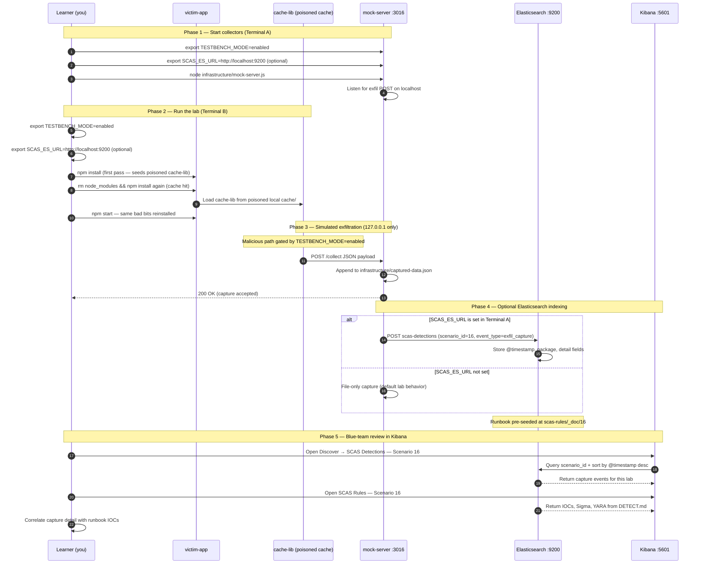

# 🚀 Zero to Hero: Scenario 16 - Package Cache Poisoning

Welcome! This guide will take you from zero knowledge to successfully completing the Package Cache Poisoning scenario. We'll go step by step, explaining everything along the way.

## 📚 What You'll Learn

By the end of this guide, you will:
- Understand how poisoned package caches persist compromise across reinstalls
- Learn how cache layers sit between registry trust and local installs
- Execute a cache poisoning attack simulation (safely)
- Observe repeated compromise after deleting `node_modules`
- Perform detection and forensic investigation
- Implement defense strategies for cache hygiene and integrity verification

- Apply the **Mitigation Playbook** from this guide and the scenario README
---


## Table of Contents

<div class="doc-toc">

- [Part 1: Understanding Package Cache Poisoning (15 minutes)](#part-1-understanding-package-cache-poisoning-15-minutes)
- [Part 2: Prerequisites Check (5 minutes)](#part-2-prerequisites-check-5-minutes)
- [Part 3: Setting Up Scenario 16 (15 minutes)](#part-3-setting-up-scenario-16-15-minutes)
- [Part 4: Understanding the Cache Structure (20 minutes)](#part-4-understanding-the-cache-structure-20-minutes)
- [Part 5: The Attack - Cache Poisoning Persistence (30 minutes)](#part-5-the-attack---cache-poisoning-persistence-30-minutes)
- [Part 6: Detection Methods (40 minutes)](#part-6-detection-methods-40-minutes)
- [Part 7: Forensic Investigation (30 minutes)](#part-7-forensic-investigation-30-minutes)
- [Part 8: Incident Response & Mitigation (30 minutes)](#part-8-incident-response--mitigation-30-minutes)
- [Mitigation Playbook](#mitigation-playbook)
- [Elasticsearch + Kibana observability (optional)](#elasticsearch--kibana-observability-optional)
- [Part 9: Key Takeaways](#part-9-key-takeaways)
- [Part 10: Advanced Exercises](#part-10-advanced-exercises)
- [📚 Additional Resources](#📚-additional-resources)
- [⚠️ Safety & Ethics](#⚠️-safety--ethics)
- [🎉 Congratulations!](#🎉-congratulations)

</div>

---
## Part 1: Understanding Package Cache Poisoning (15 minutes)

### What Is Package Cache Poisoning?

**Package cache poisoning** occurs when a malicious or tampered artifact is stored in a package manager's cache (or internal mirror cache). Subsequent installs may **reuse the poisoned copy** even after upstream registry fixes the package — because the installer trusts the local cache as a fast path to "known" content.

**Cache layer in install flow**:
```
Developer runs npm install
        ↓
Package manager checks local cache / mirror
        ↓
Cache HIT → copy cached tarball/module (may be poisoned!)
        ↓
Cache MISS → fetch from registry, then store in cache
        ↓
Lifecycle scripts run on installed content
```

### Why Caches Are Trust Boundaries

1. **Performance optimization**: Caches exist to avoid repeated downloads
2. **Implicit trust**: Installers assume cached content matched registry at cache-write time
3. **Persistence**: Bad cache entries survive `node_modules` deletion
4. **Shared environments**: CI cache keys can spread poison across pipelines
5. **Hard to inspect**: Developers rarely audit cache directories manually

### Visual Example: This Lab's Cache Simulation

This scenario simulates cache poisoning with a local folder:

```
16-package-cache-poisoning/
├── cache/cache-lib/          # Poisoned cached module (malicious index.js)
├── victim-app/
│   └── scripts/install-from-cache.js  # Copies cache-lib → node_modules
└── infrastructure/           # Mock server port 3016
```

**On every `npm install` in victim-app:**
1. `postinstall` runs `install-from-cache.js`
2. Script copies `cache/cache-lib` → `node_modules/cache-lib`
3. Poisoned module loads and exfiltrates (when TESTBENCH_MODE enabled)

### How Cache Poisoning Attacks Work

**The Attack Chain**:
```
Attacker poisons cache entry (or mirror serves bad content once)
        ↓
First install writes poisoned artifact to cache
        ↓
Developer deletes node_modules and reinstalls
        ↓
Poisoned cache entry reused — compromise repeats
        ↓
Upstream registry may already be "fixed" — cache still serves malware
        ↓
Exfiltration to attacker server (localhost:3016 in this lab)
```

### Why Cache Poisoning Is Risky

1. **False sense of recovery**: Deleting `node_modules` feels like a clean slate
2. **Delayed detection**: Registry shows clean version while cache serves bad bits
3. **CI persistence**: Shared cache restores poison across builds
4. **Blast radius**: Any machine sharing cache infrastructure affected
5. **Integrity gap**: Lockfiles may not re-verify cache-sourced content

### Real-World Examples

- **npm cache corruption incidents**: Bad tarballs served from local cache after transient registry issue
- **Compromised internal mirrors**: Artifacts cached before mirror takedown
- **CI cache poisoning**: Attackers influence cache keys to inject malicious layers
- **Air-gapped mirror drift**: Offline mirrors serving stale compromised packages

**Key insight**: "Clean package.json" is not enough when the cache layer is untrusted.

---

## Part 2: Prerequisites Check (5 minutes)

Before we start, make sure you've completed:

- ✅ Scenario 1 (Typosquatting) — basic dependency trust
- ✅ Scenario 2 (Dependency Confusion) — resolution and integrity concepts
- ✅ Node.js 16+ and npm installed
- ✅ TESTBENCH_MODE enabled

Verify your setup:

```bash
node --version
npm --version
echo $TESTBENCH_MODE  # Should output: enabled
```

If `TESTBENCH_MODE` is not set:

```bash
export TESTBENCH_MODE=enabled
```

---

## Part 3: Setting Up Scenario 16 (15 minutes)

### Step 1: Navigate to Scenario Directory

```bash
cd scenarios/16-package-cache-poisoning
```

### Step 2: Run the Setup Script

```bash
export TESTBENCH_MODE=enabled
./setup.sh
```

**What this does:**
- Prepares `cache/cache-lib/` with poisoned module code
- Sets up `victim-app/` with `install-from-cache.js` postinstall hook
- Initializes `infrastructure/captured-data.json`
- Creates mock collector on port **3016**
- Creates `detection-tools/cache-poisoning-detector.js`
- Clears `victim-app/node_modules` for clean demo

**Expected output:**
- Setup confirmation
- Numbered lab steps printed to terminal

### Step 3: Understand the Environment

**The Scenario Structure**:
```
16-package-cache-poisoning/
├── cache/
│   └── cache-lib/              # Simulated poisoned cache entry
├── victim-app/
│   ├── scripts/install-from-cache.js
│   ├── index.js
│   └── package.json
├── infrastructure/
│   ├── mock-server.js          # Port 3016
│   └── captured-data.json
└── detection-tools/
    └── cache-poisoning-detector.js
```

**The Attack**:
- Victim app's postinstall copies poisoned `cache-lib` into `node_modules`
- Module load triggers exfiltration when `TESTBENCH_MODE=enabled`
- Reinstalling without clearing cache repeats the compromise
- Detector scans `cache/cache-lib/index.js` for exfil patterns

---

## Part 4: Understanding the Cache Structure (20 minutes)

### Step 1: Examine the Poisoned Cache Module

```bash
cat cache/cache-lib/index.js
```

**What you'll see:**
- Guard: `if (process.env.TESTBENCH_MODE === 'enabled')`
- Payload with `attack: package-cache-poisoning`, stage `cache-lib-load`
- Dual evidence path: writes to `infrastructure/captured-data.json` AND POST to `localhost:3016/collect`
- Exported benign-looking API: `module.exports = { run: () => ({ ok: true, lib: 'cache-lib' }) }`

**Key Point**: Code looks like a normal library export while exfiltrating on load.

### Step 2: Review the Install-from-Cache Script

```bash
cat victim-app/scripts/install-from-cache.js
```

**What it does:**
1. Resolves paths: `cache/cache-lib` (source) → `node_modules/cache-lib` (destination)
2. Removes existing `node_modules/cache-lib`
3. Recursively copies poisoned cache content
4. `require('cache-lib')` immediately — triggers malicious load

**This simulates**: Package manager copying from poisoned cache on every install.

### Step 3: Examine Victim App Configuration

```bash
cat victim-app/package.json
```

**What you'll see:**
```json
{
  "scripts": {
    "postinstall": "node scripts/install-from-cache.js",
    "start": "node index.js"
  }
}
```

Every `npm install` re-runs cache copy — persistence is intentional.

```bash
cat victim-app/index.js
```

Victim app uses the library normally after poisoned install completes.

### Step 4: Understand Persistence Mechanics

```bash
# The poison lives HERE — not in node_modules alone
ls -la cache/cache-lib/
```

**Critical distinction**:
- Deleting `node_modules` removes installed copy
- **Not** deleting `cache/` means next install re-poisons `node_modules`
- Real-world parallel: `npm cache clean --force` or purging CI cache

---

## Part 5: The Attack - Cache Poisoning Persistence (30 minutes)

### Step 1: Understand the Attack Timeline

**Scenario**: A poisoned cache entry for `cache-lib` persists malicious code across reinstall cycles.

**Attack Timeline**:
1. Poisoned artifact stored in `cache/cache-lib`
2. Developer runs first `npm install` — postinstall copies poisoned module
3. Developer deletes `node_modules` thinking environment is clean
4. Second `npm install` copies same poisoned content again
5. Developer runs app with TESTBENCH_MODE — exfiltration fires

### Step 2: Start the Mock Attacker Server

Open **Terminal A**:

```bash
cd scenarios/16-package-cache-poisoning
node infrastructure/mock-server.js
```

**What this does:**
- Listens on `127.0.0.1:3016`
- Accepts `POST /collect`
- Stores captures in `infrastructure/captured-data.json`

**Verify it's running:**
```bash
curl -s http://127.0.0.1:3016/captured-data
```

### Step 3: First Install Cycle

Open **Terminal B**:

```bash
cd scenarios/16-package-cache-poisoning/victim-app
rm -rf node_modules package-lock.json
npm install
```

**What happens:**
- postinstall copies poisoned `cache-lib` to `node_modules`
- Module loads; if TESTBENCH_MODE not set yet, exfil may not run (gate)

**Observe cache copy:**
```bash
ls node_modules/cache-lib/
cat node_modules/cache-lib/index.js | head -5
```

### Step 4: Second Install Cycle (Prove Persistence)

```bash
rm -rf node_modules package-lock.json
npm install
```

**What happens:**
- Same postinstall script runs again
- Same poisoned cache source copied again
- Compromise persists without any registry fetch

**Key Point**: Two installs, same poisoned source — this is the core lesson.

### Step 5: Trigger Runtime Exfiltration

```bash
export TESTBENCH_MODE=enabled
npm start
```

**What happens:**
- Victim app loads `cache-lib`
- Poisoned module exfiltrates hostname, username, platform, cwd
- Evidence written to capture file and sent to mock server

### Step 6: Observe the Attack

```bash
curl -s http://127.0.0.1:3016/captured-data | jq
```

**Alternative — read capture file:**
```bash
cat ../infrastructure/captured-data.json | jq '.captures[-1]'
```

**What was exfiltrated:**
- `attack`: `package-cache-poisoning`
- `stage`: `cache-lib-load`
- Hostname, username, platform, working directory

---

## Part 6: Detection Methods (40 minutes)

### Detection Method 1: Cache Poisoning Detector

From scenario root:

```bash
node detection-tools/cache-poisoning-detector.js .
```

**Note**: The detector scans `cache/cache-lib/index.js` at scenario root. Use `.` as the target path when running from scenario root.

**What this does:**
- Reads poisoned cache module source
- Searches for `localhost:3016` or `package-cache-poisoning` strings
- Exits with code 2 when poisoning suspected
- Recommends cache purge and clean reinstall

**Expected output:**
```
🚨 Cache poisoning suspected: exfiltration endpoint found in cache/lib code.
Recommendation:
 - Clear local npm cache / poisoned cache directories
 - Reinstall dependencies in a clean environment
```

### Detection Method 2: Persistence Reproduction Test

```bash
cd victim-app
rm -rf node_modules package-lock.json && npm install
rm -rf node_modules package-lock.json && npm install
ls node_modules/cache-lib/index.js
```

**Indicator**: Identical malicious content reappears after each cycle without cache purge.

### Detection Method 3: Source Path Inspection

```bash
grep -n "cache-lib" victim-app/scripts/install-from-cache.js
ls -la cache/cache-lib/
```

**Red flags:**
- Install scripts copying from local cache paths outside registry control
- Cache directories writable by untrusted processes
- Module code containing network exfiltration

### Detection Method 4: Capture Correlation

```bash
cat infrastructure/captured-data.json | jq '.captures[] | .data.attack'
```

**What to look for:**
- Multiple captures with same `cache-lib-load` stage
- Captures after `node_modules` was deleted and reinstalled
- Timestamps clustering around repeated `npm install` events

### Detection Method 5: Integrity Verification

**Production parallel:**
```bash
npm ci                    # Enforce lockfile integrity
npm cache verify          # Validate npm cache structure
npm cache clean --force   # Purge after incident
```

### Detection Method 6: Sigma Rule (from DETECT.md)

```yaml
title: Persistent Package Compromise Across Reinstall
detection:
  selection:
    process.command_line|contains|all: ["npm", "install"]
    event.action: "repeat_compromise"
  condition: selection
level: medium
```

**Sample log line:**
```json
{"scenario_id":"16","event_type":"cache_persistence_exec","source":"cached-package","destination":"127.0.0.1:3016","timestamp_utc":"2026-04-20T13:15:00Z"}
```

---

## Part 7: Forensic Investigation (30 minutes)

### Investigation Step 1: Cache Artifact Analysis

```bash
cp cache/cache-lib/index.js /tmp/cache-lib-forensics.js
cat /tmp/cache-lib-forensics.js
```

**Questions:**
- When was cache entry last modified (`ls -la cache/cache-lib/`)?
- Who/what process can write to cache directory?
- Is cache shared across CI runners or developer machines?

### Investigation Step 2: Install Script Forensics

```bash
cat victim-app/scripts/install-from-cache.js
```

**Document:**
- Source path: `../cache/cache-lib`
- Destination: `node_modules/cache-lib`
- Immediate `require('cache-lib')` triggering load-time execution

### Investigation Step 3: Timeline Reconstruction

```bash
cat infrastructure/captured-data.json | jq '.captures[] | {timestamp, stage: .data.stage}'
```

**Build Timeline:**
- T0: First `npm install` — cache copy
- T1: `node_modules` deleted
- T2: Second `npm install` — cache copy again
- T3: `npm start` with TESTBENCH_MODE — exfiltration

### Investigation Step 4: Scope Assessment

**Questions:**
- How many projects share this cache infrastructure?
- Did registry already publish fixed version while cache serves old poison?
- Are lockfile integrity hashes validated against registry or cache?

### Investigation Step 5: Compare Installed vs Cache Source

```bash
diff cache/cache-lib/index.js victim-app/node_modules/cache-lib/index.js
# Expected: no diff — direct copy proves cache origin
```

---

## Part 8: Incident Response & Mitigation (30 minutes)

### Response Step 1: Immediate Containment

```bash
# Stop mock server
../../scripts/kill-port.sh 3016

# Remove poisoned installed copy
rm -rf victim-app/node_modules/cache-lib

# Purge simulated poisoned cache (lab)
rm -rf cache/cache-lib
# Re-run setup.sh to restore lab state for future runs
```

**Production parallels:**
```bash
npm cache clean --force
# Purge CI cache keys for affected projects
# Invalidate internal mirror entries for compromised package/version
```

### Response Step 2: Clean Reinstall

```bash
cd victim-app
rm -rf node_modules package-lock.json
# After cache purge — reinstall from trusted registry/mirror only
npm install
```

### Response Step 3: Validate with Detector

```bash
cd ..
node detection-tools/cache-poisoning-detector.js .
# Expected after purge: ✅ No obvious cache poisoning indicators found.
```

### Response Step 4: Long-term Defenses

**Implement Multiple Layers**:

1. **Cache purge in incident response** — mandatory after registry compromise

2. **Lockfile + integrity verification**:
   ```bash
   npm ci  # Deterministic installs against lockfile hashes
   ```

3. **Separate dev vs production cache trust boundaries**

4. **CI cache key hygiene** — invalidate on security incidents

5. **Monitor postinstall and cache path mutations**

6. **Immutable internal mirrors** with signed artifacts

7. **Automated detector in pipeline**:
   ```bash
   node detection-tools/cache-poisoning-detector.js .
   ```

---

---

## Mitigation Playbook

Canonical prevention and mitigation controls (aligned with the [scenario README](../../../scenarios/16-package-cache-poisoning/README.md)). Lab walkthroughs above expand each control with hands-on steps.

- Clear/rotate package cache during incident response and critical pipeline runs.
- Enforce lockfile + integrity verification against trusted metadata.
- Use deterministic installs in CI (`npm ci`) and immutable artifact mirrors.
- Monitor for suspicious cache path mutations and postinstall behavior.
- Separate developer cache trust from production build trust boundaries.

---

---

## Elasticsearch + Kibana observability (optional)

Scenario **16 — Package Cache Poisoning** is indexed in Elasticsearch when the observability stack is running.

Cache poisoning: repeated npm install reuses poisoned cache-lib artifact from cache/.

- **Detection runbook (static)** → index `scas-rules`, document id `16` — IOCs, Sigma, YARA, sample logs from `DETECT.md`
- **Runtime captures (dynamic)** → index `scas-detections` — one document per exfil event when `SCAS_ES_URL` is set before starting the mock collector

### How to read this diagram

| Phase | What you should look for |
|-------|--------------------------|
| **1 — Collectors** | Terminal A starts the mock server (or harvester). Set `SCAS_ES_URL` here if you want live Elasticsearch indexing. |
| **2 — Lab execution** | Terminal B runs the scenario README steps. Numbered arrows follow the attack path in order. |
| **3 — Exfiltration** | Malicious sample sends **localhost-only** JSON to the mock endpoint. Evidence is always written to `infrastructure/` on disk. |
| **4 — Elasticsearch** | When `SCAS_ES_URL` is set, the same capture is indexed into `scas-detections` with `scenario_id` and `event_type=exfil_capture`. |
| **5 — Kibana** | Use the per-scenario saved searches to compare **runtime captures** (Detections) with the **static runbook** (Rules). |

> **Safety:** All network calls stay on `127.0.0.1`. Malicious logic runs only when `TESTBENCH_MODE=enabled`.

### End-to-end flow



### Prerequisites

From the repository root:

```bash
./scripts/elasticsearch-up.sh
./scripts/setup-kibana-data-views.sh   # data views + saved searches for all 23 scenarios
```

### Run this scenario with live Elasticsearch forwarding

**Terminal A — mock collector** (from `scenarios/16-package-cache-poisoning`):

```bash
cd scenarios/16-package-cache-poisoning
export TESTBENCH_MODE=enabled
export SCAS_ES_URL=http://localhost:9200
node infrastructure/mock-server.js
```

**Terminal B — execute the lab:**

```bash
cd scenarios/16-package-cache-poisoning
export TESTBENCH_MODE=enabled
export SCAS_ES_URL=http://localhost:9200
cd victim-app && npm install && npm install && npm start
```

### Verify locally (file-based evidence)

```bash
curl -s http://127.0.0.1:3016/captured-data
```

### Verify in Elasticsearch (API)

```bash
# Static runbook for this scenario
curl -s "http://localhost:9200/scas-rules/_doc/16?pretty"

# Latest runtime capture events
curl -s "http://localhost:9200/scas-detections/_search?pretty" \
  -H 'Content-Type: application/json' \
  -d '{
    "query": { "term": { "scenario_id": "16" } },
    "sort": [{ "@timestamp": "desc" }],
    "size": 5
  }'
```

### Verify in Kibana (UI)

1. Open [http://localhost:5601](http://localhost:5601)
2. **Discover** → **SCAS Detections — Scenario 16** — live capture timeline (`@timestamp`, `package.name`, `detail`)
3. **Discover** → **SCAS Rules — Scenario 16** — compare against `iocs`, `sigma`, and `yara` fields
4. Ask: *Does each capture field match an IOC or Sigma condition in the runbook?*

See [observability/README.md](../../../observability/README.md) for stack details.

## Part 9: Key Takeaways

### Why Cache Poisoning Is Dangerous

1. **Persistence**: Survives `node_modules` deletion
2. **False recovery**: Teams think reinstall fixed the problem
3. **Shared blast radius**: CI and developer caches spread poison
4. **Registry mismatch**: Upstream may be clean while cache is not
5. **Low visibility**: Cache directories rarely audited

### Best Practices

1. ✅ **Purge caches** during incident response and critical pipeline runs
2. ✅ **Enforce lockfile integrity** with `npm ci` in CI
3. ✅ **Use deterministic installs** against immutable mirrors
4. ✅ **Monitor cache mutations** and suspicious postinstall behavior
5. ✅ **Separate cache trust** between dev machines and production builds
6. ✅ **Invalidate CI caches** after supply chain incidents
7. ✅ **Verify tarball hashes** against registry, not cache alone

### Real-World Impact

- **Repeat compromise**: Same malware across weeks of "clean" reinstalls
- **Detection delay**: Focus on registry while cache serves bad content
- **CI amplification**: Shared cache keys spread poison organization-wide
- **Recovery**: Requires coordinated cache purge + lockfile refresh + redeploy

---

## Part 10: Advanced Exercises

### Exercise 1: CI Cache Invalidation Playbook
- Document steps to purge GitHub Actions / GitLab CI cache after poisoned dependency incident
- Include verification that new cache entries match registry integrity hashes

### Exercise 2: Persistence Proof Report
- Run two install cycles, capture diff of `node_modules/cache-lib`
- Write incident summary explaining why deleting node_modules was insufficient

### Exercise 3: Detector Integration
- Add cache-poisoning-detector to pre-install CI job
- Define exit-code handling (0 clean, 2 poisoned)

### Exercise 4: Enterprise Fleet Detection
- Propose agent-based scan for npm cache directories containing network exfil strings
- Estimate false-positive rate vs postinstall-only detection

---

## 📚 Additional Resources

- [npm cache documentation](https://docs.npmjs.com/cli/v9/commands/npm-cache)
- [npm ci — clean install](https://docs.npmjs.com/cli/v9/commands/npm-ci)
- [Supply chain levels for software artifacts (SLSA)](https://slsa.dev/)
- Scenario README: `scenarios/16-package-cache-poisoning/README.md`
- Detection runbook: `scenarios/16-package-cache-poisoning/DETECT.md`

---

## ⚠️ Safety & Ethics

**IMPORTANT**: This scenario is for **educational purposes only**.

- ✅ Use ONLY in isolated test environments
- ✅ Never poison real npm caches or shared CI infrastructure
- ✅ All malicious code requires `TESTBENCH_MODE=enabled`
- ✅ Exfiltration targets `127.0.0.1:3016` only
- ✅ Restore lab state with `./setup.sh` after destructive cache purge exercises

---

## 🎉 Congratulations!

You've completed the Package Cache Poisoning scenario! You now understand:
- How poisoned cache entries persist compromise across reinstalls
- Why deleting `node_modules` alone does not restore trust
- How to detect, respond, and harden cache layers in your pipeline

**Remember**: The cache is part of your supply chain. Purge it with the same urgency as compromised registry credentials.

🔐 Happy Learning!
