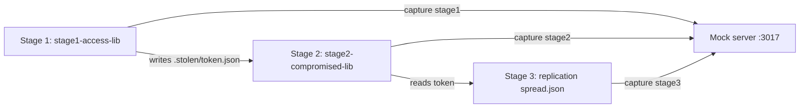
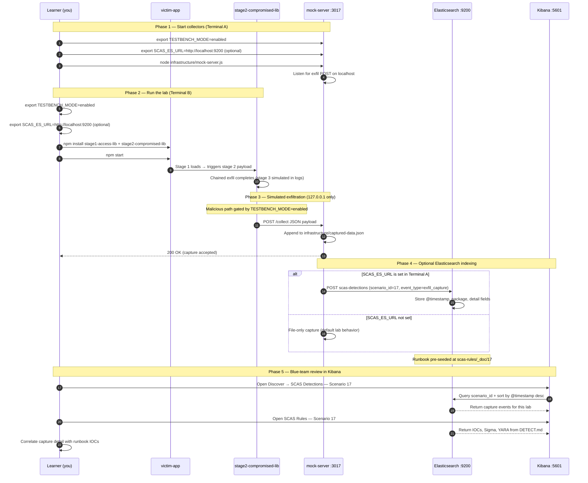

# 🚀 Zero to Hero: Scenario 17 - Multi-Stage Attack Chain

Welcome! This guide will take you from zero knowledge to successfully completing the Multi-Stage Attack Chain scenario. We'll go step by step, explaining everything along the way.

## 📚 What You'll Learn

By the end of this guide, you will:
- Understand how supply chain attacks chain across multiple stages
- Learn the kill-chain pattern: access → abuse → replication
- Execute a three-stage attack simulation (safely)
- Correlate low-signal events into a single narrative
- Perform detection and forensic investigation with the multi-stage correlator
- Implement defense-in-depth strategies that interrupt stage progression

---

## Part 1: Understanding Multi-Stage Attack Chains (15 minutes)

### What Is a Multi-Stage Supply Chain Attack?

A **multi-stage supply chain attack** progresses through sequential phases rather than executing all malicious behavior in one step. Each stage may look like a low-severity anomaly in isolation; only **correlation across time and artifacts** reveals the full campaign.

**Typical three-stage pattern in this lab**:
```
Stage 1 — Initial Access
  Write local token artifact + stage1 capture

Stage 2 — Privilege / Credential Abuse
  Read stage1 token + stage2 capture

Stage 3 — Replication / Persistence
  Write spread artifact + stage3 capture
```

### Why Staged Attacks Evade Detection

1. **Low signal per stage**: Each event seems minor alone
2. **Time separation**: Stages may occur seconds apart but different alerts fire separately
3. **Different data sources**: File writes, network beacons, package loads — siloed in SIEM
4. **Progressive trust abuse**: Stage 2 depends on artifacts from stage 1
5. **Alert fatigue**: SOC closes "informational" alerts missing chain context

### Visual Example: Stage Dependencies



### How Multi-Stage Attacks Work

**The Attack Chain**:
```
Stage 1 package installed — foothold established
        ↓
Local artifact written (.stolen/token.json)
        ↓
Stage 2 package uses stolen token — escalation simulated
        ↓
Replication artifacts written (spread.json)
        ↓
Each stage emits capture to mock server (localhost:3017)
        ↓
Correlator ties stage1 → stage2 → stage3 into single incident
```

### Why Multi-Stage Attacks Are Risky

1. **Expanding blast radius**: Each stage unlocks the next
2. **Credential reuse**: Stolen tokens enable lateral movement in CI/CD
3. **Persistence**: Replication stage simulates spread to additional targets
4. **Investigation complexity**: Timeline reconstruction requires cross-artifact analysis
5. **Containment timing**: Early stage containment prevents later stages entirely

### Real-World Examples

- **SolarWinds**: Build compromise → signed backdoor → widespread deployment
- **Codecov breach**: CI script compromise → credential theft → repository access
- **npm maintainer takeover**: Account access → malicious publish → downstream install
- **3CX supply chain (2023)**: Signed application → staged loader → secondary payload

**Key insight**: Single-alert triage fails. Correlation is the defense.

---

## Part 2: Prerequisites Check (5 minutes)

Before we start, make sure you've completed:

- ✅ Scenarios 1–5 — foundational supply chain attack patterns
- ✅ Scenario 7 (Transitive Dependencies) — dependency chain concepts
- ✅ Node.js 16+ and npm installed
- ✅ TESTBENCH_MODE enabled

Verify your setup:

```bash
node --version
npm --version
echo $TESTBENCH_MODE  # Should output: enabled
```

If `TESTBENCH_MODE` is not set:

```bash
export TESTBENCH_MODE=enabled
```

---

## Part 3: Setting Up Scenario 17 (15 minutes)

### Step 1: Navigate to Scenario Directory

```bash
cd scenarios/17-multi-stage-attack-chain
```

### Step 2: Run the Setup Script

```bash
export TESTBENCH_MODE=enabled
./setup.sh
```

**What this does:**
- Prepares `packages/stage1-access-lib/` and `packages/stage2-compromised-lib/`
- Sets up `victim-app/` orchestrating the chain
- Initializes `infrastructure/captured-data.json` with `{captures: []}` structure
- Creates mock collector on port **3017**
- Creates `detection-tools/multi-stage-correlator.js`
- Clears `victim-app/node_modules` for clean install demo

**Expected output:**
- Setup confirmation
- Numbered lab steps printed to terminal

### Step 3: Understand the Environment

**The Scenario Structure**:
```
17-multi-stage-attack-chain/
├── packages/
│   ├── stage1-access-lib/       # Stage 1 — initial access
│   └── stage2-compromised-lib/  # Stage 2 + 3 — abuse + replication
├── victim-app/
│   └── index.js                 # Orchestrates stage1 → stage2Chain
├── infrastructure/
│   ├── mock-server.js           # Port 3017
│   └── captured-data.json       # Unified evidence store
└── detection-tools/
    └── multi-stage-correlator.js
```

**The Attack**:
- Victim installs both stage packages
- `npm start` runs stage1 then stage2Chain sequentially
- Artifacts: `.stolen/token.json`, `replication/spread.json`
- Captures: stage1, stage2, stage3 events to port 3017 via `POST /collect`

---

## Part 4: Understanding the Stage Package Structure (20 minutes)

### Step 1: Examine Stage 1 — Initial Access

```bash
cat packages/stage1-access-lib/package.json
cat packages/stage1-access-lib/index.js
```

**Stage 1 behavior (when TESTBENCH_MODE=enabled)**:
1. Generates token: `stolen-<timestamp>`
2. Writes `victim-app/.stolen/token.json`
3. Appends stage1 evidence to `infrastructure/captured-data.json`
4. POSTs stage1 payload to `localhost:3017/collect`

**Exports**: `stage1()`, `getToken()` for victim orchestration

### Step 2: Examine Stage 2 — Abuse and Replication

```bash
cat packages/stage2-compromised-lib/package.json
cat packages/stage2-compromised-lib/index.js
```

**Stage 2 behavior**:
1. Reads token from `.stolen/token.json` (depends on stage 1)
2. Appends stage2 evidence + POSTs stage2 capture
3. Writes `replication/spread.json` (simulated spread)
4. Appends stage3 evidence + POSTs stage3 capture

**Exports**: `stage2Chain()` — runs stage 2 and stage 3 in sequence

### Step 3: Review Victim Orchestration

```bash
cat victim-app/index.js
```

**What you'll see:**
```javascript
const stage1 = require('stage1-access-lib');
const stage2 = require('stage2-compromised-lib');

async function main() {
  const s1 = await stage1.stage1();
  const s2 = await stage2.stage2Chain();
  // ...
}
```

**Key Point**: Explicit ordering — stage 2 cannot succeed fully without stage 1 artifact.

### Step 4: Map Artifacts and Evidence

| Stage | Local Artifact | Capture `stage` field | Mock endpoint |
|-------|----------------|----------------------|---------------|
| 1 | `.stolen/token.json` | `stage1` | POST /collect :3017 |
| 2 | (reads token) | `stage2` | POST /collect :3017 |
| 3 | `replication/spread.json` | `stage3` | POST /collect :3017 |

---

## Part 5: The Attack - Multi-Stage Chain Execution (30 minutes)

### Step 1: Understand the Attack Timeline

**Scenario**: An attacker delivers two malicious packages that execute a chained campaign when the victim application starts.

**Attack Timeline**:
1. Developer installs `stage1-access-lib` and `stage2-compromised-lib`
2. Application start invokes stage1 — token stolen and captured
3. stage2Chain reads token — abuse simulated and captured
4. Replication file written — spread simulated and stage3 captured
5. Blue team correlates all three stages into single incident

### Step 2: Start the Mock Attacker Server

Open **Terminal A**:

```bash
cd scenarios/17-multi-stage-attack-chain
node infrastructure/mock-server.js
```

**What this does:**
- Listens on `127.0.0.1:3017`
- Accepts `POST /collect`
- Supports `GET|DELETE /captured-data`
- Stores unified captures in `infrastructure/captured-data.json`

**Verify it's running:**
```bash
curl -s http://127.0.0.1:3017/captured-data
```

### Step 3: Install Stage Packages

Open **Terminal B**:

```bash
cd scenarios/17-multi-stage-attack-chain/victim-app
rm -rf node_modules package-lock.json
npm install ../packages/stage1-access-lib ../packages/stage2-compromised-lib
```

**What happens:**
- Both stage packages linked into `node_modules`
- No exfil yet — malicious paths gated until TESTBENCH_MODE and app start

### Step 4: Execute the Attack Chain

```bash
export TESTBENCH_MODE=enabled
npm start
```

**Expected console output:**
```
Starting victim app (Scenario 17)...
Stage1 token: stolen-<timestamp>
Stage2/Stage3 result: { ok: true }
Multi-stage chain simulated. Evidence should be in infrastructure/captured-data.json.
```

**What happens under the hood:**
1. `stage1()` writes token + stage1 capture
2. `stage2Chain()` reads token + stage2 capture
3. Replication spread written + stage3 capture

### Step 5: Observe Local Artifacts

```bash
cat .stolen/token.json | jq
cat replication/spread.json | jq
```

**Stage 1 artifact:**
```json
{ "token": "stolen-..." }
```

**Stage 3 artifact:**
```json
{
  "timestamp": "...",
  "simulatedSpreads": 3,
  "note": "This is an educational replication simulation"
}
```

### Step 6: Observe Unified Captures

```bash
curl -s http://127.0.0.1:3017/captured-data | jq
```

**Or read evidence file:**
```bash
cat ../infrastructure/captured-data.json | jq '.captures[] | .data.stage'
```

**Expected stages observed:**
```
"stage1"
"stage2"
"stage3"
```

**What was exfiltrated per stage:**
- **stage1**: token value, hostname, attack identifier
- **stage2**: token reuse flag (`usedToken: true`), hostname
- **stage3**: replication flag (`replicated: true`), spread confirmation

---

## Part 6: Detection Methods (40 minutes)

### Detection Method 1: Multi-Stage Correlator (Primary)

From scenario root:

```bash
node detection-tools/multi-stage-correlator.js .
```

**What this does:**
- Reads `infrastructure/captured-data.json`
- Collects unique `stage` values from capture payloads
- Requires `stage1`, `stage2`, and `stage3` all present
- Exits 2 when full chain detected; exits 1 if incomplete

**Expected output (successful run):**
```
Observed stages: stage1, stage2, stage3

🚨 Multi-stage chain detected (stage1->stage2->stage3).

Mitigation suggestions: defense in depth (dependency pinning + behavioral detection + incident containment).
```

### Detection Method 2: Manual Stage Marker Review

```bash
cat infrastructure/captured-data.json | jq '.captures[] | {timestamp, stage: .data.stage, token: .data.token}'
```

**What to look for:**
- Ordered progression stage1 → stage2 → stage3
- Shared token value across stages
- Short time window between stages (same run)

### Detection Method 3: Filesystem Artifact Detection

```bash
find victim-app -name 'token.json' -o -path '*/replication/spread.json'
```

**Red flags:**
- Hidden `.stolen/` directories in application cwd
- Unexpected `replication/` folders not in source repo
- JSON artifacts appearing only at runtime

### Detection Method 4: Package Dependency Review

```bash
cat victim-app/package-lock.json | jq '.packages | keys[]' 2>/dev/null | grep stage
ls victim-app/node_modules/ | grep stage
```

**Questions:**
- Who approved stage1/stage2 package additions?
- Are package names deceptive (`access-lib`, `compromised-lib`)?
- Do packages perform filesystem writes on require/start?

### Detection Method 5: Network Capture Correlation

```bash
curl -s http://127.0.0.1:3017/captured-data | jq '.captures | length'
```

Three or more captures (file may contain duplicates from appendEvidence + HTTP) — correlate by `data.stage` field.

### Detection Method 6: Sigma Rule (from DETECT.md)

```yaml
title: Multi-Stage Supply Chain Correlation
detection:
  selection1:
    event.type: "stage1"
  selection2:
    event.type: "stage2"
  selection3:
    event.type: "stage3"
  condition: selection1 and selection2 and selection3
level: high
```

**Sample log line:**
```json
{"scenario_id":"17","event_type":"stage_transition","source":"stage2-compromised-lib","destination":"127.0.0.1:3017","timestamp_utc":"2026-04-20T13:20:00Z"}
```

### Detection Method 7: YARA-like Text Rule

```text
rule Multi_Stage_Attack_IOC {
  strings:
    $a = "stage1"
    $b = "stage2"
    $c = "stage3"
  condition:
    all of them
}
```

Apply across capture files, SIEM aggregated logs, and package source scans.

---

## Part 7: Forensic Investigation (30 minutes)

### Investigation Step 1: Timeline Construction

```bash
cat infrastructure/captured-data.json | jq '.captures[] | {timestamp, stage: .data.stage, hostname: .data.hostname}'
```

**Build ordered timeline:**
| Time | Stage | Event |
|------|-------|-------|
| T+0s | stage1 | Token written, initial capture |
| T+1s | stage2 | Token read, abuse capture |
| T+2s | stage3 | Replication file, spread capture |

### Investigation Step 2: Token Provenance

```bash
cat victim-app/.stolen/token.json | jq
grep -r "stolen-" victim-app/node_modules/stage1-access-lib/
grep -r "readToken" victim-app/node_modules/stage2-compromised-lib/
```

**Questions:**
- Where was token generated?
- Which stage consumed it?
- Would token rotation after stage1 block stage2?

### Investigation Step 3: Replication Scope

```bash
cat victim-app/replication/spread.json | jq
```

**Document:**
- `simulatedSpreads: 3` — educational stand-in for worm/replication behavior
- Timestamp of spread artifact
- Whether spread directory is gitignored (should be — runtime artifact)

### Investigation Step 4: Package Code Review

```bash
cat packages/stage1-access-lib/index.js
cat packages/stage2-compromised-lib/index.js
```

**Forensic notes:**
- Dual evidence paths: direct file append + HTTP POST
- All gated by `TESTBENCH_MODE=enabled`
- Stage coupling via filesystem token file

### Investigation Step 5: Kill Chain Mapping

Map to MITRE-style supply chain framing:

1. **Initial Access**: stage1 package install + token theft
2. **Execution**: victim app start triggers chain
3. **Credential Access**: token written and reused
4. **Lateral Movement / Spread**: replication/spread.json simulation
5. **Command and Control**: localhost:3017 captures (lab C2 stand-in)

---

## Part 8: Incident Response & Mitigation (30 minutes)

### Response Step 1: Immediate Containment

```bash
# Stop mock server
../../scripts/kill-port.sh 3017

# Remove stage packages
cd victim-app
rm -rf node_modules package-lock.json .stolen replication

# Clear captures for retest
curl -X DELETE http://127.0.0.1:3017/captured-data
```

**Production parallels:**
- Block stage package versions at registry proxy
- Isolate hosts that executed chain
- Revoke tokens/credentials accessible during stage1 window

### Response Step 2: Interrupt Stage Progression

**Earliest containment points:**
1. **Before stage1 install** — dependency review blocks packages entirely
2. **After stage1, before stage2** — remove `.stolen/token.json`, rotate credentials
3. **After stage2** — prevent replication; network egress block limits stage3 beacon

```bash
# Simulate interrupt after stage1 discovery
rm -rf victim-app/.stolen
# stage2 would fail to read token — chain broken
```

### Response Step 3: Validate Clean State

```bash
cd ..
node detection-tools/multi-stage-correlator.js .
# After cleanup without re-running attack: incomplete chain expected
```

### Response Step 4: Long-term Defenses

**Implement Multiple Layers**:

1. **Correlation rules requiring cross-stage context** before closing alerts

2. **Segment credentials** — stage1 token should not unlock stage2 resources in production

3. **Automated containment** on stage transitions within short windows

4. **Preserve forensic artifacts per stage** for post-incident timeline reconstruction

5. **Dependency pinning and allowlisting** for packages like `stage1-access-lib`

6. **Behavioral detection** on hidden directory creation (`.stolen/`)

7. **Attack-chain tabletop exercises** against your CI/CD architecture

8. **Run correlator in CI forensics job** after integration test runs (lab parallel):
   ```bash
   node detection-tools/multi-stage-correlator.js .
   ```

---

---

---

## Elasticsearch + Kibana observability (optional)

Scenario **17 — Multi-Stage Attack Chain** is indexed in Elasticsearch when the observability stack is running.

Multi-stage chain: stage1-access-lib enables stage2-compromised-lib exfil at runtime.

- **Detection runbook (static)** → index `scas-rules`, document id `17` — IOCs, Sigma, YARA, sample logs from `DETECT.md`
- **Runtime captures (dynamic)** → index `scas-detections` — one document per exfil event when `SCAS_ES_URL` is set before starting the mock collector

### How to read this diagram

| Phase | What you should look for |
|-------|--------------------------|
| **1 — Collectors** | Terminal A starts the mock server (or harvester). Set `SCAS_ES_URL` here if you want live Elasticsearch indexing. |
| **2 — Lab execution** | Terminal B runs the scenario README steps. Numbered arrows follow the attack path in order. |
| **3 — Exfiltration** | Malicious sample sends **localhost-only** JSON to the mock endpoint. Evidence is always written to `infrastructure/` on disk. |
| **4 — Elasticsearch** | When `SCAS_ES_URL` is set, the same capture is indexed into `scas-detections` with `scenario_id` and `event_type=exfil_capture`. |
| **5 — Kibana** | Use the per-scenario saved searches to compare **runtime captures** (Detections) with the **static runbook** (Rules). |

> **Safety:** All network calls stay on `127.0.0.1`. Malicious logic runs only when `TESTBENCH_MODE=enabled`.

### End-to-end flow



### Prerequisites

From the repository root:

```bash
./scripts/elasticsearch-up.sh
./scripts/setup-kibana-data-views.sh   # data views + saved searches for all 22 scenarios
```

### Run this scenario with live Elasticsearch forwarding

**Terminal A — mock collector** (from `scenarios/17-multi-stage-attack-chain`):

```bash
cd scenarios/17-multi-stage-attack-chain
export TESTBENCH_MODE=enabled
export SCAS_ES_URL=http://localhost:9200
node infrastructure/mock-server.js
```

**Terminal B — execute the lab:**

```bash
cd scenarios/17-multi-stage-attack-chain
export TESTBENCH_MODE=enabled
export SCAS_ES_URL=http://localhost:9200
cd victim-app && npm install ../packages/stage1-access-lib ../packages/stage2-compromised-lib && npm start
```

### Verify locally (file-based evidence)

```bash
curl -s http://localhost:3017/captured-data
```

### Verify in Elasticsearch (API)

```bash
# Static runbook for this scenario
curl -s "http://localhost:9200/scas-rules/_doc/17?pretty"

# Latest runtime capture events
curl -s "http://localhost:9200/scas-detections/_search?pretty" \
  -H 'Content-Type: application/json' \
  -d '{
    "query": { "term": { "scenario_id": "17" } },
    "sort": [{ "@timestamp": "desc" }],
    "size": 5
  }'
```

### Verify in Kibana (UI)

1. Open [http://localhost:5601](http://localhost:5601)
2. **Discover** → **SCAS Detections — Scenario 17** — live capture timeline (`@timestamp`, `package.name`, `detail`)
3. **Discover** → **SCAS Rules — Scenario 17** — compare against `iocs`, `sigma`, and `yara` fields
4. Ask: *Does each capture field match an IOC or Sigma condition in the runbook?*

See [observability/README.md](../../../observability/README.md) for stack details.

## Part 9: Key Takeaways

### Why Multi-Stage Attacks Are Dangerous

1. **Low noise per stage**: Each alert dismissed in isolation
2. **Progressive damage**: Later stages worse than earlier ones
3. **Artifact chaining**: Stage 2 depends on stage 1 outputs
4. **Correlation gap**: Most teams lack cross-source timeline tools
5. **Containment window closes fast**: Delay allows replication stage

### Best Practices

1. ✅ **Correlate alerts** across filesystem, network, and package events
2. ✅ **Contain early** — stage1 response prevents stage3
3. ✅ **Segment credentials** to limit stage-to-stage reuse
4. ✅ **Preserve stage-specific forensic artifacts**
5. ✅ **Run attack-chain tabletops** for CI/CD architectures
6. ✅ **Require multi-signal confirmation** before closing supply chain tickets
7. ✅ **Pin and review** sequential dependency additions in PRs

### Real-World Impact

- **Campaign duration**: Stages may span hours or months in real attacks
- **Detection time**: Correlation reduces mean-time-to-detect vs single IOCs
- **Blast radius**: Replication stage multiplies affected systems
- **Recovery**: Requires staged rollback — not single-package removal

---

## Part 10: Advanced Exercises

### Exercise 1: SOC Correlation Dashboard
- Design Kibana/Splunk dashboard grouping events by shared token/host within 5-minute windows
- Define escalation when stage1 + stage2 appear same host

### Exercise 2: Containment Decision Tree
- Document response actions at each stage discovery point
- Tabletop: "Stage2 found — what do you do in first 15 minutes?"

### Exercise 3: Break the Chain Experiment
- Run victim flow, delete `.stolen/token.json` between stage1 and stage2
- Observe stage2 behavior and correlator output

### Exercise 4: Map to Real Incidents
- Pick one real supply chain incident (SolarWinds, Codecov, 3CX)
- Map vendor timeline to stage1/stage2/stage3 framework from this lab
- Identify earliest feasible containment point

### Exercise 5: Detection Tuning
- Propose SIEM rule reducing fatigue: require 2+ stages before high-severity page
- Balance false negatives vs alert volume

---

## 📚 Additional Resources

- [MITRE ATT&CK — Supply Chain Compromise](https://attack.mitre.org/techniques/T1195/)
- [NIST Cybersecurity Framework — Detect and Respond](https://www.nist.gov/cyberframework)
- [Google SLSA — threat model](https://slsa.dev/spec/v1.0/threats)
- Scenario README: `scenarios/17-multi-stage-attack-chain/README.md`
- Detection runbook: `scenarios/17-multi-stage-attack-chain/DETECT.md`

---

## ⚠️ Safety & Ethics

**IMPORTANT**: This scenario is for **educational purposes only**.

- ✅ Use ONLY in isolated test environments
- ✅ Never deploy stage packages to production systems
- ✅ All malicious behavior requires `TESTBENCH_MODE=enabled`
- ✅ Exfiltration targets `127.0.0.1:3017` only
- ✅ Replication/spread artifacts are simulated — not real worm behavior

---

## 🎉 Congratulations!

You've completed the Multi-Stage Attack Chain scenario! You now understand:
- How supply chain attacks progress through linked stages
- How to correlate stage1 → stage2 → stage3 evidence into one incident
- How early containment breaks the chain before replication

**Remember**: Individual alerts are chapters — correlation tells the story. Invest in cross-stage detection before stage3 runs.

🔐 Happy Learning!
