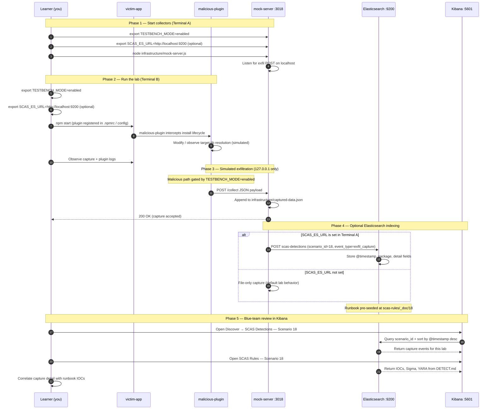

# 🚀 Zero to Hero: Scenario 18 - Package Manager Plugin Attack

Welcome! This guide will take you from zero knowledge to successfully completing the Package Manager Plugin attack scenario. We'll go step by step, explaining everything along the way.

## 📚 What You'll Learn

By the end of this guide, you will:
- Understand how package-manager plugins and install hooks work
- Learn how malicious plugins intercept installs and tamper with dependencies
- Execute a plugin attack simulation (safely)
- Detect plugin injection markers and exfiltration evidence
- Perform forensic investigation of hook-driven compromise
- Implement defense strategies for plugin governance

---

## Part 1: Understanding Package Manager Plugins (15 minutes)

### What Is a Package Manager Plugin?

A **package manager plugin** is code that hooks into the install lifecycle—before, during, or after dependencies are resolved and written to disk. Ecosystems like npm, Yarn, pnpm, and others support extension points where custom logic can run with **project-level permissions**.

**Example hook surface**:
```
npm install
    └── plugin.installHook({ projectRoot })
            ├── Observe dependency resolution
            ├── Modify files under node_modules/
            └── Phone home to attacker infrastructure
```

Unlike a single malicious package, a compromised plugin can affect **every install** in a repository that loads it.

### Why Plugins Exist

1. **Corporate policy**: Enforce license checks or registry allowlists
2. **Developer experience**: Auto-format, lint, or scaffold after install
3. **Security tooling**: Scan dependencies during install
4. **Build integration**: Wire monorepo tooling into package managers

### How Plugin Hooks Work in This Lab

This scenario models a plugin as a Node module exporting `installHook({ projectRoot })`:

```javascript
module.exports = {
  installHook({ projectRoot }) {
    // Runs during simulated install
    // Can write files, modify node_modules, exfiltrate data
  }
};
```

The victim app loads the active plugin from `plugin-active.js`, then calls the hook during a simulated install runner.

### Visual Example

```bash
victim-app/
├── plugin-active.js          # Points to malicious-plugin
├── scripts/run-plugin-install.js
└── node_modules/
    └── target-lib/
        └── .infected-by-plugin   # Marker left by malicious hook

plugins/
├── legitimate-plugin/        # Safe reference implementation
└── malicious-plugin/         # Injects marker + exfiltrates
```

### Why Plugin Attacks Are Risky

1. **Broad blast radius**: One plugin affects all installs using that config
2. **High trust**: Plugins run with the same privileges as the developer or CI runner
3. **Hard to spot**: Changes may look like normal install side effects
4. **Persistent config**: A single `.npmrc` or config file enables the hook across machines
5. **Supply chain multiplier**: Compromise the plugin once, hit every downstream install

### Real-World Examples

- **Malicious npm tooling plugins** that patch `node_modules` after install
- **Compromised CI install hooks** that inject credentials harvesters
- **Typosquatted plugin packages** registered in corporate registries
- **Insider threats** adding hooks to shared developer images

**The Attack Chain**:
```
Developer runs npm install
    └── Active plugin hook executes
            ├── Injects marker into target-lib
            ├── POSTs evidence to localhost:3018
            └── App continues normally — easy to miss!
```

---

## Part 2: Prerequisites Check (5 minutes)

Before we start, make sure you've completed:

- ✅ Scenario 1 (Typosquatting) — Understanding basic package attacks
- ✅ Scenario 4 (Postinstall Scripts) — Understanding install-time execution
- ✅ Node.js 16+ and npm installed
- ✅ TESTBENCH_MODE enabled

Verify your setup:

```bash
node --version
npm --version
echo $TESTBENCH_MODE  # Should output: enabled
```

If `TESTBENCH_MODE` is not set:

```bash
export TESTBENCH_MODE=enabled
```

---

## Part 3: Setting Up Scenario 18 (15 minutes)

### Step 1: Navigate to Scenario Directory

```bash
cd scenarios/18-package-manager-plugin-attack
```

### Step 2: Run the Setup Script

```bash
export TESTBENCH_MODE=enabled
./setup.sh
```

**What this does:**
- Prepares `infrastructure/` mock server (port **3018**)
- Initializes `captured-data.json` for evidence storage
- Clears `victim-app/node_modules` for a clean install simulation
- Prints numbered lab steps matching this guide

**Expected output:**
- Setup progress messages
- Directories and files confirmed
- "Next Steps" displayed with Terminal A / Terminal B instructions

### Step 3: Understand the Environment

**The Scenario Structure**:
```
18-package-manager-plugin-attack/
├── plugins/
│   ├── legitimate-plugin/     # Reference hook (safe)
│   └── malicious-plugin/      # Malicious installHook
├── packages/
│   └── target-lib/            # Library the hook targets
├── victim-app/
│   ├── plugin-active.js       # Active plugin pointer
│   ├── scripts/run-plugin-install.js
│   └── index.js               # Entry point (npm start)
├── infrastructure/
│   ├── mock-server.js         # Port 3018
│   └── captured-data.json     # Evidence file
└── detection-tools/
    └── plugin-attack-detector.js
```

**Key components**:
- **malicious-plugin**: Exports `installHook` that injects markers and exfiltrates
- **target-lib**: Benign library copied into `node_modules` during install simulation
- **victim-app**: Loads plugin config and runs the install hook
- **mock server**: Receives POST `/collect` on **localhost:3018**

**The Attack**:
- Victim loads malicious plugin via `plugin-active.js`
- Install runner copies `target-lib`, then awaits `installHook`
- Hook writes `.infected-by-plugin` marker and POSTs JSON to mock server

---

## Part 4: Understanding the Plugin Structure (20 minutes)

### Step 1: Examine the Active Plugin Configuration

```bash
cd victim-app
cat plugin-active.js
```

**What you'll see:**
```javascript
// Plugins live at the scenario root (../plugins), not inside victim-app/.
module.exports = '../plugins/malicious-plugin';
```

**Notice**: A single line switches the entire install pipeline from safe to malicious!

### Step 2: Compare Legitimate vs Malicious Plugin

```bash
cd ../plugins/legitimate-plugin
cat index.js
```

**What you'll see:**
- A hook that logs install events
- No file injection
- No network exfiltration

```bash
cd ../malicious-plugin
cat index.js
```

**What you'll see:**
- `installHook` gated by `TESTBENCH_MODE=enabled`
- Writes marker to `node_modules/target-lib/.infected-by-plugin`
- POSTs payload to `localhost:3018/collect`
- Also appends evidence to `infrastructure/captured-data.json`

**Key Point**: The malicious plugin runs **during install**, not when the app imports code at runtime.

### Step 3: Examine the Install Runner

```bash
cd ../../victim-app
cat scripts/run-plugin-install.js
```

**What it does:**
1. Copies `packages/target-lib` into `node_modules/target-lib`
2. Calls `plugin.installHook({ projectRoot })` and **awaits** it
3. Requires `target-lib` after the hook completes

**Why await matters**: Ensures the HTTP exfil request completes before the victim process exits.

### Step 4: View the Target Library

```bash
cat ../packages/target-lib/index.js
cat ../packages/target-lib/package.json
```

**What you'll see:**
- Clean, legitimate utility code
- No malicious behavior in the package itself
- The **plugin** tampers with it—not the package author

---

## Part 5: The Attack - Malicious Plugin Hook (30 minutes)

### Step 1: Understand the Attack Timeline

**Scenario**: An attacker introduces a malicious plugin into the project's install workflow.

**Attack Timeline**:
1. Attacker adds or modifies plugin configuration (`plugin-active.js` or equivalent)
2. Developer or CI runs `npm start` (which triggers install simulation)
3. Malicious `installHook` executes with project root access
4. Hook injects marker file under `node_modules/target-lib/`
5. Hook exfiltrates metadata to mock server on port **3018**

### Step 2: Start the Mock Attacker Server

**Terminal A** — from scenario root:

```bash
cd scenarios/18-package-manager-plugin-attack
export TESTBENCH_MODE=enabled
node infrastructure/mock-server.js
```

**What this does:**
- Starts HTTP server on **localhost:3018**
- Listens for POST `/collect`
- Appends captures to `infrastructure/captured-data.json`
- Safe — only works on localhost!

**Verify it's running** (new terminal):

```bash
curl -s http://localhost:3018/captured-data
# Should return: {"captures":[]}
```

### Step 3: Run the Victim Application

**Terminal B**:

```bash
cd scenarios/18-package-manager-plugin-attack/victim-app
rm -rf node_modules
export TESTBENCH_MODE=enabled
npm start
```

**What happens:**
1. `index.js` loads `plugin-active.js` → resolves to `malicious-plugin`
2. `run-plugin-install.js` copies `target-lib` into `node_modules`
3. `installHook` runs — writes marker and POSTs exfil payload
4. Console shows "Plugin simulation completed."

### Step 4: Observe the Attack

```bash
# Check injection marker
cat node_modules/target-lib/.infected-by-plugin
# Output: malicious plugin injected
```

```bash
# Check mock server captures
curl -s http://localhost:3018/captured-data | jq
```

**What was exfiltrated:**
- Attack type: `package-manager-plugin-attack`
- Plugin name: `malicious-plugin`
- Hostname and project root path
- Timestamp of hook execution

```bash
# Or read evidence file directly
cat ../infrastructure/captured-data.json | jq '.captures[-1]'
```

### Step 5: Trace Hook Execution

```bash
# Follow the call chain
grep -r "installHook" ../plugins/malicious-plugin/
grep -r "3018" ../plugins/malicious-plugin/
```

**Key Point**: The victim application never directly imports malicious code—the **plugin hook** is the attack vector.

### Step 6: Switch to Legitimate Plugin (Optional Comparison)

```bash
# Edit plugin-active.js to point to legitimate-plugin
echo "module.exports = '../plugins/legitimate-plugin';" > plugin-active.js
rm -rf node_modules
npm start
```

**Notice**: No marker file, no captures — same install flow, safe plugin.

Restore malicious plugin for detection exercises:

```bash
echo "module.exports = '../plugins/malicious-plugin';" > plugin-active.js
```

---

## Part 6: Detection Methods (40 minutes)

### Detection Method 1: Plugin Attack Detector

From scenario root:

```bash
cd scenarios/18-package-manager-plugin-attack
node detection-tools/plugin-attack-detector.js victim-app
```

**What this does:**
- Scans for injection marker `.infected-by-plugin`
- Checks plugin hook code for exfil endpoints (`localhost:3018`)
- Looks for `installHook` patterns in plugin implementations

**Expected output when compromised:**
```
🚨 Potential plugin compromise detected.
- Found injection marker: .infected-by-plugin
- Found exfiltration endpoint: localhost:3018
```

### Detection Method 2: Manual Plugin Configuration Review

```bash
cd victim-app

# Find active plugin pointer
cat plugin-active.js

# Search for plugin references across project
grep -r "plugin" . --include="*.js" --include="*.json" --include=".npmrc"
```

**Red flags:**
- Plugin paths pointing outside approved directories
- Recently changed plugin configuration without code review
- Unknown plugin modules in `.npmrc` or package manager config

### Detection Method 3: node_modules Integrity Checks

```bash
# Find unexpected marker files
find node_modules -name ".infected-by-plugin" 2>/dev/null

# Compare target-lib to source package
diff -r node_modules/target-lib ../packages/target-lib || true
```

**What to look for:**
- Files not present in the original package tarball
- Hidden dotfiles under dependency directories
- Timestamps on `node_modules` files newer than lockfile

### Detection Method 4: Network Monitoring

```bash
curl -s http://localhost:3018/captured-data | jq '.captures[].data'
```

**Sigma-style hunt** (from `DETECT.md`):
- Process command line contains `plugin`
- File path contains `node_modules`
- Destination `127.0.0.1:3018`

### Detection Method 5: Install-Time Process Monitoring

In production, watch for:
- Node processes spawned during `npm install` making HTTP requests
- File writes under `node_modules` after package extraction
- Plugin modules loading before dependency tree is complete

**Sample log line to hunt**:
```json
{"scenario_id":"18","event_type":"plugin_hook_injection","source":"malicious-plugin","destination":"127.0.0.1:3018"}
```

---

## Part 7: Forensic Investigation (30 minutes)

### Investigation Step 1: Reconstruct Install Flow

```bash
cd scenarios/18-package-manager-plugin-attack/victim-app

# Trace entry point
cat index.js

# Trace plugin resolution
cat plugin-active.js

# Trace install runner
cat scripts/run-plugin-install.js
```

**Questions:**
- Which file enables the malicious plugin?
- When does the hook run relative to dependency copy?
- What files does the hook touch?

### Investigation Step 2: Analyze Injected Artifacts

```bash
# Marker content and metadata
ls -la node_modules/target-lib/
cat node_modules/target-lib/.infected-by-plugin

# Hook source code
cat ../plugins/malicious-plugin/index.js
```

### Investigation Step 3: Timeline Reconstruction

```bash
# Capture timestamps
cat ../infrastructure/captured-data.json | jq '.captures[] | {timestamp, plugin: .data.plugin}'

# File modification times
stat node_modules/target-lib/.infected-by-plugin
```

**Build timeline:**
- When was plugin config last modified?
- When did install hook execute?
- What evidence was exfiltrated?
- Did CI or developer machine run the install?

### Investigation Step 4: Impact Assessment

**Questions:**
- Does the plugin config live in version control?
- Are all developers and CI runners using the same plugin?
- Could the hook modify lockfiles or inject transitive dependencies?
- What secrets exist in the project root the hook can read?

```bash
# List files hook could access from projectRoot
ls -la .
```

---

## Part 8: Incident Response & Mitigation (30 minutes)

### Response Step 1: Immediate Containment

```bash
# 1. Stop running installs
# Kill mock server if still running
../../scripts/kill-port.sh 3018

# 2. Disable malicious plugin
cd victim-app
echo "module.exports = '../plugins/legitimate-plugin';" > plugin-active.js

# 3. Remove tampered node_modules
rm -rf node_modules

# 4. Clear capture evidence (optional, for re-run)
echo '{"captures":[]}' > ../infrastructure/captured-data.json
```

### Response Step 2: Restore Clean State

```bash
cd scenarios/18-package-manager-plugin-attack/victim-app
rm -rf node_modules
export TESTBENCH_MODE=enabled
npm start   # with legitimate plugin configured

# Verify no marker
test ! -f node_modules/target-lib/.infected-by-plugin && echo "Clean"
```

### Response Step 3: Long-term Defenses

**Implement multiple layers**:

1. **Plugin allowlists**:
   - Only load plugins from signed internal registry paths
   - Block arbitrary `require()` of plugin modules in CI

2. **Code review for hook changes**:
   ```bash
   # PR check: flag changes to plugin-active.js, .npmrc, or hook modules
   git diff main -- '**/plugin-active.js' '.npmrc'
   ```

3. **Ephemeral CI installs**:
   - Run `npm ci` in disposable containers
   - Deny outbound network from install phase except approved registries

4. **node_modules integrity verification**:
   - Compare installed tree to lockfile hashes
   - Alert on unexpected files under dependency directories

5. **Automated scanning**:
   ```bash
   node detection-tools/plugin-attack-detector.js victim-app
   ```

---

---

---

## Mitigation Playbook

Canonical prevention and mitigation controls (aligned with the [scenario README](../../../scenarios/18-package-manager-plugin-attack/README.md)). Lab walkthroughs above expand each control with hands-on steps.

- Enforce plugin allowlists with signed/approved plugin sources.
- Block arbitrary plugin execution in CI and controlled developer images.
- Run integrity checks on `node_modules` and generated lockfile state.
- Review plugin code changes with the same rigor as build scripts.
- Alert on hook-driven modifications outside expected paths.

---

## Elasticsearch + Kibana observability (optional)

Scenario **18 — Package Manager Plugin Attack** is indexed in Elasticsearch when the observability stack is running.

Plugin attack: malicious-plugin hooks npm install for target-lib inside victim-app.

- **Detection runbook (static)** → index `scas-rules`, document id `18` — IOCs, Sigma, YARA, sample logs from `DETECT.md`
- **Runtime captures (dynamic)** → index `scas-detections` — one document per exfil event when `SCAS_ES_URL` is set before starting the mock collector

### How to read this diagram

| Phase | What you should look for |
|-------|--------------------------|
| **1 — Collectors** | Terminal A starts the mock server (or harvester). Set `SCAS_ES_URL` here if you want live Elasticsearch indexing. |
| **2 — Lab execution** | Terminal B runs the scenario README steps. Numbered arrows follow the attack path in order. |
| **3 — Exfiltration** | Malicious sample sends **localhost-only** JSON to the mock endpoint. Evidence is always written to `infrastructure/` on disk. |
| **4 — Elasticsearch** | When `SCAS_ES_URL` is set, the same capture is indexed into `scas-detections` with `scenario_id` and `event_type=exfil_capture`. |
| **5 — Kibana** | Use the per-scenario saved searches to compare **runtime captures** (Detections) with the **static runbook** (Rules). |

> **Safety:** All network calls stay on `127.0.0.1`. Malicious logic runs only when `TESTBENCH_MODE=enabled`.

### End-to-end flow



### Prerequisites

From the repository root:

```bash
./scripts/elasticsearch-up.sh
./scripts/setup-kibana-data-views.sh   # data views + saved searches for all 22 scenarios
```

### Run this scenario with live Elasticsearch forwarding

**Terminal A — mock collector** (from `scenarios/18-package-manager-plugin-attack`):

```bash
cd scenarios/18-package-manager-plugin-attack
export TESTBENCH_MODE=enabled
export SCAS_ES_URL=http://localhost:9200
node infrastructure/mock-server.js
```

**Terminal B — execute the lab:**

```bash
cd scenarios/18-package-manager-plugin-attack
export TESTBENCH_MODE=enabled
export SCAS_ES_URL=http://localhost:9200
cd victim-app && npm start
```

### Verify locally (file-based evidence)

```bash
curl -s http://localhost:3018/captured-data
```

### Verify in Elasticsearch (API)

```bash
# Static runbook for this scenario
curl -s "http://localhost:9200/scas-rules/_doc/18?pretty"

# Latest runtime capture events
curl -s "http://localhost:9200/scas-detections/_search?pretty" \
  -H 'Content-Type: application/json' \
  -d '{
    "query": { "term": { "scenario_id": "18" } },
    "sort": [{ "@timestamp": "desc" }],
    "size": 5
  }'
```

### Verify in Kibana (UI)

1. Open [http://localhost:5601](http://localhost:5601)
2. **Discover** → **SCAS Detections — Scenario 18** — live capture timeline (`@timestamp`, `package.name`, `detail`)
3. **Discover** → **SCAS Rules — Scenario 18** — compare against `iocs`, `sigma`, and `yara` fields
4. Ask: *Does each capture field match an IOC or Sigma condition in the runbook?*

See [observability/README.md](../../../observability/README.md) for stack details.

## Part 9: Key Takeaways

### Why Plugin Attacks Are Dangerous

1. **Wide blast radius**: One plugin config compromises every install
2. **High privilege**: Hooks run with developer/CI credentials
3. **Stealth**: Injection happens during install, not app runtime
4. **Trust assumption**: Teams treat plugins as internal tooling
5. **Hard to detect**: Changes blend into normal `node_modules` churn

### Best Practices

1. ✅ **Allowlist plugins** — Only approved, signed plugin sources
2. ✅ **Review hook code** — Same rigor as build scripts and CI pipelines
3. ✅ **Run installs in isolation** — Ephemeral CI runners with network controls
4. ✅ **Verify node_modules integrity** — Checksums, policy tools, diff against lockfile
5. ✅ **Monitor install-time behavior** — Network and filesystem telemetry during `npm install`
6. ✅ **Version-control plugin config** — Audit changes to `.npmrc` and plugin pointers
7. ✅ **Incident plan** — Document response for unauthorized plugin introduction

### Real-World Impact

- **CI pipeline compromise**: Malicious hooks in shared build images
- **Developer workstation exposure**: Local plugin config affects every clone
- **Detection time**: Often discovered only after secondary indicators (network, EDR)
- **Remediation cost**: Full lockfile regeneration and secret rotation across org

---

## Part 10: Advanced Exercises

### Exercise 1: Plugin Policy Design
- List which files under `victim-app` or `packages/` change when the malicious plugin runs and why
- Propose a policy: "plugins may only load from internal registry X" with enforcement ideas
- Draft a pull-request check that blocks new plugin paths without security review

### Exercise 2: Deep Hook Analysis
- Map every filesystem write the malicious hook performs
- Identify what data an attacker could collect from `projectRoot`
- Compare legitimate vs malicious plugin side-by-side in a diff table

### Exercise 3: Detection Automation
- Create a CI job that runs `plugin-attack-detector.js` on every build
- Write a Sigma rule matching this lab's IOCs for your SIEM
- Design an alert for HTTP POST to unknown localhost ports during install

### Exercise 4: Cross-Scenario Comparison
- How does a plugin attack differ from Scenario 4 (postinstall scripts)?
- How does it differ from Scenario 12 (workspace monorepo compromise)?
- Which control would catch both?

---

## 📚 Additional Resources

- [npm documentation — scripts and lifecycle](https://docs.npmjs.com/cli/v10/using-npm/scripts)
- [OWASP Software Supply Chain Security](https://owasp.org/www-project-top-10-for-large-language-model-applications/)
- Scenario README: `scenarios/18-package-manager-plugin-attack/README.md`
- Detection runbook: `scenarios/18-package-manager-plugin-attack/DETECT.md`
- Quick reference: `documentation/scenario-guides/quick-reference/QUICK_REFERENCE_SCENARIO_18.md`

---

## ⚠️ Safety & Ethics

**IMPORTANT**: This scenario is for **educational purposes only**.

- ✅ Use ONLY in isolated test environments
- ✅ Never deploy malicious plugin code to production
- ✅ All malicious behavior requires `TESTBENCH_MODE=enabled`
- ✅ Exfiltration targets **127.0.0.1:3018** only — no real external C2
- ✅ Plugin hooks are simulated for educational purposes

---

**Remember**: Package manager plugins are high-trust code. Treat every hook like production infrastructure—and allowlist, review, and monitor them accordingly!

🔐 Happy Learning!
