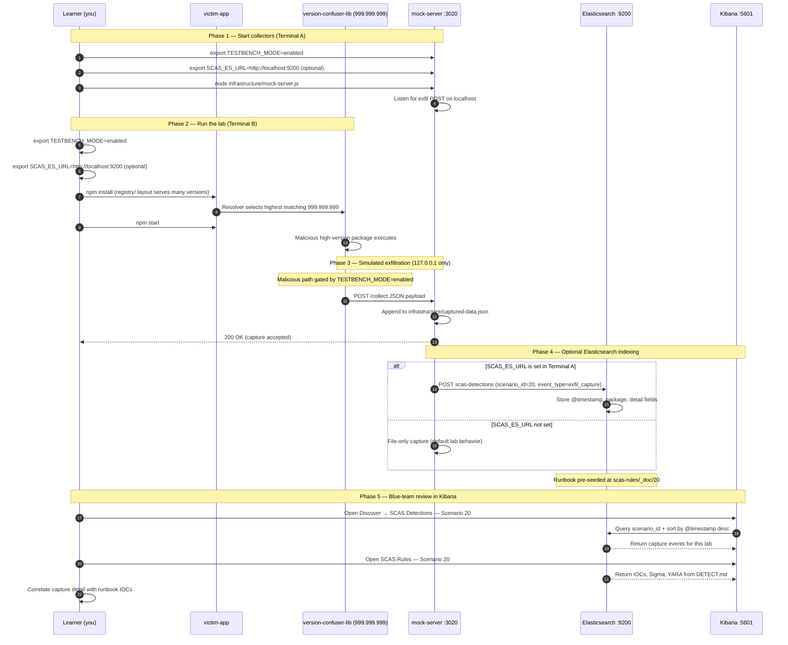

# 🚀 Zero to Hero: Scenario 20 - Package Version Confusion

Welcome! This guide will take you from zero knowledge to successfully completing the Package Version Confusion attack scenario. We'll go step by step, explaining everything along the way.

## 📚 What You'll Learn

By the end of this guide, you will:
- Understand how semver resolution and "highest version wins" can be abused
- Learn the difference between version confusion and dependency confusion
- Execute a version confusion simulation (safely)
- Inspect resolver output and installed version artifacts
- Run detection tools and conduct forensic investigation
- Implement pinning, lockfile, and registry controls

---

## Part 1: Understanding Version Confusion (15 minutes)

### What Is Version Confusion?

**Version confusion** occurs when a package manager's resolver selects an **unintended version**—often the **highest** semver match—because of loose ranges, weak registry policy, or attacker-published absurd versions.

**Classic pattern in this lab**:
```
Registry contains:
  version-confuser-lib@1.0.1   (benign)
  version-confuser-lib@999.999.999   (malicious)

Victim range: "*" or "highest wins"
Resolver picks: 999.999.999  ← attacker wins
```

### How Semver Resolution Works

Semver compares major.minor.patch numerically:
```
1.0.1  <  999.999.999
```

When a range like `*` or a loose caret allows any version, the resolver typically selects the **maximum** satisfying version. Attackers exploit this by publishing implausibly high versions.

### Version Confusion vs Dependency Confusion

| Aspect | Version Confusion (this lab) | Dependency Confusion (Scenario 2) |
|--------|------------------------------|----------------------------------|
| **Mechanism** | Same package name, higher semver | Public registry wins over private scope |
| **Registry** | Local/custom registry layout | Public npm vs internal Artifactory |
| **Range trigger** | `*`, loose semver | Missing scope + public typosquat |
| **Attacker action** | Publish `999.x` version | Publish same name on public registry |

Both abuse **trust in the resolver**—but the root cause and fix differ.

### Visual Example

```
registry/
└── version-confuser-lib/
    ├── 1.0.1/          ← Expected benign release
    │   ├── index.js
    │   └── package.json
    └── 999.999.999/    ← Malicious high version
        ├── index.js    ← Exfiltrates on load
        └── package.json

victim-app/
├── index.js            ← Simulates resolver (picks highest)
└── installed-version.json   ← Records what was chosen
```

### Why Version Confusion Is Risky

1. **Silent upgrade**: Teams expect `1.x` but get `999.x`
2. **Range permissiveness**: `*` and broad carets hide the risk
3. **Registry sprawl**: Multiple registries increase precedence bugs
4. **CI automation**: Unpinned CI installs pull latest attacker version nightly
5. **Low attacker cost**: One malicious version publish, many victims

### Real-World Context

- **Malicious high semver** on public registries
- **Custom registries** where internal and external versions collide
- **`latest` tag abuse** and dist-tag manipulation
- **Automated renovate/dependabot** pulling unexpected majors without review

**The Attack Chain**:
```
npm install / npm start
    └── Resolver lists all versions in registry/
            └── Sorts semver → picks 999.999.999
                    └── Malicious code loads → exfil to :3020
```

---

## Part 2: Prerequisites Check (5 minutes)

Before we start, make sure you've completed:

- ✅ Scenario 1 (Typosquatting) — Package naming attacks
- ✅ Scenario 2 (Dependency Confusion) — Registry precedence
- ✅ Node.js 16+ and npm installed
- ✅ TESTBENCH_MODE enabled

Verify your setup:

```bash
node --version
npm --version
echo $TESTBENCH_MODE  # Should output: enabled
```

---

## Part 3: Setting Up Scenario 20 (15 minutes)

### Step 1: Navigate to Scenario Directory

```bash
cd scenarios/20-package-version-confusion
```

### Step 2: Run the Setup Script

```bash
export TESTBENCH_MODE=enabled
./setup.sh
```

**What this does:**
- Prepares mock server on port **3020**
- Initializes `captured-data.json`
- Clears `victim-app/node_modules` for clean resolution
- Prints Terminal A / Terminal B instructions

### Step 3: Understand the Environment

**The Scenario Structure**:
```
20-package-version-confusion/
├── registry/
│   └── version-confuser-lib/
│       ├── 1.0.1/              # Benign version
│       └── 999.999.999/        # Malicious high version
├── victim-app/
│   ├── index.js                # Resolver simulation
│   ├── installed-version.json  # Written at runtime
│   └── package.json
├── infrastructure/
│   ├── mock-server.js          # Port 3020
│   └── captured-data.json
└── detection-tools/
    └── version-confusion-detector.js
```

---

## Part 4: Understanding the Registry Layout (20 minutes)

### Step 1: List Available Versions

```bash
ls -la registry/version-confuser-lib/
```

**Expected directories:**
- `1.0.1` — legitimate release
- `999.999.999` — attacker-controlled high version

### Step 2: Compare Benign vs Malicious Packages

```bash
cat registry/version-confuser-lib/1.0.1/package.json
cat registry/version-confuser-lib/1.0.1/index.js
```

**Benign behavior**: Returns `{ ok: true, version: '1.0.1' }` without network activity.

```bash
cat registry/version-confuser-lib/999.999.999/package.json
cat registry/version-confuser-lib/999.999.999/index.js
```

**Malicious behavior** (when `TESTBENCH_MODE=enabled`):
- POSTs payload to `localhost:3020/collect` on module load
- Reports `selectedVersion: '999.999.999'`

### Step 3: Examine the Victim Resolver

```bash
cat victim-app/index.js
```

**Key logic:**
1. Lists all version directories under `registry/version-confuser-lib/`
2. Sorts by semver comparison
3. Picks **highest** version (`slice(-1)[0]`)
4. Copies chosen version into `node_modules/`
5. Requires package and writes `installed-version.json`

**Simulated risky range**: Comments note this models `"*"` meaning "take the highest."

### Step 4: Review Victim Configuration

```bash
cat victim-app/package.json
```

**Questions:**
- Are dependencies pinned to exact versions?
- Is there a lockfile enforcing resolution?
- Would `npm ci` prevent drift?

### Step 5: Walk Through the Semver Comparator

The victim app implements a simplified semver sort:

```bash
grep -A 15 "function compareSemver" victim-app/index.js
```

**Try mentally sorting these** (as the resolver would):
```
1.0.1  vs  1.0.2   → 1.0.2 wins
1.9.9  vs  2.0.0   → 2.0.0 wins
1.0.1  vs  999.999.999  → 999.999.999 wins  ← attack wins
```

**Key Point**: Without an upper bound in your range policy, any published high version becomes "valid."

### Step 6: Document Expected vs Actual

Before running the attack, predict the outcome:

| Question | Your prediction | After lab |
|----------|-----------------|-----------|
| Which version should a cautious team want? | `1.0.1` | |
| Which version does "highest wins" select? | | |
| Will benign code exfiltrate? | | |

Fill the "After lab" column during Part 5.

---

## Part 5: The Attack - Highest Version Wins (30 minutes)

### Step 1: Understand the Attack Timeline

**Scenario**: Attacker publishes `version-confuser-lib@999.999.999` to a registry the victim uses. Loose semver policy causes resolver to prefer it over `1.0.1`.

**Attack Timeline**:
1. Attacker publishes implausibly high semver
2. Victim runs install/start with permissive range
3. Resolver selects `999.999.999`
4. Malicious module loads and exfiltrates to port **3020**
5. `installed-version.json` records the skew for blue team

### Step 2: Start the Mock Attacker Server

**Terminal A**:

```bash
cd scenarios/20-package-version-confusion
export TESTBENCH_MODE=enabled
node infrastructure/mock-server.js
```

**Verify**:

```bash
curl -s http://localhost:3020/captured-data
```

### Step 3: Run Victim Resolution and Install

**Terminal B**:

```bash
cd scenarios/20-package-version-confusion/victim-app
rm -rf node_modules package-lock.json
npm install
export TESTBENCH_MODE=enabled
npm start
```

**Console output includes**:
```
Available versions: 1.0.1, 999.999.999
Chosen version (highest match): 999.999.999
Installed lib run: { ok: true, version: '999.999.999' }
```

### Step 4: Inspect Resolution Evidence

```bash
cat installed-version.json
```

**Expected content**:
```json
{
  "lib": "version-confuser-lib",
  "chosenVersion": "999.999.999",
  "timestamp": "..."
}
```

```bash
# Confirm malicious code path in node_modules
cat node_modules/version-confuser-lib/package.json | grep version
```

### Step 5: Observe Exfiltration

```bash
curl -s http://localhost:3020/captured-data | jq
```

**Captured fields**:
- `attack`: `package-version-confusion`
- `selectedVersion`: `999.999.999`
- `hostname`, `cwd`, `timestamp`

```bash
cat ../infrastructure/captured-data.json | jq '.captures[-1]'
```

### Step 6: Simulate Mitigation — Pin Exact Version (Optional)

Conceptually, pinning `1.0.1` would prevent the attack:

```json
"dependencies": {
  "version-confuser-lib": "1.0.1"
}
```

In this lab the resolver simulation always picks highest from registry folders—but the **lesson** applies directly to real npm semver ranges.

---

## Part 6: Detection Methods (40 minutes)

### Detection Method 1: Version Confusion Detector

From scenario root:

```bash
cd scenarios/20-package-version-confusion
node detection-tools/version-confusion-detector.js victim-app
```

**What this flags:**
- Suspicious high versions in `installed-version.json`
- Loose semver ranges in `package.json`
- Pinning gaps that enable resolver abuse

### Detection Method 2: Manual Version Audit

```bash
cd victim-app

cat installed-version.json | jq

# Check for absurd semver jumps
node -e "
  const j = require('./installed-version.json');
  const v = j.chosenVersion || '';
  if (v.startsWith('999')) console.log('ALERT: suspicious high version', v);
"
```

### Detection Method 3: Registry Inspection

```bash
ls ../registry/version-confuser-lib/

# In production: audit registry for unexpected high versions
# npm view package-name versions --json
```

### Detection Method 4: Lockfile Enforcement

```bash
# After npm install, lockfile should freeze resolution
test -f package-lock.json && echo "Lockfile present" || echo "NO LOCKFILE — risky"
```

**Policy**: CI must use `npm ci` and fail if lockfile missing or outdated.

### Detection Method 5: Dependency Range Audit

```bash
cd victim-app

# Find wildcard or loose ranges in package.json
node -e "
  const p = require('./package.json');
  const deps = { ...p.dependencies, ...p.devDependencies };
  Object.entries(deps || {}).forEach(([name, range]) => {
    if (range === '*' || range.startsWith('^') || range.startsWith('~'))
      console.log('LOOSE:', name, range);
  });
"
```

**Production policy examples**:
- Block `*` in production `package.json` via lint rule
- Require exact pins for packages tagged `critical` in asset inventory
- Fail CI if lockfile resolution differs from pinned manifest

### Detection Method 6: Sigma and IOC Hunting

**IOCs from `DETECT.md`**:
- Implausibly high resolved version (`999.x`)
- Loose semver range enabling precedence abuse
- Beacons to `127.0.0.1:3020`

**Sample log**:
```json
{"scenario_id":"20","event_type":"version_confusion_resolution","resolved_version":"999.0.0","destination":"127.0.0.1:3020"}
```

**YARA-like strings**: `installed-version.json`, `999.`, `3020`

---

## Part 7: Forensic Investigation (30 minutes)

### Investigation Step 1: Resolution Reconstruction

```bash
cd scenarios/20-package-version-confusion/victim-app

# What versions existed?
ls ../registry/version-confuser-lib/

# What was chosen?
cat installed-version.json

# Resolver logic
head -60 index.js
```

### Investigation Step 2: Package Content Analysis

```bash
cat node_modules/version-confuser-lib/index.js
```

**Questions:**
- Does installed code match expected version's source?
- When was malicious version published (in real incidents: registry metadata)?
- Who approved the semver range that allowed selection?

### Investigation Step 3: Impact Assessment

```bash
# If this were a monorepo, which apps share the dependency?
grep -r "version-confuser-lib" . 2>/dev/null
```

**Questions:**
- How many projects use loose ranges on this package?
- Did CI builds across the org pull `999.x`?
- What secrets exist in processes that `require()` this library?

### Investigation Step 4: Timeline

```bash
cat ../infrastructure/captured-data.json | jq '.captures[] | {timestamp, version: .data.selectedVersion}'
stat installed-version.json
```

---

## Part 8: Incident Response & Mitigation (30 minutes)

### Response Step 1: Immediate Containment

```bash
# Stop victim processes
../../scripts/kill-port.sh 3020

# Remove malicious resolution
cd victim-app
rm -rf node_modules
rm -f installed-version.json
```

### Response Step 2: Pin and Reinstall

```bash
# In production: pin exact version in package.json
# "version-confuser-lib": "1.0.1"

rm -rf node_modules package-lock.json
npm install
export TESTBENCH_MODE=enabled
# Re-run with patched policy / scoped registry
```

### Response Step 3: Long-term Defenses

1. **Pin exact versions** for critical dependencies — no `*` or unbounded carets
2. **Enforce lockfiles** — `npm ci` only in CI; reject installs without lockfile
3. **Registry firewall** — block absurd semver from untrusted publishers
4. **Scoped private packages** — explicit registry mapping for internal names
5. **Version jump alerts** — flag major or numeric anomalies (e.g. `999.x`)
6. **Human review** — require approval for dependency version bumps above threshold

```bash
# CI gate example
node detection-tools/version-confusion-detector.js victim-app
```

---

---

---

## Elasticsearch + Kibana observability (optional)

Scenario **20 — Package Version Confusion** is indexed in Elasticsearch when the observability stack is running.

Version confusion: semver picks version-confuser-lib 999.999.999 over the expected 1.x release.

- **Detection runbook (static)** → index `scas-rules`, document id `20` — IOCs, Sigma, YARA, sample logs from `DETECT.md`
- **Runtime captures (dynamic)** → index `scas-detections` — one document per exfil event when `SCAS_ES_URL` is set before starting the mock collector

### How to read this diagram

| Phase | What you should look for |
|-------|--------------------------|
| **1 — Collectors** | Terminal A starts the mock server (or harvester). Set `SCAS_ES_URL` here if you want live Elasticsearch indexing. |
| **2 — Lab execution** | Terminal B runs the scenario README steps. Numbered arrows follow the attack path in order. |
| **3 — Exfiltration** | Malicious sample sends **localhost-only** JSON to the mock endpoint. Evidence is always written to `infrastructure/` on disk. |
| **4 — Elasticsearch** | When `SCAS_ES_URL` is set, the same capture is indexed into `scas-detections` with `scenario_id` and `event_type=exfil_capture`. |
| **5 — Kibana** | Use the per-scenario saved searches to compare **runtime captures** (Detections) with the **static runbook** (Rules). |

> **Safety:** All network calls stay on `127.0.0.1`. Malicious logic runs only when `TESTBENCH_MODE=enabled`.

### End-to-end flow



### Prerequisites

From the repository root:

```bash
./scripts/elasticsearch-up.sh
./scripts/setup-kibana-data-views.sh   # data views + saved searches for all 22 scenarios
```

### Run this scenario with live Elasticsearch forwarding

**Terminal A — mock collector** (from `scenarios/20-package-version-confusion`):

```bash
cd scenarios/20-package-version-confusion
export TESTBENCH_MODE=enabled
export SCAS_ES_URL=http://localhost:9200
node infrastructure/mock-server.js
```

**Terminal B — execute the lab:**

```bash
cd scenarios/20-package-version-confusion
export TESTBENCH_MODE=enabled
export SCAS_ES_URL=http://localhost:9200
cd victim-app && npm install && npm start
```

### Verify locally (file-based evidence)

```bash
curl -s http://localhost:3020/captured-data
```

### Verify in Elasticsearch (API)

```bash
# Static runbook for this scenario
curl -s "http://localhost:9200/scas-rules/_doc/20?pretty"

# Latest runtime capture events
curl -s "http://localhost:9200/scas-detections/_search?pretty" \
  -H 'Content-Type: application/json' \
  -d '{
    "query": { "term": { "scenario_id": "20" } },
    "sort": [{ "@timestamp": "desc" }],
    "size": 5
  }'
```

### Verify in Kibana (UI)

1. Open [http://localhost:5601](http://localhost:5601)
2. **Discover** → **SCAS Detections — Scenario 20** — live capture timeline (`@timestamp`, `package.name`, `detail`)
3. **Discover** → **SCAS Rules — Scenario 20** — compare against `iocs`, `sigma`, and `yara` fields
4. Ask: *Does each capture field match an IOC or Sigma condition in the runbook?*

See [observability/README.md](../../../observability/README.md) for stack details.

## Part 9: Key Takeaways

### Why Version Confusion Is Dangerous

1. **Resolver trust**: Teams assume semver picks "reasonable" versions
2. **Silent malicious upgrade**: No typosquat needed—same name, higher number
3. **Automation amplification**: CI nightly installs spread bad resolution fast
4. **Detection difficulty**: Installed package name looks correct
5. **Combined with confusion**: Public/private registry issues compound semver abuse

### Best Practices

1. ✅ **Pin exact versions** for production-critical deps
2. ✅ **Commit and enforce lockfiles** with `npm ci`
3. ✅ **Scope internal packages** to private registries explicitly
4. ✅ **Alert on semver anomalies** — first-seen maintainers, `999.x` jumps
5. ✅ **Review dependency PRs** — treat version bumps as security events
6. ✅ **Registry controls** — block publishing above policy max without approval
7. ✅ **Distinguish attack types** — version vs dependency confusion need different controls

### Real-World Impact

- **Wide CI exposure**: Every unpinned pipeline pulls malicious highest version
- **Delayed detection**: Package name matches expectation; version does not
- **Remediation**: Lockfile regeneration, registry takedown requests, org-wide pin audit

---

## Part 10: Advanced Exercises

### Exercise 1: Pinning Tradeoff
- Rewrite one `package.json` dependency from `*` to an exact pinned version and explain the tradeoff (security vs patch agility)

### Exercise 2: Attack Comparison
- Describe how dependency confusion (public vs private) differs from this lab's "highest local version" simulation
- Which control catches each earliest?

### Exercise 3: CI Semver Gate
- Design a policy that blocks semver `> 100.0.0` without human approval
- Outline telemetry needed to detect version confusion at scale

### Exercise 4: Registry Forensics
- Given `installed-version.json` and registry folder layout, write an IR report section explaining root cause and blast radius

---

## 📚 Additional Resources

- [npm semver documentation](https://docs.npmjs.com/about-semantic-versioning)
- [Dependency confusion (Alex Birsan)](https://medium.com/@alex.birsan/dependency-confusion-4a5d60fec610)
- Scenario README: `scenarios/20-package-version-confusion/README.md`
- Detection runbook: `scenarios/20-package-version-confusion/DETECT.md`
- Quick reference: `documentation/scenario-guides/quick-reference/QUICK_REFERENCE_SCENARIO_20.md`

---

## ⚠️ Safety & Ethics

**IMPORTANT**: This scenario is for **educational purposes only**.

- ✅ Use ONLY in isolated test environments
- ✅ Never publish malicious high-version packages to real registries
- ✅ All malicious behavior requires `TESTBENCH_MODE=enabled`
- ✅ Exfiltration targets **127.0.0.1:3020** only — no real external C2
- ✅ Version confusion is simulated with a local registry layout

---

**Remember**: Loose semver ranges are an open invitation. Pin versions, enforce lockfiles, and treat resolver output as untrusted until verified!

🔐 Happy Learning!
