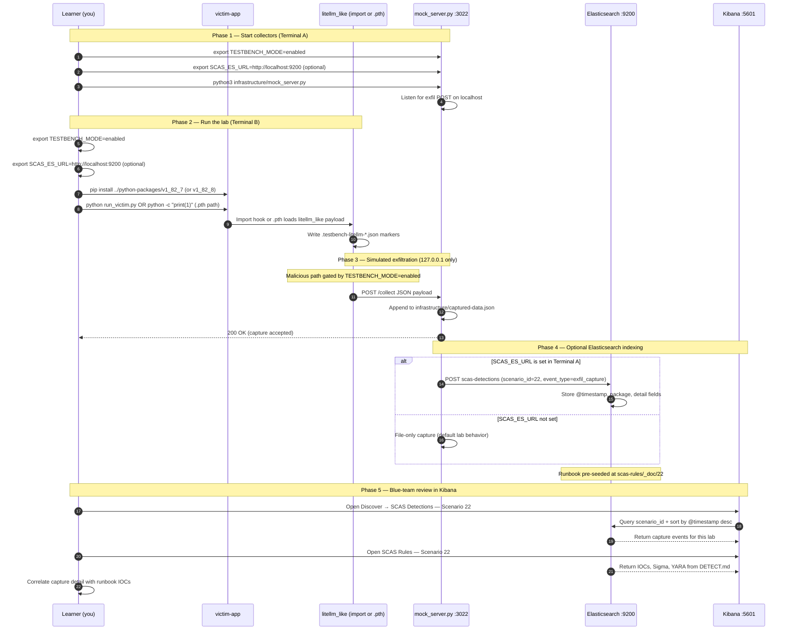

# 🚀 Zero to Hero: Scenario 22 - LiteLLM-style PyPI Compromise

Welcome! This guide will take you from zero knowledge to successfully completing the LiteLLM-style PyPI compromise scenario. We'll go step by step, explaining everything along the way.

**Note**: This lab uses a **fictional** package name `litellm_like` and **127.0.0.1:3022** HTTP only. It models import-time vs `.pth` startup execution patterns inspired by real PyPI incidents—no credential theft or external exfiltration.

## 📚 What You'll Learn

By the end of this guide, you will:
- Compare **import-time** malware vs **`.pth` interpreter startup** hooks
- Understand why `.pth` files can execute code without `import litellm_like`
- Set up and use a Python virtual environment for safe lab execution
- Execute both compromise paths (`1.82.7` and `1.82.8`) safely
- Scan `site-packages` for rogue `.pth` files
- Implement containment, eradication, and recovery for Python supply-chain incidents

---

## Part 1: Understanding PyPI Compromise Patterns (15 minutes)

### Two Execution Models

Real PyPI maintainer compromises have demonstrated two distinct execution paths:

| Path | Version in lab | When code runs | Import required? |
|------|----------------|----------------|------------------|
| **Import-time** | `1.82.7` | `import litellm_like` | ✅ Yes |
| **`.pth` startup** | `1.82.8` | Any Python process starts | ❌ No |

Both can exfiltrate, persist, or steal credentials in real incidents. This lab only writes marker JSON and POSTs to **127.0.0.1:3022**.

### What Is a `.pth` File?

Python's `site` module processes `*.pth` files in `site-packages` at **interpreter startup**. A `.pth` line can:

```
import litellm_like_pth_hook
```

That means **every** `python` invocation in that venv loads the hook—even `python -c "print(1)"`.

### Visual Example

```
python-packages/
├── v1_82_6/    # Clean baseline (1.82.6)
├── v1_82_7/    # Import trigger in litellm_like/__init__.py
└── v1_82_8/    # Installs zzz_testbench_litellm_like.pth → litellm_like_pth_hook.py

victim-app/
├── .venv/                  # Required — isolated Python environment
├── run_victim.py           # import litellm_like (path A)
├── .testbench-litellm-import.json   # Marker from 1.82.7
└── .testbench-litellm-pth.json      # Marker from 1.82.8

infrastructure/
└── mock_server.py          # Port 3022, POST /collect
```

### Why `.pth` Is Especially Dangerous

1. **No import needed**: Short scripts, linters, and CI steps trigger payload
2. **Early execution**: Runs before application security hooks in some setups
3. **Low visibility**: `.pth` files are rarely reviewed by developers
4. **Persistence feel**: Stays in site-packages until venv rebuild
5. **Harder EDR correlation**: No obvious `import litellm_like` in process logs

### Import-Time vs `.pth` — Detection Asymmetry

**Import-time (`1.82.7`)**:
- Visible in import traces, dependency scanners that analyze package code
- Blocked if app never imports the package (until something else does)

**`.pth` startup (`1.82.8`)**:
- Runs on any Python in the venv
- May evade import-focused monitoring
- Requires **site-packages filesystem** and startup hook scanning

### Real-World Context

- PyPI maintainer account takeover on popular AI/ML libraries
- Community advisories (GHSA) documenting import vs startup hook variants
- Vendor analyses linked from [GitHub issue #4](https://github.com/RAJANAGORI/supply-chain-attack-simulator/issues/4)

**The Attack Chain (Path B — `.pth`)**:
```
pip install litellm_like==1.82.8  (TESTBENCH_MODE=enabled)
    └── Installs zzz_testbench_litellm_like.pth in site-packages
            └── python -c "print('hello')"
                    └── site module loads .pth → hook runs → POST :3022
```

---

## Part 2: Prerequisites Check (5 minutes)

Before we start, make sure you have:

- ✅ Python 3.8+ installed
- ✅ `pip` and `venv` available
- ✅ TESTBENCH_MODE enabled
- ✅ Basic familiarity with virtual environments

Verify your setup:

```bash
python3 --version
pip --version
echo $TESTBENCH_MODE  # Should output: enabled
```

**Important**: This scenario **requires a venv**. Setup creates `victim-app/.venv` — always activate before pip install or python commands.

---

## Part 3: Setting Up Scenario 22 (15 minutes)

### Step 1: Navigate to Scenario Directory

```bash
cd scenarios/22-litellm-pypi-compromise
```

### Step 2: Run the Setup Script

```bash
export TESTBENCH_MODE=enabled
chmod +x setup.sh
./setup.sh
```

**What this does:**
- Creates `victim-app/.venv` Python virtual environment
- Prepares `infrastructure/mock_server.py` on port **3022**
- Initializes capture storage
- Prints instructions for import path and `.pth` path

### Step 3: Understand the Environment

**Release table**:

| Path | Version | Behavior |
|------|---------|----------|
| `python-packages/v1_82_6` | `1.82.6` | Clean — no malicious behavior |
| `python-packages/v1_82_7` | `1.82.7` | Import trigger in `__init__.py` |
| `python-packages/v1_82_8` | `1.82.8` | Adds `.pth` hook at install time |

**Mock server**:
- Python script: `infrastructure/mock_server.py`
- Port: **3022**
- Endpoint: **`POST /collect`**

---

## Part 4: Understanding the Package Structure (20 minutes)

### Step 1: Examine the Clean Baseline

```bash
cat python-packages/v1_82_6/litellm_like/__init__.py
```

**What you'll see**: Normal package initialization — no testbench triggers.

### Step 2: Examine Import-Time Payload (1.82.7)

```bash
cat python-packages/v1_82_7/litellm_like/__init__.py
```

**Behavior when `TESTBENCH_MODE=enabled`**:
1. Writes `victim-app/.testbench-litellm-import.json`
2. POSTs JSON to `http://127.0.0.1:3022/collect`
3. Runs at **import** time via `_import_trigger()` at module load

**Offline mode**: `TESTBENCH_OFFLINE=1` skips marker and network.

### Step 3: Examine `.pth` Payload (1.82.8)

```bash
cat python-packages/v1_82_8/setup.py
cat python-packages/v1_82_8/litellm_like_pth_hook.py
```

**Behavior**:
- Install with `TESTBENCH_MODE=enabled` drops `zzz_testbench_litellm_like.pth` into site-packages
- `.pth` imports `litellm_like_pth_hook` at interpreter startup
- Hook writes `.testbench-litellm-pth.json` and POSTs to mock server

### Step 4: Examine Victim Application

```bash
cat victim-app/run_victim.py
```

**What it does**: Imports `litellm_like` — triggers **1.82.7** path only.

```bash
ls -la victim-app/.venv/bin/activate
# venv required for all lab commands
```

### Step 5: Verify Virtual Environment Isolation

```bash
cd victim-app
source .venv/bin/activate
which python
which pip
python -c "import sys; print(sys.prefix)"
```

**Expected**: All paths point inside `victim-app/.venv/`

**Never do this in the lab**:
```bash
# BAD — installs into system Python
# pip install ../python-packages/v1_82_7
```

**Why venv matters**: Compromised packages and `.pth` files stay scoped to the lab environment and are removed with `rm -rf .venv`.

### Step 6: Baseline with Clean Version (Optional)

Before attack paths, confirm clean behavior:

```bash
source .venv/bin/activate
pip install ../python-packages/v1_82_6
python -c "import litellm_like; print(litellm_like.__version__)"
```

**Expected**: `1.82.6`, no marker files, no captures on mock server.

```bash
test ! -f .testbench-litellm-import.json && test ! -f .testbench-litellm-pth.json && echo "Clean baseline OK"
```

---

## Part 5: The Attack - Two Compromise Paths (40 minutes)

### Path A: Import-Time Trigger (1.82.7)

#### Step 1: Start Mock Collector

**Terminal A**:

```bash
cd scenarios/22-litellm-pypi-compromise
export TESTBENCH_MODE=enabled
python3 infrastructure/mock_server.py
```

**Verify**:

```bash
curl -s http://127.0.0.1:3022/captured-data
```

#### Step 2: Install and Run Import Trigger

**Terminal B**:

```bash
cd scenarios/22-litellm-pypi-compromise/victim-app
source .venv/bin/activate
pip install -U ../python-packages/v1_82_7
export TESTBENCH_MODE=enabled
python run_victim.py
```

**What happens**:
1. `litellm_like` imports → `__init__.py` runs `_import_trigger()`
2. Marker written: `.testbench-litellm-import.json`
3. POST to `127.0.0.1:3022/collect`

#### Step 3: Verify Import-Path Evidence

```bash
cat .testbench-litellm-import.json
curl -s http://127.0.0.1:3022/captured-data | jq
```

---

### Path B: `.pth` Startup Hook (1.82.8)

#### Step 4: Switch to `.pth` Version

**Still in Terminal B** (venv activated):

```bash
pip uninstall -y litellm_like
export TESTBENCH_MODE=enabled
pip install ../python-packages/v1_82_8
```

**Critical**: `TESTBENCH_MODE=enabled` **during install** — hook `.pth` is only added when install runs with flag set.

#### Step 5: Trigger Without Importing Package

```bash
python -c "print('hello')"
```

**No `import litellm_like` needed!** The `.pth` file loads at startup.

#### Step 6: Verify `.pth`-Path Evidence

```bash
cat .testbench-litellm-pth.json

# Find the .pth file in site-packages
python -c "import site; print(site.getsitepackages())"
find .venv -name "*.pth" -exec echo '---' \; -exec cat {} \;
```

**Expected**: `zzz_testbench_litellm_like.pth` referencing `litellm_like_pth_hook`

```bash
curl -s http://127.0.0.1:3022/captured-data | jq '.captures'
```

#### Step 7: Compare Path A vs Path B

| Indicator | Import (1.82.7) | `.pth` (1.82.8) |
|-----------|-----------------|-----------------|
| Trigger | `python run_victim.py` | Any `python` command |
| Marker file | `.testbench-litellm-import.json` | `.testbench-litellm-pth.json` |
| site-packages | No rogue `.pth` | `zzz_testbench_litellm_like.pth` |
| Import required | Yes | No |

---

## Part 6: Detection Methods (40 minutes)

### Detection Method 1: LiteLLM PTH Scanner

From scenario root with venv activated:

```bash
cd scenarios/22-litellm-pypi-compromise
source victim-app/.venv/bin/activate
python detection-tools/litellm_pth_scanner.py
```

**What this flags:**
- Unexpected `.pth` files in site-packages
- Suspicious import lines pointing to hook modules
- IOC strings like `litellm_like_pth_hook`, `zzz_testbench_litellm_like.pth`

### Detection Method 2: Manual site-packages Triage

```bash
source victim-app/.venv/bin/activate
SITE=$(python -c "import site; print(site.getsitepackages()[0])")
ls -la "$SITE"/*.pth 2>/dev/null || echo "No .pth files"

grep -r "litellm_like" "$SITE" 2>/dev/null | head -20
```

**Red flags:**
- New `.pth` files after package upgrade
- `.pth` lines with `import` statements (not just path additions)
- Alphabetically early names like `zzz_*` to load last/first strategically

### Detection Method 3: Marker File Hunt

```bash
cd victim-app
ls -la .testbench-litellm-*.json 2>/dev/null
cat .testbench-litellm-import.json 2>/dev/null
cat .testbench-litellm-pth.json 2>/dev/null
```

### Detection Method 4: Network and Log Hunting

**IOCs from `DETECT.md`**:
- Beacon to `127.0.0.1:3022`
- Marker files `.testbench-litellm-*.json`
- `.pth` content containing `litellm_like_pth_hook`

**Sample log**:
```json
{"scenario_id":"22","event_type":"python_startup_hook_exec","source":"litellm_like_pth_hook","destination":"127.0.0.1:3022"}
```

### Detection Method 5: Version Pinning Audit

```bash
pip show litellm_like
pip freeze | grep litellm
```

**Policy**: Pin `litellm_like==1.82.6` (clean) or verified hash; block unpinned `-U` upgrades in CI.

### Detection Method 6: pip Install Reproducibility

```bash
source victim-app/.venv/bin/activate
pip freeze > /tmp/before-freeze.txt
# ... run lab ...
pip freeze > /tmp/after-freeze.txt
diff /tmp/before-freeze.txt /tmp/after-freeze.txt
```

**Look for**: Unexpected version bumps or new packages after a single `pip install -U`.

### Detection Method 7: Import vs Startup Process Comparison

Run both paths and compare process behavior conceptually:

| Observation | Import path (1.82.7) | `.pth` path (1.82.8) |
|-------------|----------------------|----------------------|
| `python -c "print(1)"` triggers payload? | No | **Yes** |
| `python run_victim.py` triggers payload? | Yes | Yes (via .pth) |
| Rogue `.pth` in site-packages? | No | Yes |
| Marker file | `.testbench-litellm-import.json` | `.testbench-litellm-pth.json` |

**Enterprise lesson**: EDR rules that only alert on `import litellm_like` miss the `.pth` path entirely.

---

## Part 7: Forensic Investigation (30 minutes)

### Investigation Step 1: Environment Reconstruction

```bash
source victim-app/.venv/bin/activate
which python
pip freeze
pip show litellm_like
```

**Questions:**
- Which version is installed?
- When was venv last recreated?
- Is this venv shared across projects (dangerous)?

### Investigation Step 2: Startup Hook Analysis

```bash
find victim-app/.venv -name "*.pth" -print -exec cat {} \;
```

**Questions:**
- Which `.pth` files exist beyond this lab's IOC name?
- Do they contain `import` lines?
- Who created them (install timestamp vs package version)?

### Investigation Step 3: Import-Path Analysis

```bash
cat python-packages/v1_82_7/litellm_like/__init__.py
```

**Questions:**
- Would static analysis of PyPI tarball catch import-time side effects?
- Does package `__init__.py` perform network I/O at import?

### Investigation Step 4: Timeline and Impact

```bash
cat infrastructure/captured-data.json | jq
ls -la victim-app/.testbench-litellm-*.json
```

**Build timeline**:
- When was `1.82.8` installed with TESTBENCH flag?
- Which CI jobs ran `python` without explicit AI library import?
- What API keys existed in environment variables during those runs?

---

## Part 8: Incident Response & Mitigation (30 minutes)

### Response Step 1: Immediate Containment

```bash
# Stop workloads using compromised venv
../../scripts/kill-port.sh 3022

cd victim-app
deactivate 2>/dev/null || true
# Do not run further python in this venv
```

### Response Step 2: Eradication

```bash
cd scenarios/22-litellm-pypi-compromise/victim-app

# Remove compromised package
source .venv/bin/activate
pip uninstall -y litellm_like

# Nuclear option: delete entire venv and rebuild
deactivate
rm -rf .venv
python3 -m venv .venv
source .venv/bin/activate
pip install ../python-packages/v1_82_6   # known-good pin
```

**Verify no rogue `.pth` remains**:

```bash
find .venv -name "*.pth" 2>/dev/null
python detection-tools/litellm_pth_scanner.py
```

### Response Step 3: Recovery and Long-term Defenses

1. **Pin known-good version**: `litellm_like==1.82.6` in locked requirements
2. **Hash pinning**: Use `pip-tools` / Poetry lock with integrity hashes
3. **Vetting critical AI/ML deps**: Manual review for `__init__.py` side effects and `.pth`
4. **Scan site-packages in CI**: Run `.pth` scanner after every `pip install`
5. **Separate venvs per project**: Never share site-packages across apps
6. **Rotate secrets**: PyPI tokens, API keys (real incidents — lab has no secrets)

```bash
# Example pinned install
pip install litellm_like==1.82.6 --no-deps  # after verifying package integrity
```

### Response Step 4: Monitoring Strategy

- File integrity monitoring on `site-packages/*.pth`
- EDR rules for Python startup importing unknown modules from site-packages
- Alert on pip install of unpinned ML libraries in CI

---

---

---

## Mitigation Playbook

Canonical prevention and mitigation controls (aligned with the [scenario README](../../../scenarios/22-litellm-pypi-compromise/README.md)). Lab walkthroughs above expand each control with hands-on steps.

- Contain: stop workloads using the compromised virtualenv; block egress from CI if needed.
- Eradicate: `pip uninstall`, delete `.venv`, remove rogue `*.pth` under `site-packages`.
- Recover: pin known-good version (`litellm_like==1.82.6`); enforce hash pinning or vetting.
- Rotate: API keys and PyPI maintainer tokens after confirmed incidents.
- Scan `site-packages/*.pth` in CI after every `pip install`.

---

## Elasticsearch + Kibana observability (optional)

Scenario **22 — LiteLLM-style PyPI Compromise** is indexed in Elasticsearch when the observability stack is running.

LiteLLM-style PyPI: litellm_like exfil on import (1.82.7) or via .pth at interpreter startup (1.82.8).

- **Detection runbook (static)** → index `scas-rules`, document id `22` — IOCs, Sigma, YARA, sample logs from `DETECT.md`
- **Runtime captures (dynamic)** → index `scas-detections` — one document per exfil event when `SCAS_ES_URL` is set before starting the mock collector

### How to read this diagram

| Phase | What you should look for |
|-------|--------------------------|
| **1 — Collectors** | Terminal A starts the mock server (or harvester). Set `SCAS_ES_URL` here if you want live Elasticsearch indexing. |
| **2 — Lab execution** | Terminal B runs the scenario README steps. Numbered arrows follow the attack path in order. |
| **3 — Exfiltration** | Malicious sample sends **localhost-only** JSON to the mock endpoint. Evidence is always written to `infrastructure/` on disk. |
| **4 — Elasticsearch** | When `SCAS_ES_URL` is set, the same capture is indexed into `scas-detections` with `scenario_id` and `event_type=exfil_capture`. |
| **5 — Kibana** | Use the per-scenario saved searches to compare **runtime captures** (Detections) with the **static runbook** (Rules). |

> **Safety:** All network calls stay on `127.0.0.1`. Malicious logic runs only when `TESTBENCH_MODE=enabled`.

### End-to-end flow



### Prerequisites

From the repository root:

```bash
./scripts/elasticsearch-up.sh
./scripts/setup-kibana-data-views.sh   # data views + saved searches for all 22 scenarios
```

### Run this scenario with live Elasticsearch forwarding

**Terminal A — mock collector** (from `scenarios/22-litellm-pypi-compromise`):

```bash
cd scenarios/22-litellm-pypi-compromise
export TESTBENCH_MODE=enabled
export SCAS_ES_URL=http://localhost:9200
python3 infrastructure/mock_server.py
```

**Terminal B — execute the lab:**

```bash
cd scenarios/22-litellm-pypi-compromise
export TESTBENCH_MODE=enabled
export SCAS_ES_URL=http://localhost:9200
cd victim-app && source .venv/bin/activate && pip install -U ../python-packages/v1_82_7 && python run_victim.py
```

### Verify locally (file-based evidence)

```bash
curl -s http://127.0.0.1:3022/captured-data
```

### Verify in Elasticsearch (API)

```bash
# Static runbook for this scenario
curl -s "http://localhost:9200/scas-rules/_doc/22?pretty"

# Latest runtime capture events
curl -s "http://localhost:9200/scas-detections/_search?pretty" \
  -H 'Content-Type: application/json' \
  -d '{
    "query": { "term": { "scenario_id": "22" } },
    "sort": [{ "@timestamp": "desc" }],
    "size": 5
  }'
```

### Verify in Kibana (UI)

1. Open [http://localhost:5601](http://localhost:5601)
2. **Discover** → **SCAS Detections — Scenario 22** — live capture timeline (`@timestamp`, `package.name`, `detail`)
3. **Discover** → **SCAS Rules — Scenario 22** — compare against `iocs`, `sigma`, and `yara` fields
4. Ask: *Does each capture field match an IOC or Sigma condition in the runbook?*

See [observability/README.md](../../../observability/README.md) for stack details.

## Part 9: Key Takeaways

### Why PyPI Compromise Is Dangerous

1. **Import-time execution**: Single import compromises process
2. **`.pth` stealth**: Runs without explicit package import
3. **AI/ML stack risk**: High-value API keys in developer/CI environments
4. **venv persistence**: Malware survives until environment rebuild
5. **Detection gaps**: Import-only monitoring misses startup hooks

### Best Practices

1. ✅ **Use dedicated venvs** — rebuild from locked requirements after incidents
2. ✅ **Scan `site-packages/*.pth`** — treat new files as high severity
3. ✅ **Pin versions and hashes** — no blind `pip install -U` in CI
4. ✅ **Review `__init__.py`** — flag network I/O at import time
5. ✅ **Monitor all Python invocations** in CI, not just app entrypoints
6. ✅ **Rotate credentials** after confirmed PyPI compromise advisories
7. ✅ **Mirror/vet critical packages** through internal PyPI proxy

### Import-Time vs `.pth` — Which Is Harder to Detect?

**`.pth` startup** is generally harder in enterprise Python fleets because:
- No import statement appears in application source
- Linters, importers, and dependency graphs may miss it
- Short-lived CI commands still trigger payload

**Import-time** is easier when:
- You monitor imports or run static analysis on installed packages
- App never imports the library (until a transitive does)

---

## Part 10: Advanced Exercises

### Exercise 1: Detection Asymmetry
- Describe when **`.pth`** is more dangerous than **import-time** payloads for security monitoring
- List two EDR/data sources that catch each path

### Exercise 2: Install Policy
- Write a one-line **`pip install`** policy your team would use for critical AI dependencies
- Include pin, hash, and approval requirements

### Exercise 3: Enterprise Scanning
- Design a weekly cron job that scans all developer machines for rogue `.pth` files
- What false positives would you expect?

### Exercise 4: Clean Recovery
- Document step-by-step recovery from `.pth` compromise without rebooting the host
- When is venv deletion insufficient?

---

## 📚 Additional Resources

- [GitHub issue #4 — scenario inspiration](https://github.com/RAJANAGORI/supply-chain-attack-simulator/issues/4)
- [Python site module — `.pth` files](https://docs.python.org/3/library/site.html)
- [PEP 668 — externally managed environments](https://peps.python.org/pep-0668/)
- Scenario README: `scenarios/22-litellm-pypi-compromise/README.md`
- Detection runbook: `scenarios/22-litellm-pypi-compromise/DETECT.md`
- Quick reference: `documentation/scenario-guides/quick-reference/QUICK_REFERENCE_SCENARIO_22.md`

---

## ⚠️ Safety & Ethics

**IMPORTANT**: This scenario is for **educational purposes only**.

- ✅ Use ONLY in isolated test environments
- ✅ Fictional `litellm_like` package — not the real LiteLLM project
- ✅ All malicious behavior requires `TESTBENCH_MODE=enabled`
- ✅ Exfiltration targets **127.0.0.1:3022** only — no real external C2
- ✅ Always use the provided `.venv` — never install test packages into system Python
- ✅ Do not reuse patterns against systems you do not own

---

**Remember**: Python supply-chain defense requires site-packages filesystem monitoring—not just import analysis. Rebuild venvs, scan `.pth` files, and pin your AI stack!

🔐 Happy Learning!
