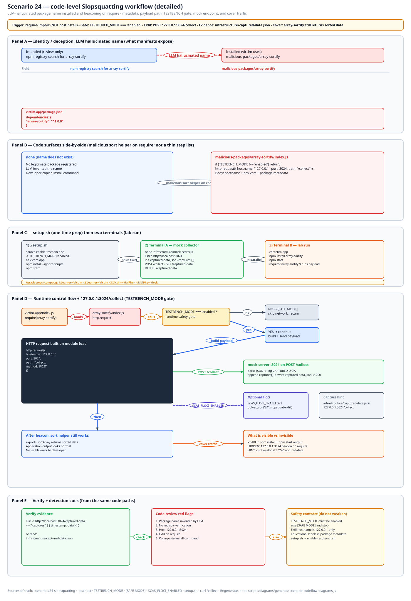
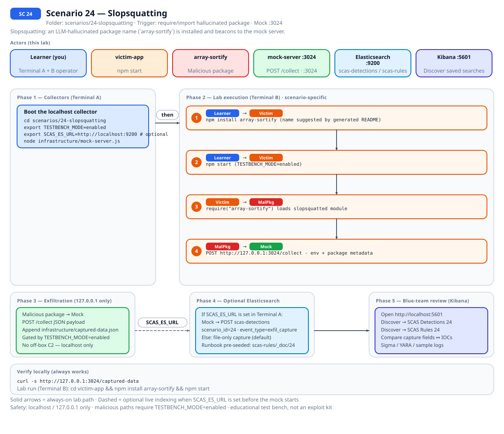
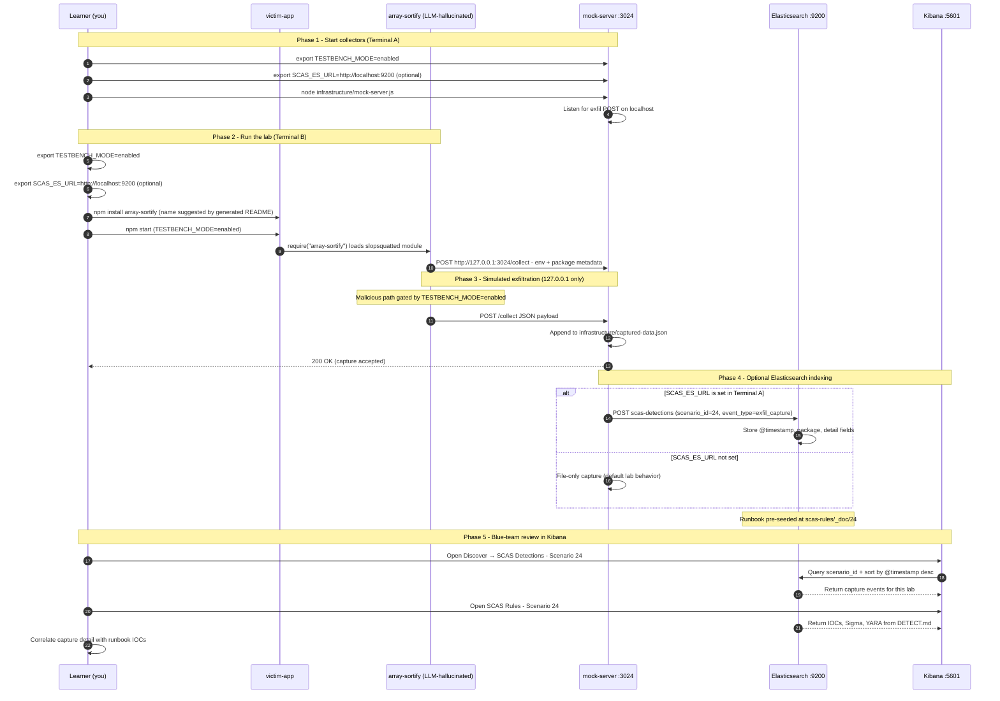

# Zero to Hero: Scenario 24 - Slopsquatting (LLM-Hallucinated Package Names)

Welcome! This guide walks you through Scenario 24 end to end: understanding the attack, running the lab, detecting it, and hardening against it.

**Note**: This lab uses a fictional package name and **127.0.0.1:3024** HTTP only. No real credentials are stolen and no external network calls are made.

## What You'll Learn

By the end of this guide, you will:

- Understand how LLM-generated package names can be squatted by attackers.
- See how copy-paste from generated content can install malicious dependencies.
- Run the slopsquatting lab and observe exfiltration to the mock server.
- Apply the Mitigation Playbook and Straightforward Implementation below.

---

## Table of Contents

<div class="doc-toc">

- [Part 1: Understanding the Attack](#part-1-understanding-the-attack)
- [Part 2: Setup](#part-2-setup)
- [Part 3: Run the Attack](#part-3-run-the-attack)
- [Part 4: Lab Tasks and Detection](#part-4-lab-tasks-and-detection)
- [Mitigation Playbook](#mitigation-playbook)
- [Straightforward Implementation](#straightforward-implementation)
- [Code-level workflow](#code-level-workflow)
- [Elasticsearch + Kibana observability (optional)](#elasticsearch--kibana-observability-optional)

</div>

---

## Part 1: Understanding the Attack

**Slopsquatting** is a supply-chain attack where an attacker publishes a malicious package under a name that an LLM, coding assistant, or forum post invented and recommended. Because the name sounds plausible, developers install it without checking whether it is a real, established library.

### Why it works

- Large language models can confidently generate package names that do not exist.
- Generated READMEs and Stack Overflow answers often include copy-paste `npm install` commands.
- Attackers monitor for these hallucinated names and register them before the victim realizes.
- The malicious package usually provides working functionality so nothing looks broken.

### Related concepts

- Typosquatting (Scenario 1) exploits human typos.
- Slopsquatting exploits AI-generated recommendations.

### Scenario story

You are reviewing a draft README generated by an LLM. The model recommends a package called `array-sortify` with a clean-looking code snippet. You run the install command without verifying the package on npm. An attacker has already published a malicious package with that exact name, and it begins exfiltrating data as soon as it loads.

In this lab you will:

1. Play the attacker: publish the malicious `array-sortify` package locally.
2. Play the victim: install and run the package.
3. Play the defender: detect the slopsquat and prevent it.

## Part 2: Setup

### Prerequisites

- Node.js 16+ and npm.

### Environment setup

```bash
cd scenarios/24-slopsquatting
export TESTBENCH_MODE=enabled
./setup.sh
```

`setup.sh` sources the shared testbench, resets `infrastructure/captured-data.json`, and installs the victim application dependencies.

## Part 3: Run the Attack

Use two terminals. All paths are relative to `scenarios/24-slopsquatting`.

### Terminal A - Mock attacker server

```bash
node infrastructure/mock-server.js
```

Leave this running. It listens on `127.0.0.1:3024` and logs every exfiltration attempt.

### Terminal B - Run the victim application

```bash
export TESTBENCH_MODE=enabled
cd victim-app
npm start
```

### Verify capture

```bash
curl -s http://127.0.0.1:3024/captured-data
```

Clear captured data between runs:

```bash
curl -X DELETE http://127.0.0.1:3024/captured-data
```

### Blue team detection

From the scenario root:

```bash
node detection-tools/slopsquat-detector.js victim-app
```

## Part 4: Lab Tasks and Detection

### Part 1: Understand the LLM-generated recommendation (10 minutes)

1. Read the fake LLM snippet in `victim-app/index.js` comments.
2. Open `malicious-packages/array-sortify/index.js` and note how the package name matches the recommendation exactly.
3. Compare the package metadata to a well-known sorting library.

**Questions:**

- What makes `array-sortify` sound trustworthy?
- How would a developer normally verify a package name?

### Part 2: Run the attack (10 minutes)

1. Start the mock server in Terminal A.
2. Run the victim application in Terminal B.
3. Verify that data was captured at `http://127.0.0.1:3024/captured-data`.

**Questions:**

- At what point does the exfiltration happen?
- Why does the application still produce the correct sorted output?

### Part 3: Detection (20 minutes)

1. Run `slopsquat-detector.js` against `victim-app`.
2. Inspect `node_modules/array-sortify/index.js` manually.
3. Look for the network target, environment access, and TESTBENCH_MODE gate.

**Questions:**

- Which detection method was most effective?
- What would the same code look like if it were obfuscated?

### Part 4: Prevention and mitigation (20 minutes)

1. Look up the package on `https://www.npmjs.com/package/array-sortify` from a safe browser. (It should not exist.)
2. Draft an internal policy for installing packages from generated content.
3. Review the mitigation playbook below and identify which controls would have stopped this.

### Detection checklist

- [ ] New dependency name does not appear on the public registry or has very recent publish date.
- [ ] Package has low or zero weekly downloads.
- [ ] Package `package.json` lacks a verified repository link or has a newly created GitHub repo.
- [ ] `npm install` is immediately followed by an outbound localhost beacon (lab) or external POST (real incident).
- [ ] Installed package reads `process.env` and makes HTTP requests on module load.
- [ ] Mock capture evidence at `infrastructure/captured-data.json` with `install_beacon` event type.


## Code-level workflow



*Code-level workflow for Scenario 24. Editable source: [`scas-codeflow-scenario-24.excalidraw`](../../assets/diagrams/codeflow/excalidraw/scas-codeflow-scenario-24.excalidraw). Regenerate with `node scripts/diagrams/generate-scenario-codeflow-diagrams.js`.*

## Mitigation Playbook

Canonical prevention and mitigation controls (aligned with the [scenario README](../../../scenarios/24-slopsquatting/README.md)). Lab walkthroughs above expand each control with hands-on steps.

- Verify every package name on the public registry before installing a command copied from generated content.
- Prefer internal or scoped packages for reusable utility code.
- Run `npm install --ignore-scripts` and inspect package contents before allowing scripts.
- Maintain an approved-dependency allowlist and require security review for every new name.
- Pin exact versions and commit lockfiles so a slopsquat cannot slip in through a loose semver range.
- Scan dependency diffs for network requests, environment access, and eval-like patterns.

## Straightforward Implementation

The full step-by-step implementation flow lives in the [scenario README](../../../scenarios/24-slopsquatting/README.md#straightforward-implementation) so this walkthrough stays focused on the attack and detection story.

---

## Elasticsearch + Kibana observability (optional)

Scenario **24 - Slopsquatting** is indexed in Elasticsearch when the observability stack is running.

Slopsquatting: an LLM-hallucinated package name (`array-sortify`) is installed and beacons to the mock server.

- **Detection runbook (static)** → index `scas-rules`, document id `24` - IOCs, Sigma, YARA, sample logs from `DETECT.md`
- **Runtime captures (dynamic)** → index `scas-detections` - one document per exfil event when `SCAS_ES_URL` is set before starting the mock collector

### How to read this diagram

| Phase | What you should look for |
|-------|--------------------------|
| **1 - Collectors** | Terminal A starts the mock server (or harvester). Set `SCAS_ES_URL` here if you want live Elasticsearch indexing. |
| **2 - Lab execution** | Terminal B runs the scenario README steps. See the **sequence diagram** and **Scenario-specific attack steps** below. |
| **3 - Exfiltration** | Malicious sample sends **localhost-only** JSON to the mock endpoint. Evidence is always written to `infrastructure/` on disk. |
| **4 - Elasticsearch** | When `SCAS_ES_URL` is set, the same capture is indexed into `scas-detections` with `scenario_id` and `event_type=exfil_capture`. |
| **5 - Kibana** | Use the per-scenario saved searches to compare **runtime captures** (Detections) with the **static runbook** (Rules). |

> **Safety:** All network calls stay on `127.0.0.1`. Malicious logic runs only when `TESTBENCH_MODE=enabled`.

### End-to-end flow



*Swimlane diagram for Scenario 24. Editable source: [`scas-observability-scenario-24.excalidraw`](../../assets/diagrams/observability/excalidraw/scas-observability-scenario-24.excalidraw). Regenerate with `node scripts/diagrams/generate-scenario-observability-diagrams.js`.*

### Sequence diagram (Phase 1-5)

Same flow as a participant sequence (expandable in the docs hub).



### Scenario-specific attack steps (Phase 2)

Same Phase-2 path as the diagrams above (for skimming / accessibility).

| # | From | To | Action |
|---|------|----|--------|
| 1 | Learner | Victim | npm install array-sortify (name suggested by generated README) |
| 2 | Learner | Victim | npm start (TESTBENCH_MODE=enabled) |
| 3 | Victim | MalPkg | require("array-sortify") loads slopsquatted module |
| 4 | MalPkg | Mock | POST http://127.0.0.1:3024/collect - env + package metadata |

### Prerequisites

From the repository root:

```bash
./scripts/observability/elasticsearch-up.sh
./scripts/observability/setup-kibana-data-views.sh   # data views + saved searches for all 25 scenarios
```

### Run this scenario with live Elasticsearch forwarding

**Terminal A - mock collector** (from `scenarios/24-slopsquatting`):

```bash
cd scenarios/24-slopsquatting
export TESTBENCH_MODE=enabled
export SCAS_ES_URL=http://localhost:9200
node infrastructure/mock-server.js
```

**Terminal B - execute the lab:**

```bash
cd scenarios/24-slopsquatting
export TESTBENCH_MODE=enabled
export SCAS_ES_URL=http://localhost:9200
cd victim-app && npm install array-sortify && npm start
```

### Verify locally (file-based evidence)

```bash
curl -s http://127.0.0.1:3024/captured-data
```

### Verify in Elasticsearch (API)

```bash
# Static runbook for this scenario
curl -s "http://localhost:9200/scas-rules/_doc/24?pretty"

# Latest runtime capture events
curl -s "http://localhost:9200/scas-detections/_search?pretty" \
  -H 'Content-Type: application/json' \
  -d '{
    "query": { "term": { "scenario_id": "24" } },
    "sort": [{ "@timestamp": "desc" }],
    "size": 5
  }'
```

### Verify in Kibana (UI)

1. Open [http://localhost:5601](http://localhost:5601)
2. **Discover** → **SCAS Detections - Scenario 24** - live capture timeline (`@timestamp`, `package.name`, `detail`)
3. **Discover** → **SCAS Rules - Scenario 24** - compare against `iocs`, `sigma`, and `yara` fields
4. Ask: *Does each capture field match an IOC or Sigma condition in the runbook?*

See [observability/README.md](../../../observability/README.md) for stack details.