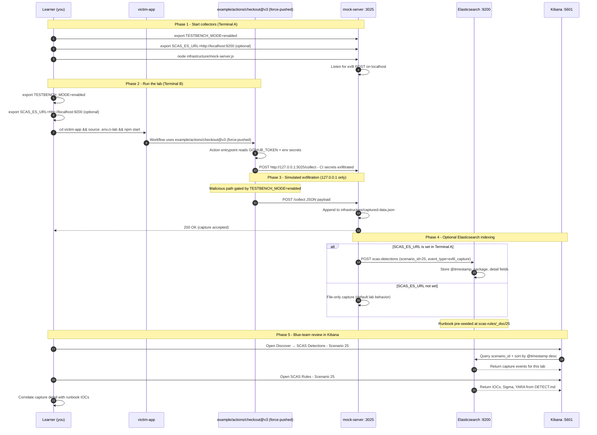

# Zero to Hero: Scenario 25 - Compromised Reusable GitHub Action

Welcome! This guide walks you through Scenario 25 end to end: understanding the attack, running the lab, detecting it, and hardening against it.

**Note**: This lab uses a fictional action and **127.0.0.1:3025** HTTP only. No real credentials are stolen and no external network calls are made.

## What You'll Learn

By the end of this guide, you will:

- Understand how a force-pushed mutable action tag can compromise every workflow that uses it.
- See how a reusable action harvests CI secrets before running legitimate steps.
- Run the compromised-action lab and observe exfiltration to the mock server.
- Apply the Mitigation Playbook and Straightforward Implementation below.

---

## Table of Contents

<div class="doc-toc">

- [Part 1: Understanding the Attack](#part-1-understanding-the-attack)
- [Part 2: Setup](#part-2-setup)
- [Part 3: Run the Attack](#part-3-run-the-attack)
- [Part 4: Lab Tasks and Detection](#part-4-lab-tasks-and-detection)
- [Mitigation Playbook](#mitigation-playbook)
- [Straightforward Implementation](#straightforward-implementation)
- [Code-level workflow](#code-level-workflow)
- [Elasticsearch + Kibana observability (optional)](#elasticsearch--kibana-observability-optional)

</div>

---

## Part 1: Understanding the Attack

Reusable GitHub Actions are one of the most trusted pieces of CI/CD infrastructure. A workflow line like `uses: example/actions/checkout@v3` tells GitHub to download and run code from another repository. If an attacker compromises the maintainer account for that action, they can force-push the mutable `v3` tag to a malicious commit. Every pipeline that references the tag will run the attacker's code on the next execution.

### Why mutable tags are dangerous

- Tags and floating major-version branches (`@v3`) can be moved to any commit.
- Pipelines usually resolve the tag at runtime, so the compromise is immediate and global.
- Commit SHAs are immutable, so pinning to a SHA prevents tag-movement attacks.
- Third-party actions often run with access to `GITHUB_TOKEN`, secrets, and the repository checkout.

### Real-world parallels

- Scenario 23 covers the 2026 Trivy action compromise (CVE-2026-33634).
- This scenario generalizes the same attack pattern to any popular reusable action.

### Scenario story

Your organization uses `example/actions/checkout@v3` in every workflow. An attacker phishes the action maintainer, gains publish access, and force-pushes the `v3` tag to a malicious commit. The next CI run executes the backdoored action, which harvests `GITHUB_TOKEN` and repository secrets and exfiltrates them to an attacker-controlled host.

In this lab you will:

1. Play the attacker: examine the force-pushed malicious action.
2. Play the victim: run `ci.yml` locally (act when installed, otherwise `npm start`).
3. Play the defender: detect the malicious reference and replace it with a pinned SHA.

## Part 2: Setup

### Prerequisites

- Node.js 16+ and npm.
- Optional: [nektos/act](https://github.com/nektos/act) (`brew install act`) so `./run-ci.sh` executes `ci.yml` instead of the Node stand-in. Docker is not required. The runner maps `example/actions/checkout@v3` to the local action and never fetches from GitHub.

### Environment setup

```bash
cd scenarios/25-compromised-github-action
export TESTBENCH_MODE=enabled
./setup.sh
```

`setup.sh` sources the shared testbench, resets `infrastructure/captured-data.json`, and plants lookalike CI secrets in `.env.ci-lab`.

## Part 3: Run the Attack

Use two terminals. All paths are relative to `scenarios/25-compromised-github-action`.

### Terminal A - Mock attacker server

```bash
node infrastructure/mock-server.js
```

Leave this running. It listens on `127.0.0.1:3025` and logs every exfiltration attempt.

### Terminal B - Run the compromised workflow

```bash
export TESTBENCH_MODE=enabled
./run-ci.sh
```

`run-ci.sh` sources `.env.ci-lab` and prefers act. The workflow file still says `uses: example/actions/checkout@v3`. act resolves that ref to `victim-app/.github/actions/checkout` and runs `index.js` as a `node20` action. If act is missing or the run fails, the same payload is loaded with `npm start`.

Do not push this workflow to a real GitHub repo. Local act is the point.

To force the Node stand-in: `SCAS_SKIP_ACT=1 ./run-ci.sh`.

### Verify capture

```bash
curl -s http://127.0.0.1:3025/captured-data
```

Clear captured data between runs:

```bash
curl -X DELETE http://127.0.0.1:3025/captured-data
```

### Blue team detection

From the scenario root:

```bash
node detection-tools/action-compromise-detector.js victim-app
```

## Part 4: Lab Tasks and Detection

### Part 1: Understand the attack (15 minutes)

1. Read `victim-app/.github/workflows/ci.yml` and find the compromised reference.
2. Open `victim-app/.github/actions/checkout/index.js` and identify the exfiltration code.
3. Compare the malicious action to a normal checkout action.

**Questions:**

- What is force-pushing and why does it work against version tags?
- Which CI secrets does the action collect?
- Why does the pipeline still appear to succeed?

### Part 2: Run the attack (15 minutes)

1. Start the mock server in Terminal A.
2. Run `./run-ci.sh` in Terminal B (after sourcing is handled by the script).
3. Verify that secrets were captured at `http://127.0.0.1:3025/captured-data`.

**Questions:**

- At what step does the exfiltration occur?
- What would the real exfiltration destination look like?

### Part 3: Detection (20 minutes)

1. Run `action-compromise-detector.js` against `victim-app`.
2. Review every finding and map it to a workflow line.
3. Read `DETECT.md` for the full detection runbook.

**Questions:**

- Which detector check catches the force-pushed tag?
- What would a GitHub audit log show for the tag update?

### Part 4: Hardening and prevention (20 minutes)

1. Edit `victim-app/.github/workflows/ci.yml` to use the commented-out safe SHA reference.
2. Re-run `action-compromise-detector.js` and confirm the findings are cleared.
3. Draft an internal policy requiring SHA pinning for all third-party actions.

**Questions:**

- Why does a commit SHA prevent force-push attacks?
- How does `step-security/harden-runner` complement SHA pinning?
- What secrets would you rotate after a confirmed action compromise?

### Detection checklist

- [ ] Search all `.github/workflows/*.yml` files for `example/actions/checkout@v3`.
- [ ] Search for any third-party action reference that uses a mutable tag (`@vN` or `@vN.N.N`).
- [ ] Review GitHub organization audit logs for unexpected tag force-pushes.
- [ ] Inspect CI runner logs for unexpected outbound network connections.
- [ ] Check `~/.ssh/id_rsa`, `~/.aws/credentials`, `~/.kube/config`, and `~/.docker/config.json` access.
- [ ] Rotate all secrets accessible to pipelines that ran the compromised action.
- [ ] Mock capture evidence at `infrastructure/captured-data.json` with `ci_secret_exfil` event type.


## Code-level workflow


*Code-level workflow for Scenario 25. Editable source: [`scas-codeflow-scenario-25.excalidraw`](../../assets/diagrams/codeflow/excalidraw/scas-codeflow-scenario-25.excalidraw). Regenerate with `node scripts/diagrams/generate-scenario-codeflow-diagrams.js`.*

## Elasticsearch + Kibana observability (optional)

Scenario **25 - Compromised Reusable GitHub Action** is indexed in Elasticsearch when the observability stack is running.

Compromised reusable GitHub Action: force-pushed v3 tag runs malicious action code that harvests CI secrets.

- **Detection runbook (static)** → index `scas-rules`, document id `25` - IOCs, Sigma, YARA, sample logs from `DETECT.md`
- **Runtime captures (dynamic)** → index `scas-detections` - one document per exfil event when `SCAS_ES_URL` is set before starting the mock collector

### How to read this diagram

| Phase | What you should look for |
|-------|--------------------------|
| **1 - Collectors** | Terminal A starts the mock server (or harvester). Set `SCAS_ES_URL` here if you want live Elasticsearch indexing. |
| **2 - Lab execution** | Terminal B runs the scenario README steps. See the **sequence diagram** and **Scenario-specific attack steps** below. |
| **3 - Exfiltration** | Malicious sample sends **localhost-only** JSON to the mock endpoint. Evidence is always written to `infrastructure/` on disk. |
| **4 - Elasticsearch** | When `SCAS_ES_URL` is set, the same capture is indexed into `scas-detections` with `scenario_id` and `event_type=exfil_capture`. |
| **5 - Kibana** | Use the per-scenario## Mitigation Playbook

Canonical prevention and mitigation controls (aligned with the [scenario README](../../../scenarios/25-compromised-github-action/README.md)). Lab walkthroughs above expand each control with hands-on steps.

- Pin every reusable action to an immutable commit SHA, never a mutable tag.
- Audit workflow files for tag references and enforce SHA pinning via CI lint or policy.
- Apply least-privilege permissions and avoid passing secrets to third-party actions as environment variables.
- Monitor CI runners for unexpected outbound network calls.
- Rotate CI secrets immediately when a reusable action compromise is reported or suspected.
- Use tools like `step-security/harden-runner` to block unexpected egress from action steps.

## Straightforward Implementation

The full step-by-step implementation flow lives in the [scenario README](../../../scenarios/25-compromised-github-action/README.md#straightforward-implementation) so this walkthrough stays focused on the attack and detection story.

---

 saved searches to compare **runtime captures** (Detections) with the **static runbook** (Rules). |

> **Safety:** All network calls stay on `127.0.0.1`. Malicious logic runs only when `TESTBENCH_MODE=enabled`.

### End-to-end flow


*Swimlane diagram for Scenario 25. Editable source: [`scas-observability-scenario-25.excalidraw`](../../assets/diagrams/observability/excalidraw/scas-observability-scenario-25.excalidraw). Regenerate with `node scripts/diagrams/generate-scenario-observability-diagrams.js`.*

### Sequence diagram (Phase 1-5)

Same flow as a participant sequence (expandable in the docs hub).



### Scenario-specific attack steps (Phase 2)

Same Phase-2 path as the diagrams above (for skimming / accessibility).

| # | From | To | Action |
|---|------|----|--------|
| 1 | Learner | Victim | cd victim-app && source .env.ci-lab && npm start |
| 2 | Victim | MalPkg | Workflow uses example/actions/checkout@v3 (force-pushed) |
| 3 | MalPkg | MalPkg | Action entrypoint reads GITHUB_TOKEN + env secrets |
| 4 | MalPkg | Mock | POST http://127.0.0.1:3025/collect - CI secrets exfiltrated |

### Prerequisites

From the repository root:

```bash
./scripts/observability/elasticsearch-up.sh
./scripts/observability/setup-kibana-data-views.sh   # data views + saved searches for all 25 scenarios
```

### Run this scenario with live Elasticsearch forwarding

**Terminal A - mock collector** (from `scenarios/25-compromised-github-action`):

```bash
cd scenarios/25-compromised-github-action
export TESTBENCH_MODE=enabled
export SCAS_ES_URL=http://localhost:9200
node infrastructure/mock-server.js
```

**Terminal B - execute the lab:**

```bash
cd scenarios/25-compromised-github-action
export TESTBENCH_MODE=enabled
export SCAS_ES_URL=http://localhost:9200
cd victim-app && export TESTBENCH_MODE=enabled && npm start
```

### Verify locally (file-based evidence)

```bash
curl -s http://127.0.0.1:3025/captured-data
```

### Verify in Elasticsearch (API)

```bash
# Static runbook for this scenario
curl -s "http://localhost:9200/scas-rules/_doc/25?pretty"

# Latest runtime capture events
curl -s "http://localhost:9200/scas-detections/_search?pretty" \
  -H 'Content-Type: application/json' \
  -d '{
    "query": { "term": { "scenario_id": "25" } },
    "sort": [{ "@timestamp": "desc" }],
    "size": 5
  }'
```

### Verify in Kibana (UI)

1. Open [http://localhost:5601](http://localhost:5601)
2. **Discover** → **SCAS Detections - Scenario 25** - live capture timeline (`@timestamp`, `package.name`, `detail`)
3. **Discover** → **SCAS Rules - Scenario 25** - compare against `iocs`, `sigma`, and `yara` fields
4. Ask: *Does each capture field match an IOC or Sigma condition in the runbook?*

See [observability/README.md](../../../observability/README.md) for stack details.