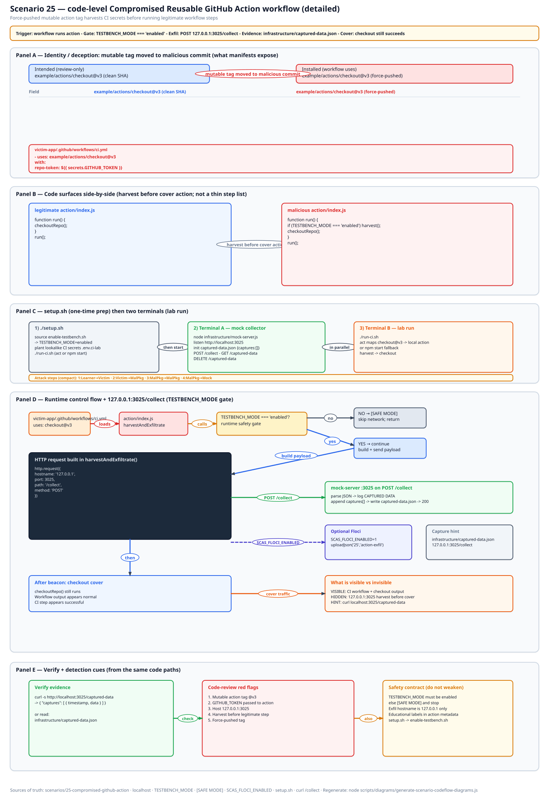
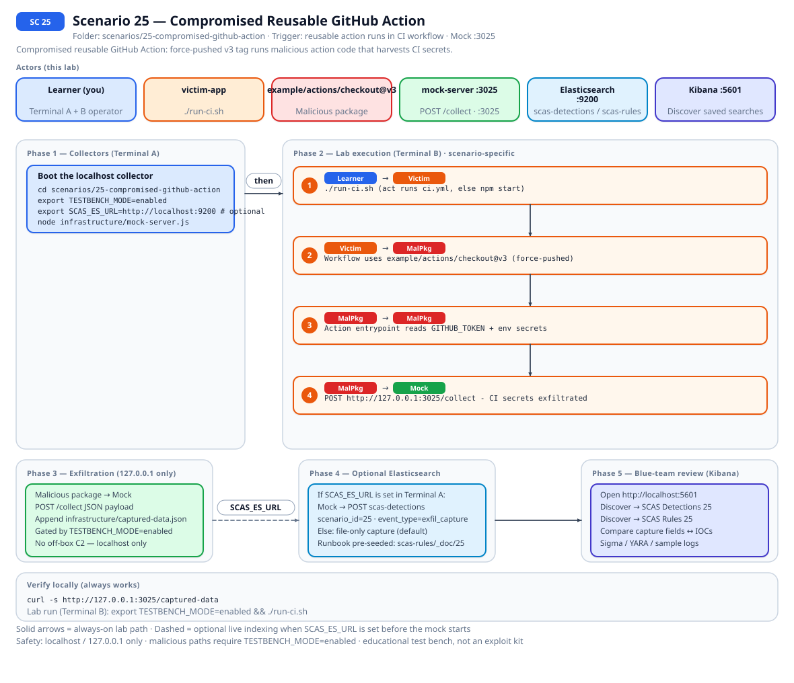
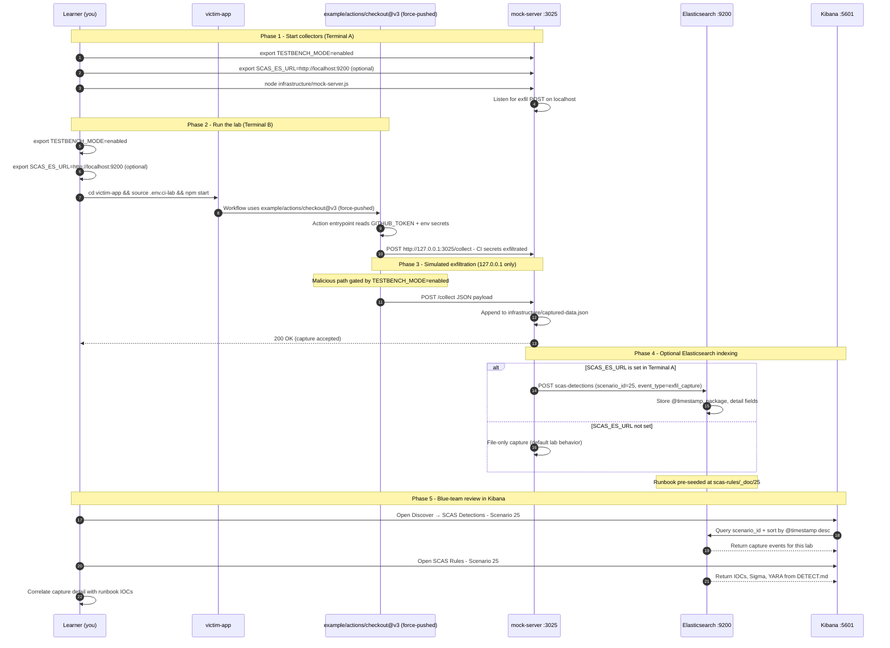

# Zero to Hero: Scenario 25 - Compromised Reusable GitHub Action

Welcome! This guide will take you from zero knowledge to successfully completing the compromised reusable GitHub Action scenario.

**Note**: This lab uses a fictional action and **127.0.0.1:3025** HTTP only. No real credentials are stolen and no external network calls are made.

## 📚 What You'll Learn

By the end of this guide, you will:

- Understand how a force-pushed mutable action tag can compromise every workflow that uses it.
- See how a reusable action harvests CI secrets before running legitimate steps.
- Run the compromised-action lab and observe exfiltration to the mock server.
- Apply the **Mitigation Playbook** from this guide and the scenario README.

---

## Table of Contents

<div class="doc-toc">

- [Mitigation Playbook](#mitigation-playbook)
- [Straightforward Implementation](#straightforward-implementation)

</div>

---
## Table of Contents

## Mitigation Playbook

## Straightforward Implementation

## Code-level workflow



*Code-level workflow for Scenario 25. Editable source: [`scas-codeflow-scenario-25.excalidraw`](../../assets/diagrams/codeflow/excalidraw/scas-codeflow-scenario-25.excalidraw). Regenerate with `node scripts/diagrams/generate-scenario-codeflow-diagrams.js`.*

## Elasticsearch + Kibana observability (optional)

Scenario **25 - Compromised Reusable GitHub Action** is indexed in Elasticsearch when the observability stack is running.

Compromised reusable GitHub Action: force-pushed v3 tag runs malicious action code that harvests CI secrets.

- **Detection runbook (static)** → index `scas-rules`, document id `25` - IOCs, Sigma, YARA, sample logs from `DETECT.md`
- **Runtime captures (dynamic)** → index `scas-detections` - one document per exfil event when `SCAS_ES_URL` is set before starting the mock collector

### How to read this diagram

| Phase | What you should look for |
|-------|--------------------------|
| **1 - Collectors** | Terminal A starts the mock server (or harvester). Set `SCAS_ES_URL` here if you want live Elasticsearch indexing. |
| **2 - Lab execution** | Terminal B runs the scenario README steps. See the **sequence diagram** and **Scenario-specific attack steps** below. |
| **3 - Exfiltration** | Malicious sample sends **localhost-only** JSON to the mock endpoint. Evidence is always written to `infrastructure/` on disk. |
| **4 - Elasticsearch** | When `SCAS_ES_URL` is set, the same capture is indexed into `scas-detections` with `scenario_id` and `event_type=exfil_capture`. |
| **5 - Kibana** | Use the per-scenario saved searches to compare **runtime captures** (Detections) with the **static runbook** (Rules). |

> **Safety:** All network calls stay on `127.0.0.1`. Malicious logic runs only when `TESTBENCH_MODE=enabled`.

### End-to-end flow



*Swimlane diagram for Scenario 25. Editable source: [`scas-observability-scenario-25.excalidraw`](../../assets/diagrams/observability/excalidraw/scas-observability-scenario-25.excalidraw). Regenerate with `node scripts/diagrams/generate-scenario-observability-diagrams.js`.*

### Sequence diagram (Phase 1-5)

Same flow as a participant sequence (expandable in the docs hub).



### Scenario-specific attack steps (Phase 2)

Same Phase-2 path as the diagrams above (for skimming / accessibility).

| # | From | To | Action |
|---|------|----|--------|
| 1 | Learner | Victim | cd victim-app && source .env.ci-lab && npm start |
| 2 | Victim | MalPkg | Workflow uses example/actions/checkout@v3 (force-pushed) |
| 3 | MalPkg | MalPkg | Action entrypoint reads GITHUB_TOKEN + env secrets |
| 4 | MalPkg | Mock | POST http://127.0.0.1:3025/collect - CI secrets exfiltrated |

### Prerequisites

From the repository root:

```bash
./scripts/observability/elasticsearch-up.sh
./scripts/observability/setup-kibana-data-views.sh   # data views + saved searches for all 23 scenarios
```

### Run this scenario with live Elasticsearch forwarding

**Terminal A - mock collector** (from `scenarios/25-compromised-github-action`):

```bash
cd scenarios/25-compromised-github-action
export TESTBENCH_MODE=enabled
export SCAS_ES_URL=http://localhost:9200
node infrastructure/mock-server.js
```

**Terminal B - execute the lab:**

```bash
cd scenarios/25-compromised-github-action
export TESTBENCH_MODE=enabled
export SCAS_ES_URL=http://localhost:9200
cd victim-app && export TESTBENCH_MODE=enabled && npm start
```

### Verify locally (file-based evidence)

```bash
curl -s http://127.0.0.1:3025/captured-data
```

### Verify in Elasticsearch (API)

```bash
# Static runbook for this scenario
curl -s "http://localhost:9200/scas-rules/_doc/25?pretty"

# Latest runtime capture events
curl -s "http://localhost:9200/scas-detections/_search?pretty" \
  -H 'Content-Type: application/json' \
  -d '{
    "query": { "term": { "scenario_id": "25" } },
    "sort": [{ "@timestamp": "desc" }],
    "size": 5
  }'
```

### Verify in Kibana (UI)

1. Open [http://localhost:5601](http://localhost:5601)
2. **Discover** → **SCAS Detections - Scenario 25** - live capture timeline (`@timestamp`, `package.name`, `detail`)
3. **Discover** → **SCAS Rules - Scenario 25** - compare against `iocs`, `sigma`, and `yara` fields
4. Ask: *Does each capture field match an IOC or Sigma condition in the runbook?*

See [observability/README.md](../../../observability/README.md) for stack details.

