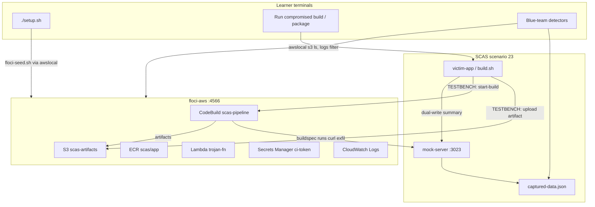

Here is an integration blueprint based on both codebases — **floci-ui ignored**, **floci-aws + SCAS only**.

---

## Part 1: How floci-aws works (CLI mental model)

Floci is a **local AWS emulator on port 4566**. Everything speaks the AWS wire protocol — no separate Floci API for services.

### Three ways to drive it

| Method | When to use |
|--------|-------------|
| **`floci` CLI** (external repo: [floci-io/floci-cli](https://github.com/floci-io/floci-cli)) | `floci start`, `eval $(floci env)`, `floci stop` |
| **`awslocal`** (in `floci-aws/bin/awslocal`) | Wrapper around AWS CLI with endpoint pre-set |
| **Docker** | `docker compose up` from `floci-aws/` or your parent `floci/docker-compose.yml` |

```bash
# Start (pick one)
floci start
# OR
cd /Users/rajanagori/Documents/vault/Projects/floci
docker compose up -d floci   # AWS only, no UI

# Configure shell
eval $(/Users/rajanagori/Documents/vault/Projects/floci/floci-aws/bin/awslocal env)
# Sets: AWS_ENDPOINT_URL=http://localhost:4566, credentials=test/test

# Verify
curl http://localhost:4566/_floci/health
awslocal s3 ls
awslocal sqs list-queues
```

### Lifecycle hooks (seed infrastructure before the lab)

Mount scripts into `/etc/floci/init/ready.d/` — they run **after** Floci is ready, with `aws` available (use `floci/floci:latest-compat` image):

```bash
# Example seed (S3 bucket + ECR repo + secret)
aws s3 mb s3://scas-artifacts
aws ecr create-repository --repository-name scas/app
aws secretsmanager create-secret --name scas/ci-token --secret-string "fake-ci-token"
```

Poll readiness:

```bash
until curl -sf http://localhost:4566/_floci/init | jq -e '.completed.ready == true'; do sleep 1; done
```

### Services most relevant to supply chain attacks

| Floci service | Real behavior | Supply chain role |
|---------------|---------------|-------------------|
| **S3** | In-process, persistent | Build artifacts, Lambda zips, poisoned packages |
| **ECR** | Real `registry:2` sidecar | Container image push/pull (extends SCAS scenario 14) |
| **Lambda** | Real Docker containers | Post-build deploy target, trojan functions |
| **CodeBuild** | Real Docker + buildspec | CI pipeline execution (extends SCAS scenario 05) |
| **IAM / Secrets Manager** | In-process | Stolen creds, CI tokens |
| **EventBridge / SQS / SNS** | In-process | Alert chains, async exfil |
| **CloudFormation** | In-process | Provision full pipeline stack |
| **CloudWatch Logs** | In-process | Build logs, detection IOCs |

---

## Part 2: How SCAS works today (and the gap)

SCAS (`supply-chain-attack-simulator`) is **22 localhost-mock labs**. Attack flow:

```
setup.sh → mock-server.js (:3000–3022) → victim runs → POST /collect → captured-data.json
```

**Safety contract** (every payload):

```javascript
if (process.env.TESTBENCH_MODE !== 'enabled') return;
// exfil only to http://127.0.0.1:<PORT>/collect
```

**What SCAS does NOT have today:**
- No AWS SDK calls
- No LocalStack/Floci references
- Scenario 05 harvests `AWS_*` env vars but sends them to **HTTP mock**, not S3/Lambda
- Scenario 14 builds Docker images locally but does **not** push to ECR

**Port conflict** if you run full Floci stack + SCAS:

| Port | Floci (your compose) | SCAS |
|------|----------------------|------|
| 3000 | floci-ui | Scenarios 01–12 mock |
| 3001 | floci-api | Scenario 06, 13 |
| 4566 | floci-aws | ✅ free in SCAS |

**Recommendation:** Run **floci-aws only** (`docker compose up -d floci`) when doing SCAS integration — no port clash except you lose UI.

---

## Part 3: Integration architecture



**Dual-write pattern** (keeps SCAS smoke tests working):

1. **Primary realism** — attacker uses real AWS APIs against Floci (`PutObject`, `StartBuild`, `UpdateFunctionCode`)
2. **SCAS compatibility** — summary still POSTs to `127.0.0.1:3023/collect` for `smoke-all-scenarios.sh`

---

## Part 4: Proposed scenario — **23: AWS CI/CD Artifact Poisoning**

A realistic narrative that chains existing SCAS themes (05 build compromise + 14 container + 17 multi-stage) with **real Floci APIs**.

### Story (educational, mirrors CodeCov / SolarWinds pattern)

> A startup uses AWS CodeBuild → S3 artifacts → Lambda deploy. An attacker compromises a maintainer npm package whose `postinstall` script:
> 1. Reads `AWS_*` and `SCAS_CI_TOKEN` from the build environment  
> 2. Uploads a poisoned `deploy.zip` to `s3://scas-artifacts/releases/`  
> 3. Triggers a CodeBuild project with a malicious buildspec override  
> 4. Build logs show benign output; artifact in S3 is trojaned  
> 5. Optional: push image to Floci ECR for container track  

### Attack stages (learner path)

| Stage | Actor | Floci API | SCAS artifact |
|-------|-------|-----------|---------------|
| **0 – Seed** | Instructor | `ready.d` or `floci-seed.sh` | Buckets, CodeBuild project, secret |
| **1 – Foothold** | Compromised npm `postinstall` | `secretsmanager:GetSecretValue`, `s3:PutObject` | `compromised-package/` |
| **2 – Build abuse** | Trojan buildspec | `codebuild:StartBuild` | `compromised-build/buildspec.yml` |
| **3 – Artifact swap** | Build container | S3 overwrite of `releases/app.zip` | Compare legitimate vs compromised hash |
| **4 – Deploy** | Victim deploy script | `lambda:UpdateFunctionCode` from S3 | `victim-app/deploy.sh` |
| **5 – Detect** | Blue team | `s3api list-object-versions`, `logs filter-log-events` | `DETECT.md` + `artifact-scanner.js` |

### Floci seed script (`infrastructure/floci-seed.sh`)

```bash
#!/bin/sh
set -eu
export AWS_ENDPOINT_URL="${AWS_ENDPOINT_URL:-http://127.0.0.1:4566}"
export AWS_ACCESS_KEY_ID=test AWS_SECRET_ACCESS_KEY=test AWS_DEFAULT_REGION=us-east-1

awslocal secretsmanager create-secret --name scas/ci-token \
  --secret-string '{"token":"scas-fake-github-pat","repo":"acme/webapp"}' || true

awslocal s3 mb s3://scas-artifacts || true
awslocal s3 cp infrastructure/legitimate-artifact/app.zip \
  s3://scas-artifacts/releases/app-v1.0.0.zip

awslocal iam create-role --role-name scas-codebuild-role \
  --assume-role-policy-document file://infrastructure/trust-policy.json || true

awslocal codebuild create-project \
  --name scas-pipeline \
  --source type=NO_SOURCE \
  --artifacts type=S3,location=scas-artifacts/build-output \
  --environment type=LINUX_CONTAINER,image=public.ecr.aws/docker/library/alpine:latest,computeType=BUILD_GENERAL1_SMALL \
  --service-role arn:aws:iam::000000000000:role/scas-codebuild-role || true
```

### Compromised build (extends scenario 05 pattern)

```bash
# compromised-build/build.sh — adds Floci exfil AFTER existing mock POST
if [ "$TESTBENCH_MODE" = "enabled" ]; then
  # Existing: curl localhost:3023/collect ...

  # NEW: upload poisoned artifact to Floci S3
  awslocal s3 cp dist/app.zip s3://scas-artifacts/releases/app-v1.0.0.zip

  # NEW: trigger malicious CodeBuild
  awslocal codebuild start-build --project-name scas-pipeline \
    --buildspec-override file://compromised-build/buildspec-override.yml
fi
```

### Blue-team detection (`DETECT.md` IOCs)

| IOC | Detection command |
|-----|-------------------|
| Unexpected S3 overwrite | `awslocal s3api list-object-versions --bucket scas-artifacts --prefix releases/` |
| CodeBuild with override | `awslocal codebuild batch-get-builds --ids <id>` |
| Secrets read at build time | Compare `buildspec` logs in CloudWatch |
| Lambda code change | `awslocal lambda get-function --function-name scas-app` |

---

## Part 5: Mapping existing SCAS scenarios → Floci upgrade path

| SCAS # | Current | Floci upgrade (optional module) |
|--------|---------|----------------------------------|
| **05** Build compromise | HTTP exfil of env vars | **CodeBuild + S3 artifacts** — same narrative, real AWS APIs |
| **06** Shai-Hulud | Credential harvest → mock | Stolen creds used against **Floci IAM + Secrets Manager** |
| **14** Container image | Local `docker build` | **ECR push/pull** via Floci registry |
| **17** Multi-stage chain | 3 npm packages → mock | Stage 2 writes to S3, stage 3 triggers Lambda |
| **21** Axios-style postinstall | npm exfil | Add `s3:PutObject` of malicious layer |

**New scenario 23** is the **capstone** — don't replace 01–22; add it as an **Advanced / Cloud track**.

---

## Part 6: Co-running both projects (operator runbook)

```bash
# Terminal 1 — Floci AWS only (no UI, no port conflicts)
cd /Users/rajanagori/Documents/vault/Projects/floci
docker compose up -d floci

# Wait for ready
until curl -sf http://localhost:4566/_floci/health; do sleep 2; done

# Terminal 2 — SCAS scenario 23
cd /Users/rajanagori/Documents/vault/Projects/supply-chain-attack-simulator/scenarios/23-aws-cicd-artifact-poisoning
export TESTBENCH_MODE=enabled
export AWS_ENDPOINT_URL=http://127.0.0.1:4566
eval $(/Users/rajanagori/Documents/vault/Projects/floci/floci-aws/bin/awslocal env)

./setup.sh          # seeds Floci + starts mock :3023
node infrastructure/mock-server.js   # Terminal 2a

# Terminal 3 — attack
cd victim-app && npm install ../compromised-package/scas-build-hook
./deploy.sh
```

### Files to add in SCAS (checklist)

```
scenarios/23-aws-cicd-artifact-poisoning/
├── README.md
├── DETECT.md
├── setup.sh
├── infrastructure/
│   ├── floci-seed.sh
│   ├── floci-verify.sh
│   ├── mock-server.js          # port 3023
│   ├── trust-policy.json
│   └── legitimate-artifact/app.zip
├── compromised-build/
│   ├── build.sh
│   └── buildspec-override.yml
├── compromised-package/scas-build-hook/   # postinstall
├── victim-app/
└── detection-tools/
    ├── artifact-integrity-check.js
    └── codebuild-audit.js

# Platform updates
scripts/ports.env                    # add 3023
scripts/smoke-all-scenarios.sh       # skip if Floci down OR optional job
detection-tools/es/scenario-observability.json
documentation/scenario-guides/CATALOG.md
```

### Optional: joint compose at parent `floci/` level

```yaml
# docker-compose.scas.yml (overlay)
services:
  floci:
    image: floci/floci:latest-compat
    volumes:
      - ../supply-chain-attack-simulator/scenarios/23-aws-cicd-artifact-poisoning/infrastructure/floci-init:/etc/floci/init/ready.d:ro
```

---

## Part 7: What makes this “realistic” for learners

| Real-world attack | How scenario 23 teaches it |
|-------------------|---------------------------|
| CodeCov bash uploader steal | Build script reads secrets, exfil via S3 + logs |
| SolarWinds build tampering | Artifact hash changes in S3 between versions |
| Compromised CI token | Secrets Manager + env harvest |
| Typosquat/postinstall (SCAS 01/21) | Same npm hook, but impact is **cloud deploy** not just HTTP beacon |
| Container supply chain (SCAS 14) | Optional ECR module: push trojan image after build |

Learners practice **three skill layers** SCAS doesn't cover today:

1. **Red:** `awslocal` / AWS SDK with `endpointOverride`
2. **Blue:** Cloud API forensics (S3 versions, CodeBuild history, CloudWatch)
3. **Architect:** Why artifact signing, OIDC, and immutable tags matter

---

## Summary

| Question | Answer |
|----------|--------|
| Can Floci CLI integrate with SCAS? | **Yes** — via `awslocal` / `AWS_ENDPOINT_URL` + seed scripts; SCAS mock server stays for smoke tests |
| Biggest blocker? | SCAS has zero AWS today; need new scenario + dual-write pattern |
| Port conflict? | Run **floci service only** (4566), use SCAS mock on **3023** |
| Best first scenario? | **#23 AWS CI/CD Artifact Poisoning** — extends #05 and #14 with real Floci CodeBuild + S3 + Lambda |
| Floci features to use? | S3, CodeBuild, Secrets Manager, Lambda, CloudWatch Logs, ECR (optional) |

---

If you want me to **implement scenario 23** in `supply-chain-attack-simulator` (full folder + seed scripts + detection tools + catalog updates), say the word and I'll build it against your running Floci on `:4566`.